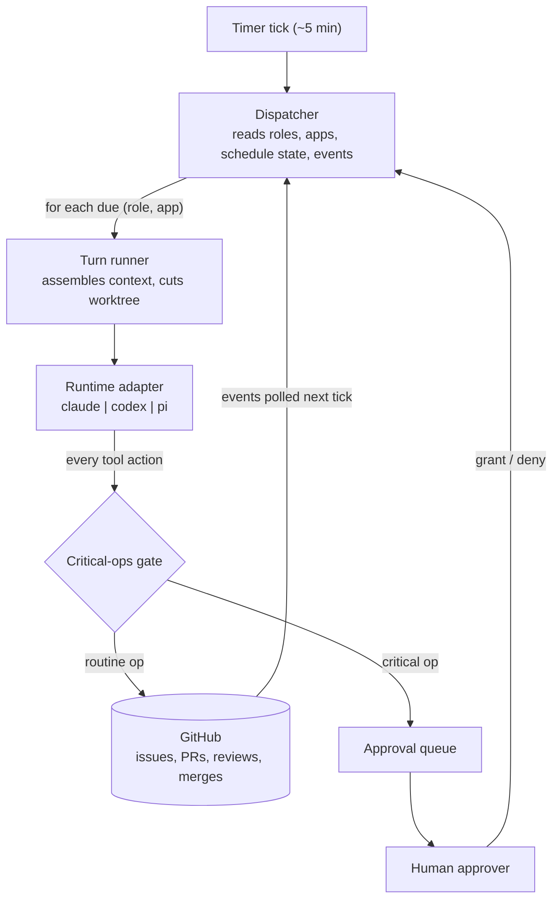

# Operon

An **org runtime**: a standing team of AI agents (Planner, Builder, Reviewer,
SRE, Support, Marketing) that develops and operates a software product through
a private GitHub repo, with a human approver gating critical operations only.



Read [`PURPOSE.md`](PURPOSE.md) for the why and every decision made so far;
[`TASTE.md`](TASTE.md) is the org's constitution;
[`roles.yaml`](roles.yaml) is the org chart made executable.

## Layout

```
src/runtime/   the runtime contract: Runtime interface, critical-ops gate,
               telemetry, adapters (claude | codex | pi)
src/loop/      the build loop: ticket → PR → review → merge
src/org/       the standing org: roles loader, scheduler, memory, retro   [WIP]
test/          gate conformance seed + roles.yaml validation
research/      decision records
```

Imports flow downward only: `org → loop → runtime`.

## Commands

```bash
pnpm install
pnpm test               # gate conformance + roles validation
pnpm dev roles          # validate roles.yaml, print the org chart
pnpm dev doctor         # runtime adapter status
```

Usage docs (pointing the org at an app and running it) will land once the
dispatcher ships.

## Status

Scaffold. The runtime contract, gate policy, and roles schema are real and
tested; the three adapters are documented stubs (see
`research/2026-07-03_runtime-layer.md` for the integration plan).
