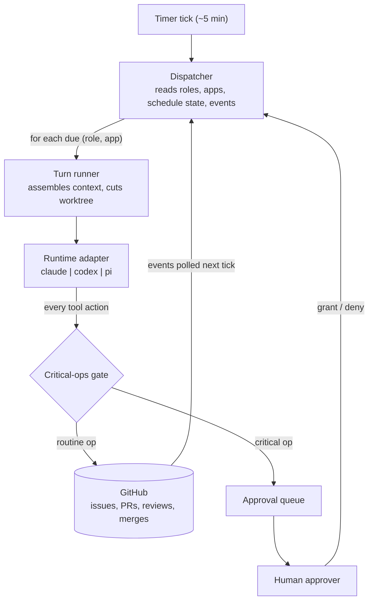

# Operon

An **org runtime**: a standing team of AI agents (Planner, Builder, Reviewer,
SRE, Support, Marketing) that develops and operates a software product through
a private GitHub repo, with a human approver gating critical operations only.



Read [`docs/PURPOSE.md`](docs/PURPOSE.md) for the why and every decision made so far;
[`TASTE.md`](TASTE.md) is the org's constitution;
[`roles.yaml`](roles.yaml) is the org chart made executable.

## Layout

```
src/runtime/   the runtime contract: Runtime interface, critical-ops gate,
               telemetry, run logs, adapters (claude live; codex/pi stubbed)
src/loop/      pass pipelines, briefs, quality gates, verdict parsing, and
               the ticket → PR → review → merge state machine [M5 WIP]
src/org/       app registry, bootstrap, co-planning, roles loader;
               scheduler/approvals/memory/retro still upcoming
test/          adapter conformance, gate, pipelines, bootstrap, qgates
research/      decision records
```

Imports flow downward only: `org → loop → runtime`.

## Commands

```bash
pnpm install
pnpm test               # fast offline suite
pnpm typecheck
pnpm dev roles          # validate roles.yaml, print the org chart
pnpm dev apps           # validate apps.yaml, print the app registry
pnpm dev pipelines      # validate pipelines.yaml, print pass table
pnpm dev doctor         # runtime adapter status
```

Usage docs (pointing the org at an app and running it) will land once the
dispatcher ships.

## Status

M0-M4 are complete. The runtime contract, critical-ops gate, ClaudeRuntime,
pass executor, run logs, app registry, bootstrap flow, co-planning launcher,
quality gates, and typed verdict parsers are implemented and tested offline.
The next build milestone is M5: the real GitHub ticket state machine
(`op:ready` → PR → gates → review → squash merge) against sandbox repos.

CodexRuntime and PiRuntime are still planned for M10; until then, the live
adapter is ClaudeRuntime and `pnpm test:live` is the gated live-conformance
proof.
