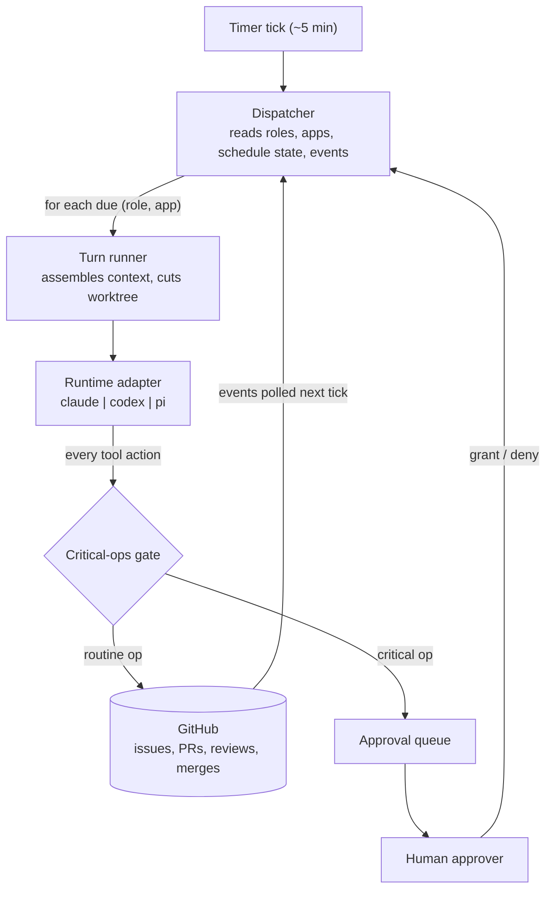

# Operon

An **org runtime**: a standing team of AI agents (Planner, Builder, Reviewer,
SRE, Support, Marketing) that develops and operates a software product through
a private GitHub repo, with a human approver gating critical operations only.



Read [`docs/PURPOSE.md`](docs/PURPOSE.md) for the why and every decision made so far;
[`TASTE.md`](TASTE.md) is the org's constitution;
[`roles.yaml`](roles.yaml) is the org chart made executable.

## Layout

```
src/runtime/   the runtime contract: Runtime interface, critical-ops gate,
               telemetry, run logs, adapters (Claude SDK, Codex App Server,
               pi SDK)
src/loop/      pass pipelines, briefs, quality gates, verdict parsing, and
               the ticket → PR → review → merge state machine
src/org/       app registry, bootstrap, co-planning, dispatch, approvals,
               budget overlays, trigger routing; memory/retro still upcoming
test/          adapter conformance, gate, pipelines, bootstrap, qgates
research/      decision records
```

Imports flow downward only: `org → loop → runtime`.

## Commands

```bash
pnpm install
pnpm test               # fast offline suite
pnpm typecheck
pnpm dev roles          # validate roles.yaml, print the org chart
pnpm dev apps           # validate apps.yaml, print the app registry
pnpm dev pipelines      # validate pipelines.yaml, print pass table
pnpm dev loop --app operon-sandbox-alpha --once --dry-run
                        # inspect ready-ticket loop plan without claiming
pnpm dev doctor         # runtime adapter status
GH_SANDBOX_REPO=<owner/repo> pnpm e2e:sandbox:setup
GH_SANDBOX_REPO=<owner/repo> pnpm e2e:sandbox
                        # disposable real-GitHub M5 loop proof
```

Usage docs (pointing the org at an app and running it) will land once the
dispatcher ships.

## Status

M0-M12 are complete. The runtime contract, critical-ops gate, ClaudeRuntime,
CodexRuntime, PiRuntime, pass executor, run logs, app registry,
bootstrap flow, co-planning launcher,
quality gates, typed verdict parsers, GitHub ticket state machine, scheduler,
manual loop driver, real Builder/Reviewer pipeline integration, approval queue,
dispatcher, budget overlay, Planner pipelines, standing-role v0 pipelines, and
trigger routing are implemented and tested. Manual app commands now resolve
real app checkouts and assemble app-aware context instead of falling back to
the Operon repo. M5 is proven against a
disposable private GitHub repo: ready issue → claim → real gates → PR →
injected review → squash merge → closed issue. M6 is proven on
`operon-sandbox-alpha`: real Claude Builder/Reviewer passes shipped issue #1
through PR #2 to a merged squash commit. M8 is proven on
`operon-sandbox-gamma`: a running `/health` service, a real private
`op:incident` issue, and Support/Marketing draft artifacts. M11 onboarded the
private `buildstacks-dev/buildstacks.dev` repo as `status: onboarding`
without changing Operon runtime code. M12 re-verified alpha, beta, and gamma
functional smokes plus live Claude adapter conformance.

`docs/capability-matrix.md` records each adapter's native, adapter-built, and
degraded capabilities. `pnpm test:live` is the gated live-adapter proof; Codex
and pi live smokes are opt-in with `OPERON_CODEX_LIVE=1` and
`OPERON_PI_LIVE=1`.
