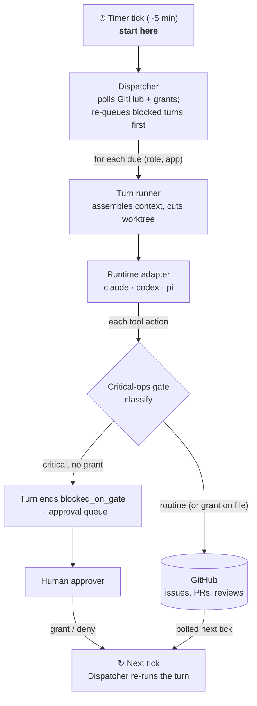

# Operon

An **org runtime**: a standing team of AI agents (Planner, Builder, Reviewer,
SRE, Support, Marketing) that develops and operates a software product through
a private GitHub repo, with a human approver gating critical operations only.



The flow is a single loop, read top to bottom: the **Timer tick** wakes the
**Dispatcher**, which runs due turns through the adapter and gate, then the
`↻ Next tick` node folds back to the Dispatcher on the following tick — grants
and freshly-polled GitHub events are both picked up there.

The gate classifies *every* tool action; only ops matching a critical rule are
blocked. A blocked op does not resume in place — the turn ends `blocked_on_gate`,
the human's grant writes a single-use grant file, and the **next dispatcher tick
re-runs that turn first**, where the gate now finds the grant and lets the op
through. The org's own squash-merge is a separate path, gated by HMAC review
authorization rather than this gate.

Read [`docs/PURPOSE.md`](docs/PURPOSE.md) for the why and every decision made so far;
[`TASTE.md`](TASTE.md) is the org's constitution;
[`roles.yaml`](roles.yaml) is the org chart made executable;
[`AGENTS.md`](AGENTS.md) is the contributor map.
New to the code? Open [`docs/wiki.html`](docs/wiki.html) — a standalone,
self-contained wiki that walks the three layers, the build loop, and the
runtime adapters, with curated reading paths for coming up to speed.

Operon turns approved goals into verified software outcomes with process
proportional to risk, minimal human attention, durable forward progress, and
continuously improving unit economics. `docs/VISION.md` states the operator
outcome; `docs/efficiency.md` is the sole normative route, budget,
measurement, and qualification contract.

## Install locally

Operon requires **Node.js >= 26** and the pnpm version pinned in
`packageManager`. Node 26 does not bundle Corepack, so install/enable it once
if `pnpm --version` does not match the pin.

```bash
npm install -g corepack   # once per Node installation, when needed
corepack enable
pnpm install
pnpm link:local
```

`pnpm link:local` exposes `operon` at `~/.local/bin/operon` (or
`$OPERON_BIN_DIR/operon`) and links the `$operon` skill into Codex
(`$CODEX_HOME/skills/operon`), Claude (`$CLAUDE_CONFIG_DIR/skills/operon`),
and pi (`$PI_CODING_AGENT_DIR/skills/operon`), using each provider's default
home when its override is unset. Add `~/.local/bin` to `PATH` if necessary. The
local command is source-backed: the next invocation reads the latest source
changes, so no `operon update`, relink, or rebuild is needed. A packed or
published installation instead runs the compiled `dist/cli.js` binary.

These four locations are intentionally different:

| Location | One-line meaning |
| --- | --- |
| Package root | Operon's installed implementation and reusable templates. |
| Org home | Committed roles, apps, pipelines, prompts, authority, taste, and curated memory. |
| State home | Local high-churn clones, worktrees, locks, approvals, telemetry, and run logs. |
| App repo | An independent product checkout that Operon develops or operates. |

Create the org before onboarding an app; this can be run from any directory:

```bash
operon --version
operon org init ~/Build/my-org --name my-org
operon doctor
operon context
```

`org init` creates a complete org home from packaged templates, including a
versioned `AUTHORITY.md`, creates the
default state home at `~/.operon/<org>`, and records the active org pointer at
`~/.operon/config`. Use `operon org use <path>` to switch to another complete
org. `OPERON_ORG_HOME` and `OPERON_STATE_HOME` are explicit per-process
overrides. The default `delegated-operator` charter automates ordinary,
reversible work while Operon's critical-operation gates remain mandatory;
choose `--authority conservative` or `--authority custom --authority-file
<path> --authority-by <identity>` during onboarding to narrow or replace the
human grant explicitly.

## Commands

Run `operon --help` or `operon <command> --help` for current syntax. The
read-only discovery surfaces are also machine-readable for coding agents:

```bash
operon capabilities --json
operon context --json
operon roles
operon apps
operon pipelines
operon doctor --json
```

By default `doctor` runs bounded, non-billable readiness probes only for the
runtimes and models referenced by the active `roles.yaml`: Claude performs an
SDK initialize/account-info control request, Codex performs App Server
`initialize` + `account/read`, and pi resolves its model/auth configuration.
No model prompt is sent. Missing launch artifacts, transport failure, missing
auth, invalid model configuration, and probe timeout are reported distinctly.
Use `operon doctor --config-only` only in an isolated/offline packaging check;
its adapter rows are `WARN` because configuration validity is not runtime
readiness.

Offline onboarding and inspection do not require provider credentials:

```bash
operon bootstrap <local-repo> --scan-only
operon bootstrap <local-repo>                    # interactive terminal questionnaire
operon bootstrap <local-repo> --answers answers.json
operon bootstrap <local-repo> --answers-from <archive-or-app> --json
operon org upgrade --authority delegated-operator --json
operon app verify <app> --json
operon app promote <app> --to live --json         # non-mutating plan
operon new-app marketplace --target-dir ../marketplace --repo owner/marketplace --goal "A marketplace for dummy products" --dry-run
operon plan <app> --dry-run
operon loop --app <app> --once --dry-run
operon dispatch --dry-run
operon scheduler install --json                       # preview, zero writes
operon scheduler status --json                        # read-only health
operon scheduler uninstall --json                     # preview, zero writes
operon run-role <role> --app <app> --dry-run
operon status
operon budget
operon analyze
operon approvals
operon report --period 90d
operon report --app <app> --period 30d --html app-report.html
operon observe --app <app> --open
```

Bootstrap accepts a local checkout path, never a GitHub URL. It always joins
the active org and writes app-owned files under `.operon/`, plus one marked,
idempotent authority pointer composed into root `AGENTS.md` and `CLAUDE.md`.
Existing instruction content is preserved. Its opening output explains the app repo, org home, and
state home before anything is written. A non-interactive run requires
`--answers` or `--answers-from` and otherwise writes nothing. Normalized
non-secret answers are retained in isolated state and reset archives;
`--answers-from <app>` resolves the app's latest default reset archive.
Generated YAML/authority metadata and text formatting are validated before
success. `new-app` creates a separate product
repo skeleton and then follows the same bootstrap/register path. Neither
command creates or publishes a GitHub repo.

Onboarding claims follow an evidence ladder:

| Evidence | What it proves |
| --- | --- |
| Generated | Local app/org artifacts exist; no registry, remote, runtime, or schedule claim follows. |
| Registered | The org registry and app-owned config agree; the app remains onboarding. |
| Runtime-ready | Deterministic verification proves refs, ancestry, managed clone, authority/config hashes, app checks, locks/approvals, and required adapters. |
| Live | Human-selected registry policy permits ordinary manual/dispatch work; a scheduler is not implied. |
| Autonomously scheduled | The correct org-scoped scheduler is installed, healthy, and emits attributable due/executed/skipped/blocked evidence. |

These are evidence claims, not five new `apps.yaml` values; registry state
remains `onboarding | live | paused`. `new-app` reaches generated, while a
successful bootstrap reaches registered. Neither alone proves runtime-ready,
live, or autonomous scheduling.

Scheduler lifecycle is explicitly gated. Preview the exact org-scoped
definition first, then execute only with the reported identity (or exact org
name):

```bash
operon scheduler install --json
operon scheduler install --execute --confirm <scheduler-id>
operon scheduler status --json
operon scheduler uninstall --json
operon scheduler uninstall --execute --confirm <scheduler-id>
```

The generated host definition uses absolute executable, package, org-home, and
state-home paths. It contains no credentials or inherited environment dump.
Status joins ownership/hash/cadence validation, loaded/active manager state,
recent durable ticks, duplicate/orphan checks, and provider settlement
agreement; a definition file alone is never healthy. See
[`docs/scheduler.md`](docs/scheduler.md) for the canonical schema, identities,
reason codes, and health rules.

The `--dry-run` variants of `new-app`, `plan`, `loop`, `dispatch`, and
`run-role` assemble real context but spend no tokens. Live forms can spend
tokens and touch GitHub:

```bash
operon plan <app>
operon loop --app <app> --once
operon dispatch
pnpm test:live
GH_SANDBOX_REPO=<owner/repo> pnpm e2e:sandbox:setup
GH_SANDBOX_REPO=<owner/repo> pnpm e2e:sandbox
```

## Reset an app for another test iteration

Use `operon app reset <app>` to begin another onboarding/build-loop iteration
without deleting the GitHub repository or the organization. It is a
non-mutating plan by default: it inventories the selected app's managed local
state and identifiable Operon GitHub work (`op:*` issues and PRs linked to
them), and reports blockers such as active turns, locks, journals, or pending
approvals.

```bash
operon app reset buildstacks.dev
operon app reset buildstacks.dev --execute --confirm buildstacks.dev --force
```

Execution first writes a checksummed archive to
`~/.operon/archives/<org>/<app>-reset-<fingerprint>/` (or `--archive-root`), then
closes the planned PRs/issues, deletes their head branches, removes the app
from `apps.yaml`, and clears its managed clone, worktrees, runs, ticket state,
approval records, schedules, and ledger rows. It never deletes the GitHub
repository, its default branch, a human checkout, or the GitHub history of
closed work. Re-onboard the checkout with `operon bootstrap <local-repo>
--answers-from <archive-or-app>` when ready. Reset JSON includes typed blocker
codes, ids, force eligibility, and remediation. Its durable intent and
checksummed archive make a killed execution safely resumable without losing
the originally reviewed GitHub plan.

`--force` is intentionally narrow: it permits cleanup past a `running` record
whose heartbeat is more than ten minutes old. It never overrides a fresh run,
active journal/lock, or pending approval.

Legacy org migration and the registered-to-live lifecycle are also plan-first
and token-free:

```bash
operon org upgrade --authority delegated-operator --json
operon org upgrade --authority delegated-operator --execute --json
operon app verify <app> --json
operon app promote <app> --to live --json
operon app promote <app> --to live --execute --json
```

Upgrade is additive, archive-backed, and followed by org/authority validation.
Verification proves remote/default ancestry, managed HEAD, registry/config and
authority hashes, app checks, approvals/locks, and static adapter/model
readiness without starting a runtime. Promotion mutates app/registry status
only after verification and resumes exactly once across config, commit, push,
and registry boundaries. All lifecycle JSON is canonically key-sorted.

Contributors can still use `pnpm dev <command>` inside the Operon source repo,
but product and org workflows should exercise the installed `operon` command
from a neutral directory.

## Live UI and Reports

`operon observe` starts one read-only local server in the foreground. **Live**
remains at `/`; **Reports** is available at `/reports` under the same
per-process capability, listener, security headers, and navigation shell. It resolves
the active org and state home independently of the working directory, binds
only to `127.0.0.1`, and prints a per-process capability URL. Use `--app`,
`--parent-task`, or `--ticket` to deep-link a scoped view; `--open` launches the
local browser. `--parent-task` opens that historical session initially while
keeping sibling sessions available in the chooser. The observer performs no
provider turn and spends no tokens.

The page separates app onboarding and non-ticket intake, GitHub delivery work,
and approvals. A top-right Session chooser switches between **Live org** and
historical parent tasks (plus standalone traces for older uncorrelated work),
using the identical dashboard and evidence drawer; the selection survives URL
refreshes while SSE continues. Open GitHub issues labeled `op:ready` are the
only claimable product-delivery queue. HTTP supplies a versioned snapshot and
deliberate allowlisted evidence; SSE supplies cursor-based live updates. Exact
prompts, briefs, outputs, and `session.log` are never preloaded or streamed;
they require an explicit local fetch, and `session.log` is labeled **activity
log—not transcript**. There are no configuration, approval, retry, merge,
label, deploy, or other mutation routes or controls. Closing the browser or
observer cannot stop a run.

Reports are explicit as-of snapshots, not SSE-updating live totals. The first
panel discloses incomplete, estimated, unavailable, duplicate, corrupt,
unsettled, legacy, or retention-limited data before showing known tokens,
equivalent-cost provenance, trends, allocations, operating-health
distributions, current-month budget context, and exhaustive session/pass
detail. An observer started with `--app` is server-scoped: its Reports mode
cannot query the org or sibling apps.

`operon report` provides the same ledger-first read model without starting a
server. Omitted `--app` means the active org; the default is the trailing 90
UTC calendar days. Terminal output is concise, while `--json` and portable
`--html` are exhaustive unless `--summary-only` is explicit. Portable HTML is
one responsive, accessible, print-friendly file with a hash-restricted CSP,
no external requests, and no prompts, briefs, outputs, or activity logs.
Report generation never reconciles or mutates state. `operon telemetry`
remains the envelope-first forensic trace/evidence report, and `operon budget`
remains the current-calendar-month enforcement rollup; selected multi-month
report spend is never compared directly with one monthly cap.

## Setup / auth

The offline commands above need nothing. The live commands need:

- **Claude auth** for `plan`, `loop`, `dispatch`, and `pnpm test:live`. Auth is
  subscription-first (any usable Claude Agent SDK auth counts); `ANTHROPIC_API_KEY`
  is a fallback. `pnpm test:live` skips cleanly when no usable auth is present.
- **Opt-in provider smokes** for the Codex and pi adapters inside `pnpm test:live`:
  set `OPERON_CODEX_LIVE=1` and/or `OPERON_PI_LIVE=1`. (`gpt-5.6-sol` in
  Codex uses the installed ChatGPT-account-authenticated App Server path;
  adapter calibration verifies exact availability before qualification.)
- **`gh` auth + `GH_SANDBOX_REPO=<owner/repo>`** for the `e2e:sandbox` scripts,
  which create and merge one disposable issue/PR against a private repo.
- **`OPERON_SELF_APPROVAL_SECRET`** so the loop can authorize its own merge in a
  single-token setup. It is the HMAC key behind the self-approval marker the merge
  gate checks; without it the loop cannot sign a merge authorization and the merge
  is withheld as a critical op.

Environment variables are loaded per project from `.env` / `.env.local` at the
git root; there is no `.env.example` yet — the variables above are the full set.

## Testing

The complete offline verification for source changes is:

```bash
pnpm test
pnpm test:observe-browser   # when Live UI code or assets change
pnpm typecheck
pnpm build
pnpm smoke:onboarding
npm pack --dry-run
```

The highly efficient organization qualification layer is separate and
evidence-preserving:

```bash
pnpm eval:validate                 # schemas, hashes, graders, isolation
pnpm test:transformation           # required + exact known-red baseline
pnpm eval:deterministic            # L0-L3, token-free
pnpm test:transformation:strict    # current Phase 6 scope only
pnpm test:transformation:future-soak-strict # red only for I-LIVE-01 until the future soak
```

The ratified Phase 6 boundary is defined only in
[`docs/efficiency.md`](docs/efficiency.md#phase-6-qualification-scope). Its
current strict scope contains 83 contracts and can finish after valid candidate
qualification, nine evidence promotions, read-only production confirmation,
and shipping. `I-LIVE-01` is the sole future-soak contract: it remains pending,
cannot be promoted by virtual-soak or production-confirmation evidence, and is
not current Phase 6 debt. The broader “highly efficient organization” claim
remains reserved until the genuine future 48-hour campaign passes.

Provider and disposable-GitHub campaigns are never implicit. This is a source-
repository developer workflow, not an Operon-org operation. A prepared
content-hashed manifest binds either exact campaign authority or a standing
developer-objective grant; environment switches and exact confirmations remain
accident guards, while the grant enforces its cumulative equivalent-cost
ceiling. Repaired candidates pass exact-candidate adapter and non-promotable
focused admission before one fail-fast full qualification. `pnpm eval:qualify` is read-only over
immutable attempt results. A passed campaign is archived before its sanitized
promotion slice is imported with `eval:import-evidence`; `eval:attest-release`
then proves installable-package and executable-suite bytes are unchanged, and
`eval:promote` creates the contract-specific projections. File presence or an
unbound local `passed` JSON cannot promote a contract. See
[`eval/README.md`](eval/README.md) and the
canonical [`docs/efficiency.md`](docs/efficiency.md).
The independent control-plane boundary and incremental workflow are canonical
in the repository-only [`docs/development.md`](docs/development.md); those
developer instructions and grants never become authority for an operated org.

The Phase 6 learning block uses a predeclared content-hashed T1 treatment only
on treatment arms and derives all paired outcomes from provider artifacts and
hidden guardrails. Even an improved result does not authorize activation:
`pnpm eval:learning-activation` first previews the exact candidate/action
hashes for a separately approved, isolated single activation and rollback.

Unavailable provider token or cost totals are never coerced to zero. The
attempt remains invalid with explicit missing denominators and its original
typed account or transport cause. The retained Phase 6 candidate campaigns
and their correction handoffs are documented in
[`research/evals/2026-07-15-phase6-candidate-qualification-invalid.md`](research/evals/2026-07-15-phase6-candidate-qualification-invalid.md)
and
[`research/evals/2026-07-15-phase6-pi-codex-candidate-invalid.md`](research/evals/2026-07-15-phase6-pi-codex-candidate-invalid.md),
then the scope-split candidate and its valid adapter admission are recorded in
[`research/evals/2026-07-15-phase6-scope-split-candidate-invalid.md`](research/evals/2026-07-15-phase6-scope-split-candidate-invalid.md).
The latest 32/34 review-boundary failure and the focused-admission correction
are recorded in
[`research/evals/2026-07-16-phase6-review-boundary-candidate-invalid.md`](research/evals/2026-07-16-phase6-review-boundary-candidate-invalid.md).
The subsequent fail-fast budget-carry failure—14 passes followed by one
premature per-turn budget stop—is retained in
[`research/evals/2026-07-16-phase6-budget-carry-candidate-not-qualified.md`](research/evals/2026-07-16-phase6-budget-carry-candidate-not-qualified.md).

The Live UI browser suite uses a dev-only Playwright dependency and local
Chromium (`pnpm exec playwright install chromium` once). Its fixtures use real
ephemeral loopback HTTP/SSE boundaries but no provider tokens, GitHub writes,
or external browser requests.

## Layout

```
src/runtime/   the runtime contract: Runtime interface, critical-ops gate,
               telemetry, L1-L3 run logs, secret-patterns, adapters
               (Claude SDK, Codex App Server, pi SDK)
src/loop/      pass pipelines, briefs, quality gates, verdict parsing, and
               the ticket -> PR -> review -> merge state machine
src/org/       app registry, bootstrap, co-planning, dispatch, approvals,
               budget overlays, trigger routing, context, memory, scorecards,
               retro, org-scoped scheduler lifecycle/evidence, standing-role
               artifacts, and the governed learning loop (src/org/learning/)
src/observe/   versioned read projection, bounded GitHub source, loopback
               HTTP/SSE server, and framework-free Live UI shell
src/report/    ledger/range/detail readers, deterministic report projection,
               portable renderers, lazy cache/paging service, Reports assets
src/cli/       one module per subcommand; src/cli.ts is a thin dispatch table
test/          adapter conformance, gate, pipelines, bootstrap, qgates, CLI
research/      decision records
eval/          portable contracts, schemas, cases, app seeds, graders, corpora,
               campaign templates, and non-secret price catalogs
```

Imports flow downward only: `org -> loop -> runtime`.

## Observability: where agent activity is recorded

The operational evidence stores live under the org's *state home*
(`~/.operon/<org>/` by default), with one authority per fact:

```
runs/<app>/<YYYYMMDD-HHMMSS>-<pipeline>-<pass>/
├── envelope.json    # ids, status, timings, token/cost rollups, verdict, replay seed (git_head) — L1
├── events.jsonl     # trace/span-scoped lifecycle events — L2
├── brief.md         # the exact prompt the pass received — L3, verbatim
├── output.md        # what the pass produced — L3, verbatim
└── session.log      # activity log—not transcript; present only when TurnEvents streamed
telemetry/<date>.jsonl    # the org ledger: one row per settled provider turn
efficiency/episodes/<hash>/ # admitted route + terminal execution steps +
                            # episode context-manifest projection
invocations/<date>.jsonl  # one row per orchestrator invocation (loop + dispatch)
scheduler/installation.json # owned definition/install record
scheduler/evidence/       # exact-once invocation, decision, and local-alert JSON
standing-roles/<app>/     # grounded draft-only artifacts + Planner feeds
learning/events/<date>/   # learning-loop capture: gate outcomes, pass verdicts,
                          # human observations, episode lifecycle, late outcomes
learning/episodes/        # EpisodeRecord projection over runs + ledger +
                          # approvals + ticket claim state (M2; rebuildable)
learning/capsules/        # build-episode ReplayCapsules with replayability
learning/fingerprints/    # content-addressed SystemFingerprints
learning/resolved/        # per-turn pinned resolve records with lineage (M4/M5; never prompt bytes)
learning/canary/          # episode-sticky canary assignments (M5; first resolve wins)
learning/publish-journal/ # the publisher's crash-resumable transaction journals (M4)
learning/m6-runs/         # durable distillation/review skip, cap, failure, and output records
learning/compaction/      # weekly report-only compaction snapshots (never bundle mutations)
runs/learning-replay/     # reserved replay namespace (M5) — reconciled for spend,
                          # excluded from capture/episode projection
```

The experiment and activation substrate (M3–M5) lives in the *committed org
home* instead — `learning/experiments/` (ExperimentRecords + EvalResults,
declared before results), `learning/interventions/` (one lineage record per
published change), `learning/evals/**` (sanitized eval fixtures converted
from replay capsules, trusted only after independent validation),
`learning/candidates/` (agent-emitted, no authority, never resolvable),
`learning/reviews/` + `learning/rejections.jsonl` (fail-closed reviewer
verdicts and the suppression ledger), `learning/quarantine/` (human-authored
provisionals with resolver-enforced TTLs), `learning/bundle/**` +
`learning/manifest.yaml` (active concepts, version cuts, and live-canary
trial state), and `learning/proposals/**` (unmerged drafts) — everything
except candidates and proposals is gate-protected; only humans and the
deterministic publisher write inside.

`runs/` is the per-pass source of truth (what was asked, what happened, what
it cost). The ledger is the rollup `operon budget`, `operon status`, retro,
and scorecards read: every provider turn settles into it exactly once, keyed
on `(app, providerTurnId)` for current rows and `(app, runId)` for legacy rows
— completed, blocked, and failed provider invocations alike — so budget caps
are enforced against real spend, and a tick whose app has exhausted its
monthly cap refuses to claim before any pass starts. `operon budget
--reconcile` repairs stale terminal execution receipts and back-fills missing
settlements idempotently.
Subscription-backed provider costs are Operon-computed equivalent-cost
estimates, flagged as such on every row. `operon telemetry --app <app>
[--html out.html]` renders the run view and copies linked artifacts into an
adjacent evidence bundle.

None of these stores grows forever: every state subtree has a documented
retention window, swept fail-safe once per UTC day from the dispatch tick
(docs/scheduler.md → State retention; manual form `operon prune-runs
--sweep`). Ledger day-files are never deleted while `budget --reconcile`
could still re-settle their rows from surviving evidence, and the committed
org-home `learning/**` substrate plus the state home's durable learning
archives are never swept.

`operon report [--app <app>] [--period 90d] [--json|--html out.html]`
instead reads the ledger first, keeps duplicate rows as recorded, separates
provider-reported, estimated, partial, and unknown cost, and groups explicit
parent tasks, traces, orphan runs, mechanical passes, and legacy unattributed
turns for management drill-down without copying L3 evidence. Current-month
budget context uses the same ledger semantics as `operon budget`; historical
range spend remains a separate fact. CLI, JSON, portable HTML, and Observe
`/reports` also project route history, terminal/settlement integrity,
productive and repeated-work evidence, elapsed/active/human-wait time, and
rendered context bytes by source; missing legacy evidence stays named and
invalidates the affected metric instead of becoming zero.

For work delegated from an outer Codex/Claude session, begin a parent record
once with `operon task begin --id <id> --prompt-file <exact-prompt>`, export
the printed `OPERON_PARENT_TASK_ID`, and then run Planner/Builder/Reviewer
commands normally. Use `operon task fallback` before any external/manual
continuation and `operon task finish` only at the actual outcome boundary.
Telemetry joins those child traces back to the exact prompt and will not call
a task “Operon end-to-end complete” when a required stage or Reviewer is
missing, or when execution used a fallback.

`operon plan <app> --auto --goal "..."` currently chooses a planning pass set
before any model turn. Quick planning uses one combined
planning/decomposition pass; standard uses a visionary, one PM perspective,
and a decomposer; deep adds a second competing PM and arbitration. The route uses explicit risk,
ambiguity, coupling, reversibility, external-consequence, expected-ticket,
and sensitive-domain factors—not prompt length. Every planning envelope
records the policy version, factors, selected/skipped passes with reasons,
and a pre-execution historical cost estimate (or an honest unavailable
marker plus the role-cap upper bound). Under `efficiency/v1`, this
`planning_depth` is evidence derived from episode admission, not a second
quick/standard/deep route authority.

`operon learn` is the learning loop's human window; `operon learn --help`
has the full argument semantics. The capture verbs (`report`, `inspect
<episode-id>`, `show <id>`, `emit`, `fixture`) read and annotate episodes
and convert closed episodes into eval fixtures (trusted only after an
independent `--validate --by <someone-else>`). The M4 activation verbs
(`review`, `publish`, `resolve`, `disable`, `rollback`, `provisional`)
drive manual governed activation: review fails closed, activation into
context or T2/T3 raises a content-bound approval, and nothing
self-activates. The M5 evaluation verbs (`experiment declare|run|list`,
`canary start|status|promote|stop`) run the design-§9.5 offline funnel —
paired control/treatment replays in seed worktrees, early stopping, spend
settled into the org ledger and capped by the learning budget `operon
budget` renders — and the human-started, episode-sticky live canary (a T3
live canary is unrepresentable in policy; insufficient volume reads
`inconclusive` — human judgment, never limbo).

## Status

Operon is build-complete and proven live: real Planner/Builder/Reviewer turns
take GitHub issues from `op:ready` through quality gates, PR, cross-provider
review, and squash-merge on real repos — most recently `operon-sandbox-delta`
("Ledgerette"), onboarded from scratch, where the loop fixed and merged both
planted bugs unaided. A proportionality campaign (2026-07-10,
[`docs/proportionality-review.md`](docs/proportionality-review.md)) then
rebuilt the org's economics end to end: per-pass ledger settlement with
enforced budget caps, durable continuation from artifacts, honest stops with
token-free environment preflight, one-pass proportional bootstrap planning
published by the orchestrator, a ratified approval & release boundary (scoped
grants, release handoff, adapter-level role toolset shaping), and a
repeatable clean-room benchmark
([`docs/benchmark-runbook.md`](docs/benchmark-runbook.md)). On top of that
substrate, a governed learning loop
([`docs/learning-loop/`](docs/learning-loop/), ratified 2026-07-11) is complete
and live through M6: every pass is captured into episodes and replay
capsules, and learned changes activate only through human review, offline
paired-replay evaluation, a human-started canary, and M6 scheduled
distillation with independent review and report-only compaction. The latest dated live evidence is
[`research/2026-07-11_adapter-tool-events.md`](research/2026-07-11_adapter-tool-events.md);
open work lives in the [issue tracker](https://github.com/buildstacks-dev/Operon/issues).

`docs/capability-matrix.md` records each adapter's native, adapter-built, and
degraded capabilities. `pnpm test:live` is the gated live-adapter proof.

### Known limitations

- **Live UI V1 is local-only.** It has no remote/public bind, TLS, multi-user
  auth, cloud ingestion, or workflow controls. Use SSH port forwarding to the
  loopback capability URL when observing a remote host. GitHub is polled on a
  bounded interval and may show an explicitly degraded last-known projection
  while local run evidence remains live.

- **Tool-event outcomes are partial on Claude and pi.** All three adapters
  emit `tool_use` turn events (issue #27, live-verified 2026-07-11 —
  `research/2026-07-11_adapter-tool-events.md`), so `envelope.tool_counts`
  is populated and all five anomaly detectors can fire. But Claude and pi
  surface tool calls before execution, so their events carry no
  `success`/`durationMs` outcome fields; per-tool failure and latency
  analytics are Codex-only for now.
- **Interactive co-planning usage is unmeasured.** Interactive `operon plan`
  spawns the native `claude` CLI with inherited stdio, so session tokens never
  flow through Operon; those ledger rows carry an explicit `unmeasured: true`
  marker (cost unknown, not zero). The runtime-backed `plan --auto` mode is
  fully measured — prefer it wherever a goal can be stated non-interactively.
- **Interactive co-planning can use a stale managed clone.** The launcher does
  not yet fetch the remote default branch before cutting its worktree. Tracked
  in [issue #60](https://github.com/buildstacks-dev/Operon/issues/60).
- **Bootstrap publication remains manual.** A safe, draft-PR-only publication
  workflow with exact staging and dry-run semantics is tracked in
  [issue #61](https://github.com/buildstacks-dev/Operon/issues/61).
- **Codex App-Server read bypass:** under the `untrusted` approval policy the
  App Server auto-runs trusted read-only commands (`cat`, `ls`) without an
  approval request, so those reads do not reach the gate hook. Tracked in
  [issue #20](https://github.com/buildstacks-dev/Operon/issues/20) with live
  evidence and the required upstream capability.
