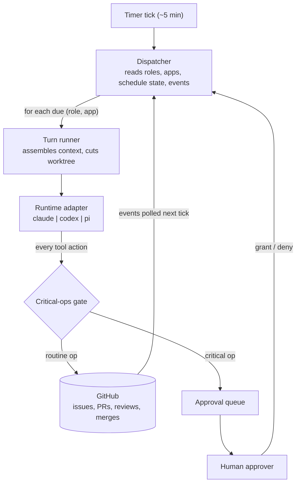

# Operon

An **org runtime**: a standing team of AI agents (Planner, Builder, Reviewer,
SRE, Support, Marketing) that develops and operates a software product through
a private GitHub repo, with a human approver gating critical operations only.



Read [`docs/PURPOSE.md`](docs/PURPOSE.md) for the why and every decision made so far;
[`TASTE.md`](TASTE.md) is the org's constitution;
[`roles.yaml`](roles.yaml) is the org chart made executable;
[`AGENTS.md`](AGENTS.md) is the contributor map.
New to the code? Open [`docs/wiki.html`](docs/wiki.html) — a standalone,
self-contained wiki that walks the three layers, the build loop, and the
runtime adapters, with curated reading paths for coming up to speed.

## Prerequisites

- **Node.js >= 22** (enforced by `engines` in `package.json`).
- **pnpm 11.10.0**, pinned via the `packageManager` field. Run `corepack enable`
  once so the pinned version is used — an older global pnpm fails with store /
  workspace errors.

```bash
corepack enable        # once, so the pinned pnpm@11.10.0 is used
pnpm install
```

Everything you need to explore the repo offline works with no credentials:

```bash
pnpm test               # fast offline suite (575 tests, ~10s)
pnpm typecheck
pnpm dev roles          # validate roles.yaml, print the org chart
pnpm dev apps           # validate apps.yaml, print the app registry
pnpm dev pipelines      # validate pipelines.yaml, print the pass table
pnpm dev doctor         # runtime adapter + config + scheduler status
```

## Commands

Run any subcommand with `pnpm dev <cmd>`; `pnpm dev` with no arguments prints
the full usage.

**Offline — no auth, safe to run on a fresh clone:**

```bash
pnpm dev roles              # validate roles.yaml, print the org chart
pnpm dev apps               # validate apps.yaml, print the app registry
pnpm dev pipelines          # validate pipelines.yaml, print the pass table
pnpm dev doctor             # runtime adapter + config + scheduler status
pnpm dev status             # recent L1/L2 run status from the org home
pnpm dev budget             # monthly app spend and budget pauses
pnpm dev analyze            # L1/L2 anomaly flags and recommendations
pnpm dev approvals          # inspect / decide the critical-op approval queue
pnpm dev retro --date 2026-07-04   # write a weekly evidence retro report
pnpm dev new-app marketplace --target-dir ../marketplace --repo owner/marketplace --goal "A marketplace for dummy products" --dry-run
                            # plan a greenfield app scaffold + Operon bootstrap
pnpm dev bootstrap <repo> --scan-only        # scan a repo, report only (no write)
pnpm dev plan <app> --dry-run                # print a Planner co-planning session
pnpm dev loop --app <app> --once --dry-run   # inspect the ready-ticket loop plan
pnpm dev dispatch --dry-run                  # simulate one autonomous scheduler tick
pnpm dev run-role <role> [--app <app>] --dry-run  # print one role's assembled brief
pnpm dev prune-runs [root] --retention-days N     # delete finalized run dirs past retention
```

The `--dry-run` variants of `new-app`, `plan`, `loop`, `dispatch`, and
`run-role` assemble real context but spend no tokens, so they are safe without
auth.

`pnpm dev new-app ...` is the greenfield path. It creates a separate product
repo skeleton, writes starter product docs (`docs/VISION.md`,
`docs/REQUIREMENTS.md`), writes an initial issue packet under
`.operon/bootstrap/`, emits `.operon/` app artifacts through the same bootstrap
code used for existing repos, and registers the app in the org when an org home
is available. It does not create the GitHub repo or publish anything externally;
the generated `.operon/bootstrap/next-commands.md` records those operator steps.

`pnpm dev bootstrap <repo> --scan-only` inventories a GitHub-backed app repo:
commands, CI, deploy hints, and existing app-owner documentation grouped by
product, architecture, specs, operations, contributor, and quality categories.
Full bootstrap with questionnaire answers emits `.operon/onboarding-report.md`
with the same inventory and gap guidance. It does not generate authoritative
product, architecture, or roadmap docs from source code; app owners bring those
truth sources themselves.

**Live — spends tokens / touches GitHub (auth required):**

```bash
pnpm dev plan <app>                    # a real Planner co-planning session
pnpm dev loop --app <app> --once       # run the build loop over ready tickets
pnpm dev dispatch                      # one real autonomous scheduler tick
pnpm test:live                         # live adapter conformance (real turns)
GH_SANDBOX_REPO=<owner/repo> pnpm e2e:sandbox:setup   # idempotent private repo/label setup
GH_SANDBOX_REPO=<owner/repo> pnpm e2e:sandbox         # disposable real-GitHub loop proof
```

## Setup / auth

The offline commands above need nothing. The live commands need:

- **Claude auth** for `plan`, `loop`, `dispatch`, and `pnpm test:live`. Auth is
  subscription-first (any usable Claude Agent SDK auth counts); `ANTHROPIC_API_KEY`
  is a fallback. `pnpm test:live` skips cleanly when no usable auth is present.
- **Opt-in provider smokes** for the Codex and pi adapters inside `pnpm test:live`:
  set `OPERON_CODEX_LIVE=1` and/or `OPERON_PI_LIVE=1`. (`gpt-5.5` in Codex
  currently requires ChatGPT-account auth, not an API key.)
- **`gh` auth + `GH_SANDBOX_REPO=<owner/repo>`** for the `e2e:sandbox` scripts,
  which create and merge one disposable issue/PR against a private repo.
- **`OPERON_SELF_APPROVAL_SECRET`** so the loop can authorize its own merge in a
  single-token setup. It is the HMAC key behind the self-approval marker the merge
  gate checks; without it the loop cannot sign a merge authorization and the merge
  is withheld as a critical op.

Environment variables are loaded per project from `.env` / `.env.local` at the
git root; there is no `.env.example` yet — the variables above are the full set.

## Layout

```
src/runtime/   the runtime contract: Runtime interface, critical-ops gate,
               telemetry, L1-L3 run logs, secret-patterns, adapters
               (Claude SDK, Codex App Server, pi SDK)
src/loop/      pass pipelines, briefs, quality gates, verdict parsing, and
               the ticket -> PR -> review -> merge state machine
src/org/       app registry, bootstrap, co-planning, dispatch, approvals,
               budget overlays, trigger routing, context, memory, scorecards,
               retro
src/cli/       one module per subcommand; src/cli.ts is a thin dispatch table
test/          adapter conformance, gate, pipelines, bootstrap, qgates, CLI
research/      decision records
```

Imports flow downward only: `org -> loop -> runtime`.

## Status

M0-M12 are complete and the runtime has been hardened and proven live
end-to-end. Implemented and tested: the runtime contract, critical-ops gate,
ClaudeRuntime / CodexRuntime / PiRuntime, the pass executor, L1-L3 run logs,
the app registry, bootstrap flow, co-planning launcher, quality gates
(including a `setup` gate that installs app deps before tests run), typed
verdict parsers with an in-session reformat retry, the GitHub ticket state
machine, the scheduler, the manual loop driver, real Builder/Reviewer pipeline
integration, the approval queue with unforgeable merge authorization, the
budget overlay with auto-pause, Planner and standing-role pipelines,
kind-based company-event routing with channel-presence gating, OKF memory,
full context assembly, per-(app,role) scorecards, and weekly retro
reporting/curation. Manual app commands resolve real app checkouts and
assemble app-aware context.

Proven against real repos:

- **M5** — a disposable private GitHub repo: ready issue → claim → real gates →
  PR → injected review → squash merge → closed issue.
- **M6** — `operon-sandbox-alpha`: real Claude Builder/Reviewer passes shipped
  issue #1 through PR #2 to a merged squash commit.
- **M8** — `operon-sandbox-gamma`: a running `/health` service, a real private
  `op:incident` issue, and Support/Marketing draft artifacts.
- **M11** — the private `buildstacks-dev/buildstacks.dev` repo onboarded as
  `status: onboarding` without changing Operon runtime code.
- **M12 + hardening** — `operon-sandbox-delta` ("Ledgerette") onboarded from
  scratch and driven end-to-end: both planted bugs were fixed live by the loop
  and merged (PRs #11, #12). alpha, beta, gamma, and the live Claude adapter
  conformance were re-verified.

`docs/capability-matrix.md` records each adapter's native, adapter-built, and
degraded capabilities. `pnpm test:live` is the gated live-adapter proof.

### Known limitations

- **Tool-level telemetry is partial.** The L2 event bridge is wired, but the
  adapters do not yet emit `tool_use` turn events, so `envelope.tool_counts`
  stays empty and the `bash_heavy` / `environment_retry` anomaly detectors
  cannot fire. The other three detectors (`low_tokens_high_time`,
  `single_turn_long_run`, `cold_cache`) work off envelope fields that are
  written.
- **The manual `pnpm dev loop` path does not feed the org telemetry ledger**
  (`telemetry/<day>.jsonl`); only the autonomous `dispatch` path records turn
  spend there, so `pnpm dev budget` shows `$0` for manually-driven loops.
  Per-pass spend is still fully visible in `pnpm dev status` and the run
  envelopes. Production uses the dispatcher, which records.
- **Codex App-Server read bypass:** under the `untrusted` approval policy the
  App Server auto-runs trusted read-only commands (`cat`, `ls`) without an
  approval request, so those reads do not reach the gate hook. Tracked in
  `docs/capability-matrix.md` as a live-verify follow-up.
