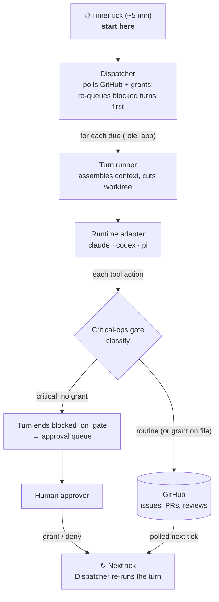

# Operon

An **org runtime**: a standing team of AI agents (Planner, Builder, Reviewer,
SRE, Support, Marketing) that develops and operates a software product through
a private GitHub repo, with a human approver gating critical operations only.



The flow is a single loop, read top to bottom: the **Timer tick** wakes the
**Dispatcher**, which runs due turns through the adapter and gate, then the
`↻ Next tick` node folds back to the Dispatcher on the following tick — grants
and freshly-polled GitHub events are both picked up there.

The gate classifies *every* tool action; only ops matching a critical rule are
blocked. A blocked op does not resume in place — the turn ends `blocked_on_gate`,
the human's grant writes a single-use grant file, and the **next dispatcher tick
re-runs that turn first**, where the gate now finds the grant and lets the op
through. The org's own squash-merge is a separate path, gated by HMAC review
authorization rather than this gate.

Read [`docs/PURPOSE.md`](docs/PURPOSE.md) for the why and every decision made so far;
[`TASTE.md`](TASTE.md) is the org's constitution;
[`roles.yaml`](roles.yaml) is the org chart made executable;
[`AGENTS.md`](AGENTS.md) is the contributor map.
New to the code? Open [`docs/wiki.html`](docs/wiki.html) — a standalone,
self-contained wiki that walks the three layers, the build loop, and the
runtime adapters, with curated reading paths for coming up to speed.

## Install locally

Operon requires **Node.js >= 26** and the pnpm version pinned in
`packageManager`. Node 26 does not bundle Corepack, so install/enable it once
if `pnpm --version` does not match the pin.

```bash
npm install -g corepack   # once per Node installation, when needed
corepack enable
pnpm install
pnpm link:local
```

`pnpm link:local` exposes `operon` at `~/.local/bin/operon` (or
`$OPERON_BIN_DIR/operon`) and links the `$operon` Codex skill into
`$CODEX_HOME/skills/operon`. Add `~/.local/bin` to `PATH` if necessary. The
local command is source-backed: the next invocation reads the latest source
changes, so no `operon update`, relink, or rebuild is needed. A packed or
published installation instead runs the compiled `dist/cli.js` binary.

These four locations are intentionally different:

| Location | One-line meaning |
| --- | --- |
| Package root | Operon's installed implementation and reusable templates. |
| Org home | Committed roles, apps, pipelines, prompts, taste, and curated memory. |
| State home | Local high-churn clones, worktrees, locks, approvals, telemetry, and run logs. |
| App repo | An independent product checkout that Operon develops or operates. |

Create the org before onboarding an app; this can be run from any directory:

```bash
operon --version
operon org init ~/Build/my-org --name my-org
operon doctor
operon context
```

`org init` creates a complete org home from packaged templates, creates the
default state home at `~/.operon/<org>`, and records the active org pointer at
`~/.operon/config`. Use `operon org use <path>` to switch to another complete
org. `OPERON_ORG_HOME` and `OPERON_STATE_HOME` are explicit per-process
overrides.

## Commands

Run `operon --help` or `operon <command> --help` for current syntax. The
read-only discovery surfaces are also machine-readable for coding agents:

```bash
operon capabilities --json
operon context --json
operon roles
operon apps
operon pipelines
operon doctor --json
```

Offline onboarding and inspection do not require provider credentials:

```bash
operon bootstrap <local-repo> --scan-only
operon bootstrap <local-repo>                    # interactive terminal questionnaire
operon bootstrap <local-repo> --answers answers.json
operon new-app marketplace --target-dir ../marketplace --repo owner/marketplace --goal "A marketplace for dummy products" --dry-run
operon plan <app> --dry-run
operon loop --app <app> --once --dry-run
operon dispatch --dry-run
operon run-role <role> --app <app> --dry-run
operon status
operon budget
operon analyze
operon approvals
```

Bootstrap accepts a local checkout path, never a GitHub URL. It always joins
the active org and writes app-owned files only under the app repo's
`.operon/` directory. Its opening output explains the app repo, org home, and
state home before anything is written. A non-interactive run requires
`--answers` and otherwise writes nothing. `new-app` creates a separate product
repo skeleton and then follows the same bootstrap/register path. Neither
command creates or publishes a GitHub repo.

The `--dry-run` variants of `new-app`, `plan`, `loop`, `dispatch`, and
`run-role` assemble real context but spend no tokens. Live forms can spend
tokens and touch GitHub:

```bash
operon plan <app>
operon loop --app <app> --once
operon dispatch
pnpm test:live
GH_SANDBOX_REPO=<owner/repo> pnpm e2e:sandbox:setup
GH_SANDBOX_REPO=<owner/repo> pnpm e2e:sandbox
```

Contributors can still use `pnpm dev <command>` inside the Operon source repo,
but product and org workflows should exercise the installed `operon` command
from a neutral directory.

## Setup / auth

The offline commands above need nothing. The live commands need:

- **Claude auth** for `plan`, `loop`, `dispatch`, and `pnpm test:live`. Auth is
  subscription-first (any usable Claude Agent SDK auth counts); `ANTHROPIC_API_KEY`
  is a fallback. `pnpm test:live` skips cleanly when no usable auth is present.
- **Opt-in provider smokes** for the Codex and pi adapters inside `pnpm test:live`:
  set `OPERON_CODEX_LIVE=1` and/or `OPERON_PI_LIVE=1`. (`gpt-5.5` in Codex
  currently requires ChatGPT-account auth, not an API key.)
- **`gh` auth + `GH_SANDBOX_REPO=<owner/repo>`** for the `e2e:sandbox` scripts,
  which create and merge one disposable issue/PR against a private repo.
- **`OPERON_SELF_APPROVAL_SECRET`** so the loop can authorize its own merge in a
  single-token setup. It is the HMAC key behind the self-approval marker the merge
  gate checks; without it the loop cannot sign a merge authorization and the merge
  is withheld as a critical op.

Environment variables are loaded per project from `.env` / `.env.local` at the
git root; there is no `.env.example` yet — the variables above are the full set.

## Layout

```
src/runtime/   the runtime contract: Runtime interface, critical-ops gate,
               telemetry, L1-L3 run logs, secret-patterns, adapters
               (Claude SDK, Codex App Server, pi SDK)
src/loop/      pass pipelines, briefs, quality gates, verdict parsing, and
               the ticket -> PR -> review -> merge state machine
src/org/       app registry, bootstrap, co-planning, dispatch, approvals,
               budget overlays, trigger routing, context, memory, scorecards,
               retro
src/cli/       one module per subcommand; src/cli.ts is a thin dispatch table
test/          adapter conformance, gate, pipelines, bootstrap, qgates, CLI
research/      decision records
```

Imports flow downward only: `org -> loop -> runtime`.

## Observability: where agent activity is recorded

Two stores, one authority each (both under the org's *state home*,
`~/.operon/<org>/` by default):

```
runs/<app>/<YYYYMMDD-HHMMSS>-<pipeline>-<pass>/
├── envelope.json    # ids, status, timings, token/cost rollups, verdict — L1
├── events.jsonl     # trace/span-scoped lifecycle events — L2
├── brief.md         # the exact prompt the pass received — L3, verbatim
├── output.md        # what the pass produced — L3, verbatim
└── session.log      # present only when the adapter streamed TurnEvents
telemetry/<date>.jsonl    # the org ledger: one row per settled provider turn
invocations/<date>.jsonl  # one row per orchestrator invocation (loop + dispatch)
```

`runs/` is the per-pass source of truth (what was asked, what happened, what
it cost). The ledger is the rollup `operon budget`, `operon status`, retro,
and scorecards read: every provider turn settles into it exactly once, keyed
on its `runId` — completed, blocked, and failed passes alike — so budget caps
are enforced against real spend, and a tick whose app has exhausted its
monthly cap refuses to claim before any pass starts. `operon budget
--reconcile` back-fills the ledger from run envelopes (idempotent).
Subscription-backed provider costs are Operon-computed equivalent-cost
estimates, flagged as such on every row. `operon telemetry --app <app>
[--html out.html]` renders the run view.

## Status

Operon is build-complete and proven live: real Planner/Builder/Reviewer turns
take GitHub issues from `op:ready` through quality gates, PR, cross-provider
review, and squash-merge on real repos — most recently `operon-sandbox-delta`
("Ledgerette"), onboarded from scratch, where the loop fixed and merged both
planted bugs unaided. A proportionality campaign (2026-07-10,
[`docs/proportionality-review.md`](docs/proportionality-review.md)) then
rebuilt the org's economics end to end: per-pass ledger settlement with
enforced budget caps, durable continuation from artifacts, honest stops with
token-free environment preflight, one-pass proportional bootstrap planning
published by the orchestrator, a ratified approval & release boundary (scoped
grants, release handoff, adapter-level role toolset shaping), and a
repeatable clean-room benchmark
([`docs/benchmark-runbook.md`](docs/benchmark-runbook.md)). The latest dated
live evidence is
[`research/2026-07-10_stage7-live-conformance-and-benchmark.md`](research/2026-07-10_stage7-live-conformance-and-benchmark.md);
open work lives in the [issue tracker](https://github.com/buildstacks-dev/Operon/issues).

`docs/capability-matrix.md` records each adapter's native, adapter-built, and
degraded capabilities. `pnpm test:live` is the gated live-adapter proof.

### Known limitations

- **Tool-level telemetry is partial.** The L2 event bridge is wired, but the
  adapters do not yet emit `tool_use` turn events, so `envelope.tool_counts`
  stays empty and the `bash_heavy` / `environment_retry` anomaly detectors
  cannot fire. The other three detectors (`low_tokens_high_time`,
  `single_turn_long_run`, `cold_cache`) work off envelope fields that are
  written.
- **Interactive co-planning usage is unmeasured.** Interactive `operon plan`
  spawns the native `claude` CLI with inherited stdio, so session tokens never
  flow through Operon; those ledger rows carry an explicit `unmeasured: true`
  marker (cost unknown, not zero). The runtime-backed `plan --auto` mode is
  fully measured — prefer it wherever a goal can be stated non-interactively.
- **Codex App-Server read bypass:** under the `untrusted` approval policy the
  App Server auto-runs trusted read-only commands (`cat`, `ls`) without an
  approval request, so those reads do not reach the gate hook. Tracked in
  `docs/capability-matrix.md` as a live-verify follow-up.
