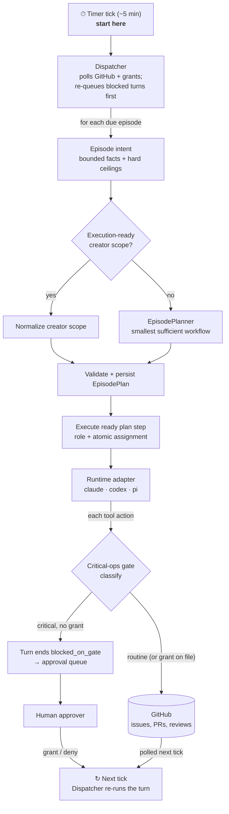

# Cormidia

An **org runtime**: a standing team of AI agents (Planner, Builder, Reviewer,
SRE, Support, Marketing) that develops and operates a software product through
a private GitHub repo, with a human approver gating critical operations only.

The name comes from the *cormidium*, a coordinated unit found in siphonophores.
That is only the name's origin: Cormidia's product units remain **orgs**, **apps**,
and **roles**.



The flow is a single loop, read top to bottom: the **Timer tick** wakes the
**Dispatcher**, which turns due work into one durable episode plan before any
delivery turn reaches an adapter, then the
`↻ Next tick` node folds back to the Dispatcher on the following tick — grants
and freshly-polled GitHub events are both picked up there.

EpisodePlanner normally runs for every episode in both assignment modes. The
only provider-planning-turn bypass is an explicit, provenance-bearing creator
scope complete enough to normalize into the same executable plan. A short
prompt, an existing ticket, or work that merely looks simple never implies the
bypass. `fixed` and `adaptive` change only how each planned provider step gets
its indivisible harness/model/effort assignment: fixed resolves the configured
tuple; adaptive chooses an exact approved candidate. Role permissions do not
change with the assignment. The planner boot turn receives no network or tool
authority; deterministic intent gathering is complete before it runs.

The gate classifies *every* tool action; only ops matching a critical rule are
blocked. A blocked op does not resume in place — the turn ends `blocked_on_gate`,
the human's grant writes a single-use grant file, and the **next dispatcher tick
re-runs that turn first**, where the gate now finds the grant and lets the op
through. The org's own squash-merge is a separate path, gated by HMAC review
authorization rather than this gate.

Read [`docs/PURPOSE.md`](docs/PURPOSE.md) for the why and every decision made so far;
[`TASTE.md`](TASTE.md) is the org's constitution;
[`roles.yaml`](roles.yaml) is the org chart made executable;
[`AGENTS.md`](AGENTS.md) is the contributor map.
New to the code? Start at [`docs/architecture.md`](docs/architecture.md) —
the thin system map — and follow its links into each subsystem's topic folder
(`docs/loop/`, `docs/scheduler/`, `docs/approvals/`, `docs/harness/`,
`docs/org/`, and friends), where one `design.md` per folder is the
authoritative contract.

Cormidia turns approved goals into verified software outcomes with process
proportional to the work and its risk, minimal human attention, durable forward
progress, and continuously improving unit economics. `docs/VISION.md` states
the operator outcome; `docs/episodes/contract.md` is the normative plan-derived
budget, route, and measurement contract; `docs/qualification/design.md`
owns qualification and release gating.

## Install

Cormidia requires **Node.js >= 26**. Install the published command globally:

```bash
npm install -g --ignore-scripts cormidia
node "$(npm root -g)/cormidia/scripts/link-skills.mjs" --dry-run
node "$(npm root -g)/cormidia/scripts/link-skills.mjs"
cormidia --version
cormidia-job --help
```

The package installs **two binaries** through npm's global bin directory:
`cormidia` (the governed org runtime) and `cormidia-job` (ad-hoc
dependency-ordered job graphs — see `docs/jobs/design.md`).

npm installs binaries only. The second command installs the **two packaged
Agent Skills** that teach a coding agent to drive those binaries, linking
`$cormidia` and `$cormidia-job` into each provider's user-global skill home:

| Provider | Skill home | Override |
| --- | --- | --- |
| Codex | `~/.codex/skills/` | `$CODEX_HOME` |
| Claude | `~/.claude/skills/` | `$CLAUDE_CONFIG_DIR` |
| pi | `~/.pi/agent/skills/` | `$PI_CODING_AGENT_DIR` |

**User-global, not per-project, and not an agent instruction file.** A skill is
routed by its frontmatter `name`/`description`; its body loads only when the
agent triggers it, so installing both globally costs nothing per prompt and
makes Cormidia available in every repository. `$cormidia-job`'s description
deliberately routes product work — tickets, PRs, releases, anything reaching
GitHub — back to `$cormidia`, so installing one without the other removes that
guardrail. Skill install is an **install-time** step, not an org-onboarding or
app-onboarding step: `cormidia org init` and `cormidia bootstrap` neither
install nor require skills.

Re-run the dry-run and `link-skills.mjs` after upgrading. The linker classifies
all six targets first, reports every collision with the observed link/file
evidence and an exact move-aside command, and changes none when any path is
foreign. A clean run replaces the complete skill set transactionally; rerunning
the same version is an idempotent no-op.

### Install locally from source

For development from a source checkout, use the pnpm version pinned in
`packageManager`. Node 26 does not bundle Corepack, so install/enable it once
if `pnpm --version` does not match the pin.

```bash
npm install -g corepack   # once per Node installation, when needed
corepack enable
pnpm install
pnpm link:local
```

`pnpm link:local` exposes **both** binaries at `~/.local/bin/` (or
`$CORMIDIA_BIN_DIR`) and links **both** skills into the same three provider
skill homes the published install uses, using each provider's default home when
its override is unset. Add `~/.local/bin` to `PATH` if necessary. Rerunning it
is idempotent and upgrades the former `scripts/cormidia-local.mjs` link only
when it belongs to that same checkout; files, directories, and links owned by
another checkout remain untouched and are refused.

The local command is **source-backed**: `~/.local/bin/cormidia` symlinks into
the checkout and runs `src/cli.ts` through `tsx`, so the next invocation reads
the latest source changes and no `cormidia update`, relink, or rebuild is
needed. That also means the installed command *is* whatever the checkout
currently says — the working tree, on its current branch.

A packed or published installation takes a different path entirely: the
packaged `src/cormidia.cjs` and `src/cormidia-job.cjs` preflight launchers run
the compiled `dist/cli.js` and `dist/jobs/main.js`. All four launchers report a
removed working directory before ESM resolution with one actionable Cormidia
error.

### Testing the packaged install

Because the dev loop is source-backed, it never exercises the `dist/` code a
real install runs. To verify this checkout the way a user receives it:

```bash
pnpm install:packaged --dry-run
```

Without `--dry-run` it builds with the exact pnpm version pinned in
`packageManager`, packs, and runs npm's real global-install path in a disposable
same-filesystem prefix. Only after that staged generation passes both binary
checks does it transactionally promote the Cormidia-owned package root, both declared
binaries, and all six skill links. Same-version reinstall and packaged upgrade
converge in place; any ordinary failure restores the prior complete generation.

Every package, binary, PATH shadow, and skill target is classified before the
first install-target mutation from its exact directory-entry evidence plus the
owning `package.json` name/version/bin identity. Foreign collisions are all
reported with evidence and exact move-aside commands and remain untouched. A
source-backed generation requires explicit `--replace-source-links`; this is
the safe source-to-package path, and `pnpm link:local` restores the dev loop.
`--tarball <absolute-path>` applies the same checks and transaction to an exact
already-packed candidate without rebuilding it.

That consent is intentionally scoped to links into the checkout running the
command. A link into another identity-verified Cormidia checkout remains a
foreign collision because it may be a separate active dev loop; even
`--replace-source-links` leaves it untouched. The refusal names that checkout,
shows the exact symlink evidence, and supplies one move-aside command per path
so the operator can inspect and explicitly retire the other loop before retrying.

`pnpm smoke:package -- <absolute-tarball-path>` is the narrower CI check — it
performs two real `npm install -g --prefix <temporary-prefix>` passes, runs every
declared binary, and links both skills into three temporary provider homes. It
never reads or changes the host's actual global installation.

These four locations are intentionally different:

| Location | One-line meaning |
| --- | --- |
| Package root | Cormidia's installed implementation and reusable templates. |
| Org home | Committed roles, apps, pipelines, prompts, authority, taste, and curated memory. |
| State home | Local high-churn clones, worktrees, locks, approvals, telemetry, and run logs. |
| App repo | An independent product checkout that Cormidia develops or operates. |

Create the org before onboarding an app; this can be run from any directory:

```bash
cormidia --version
cormidia org init ~/Build/my-org --name my-org --dry-run
cormidia org init ~/Build/my-org --name my-org
cormidia doctor
cormidia context
```

`org init --dry-run` is a token-free, zero-domain-write preflight: it resolves the org,
state, and pointer paths; lists every generated destination; and shows the
authority summary plus complete packaged role chart. Without `--dry-run`, init
keeps its execute-by-default compatibility. It creates an absent directory or
safely populates an existing real directory while preserving unrelated entries;
an existing org, generated-path collision, or symlink blocks before target
mutation and nothing is overwritten. Once the proposed state home has passed
that validation, the command-level invocation audit is the sole preview write.

Successful init creates a complete org home from packaged templates, including
a versioned `AUTHORITY.md`, creates the
default state home at `~/.cormidia/<org>`, and records the active org pointer at
`~/.cormidia/config`. Use `cormidia org use <path>` to switch to another complete
org. `CORMIDIA_ORG_HOME` and `CORMIDIA_STATE_HOME` are explicit per-process
overrides. The default `delegated-operator` charter automates ordinary,
reversible work while Cormidia's critical-operation gates remain mandatory;
choose `--authority conservative` or `--authority custom --authority-file
<path> --authority-by <identity>` during onboarding to narrow or replace the
human grant explicitly.

### Upgrading an existing installation

For a published package upgrade, rerun the three install/link commands above.
npm replaces its same-prefix `cormidia` package and binary links; the skill
preflight then proves every existing target is absent or Cormidia-owned before
converging all six. Do not use bare `npm install -g` to convert an active
source-backed development link: run `pnpm install:packaged
--replace-source-links` from that checkout so binaries and skills change as one
rollback-safe generation.

The first invocation that uses the default home atomically moves
`~/.operon` to `~/.cormidia`, rewrites the active pointer and lifecycle clone
paths, repairs active turn journals and registered git worktrees, and replaces
an owned host-scheduler definition with the Cormidia identity and state path.
If both roots exist, Cormidia
refuses before changing either one; identify the authoritative state and move
the other aside before retrying. Explicit `CORMIDIA_STATE_HOME` paths are never
relocated automatically.

Environment variables are a hard break: only the `CORMIDIA_*` names are read.
Existing app repositories also need one reviewed repository commit that runs
`git mv .operon .cormidia` and updates any instruction links to the app-owned
files. Bootstrap refuses to create `.cormidia/` beside the retired directory,
so app policy can never split across two roots.

Every dispatched CLI command whose state home is explicit or safely resolved
writes one terminal command row under `invocations/`, including read-only
commands, previews, parser failures, and pre-provider refusals. Rows carry a
stable invocation id, command/subcommand, secret-redacted argv, dry-run flag,
outcome/exit code/duration, and resolved org/app when known. Intent is persisted
first under `state/invocation-journal/`; terminal append is idempotent, and the
next command reconciles a terminal journal or a running journal whose process
is proven dead as `interrupted`. A live process's running journal is never
guessed terminal and remains inspectable. This audit write is the sole
exception to preview/read-only "no state writes" claims. Help, version, the
no-command usage banner, and commands with neither an explicit nor a safely
resolved state home have no org-scoped destination and are deliberately not
journaled.

## Commands

`cormidia --help` is intentionally concise: it shows common starting actions and
the operator-intent help groups, not the entire command catalog. Use the next help
layer for the area you are working in, then ask the individual command for complete
syntax, constraints, and safety notes:

```bash
cormidia setup --help
cormidia onboarding --help
cormidia delivery --help
cormidia operations --help
cormidia governance --help
cormidia inspection --help
cormidia <command> --help
```

These help groups are navigation only; they do not replace, rename, or wrap any
command. The read-only discovery surfaces remain exhaustive and machine-readable for
coding agents and automation:

```bash
cormidia capabilities --json
cormidia context --json
cormidia roles
cormidia apps
cormidia pipelines
cormidia doctor --json
```

For every command that accepts `--json`, the format contract also covers
failures caught at the CLI boundary. A failed invocation exits non-zero and
prints one document to stdout with `schema_version`, `ok: false`, and a stable
`error.code`, `error.message`, and `error.remediation`; it does not prepend a
plaintext stderr diagnostic. For example, discovery before an org is selected
reports `error.code: "no_active_org"`, so callers never need to match prose.
`context`, `org show`, and `doctor` share the same lifecycle classification:

| Condition | Stable code | Recovery |
| --- | --- | --- |
| No pointer or explicit selectable org | `no_active_org` | Run `cormidia org init <path> --name <name>`. |
| Selected path does not exist | `active_org_missing` | The error names the exact path; select an existing home with `cormidia org use <path>` or initialize one. |
| Selected path exists but required configuration is missing | `org_home_incomplete` | Restore the named entry, select a complete home, or initialize one. |

These reads never repair, rewrite, or guess the active pointer.

By default `doctor` runs bounded, non-billable readiness probes only for the
runtimes and models referenced by the active `roles.yaml`: Claude performs an
SDK initialize/account-info control request, Codex performs App Server
`initialize` + `account/read`, and pi resolves its model/auth configuration.
No model prompt is sent. Missing launch artifacts, transport failure, missing
auth, invalid model configuration, and probe timeout are reported distinctly.
Use `cormidia doctor --config-only` only in an isolated/offline packaging check;
its adapter rows are `WARN` because configuration validity is not runtime
readiness.

Offline onboarding and inspection do not require provider credentials:

```bash
cormidia bootstrap <local-repo> --scan-only
cormidia bootstrap <local-repo>                    # interactive terminal questionnaire
cormidia bootstrap <local-repo> --answers answers.json
cormidia bootstrap <local-repo> --answers-from <archive-or-app> --json
cormidia bootstrap publish <app> --json             # preview; --execute opens draft PRs only
cormidia org upgrade --authority delegated-operator --json
cormidia app verify <app> --json
cormidia app promote <app> --to live --json         # non-mutating plan
cormidia new-app marketplace --target-dir ../marketplace --repo acme-co/marketplace --goal "A marketplace for dummy products" --dry-run # stack-neutral bare, the default
cormidia new-app docs-site --target-dir ../docs-site --repo acme-co/docs-site --goal "Publish product documentation" --template typescript-node --dry-run --json # explicit accelerator
cormidia app product-docs <app> --workdir <checkout> --disposition keep # preview; execute requires <app>:keep
cormidia plan <app> --dry-run
cormidia plan ratify-ticket-budget --app <app> --decomposition <id> --actor <identity> --reason "<why>" --from-budget N --to-budget N # preview; human-gated
cormidia loop --app <app> --once --dry-run
cormidia loop rearm --app <app> --ticket <n> --reason "reviewed" --actor <identity> --from-allowance 3 --to-allowance 4 # preview
cormidia dispatch --dry-run
cormidia dispatch --retry-schedule <settlement-id>       # explicit one-time retry; same due-window identity
cormidia publication list --app <app> --json             # read-only transaction/recovery status
cormidia publication resume --app <app> --id <pub-id> --json # token-free exact recovery
cormidia scheduler install --json                       # preview, audit row only
cormidia scheduler status --json                        # read-only health
cormidia scheduler uninstall --json                     # preview, audit row only
cormidia run-role <role> --app <app> --turn <invocation-id> --template <bounded-scope.md> --dry-run
cormidia run-role <role> --app <app> --turn <invocation-id> --template <bounded-scope.md> --dry-run --allow-network # explicit per-invocation egress preview
cormidia status
cormidia budget
cormidia analyze
cormidia approvals
cormidia approvals status
cormidia objective grant --app <app> --objective <text> --classes <rule[,rule...]> --repo <owner/repo> --by <identity> # human-created standing authority (grantable classes)
cormidia objective grant-critical --app <app> --objective <text> --class <rule> --scope <bound> --repo <owner/repo> --by <identity> # §4.1 ceremony verb for one human-only class
cormidia objective list --json
cormidia objective revoke <grant-id>
cormidia report --period 90d
cormidia report --app <app> --period 30d --html app-report.html
cormidia observe --app <app> --open
```

Company-lifecycle files placed in
`~/.cormidia/<org>/state/events/inbox/*.json` use a closed kind registry.
`cormidia dispatch` reports malformed payloads as `malformed_company_event`,
unregistered kinds as `unknown_company_event_kind`, and valid registered kinds
with no current role trigger as the non-error skip `no_subscriber`; only valid
subscribed kinds spawn turns. See [the event schema contract](docs/scheduler/event-schemas.md)
for the supported kinds, payloads, and exact retention behavior.

`new-app` classifies its target by content, not by emptiness. Design documents,
briefs, assets, prototypes, and incidental metadata are legitimate greenfield
inputs: the scaffold lands additively beside them and every existing byte is
preserved and reported. An existing application checkout is routed to
`cormidia bootstrap`, an already-onboarded app to verify/reset, and a path the
scaffold would create — or a symlinked, non-directory, or unwritable target —
refuses before the first write and names the exact path. Preview and execution
run the same preflight, and preview runs it before reporting, so a dry run that
reports ready is a prediction execution can keep; the target is re-read
immediately before the first write so an intervening write fails closed.

One rule decides whether an `owner/repo` slug is a concrete, deliberately
chosen external-action target, and every surface reads it: `new-app` preview and
execution, bootstrap registration, the generated guide, `app verify`, planning,
and every dispatched turn. An unresolved template value — a placeholder in
either component, a URL, a path, or a whitespace variant — is a blocker, never
generated executable guidance and never a durable registration; preview and
execution report the same typed refusal naming the exact target. An existing-app
bootstrap with no resolvable remote still registers, but the recorded
`OWNER/<app>` slug is marked non-actionable and refused by every outward path.
Correcting an app already registered with a placeholder is a supported
lifecycle operation (`cormidia app reset <app> --execute --confirm <app>`, then
re-onboard with the real slug) — never a hand-edit of `apps.yaml`,
`.cormidia/config.yaml`, or the generated guide, which are written together and
would otherwise disagree. The human walk-through is
[`docs/org/manual-e2e-runbook.md`](docs/org/manual-e2e-runbook.md), whose
identity preflight is fail-closed.

Bootstrap accepts a local checkout path, never a GitHub URL. It always joins
the active org and writes app-owned files under `.cormidia/`, plus one marked,
idempotent authority pointer composed into root `AGENTS.md` and `CLAUDE.md`.
Existing instruction content is preserved. Its opening output explains the app repo, org home, and
state home before anything is written. A non-interactive run requires
`--answers` or `--answers-from` and otherwise writes no bootstrap artifacts
(the universal command audit row still records the refusal). Normalized
non-secret answers are retained in isolated state and reset archives;
`--answers-from <app>` resolves the app's latest default reset archive.
Generated YAML/authority metadata and text formatting are validated before
success. `new-app` creates a separate product repo and then follows the same
bootstrap/register path. Its default is `--template bare`: omitting `--template`
behaves exactly like passing it, because the absence of a choice is not an
architecture decision. Bare emits only stack-neutral product docs and Cormidia
artifacts — no framework, runtime, package manager, application skeleton, or gate
command is inferred from `--goal`. `--template typescript-node` remains an
explicit accelerator and emits the existing npm + strict TypeScript web scaffold
and executable setup/test/lint commands, byte-identical to before.
Required test/lint gates remain explicitly pending and fail closed until the
first implementation configures meaningful stack-specific commands. Dry-run
text and JSON report the selected template, exact paths (including the
generated `.cormidia/LABELS.md` reference), and gate state. The generated next
steps are app-specific and checkpoint repository creation/push, canonical labels,
planning sources and preview/live pairs, Builder/Reviewer delivery, approvals and
human merge, verification/promotion, and operation. Before the first plan, the
operator records `keep`, `reconcile`, or `remove` against exact generated document
hashes with `app product-docs`; automated planning fails before a provider or GitHub
write when that decision is missing or stale. Exact legacy scaffolds are migrated by
that same confirmed command. Keep creates no unnecessary docs work, remove uses
recoverable staging to delete only still-exact placeholders and keeps them absent, and reconcile creates a
governed documentation unit ahead of implementation from an external authoritative
source. For `bare`, planning also creates the stack-and-gates unit first; only its
generated loop command grants network access for stack/dependency setup. Omit the grant
from later invocations unless their accepted work requires egress. Verify and preview
promotion only after the required units merge with real checks.
`new-app` and ordinary `bootstrap` themselves create neither a GitHub repo nor an
issue; the generated guide marks the later outward commands explicitly.

Onboarding claims follow an evidence ladder:

| Evidence | What it proves |
| --- | --- |
| Generated | Local app/org artifacts exist; no registry, remote, runtime, or schedule claim follows. |
| Registered | The org registry and app-owned config agree; the app remains onboarding. |
| Runtime-ready | Deterministic verification proves refs, ancestry, canonical GitHub labels (explicitly not applicable for local/file remotes), managed clone, authority/config hashes, app checks, locks/approvals, and required adapters. |
| Live | Human-selected registry policy permits ordinary manual/dispatch work; a scheduler is not implied. |
| Autonomously scheduled | The correct org-scoped scheduler is installed, healthy, and emits attributable due/executed/skipped/blocked evidence. |

These are evidence claims, not five new `apps.yaml` values; registry state
remains `onboarding | live | paused`. `new-app` reaches generated, while a
successful bootstrap reaches registered. Neither alone proves runtime-ready,
live, or autonomous scheduling. The design contract behind all of this —
what bootstrap scans, what verify proves, how promote executes — is
[`docs/org/onboarding.md`](docs/org/onboarding.md).

Scheduler lifecycle is explicitly gated. Preview the exact org-scoped
definition first, then execute only with the reported identity (or exact org
name):

```bash
cormidia scheduler install --json
cormidia scheduler install --execute --confirm <scheduler-id>
cormidia scheduler status --json
cormidia scheduler uninstall --json
cormidia scheduler uninstall --execute --confirm <scheduler-id>
```

The generated host definition uses absolute executable, package, org-home, and
state-home paths. Install also resolves required tools such as `gh`, records
their absolute paths, and renders an explicit minimal `PATH`; dispatch fails
before org loading or turn construction if that environment drifts. It contains
no credentials or inherited environment dump.
Status joins ownership/hash/cadence validation, loaded/active manager state,
recent durable ticks, duplicate/orphan checks, and provider settlement
agreement; a definition file alone is never healthy. See
[`docs/scheduler/design.md`](docs/scheduler/design.md) for the canonical schema, identities,
reason codes, and health rules.

The `--dry-run` variants of `new-app`, `plan`, `loop`, `dispatch`, and
`run-role` spend no tokens. The current `plan --auto --dry-run` and
`plan --creator-scope ... --execution-ready --dry-run` and
`plan --explain-route` commands expose only a provisional, token-free intent
preview: current ledger budget, declared request facts, assignment candidates,
safety facts, creator-scope assessment, and the fixed planner boot boundary.
Repository/source inspection owned by the live snapshot remains clearly
deferred. The previews deliberately return
`exactProviderAuthoredPlan: null`; ordinary auto planning needs a live
EpisodePlanner call, while explicit creator scope is normalized and persisted
only during live execution. `cormidia episode explain <episode-id>` exposes the
read-only durable plan, assignment rationale, route, and execution status. It
degrades instead of failing: it prints the directory it read, renders whatever
durable evidence exists, annotates anything it could not resolve, and exits
non-zero when the explanation is incomplete. `--json` emits the same
explanation as one document.

Fresh standalone `run-role` preview and live invocations require the same app,
invocation identity, bounded template, and assignment semantics. `--turn` is a
trace/session identity, not a GitHub ticket number or ticket binding. The
preview reads and hashes the template, validates the execution-ready creator
scope, reports its provenance/objective/atomic assignment, constructs no
provider runtime, and writes no workflow state beyond its command audit row. Provider readiness, live budget and
approval outcomes, managed-clone synchronization, and later external-state
changes remain explicit exclusions. `--workdir` is intentionally unsupported:
preview reads a discovered registered checkout, while live execution
synchronizes the org-managed clone. A durable resume may reuse its persisted
creator bytes without a mutable template file; scheduled/event routes keep
their governed pipeline scope.

`run-role` denies network access by default. `--allow-network` admits egress
for that invocation only, appears in the token-free brief, and is bound into
the durable creator scope so a resumed turn cannot silently change it.

Live forms can spend tokens and touch GitHub:

```bash
cormidia plan <app> --auto --goal "<bounded goal>"
cormidia plan <app> --auto --goal "<corpus goal>" --source docs/specs --expected-tickets complete
cormidia plan <app> --auto --goal "<corpus goal>" --source docs/specs --expected-tickets complete --resume-publication
cormidia plan <app> --creator-scope ./scope.yaml --execution-ready --no-publish
cormidia loop --app <app> --once
cormidia dispatch
```

An execution-ready creator scope is the explicit alternative to the dedicated
EpisodePlanner design turn. `--creator-scope` and `--execution-ready` are
required together; readiness is never inferred from a detailed-looking goal or
file. JSON and YAML are transport formats for the existing strict
`CreatorEpisodeScope` schema, not separate plan schemas. The scope's objective
supplies `--goal` when it is omitted. A mismatched disposition, incomplete
scope, unknown operation/role, or unapproved adaptive assignment fails before
provider construction instead of silently falling back to EpisodePlanner.

`--expected-tickets` states how many tickets you expect and accepts an exact
count (`10`), inclusive range (`4-12`), open range (`7+`), or `complete`.
It does not raise publication admission: each invocation remains bounded to
bootstrap 3, growth 5, or mature 7 tickets, further constrained by repository
evidence even when `--stage` is asserted. The planner owns decomposition, and
its RoadmapPlan is where that decomposition is durable — Cormidia does not keep
a second, source-derived decomposition beside it. A publication batch is marked
prepared before any issue is created, so an interrupted run recovers that exact
batch with `--resume-publication` instead of creating duplicates. Dependency
indexes are local to the plan that declares them; cross-episode dependency edges
are not supported.

```yaml
planningDisposition: execution_ready
provenance:
  source: human
  creatorId: operator@example.com
  createdAt: "2026-07-20T12:00:00.000Z"
  evidenceRefs: [docs/specs/feature-a.md]
workKind: bounded-product-plan
objective: Turn the approved Feature A design into implementation tickets
inScope: [Preserve and decompose the approved Feature A design]
outOfScope: [Redesign Feature A]
acceptanceCriteria: [Every approved criterion appears in a buildable ticket]
expectedArtifacts:
  - {id: ticket-plan, kind: TicketPlan, required: true}
declaredConstraints: {designRef: docs/specs/feature-a.md}
safetyFacts: []
steps:
  - kind: provider_turn
    id: ticket-plan
    operation: plan/decompose
    role: planner
    objective: Render the approved design as a TicketPlan
    dependsOn: []
    requiredCapabilities: [structured_verdict]
    inputRefs: []
    expectedOutputs:
      - {id: ticket-plan, kind: TicketPlan, required: true}
    maxTurnBudgetUsd: 5
    selectionReason: The creator already supplied every design decision
```

The terminal operation must match the requested/default stage:
`plan/bootstrap` for bootstrap and `plan/decompose` for growth or mature.
In fixed assignment mode, omit `assignment` and Cormidia resolves the configured
role tuple. In adaptive mode, each provider step must include one exact approved
`assignment` tuple. `--dry-run` validates and previews creator-scope
normalization with zero runtime calls or durable writes. Live execution skips
the dedicated EpisodePlanner, persists the creator provenance and normalized
EpisodePlan, executes only the declared governed planning steps, and sends the
resulting schema-validated TicketPlan through the same no-publish or
orchestrator-owned publication projection as ordinary planning.

## Reset an app for another test iteration

Use `cormidia app reset <app>` to begin another onboarding/build-loop iteration
without deleting the GitHub repository or the organization. It is a
non-mutating plan by default: it inventories the selected app's managed local
state and identifiable Cormidia GitHub work (`op:*` issues and PRs linked to
them), and reports blockers such as active turns, locks, journals, or pending
approvals.

```bash
cormidia app reset buildstacks.dev
cormidia app reset buildstacks.dev --execute --confirm buildstacks.dev --force
```

Execution first writes a checksummed archive to
`~/.cormidia/archives/<org>/<app>-reset-<fingerprint>/` (or `--archive-root`), then
closes the planned PRs/issues, deletes their head branches, removes the app
from `apps.yaml`, and clears its managed clone, worktrees, runs, ticket state,
approval records, schedules, and ledger rows. It never deletes the GitHub
repository, its default branch, a human checkout, or the GitHub history of
closed work. Re-onboard the checkout with `cormidia bootstrap <local-repo>
--answers-from <archive-or-app>` when ready. Reset JSON includes typed blocker
codes, ids, force eligibility, and remediation. Its durable intent and
checksummed archive make a killed execution safely resumable without losing
the originally reviewed GitHub plan.

`--force` is intentionally narrow: it permits cleanup past a `running` record
whose heartbeat is more than ten minutes old. It never overrides a fresh run,
active journal/lock, or pending approval.

Legacy org migration and the registered-to-live lifecycle are also plan-first
and token-free:

```bash
cormidia org upgrade --authority delegated-operator --json
cormidia org upgrade --authority delegated-operator --execute --json
cormidia app verify <app> --json
cormidia app promote <app> --to live --json
cormidia app promote <app> --to live --execute --json
```

Upgrade is additive, archive-backed, and followed by org/authority validation.
Verification proves remote/default ancestry, managed HEAD, registry/config and
authority hashes, app checks, approvals/locks, and static adapter/model
readiness without starting a runtime. Gate commands in `.cormidia/config.yaml`
are top-level keys (siblings of `apps`, never under `apps.<name>`). A real
verify accepts a valid changed config only from the fetched remote default
branch, records its exact hash and commit in a crash-resumable lifecycle
journal, and gives promotion preview an actionable `app verify` remediation
without mutating the record. Promotion mutates app/registry status
only after verification and resumes exactly once across config, commit, push,
and registry boundaries. All lifecycle JSON is canonically key-sorted.

Contributors can still use `pnpm dev <command>` inside the Cormidia source repo,
but product and org workflows should exercise the installed `cormidia` command
from a neutral directory.

## Live UI and Reports

`cormidia observe` starts one read-only local server in the foreground. **Live**
remains at `/`; **Reports** is available at `/reports` under the same
per-process capability, listener, security headers, and navigation shell. It resolves
the active org and state home independently of the working directory, binds
only to `127.0.0.1`, and prints a per-process capability URL. Use `--app`,
`--parent-task`, or `--ticket` to deep-link a scoped view; `--open` launches the
local browser. `--parent-task` opens that historical session initially while
keeping sibling sessions available in the chooser. The observer performs no
provider turn and spends no tokens.

The page separates app onboarding and non-ticket intake, GitHub delivery work,
and approvals. A top-right Session chooser switches between **Live org** and
historical parent tasks (plus standalone traces for older uncorrelated work),
using the identical dashboard and evidence drawer; the selection survives URL
refreshes while SSE continues. Open GitHub issues labeled `op:ready` are the
only claimable product-delivery queue. HTTP supplies a versioned snapshot and
deliberate allowlisted evidence; SSE supplies cursor-based live updates. Exact
prompts, briefs, outputs, and `session.log` are never preloaded or streamed;
they require an explicit local fetch, and `session.log` is labeled **activity
log—not transcript**. There are no configuration, approval, retry, merge,
label, deploy, or other mutation routes or controls. Closing the browser or
observer cannot stop a run.

Reports are explicit as-of snapshots, not SSE-updating live totals. The first
panel discloses incomplete, estimated, unavailable, duplicate, corrupt,
unsettled, legacy, or retention-limited data before showing known tokens,
equivalent-cost provenance, trends, allocations, operating-health
distributions, current-month budget context, and exhaustive session/pass
detail. An observer started with `--app` is server-scoped: its Reports mode
cannot query the org or sibling apps.

`cormidia report` provides the same ledger-first read model without starting a
server. Omitted `--app` means the active org; the default is the trailing 90
UTC calendar days. Terminal output is concise, while `--json` and portable
`--html` are exhaustive unless `--summary-only` is explicit. Portable HTML is
one responsive, accessible, print-friendly file with a hash-restricted CSP,
no external requests, and no prompts, briefs, outputs, or activity logs.
Report generation never reconciles or mutates state. `cormidia telemetry`
remains the envelope-first forensic trace/evidence report, and `cormidia budget`
remains the current-calendar-month enforcement rollup; selected multi-month
report spend is never compared directly with one monthly cap.

## Setup / auth

The offline commands above need nothing. The live commands need:

- **Claude auth** for `plan`, `loop`, and `dispatch`. Auth is
  subscription-first (any usable Claude Agent SDK auth counts); `ANTHROPIC_API_KEY`
  is a fallback. (`gpt-5.6-sol` in Codex uses the installed
  ChatGPT-account-authenticated App Server path.)
- **No self-approval variable is required by default.** Live loop/dispatch
  execution race-safely creates an owner-only HMAC key at
  `<stateHome>/state/self-approval-secret`; it is resolved by the orchestrator
  and never placed in provider context or environment. Set
  `CORMIDIA_SELF_APPROVAL_SECRET` only as an explicit compatibility override.
  A corrupt, linked, or weakly-permissioned state key fails closed.

Environment variables are loaded per project from `.env` / `.env.local` at the
git root; there is no `.env.example` yet — the variables above are the full set.

## Testing

**Replacement harness implemented; RQ-1 release gate active (2026-08-04).** The
legacy suite remains frozen under `archive-do-not-read/` — never read, cite, or run
it. The ratified contract is `validation-design/validation-policy.yaml`; the executable
L1/L2 harness plus opt-in L3/L4/L5 runners live in `tests/`. RQ-1 qualifies an exact
candidate only from complete deterministic L1/L2 plus separately authorized L3/L4
campaign evidence bound to that candidate; missing work is incomplete/inconclusive,
never green. The human threat model, HB-073 abuse cases, seven-day soak, and natural
rotation remain visible future L5 assurance outside the RQ-1 denominator. F-PT-018 is
an explicit merge-enforcement limitation bounded by protected human merge and an
exact-tag rerun, not a claim of mechanical branch protection.

The interim verification for source changes is:

```bash
pnpm test          # complete offline L1/L2 suite; passWithNoTests is disabled
pnpm typecheck
pnpm build
pnpm smoke:onboarding   # packaging / onboarding changes
npm pack --dry-run      # packaging changes
```

Triggered lanes are explicit and human-authorized; an absent config is a refusal, not
a skip. Schemas and procedures are in
[`docs/qualification/design.md`](docs/qualification/design.md#replacement-campaign-contract).

```bash
CORMIDIA_LIVE=1 CORMIDIA_LIVE_CONFIG=/absolute/live.json pnpm test:live
CORMIDIA_EVAL=1 CORMIDIA_EVAL_CONFIG=/absolute/eval.json pnpm test:eval
CORMIDIA_SOAK=1 CORMIDIA_SOAK_CONFIG=/absolute/soak.json pnpm test:soak -- start
```

All triggered results persist under the org state home and keep completeness separate
from verdict. `INCONCLUSIVE` explicitly means not a pass and not release evidence.
Use the [validation triage runbook](docs/qualification/validation-triage.md) for every
reported alert or missing obligation.

The ratified Phase 6 boundary is defined only in
[`docs/qualification/design.md`](docs/qualification/design.md#phase-6-qualification-scope);
that document remains the canonical *contract*, but its executable machinery
(campaign scripts, evidence promotion, release attestation) is archived and
non-operational during the rebuild. The retained Phase 6 candidate-campaign
records stay in `research/evals/`. The independent control-plane boundary and
incremental workflow are canonical in the repository-only
[`docs/DEVELOPMENT.md`](docs/DEVELOPMENT.md); those developer instructions and
grants never become authority for an operated org.

## Layout

```
src/runtime/   the runtime contract: Runtime interface, critical-ops gate,
               telemetry, L1-L3 run logs, secret-patterns, adapters
               (Claude SDK, Codex App Server, pi SDK)
src/loop/      durable EpisodePlan schema/DAG execution, plan-derived route,
               pass transport, briefs, quality gates, verdict parsing, and
               the ticket -> PR -> review -> merge state machine
src/org/       EpisodePlanner intent/policy/runtime/orchestration, app registry,
               bootstrap, co-planning, dispatch, approvals,
               budget overlays, trigger routing, context, memory, scorecards,
               retro, org-scoped scheduler lifecycle/evidence, standing-role
               artifacts, and the governed learning loop (src/org/learning/)
src/observe/   versioned read projection, bounded GitHub source, loopback
               HTTP/SSE server, and framework-free Live UI shell
src/report/    ledger/range/detail readers, deterministic report projection,
               portable renderers, lazy cache/paging service, Reports assets
src/cli/       one module per subcommand; src/cli.ts is a thin dispatch table
tests/  implemented replacement validation harness + opt-in campaign runners
research/      decision records
archive-do-not-read/  frozen pre-rebuild validation corpus — never read or run
```

Imports flow downward only: `org -> loop -> runtime`.

## Observability: where agent activity is recorded

The operational evidence stores live under the org's *state home*
(`~/.cormidia/<org>/` by default), with one authority per fact:

Live provider commands report sanitized phase, assignment, elapsed-time, usage,
heartbeat, and terminal-state progress on stderr. `--progress=jsonl` selects
machine-readable JSON Lines; `--quiet` and `--progress=off` suppress terminal
progress without disabling its durable log. A command's `--json` stdout remains
one final document, and redirected progress is newline-delimited without ANSI.

```
runs/<app>/<YYYYMMDD-HHMMSS>-<pipeline>-<pass>/   # ad-hoc job steps reuse this shape as
#                                          # <ts>-job-<job-id>-<step-id>, under the
#                                          # named app or the `adhoc` slot
├── envelope.json    # ids, status, timings, token/cost rollups, verdict, replay seed (git_head) — L1
├── events.jsonl     # trace/span-scoped lifecycle events — L2
├── brief.md         # the exact prompt the pass received — L3, verbatim
├── output.md        # what the pass produced — L3, verbatim
├── session.log      # activity log—not transcript; present only when TurnEvents streamed
├── planning-sources.json / planner-feeds.json # optional content-bound input manifest
└── published-tickets.json # final planning pass only: issue numbers + the same
                           # episode/run/trace identity each ticket body's
                           # Planned-by: trailer carries (#128)
jobs/<job-id>/
├── journal.json     # ad-hoc job step events, config hash, terminal status — the
│                    # RESUME AUTHORITY. Completion is read here and never inferred
│                    # from an output file, since a half-written file and a complete
│                    # one are indistinguishable. A config edited under a live
│                    # journal refuses rather than resuming (docs/jobs/design.md §6)
└── config-snapshot.yaml # the exact config the journal is bound to
telemetry/<date>.jsonl    # the org ledger: one row per settled provider turn
narrative/<app>/          # human-level causal timeline (#129): one captured
                          # story (.json) + rendered markdown (.md) per episode
                          # and a time-ordered INDEX.md — quotes captured at
                          # render time survive the 30-day runs/ sweep
                          # (`cormidia narrative`; docs/narrative/design.md)
efficiency/episodes/<hash>/ # EpisodeIntent + immutable plan-vN records/current
                            # pointer + plan-DAG journal + derived route +
                            # terminal execution steps + context projection
invocations/<date>.jsonl  # one terminal row per CLI command; internal release
                          # executions remain separate kind:release rows
cli-progress/<command>/   # sanitized per-invocation JSONL for foreground
                          # phases, 30-second heartbeats, exact assignments,
                          # usage, terminal state, next action, and artifact ref
state/invocation-journal/ # pre-command intent + terminal append recovery;
                          # a later command reconciles dead-process/terminal rows
scheduler/installation.json # owned definition/install record
scheduler/evidence/       # exact-once invocation, decision, and local-alert JSON
validation/campaigns/<id>/ # durable L3/L4/L5 report.json; partial evidence retained
validation/soaks/<id>/     # resumable real-soak checkpoint state
planning/apps/<hash>/      # immutable backlog snapshots/RoadmapPlan revisions,
                           # current roadmap pointer, validation catalogs/contracts,
                           # contract lifecycle/current-unit pointers, readiness,
                           # batches, per-unit EpisodePlan binding, Builder evidence,
                           # independent Reviewer verdict
                           # plus per-scope corpus coverage current/revision chain:
                           # planned/published/in_progress/delivered/deferred/
                           # superseded/remaining and bounded publication batches
planning/publications/<hash>/ # durable scheduled-Planner publication transactions;
                           # exact branch/commit/effects/evidence and recovery command
publication/org/<content-id>.json # durable COMMITTED-ORG-HOME publication
                           # transactions (#388): the exact surface, owned paths,
                           # resolved base, branch, commit, pushed commit, draft PR,
                           # and the typed durability state a command may claim
publication/app-<app>/<content-id>.json # the same, for app-repository
                           # publications (#389): the product-document
                           # disposition. Planning reads these to tell "no
                           # decision" from "a decision that has not reached the
                           # managed base yet" — WITHOUT reading a human checkout
planning/delivery-unit-claims/ # atomic all-member delivery-unit claim records
standing-roles/<app>/     # grounded draft-only artifacts + Planner feeds
approvals/                # content-bound decisions, grants, execution state,
                          # attempt/result acknowledgement, transition audit
tickets/<app>/<issue>.json # atomic provisional/paid claim, approval continuation,
                          # re-arm transaction, and lifecycle telemetry
state/self-approval-secret # owner-only orchestrator HMAC key for exact-commit
                           # same-account review authorization (never prompt data)
learning/events/<date>/   # learning-loop capture: gate outcomes, pass verdicts,
                          # human observations, episode lifecycle, late outcomes
learning/episodes/        # EpisodeRecord projection over runs + ledger +
                          # approvals + ticket claim state (M2; rebuildable)
learning/capsules/        # build-episode ReplayCapsules with replayability
learning/fingerprints/    # content-addressed SystemFingerprints
learning/resolved/        # per-turn pinned resolve records with lineage (M4/M5; never prompt bytes)
learning/canary/          # episode-sticky canary assignments (M5; first resolve wins)
learning/publish-journal/ # the publisher's crash-resumable transaction journals (M4)
learning/m6-runs/         # durable distillation/review skip, cap, failure, and output records
learning/compaction/      # weekly report-only compaction snapshots (never bundle mutations)
runs/learning-replay/     # reserved replay namespace (M5) — reconciled for spend,
                          # excluded from capture/episode projection
```

The *committed org home* is Git-backed configuration, so a change written there
is not org truth until it reaches the configured remote. Every mutating command
reports a durability state — `local_only`, `recorded_locally`,
`pending_publication`, `pending_merge`, or `reachable_at_remote` (the only
terminal one) — and `cormidia org publish [--surface <id>] [--execute]` is the
governed route and the supported recovery for an org home whose configuration
never reached its remote. It stages only the named surface's owned paths, cuts a
dedicated branch from the resolved remote default branch, and opens a draft pull
request; Cormidia never merges it. `cormidia context` reports whether this
checkout is recoverable from its remote, and says `unknown` rather than agreeing
when no remote ref has been fetched. See `docs/org/onboarding.md`.

The experiment and activation substrate (M3–M5) lives in the *committed org
home* instead — `learning/experiments/` (ExperimentRecords + EvalResults,
declared before results), `learning/interventions/` (one lineage record per
published change), `learning/evals/**` (sanitized eval fixtures converted
from replay capsules, trusted only after independent validation),
`learning/candidates/` (agent-emitted, no authority, never resolvable),
`learning/reviews/` + `learning/rejections.jsonl` (fail-closed reviewer
verdicts and the suppression ledger), `learning/quarantine/` (human-authored
provisionals with resolver-enforced TTLs), `learning/bundle/**` +
`learning/manifest.yaml` (active concepts, version cuts, and live-canary
trial state), and `learning/proposals/**` (unmerged drafts) — everything
except candidates and proposals is gate-protected; only humans and the
deterministic publisher write inside.

`runs/` is the per-pass source of truth (what was asked, what happened, what
it cost). The ledger is the rollup `cormidia budget`, `cormidia status`, retro,
and scorecards read: every provider turn settles into it exactly once, keyed
on `(app, providerTurnId)` for current rows and `(app, runId)` for legacy rows
— completed, blocked, and failed provider invocations alike — so budget caps
are enforced against real spend, and a tick whose app has exhausted its
monthly cap refuses to claim before any pass starts. `cormidia budget
--reconcile` repairs stale terminal execution receipts and back-fills missing
settlements idempotently.
Subscription-backed provider costs are Cormidia-computed equivalent-cost
estimates, flagged as such on every row. `cormidia telemetry --app <app>
[--html out.html]` renders the run view and copies linked artifacts into an
adjacent evidence bundle.

None of these stores grows forever: every state subtree has a documented
retention window, swept fail-safe once per UTC day from the dispatch tick
(docs/scheduler/design.md → State retention; manual form `cormidia prune-runs
--sweep`). Ledger day-files are never deleted while `budget --reconcile`
could still re-settle their rows from surviving evidence, and the committed
org-home `learning/**` substrate plus the state home's durable learning
archives are never swept.

`cormidia report [--app <app>] [--period 90d] [--json|--html out.html]`
instead reads the ledger first, keeps duplicate rows as recorded, separates
provider-reported, estimated, partial, and unknown cost, and groups explicit
parent tasks, traces, orphan runs, mechanical passes, and legacy unattributed
turns for management drill-down without copying L3 evidence. Current-month
budget context uses the same ledger semantics as `cormidia budget`; historical
range spend remains a separate fact. CLI, JSON, portable HTML, and Observe
`/reports` also project route history, terminal/settlement integrity,
productive and repeated-work evidence, elapsed/active/human-wait time, and
rendered context bytes by source; missing legacy evidence stays named and
invalidates the affected metric instead of becoming zero.

For work delegated from an outer Codex/Claude session, begin a parent record
once with `cormidia task begin --id <id> --prompt-file <exact-prompt>`, export
the printed `CORMIDIA_PARENT_TASK_ID`, and then run Planner/Builder/Reviewer
commands normally. Use `cormidia task fallback` before any external/manual
continuation and `cormidia task finish` only at the actual outcome boundary.
Telemetry joins those child traces back to the exact prompt and will not call
a task “Cormidia end-to-end complete” when a required stage or Reviewer is
missing, or when execution used a fallback.

Episode execution now has one workflow authority: a schema-validated,
versioned `EpisodePlan`. EpisodePlanner normally designs the smallest
sufficient role/step DAG before delivery. A creator may avoid that provider
turn only by deliberately supplying complete scope, acceptance criteria,
artifacts, governed steps or a workflow-template reference, safety facts, and
provenance; Cormidia normalizes it into the same plan and validates it under the
same policy. Incomplete creator scope remains authoritative input, but
EpisodePlanner fills the missing decisions.

App configuration uses `execution.assignment_mode: fixed | adaptive` and
defaults omission to `fixed`. Fixed mode preserves the role's configured
harness/model/effort tuple. Adaptive mode can only select exact, qualified
role candidates allowed by the org and optionally narrowed by the app. The
tuple is persisted and resumed atomically; no fallback may change just its
harness, model, or effort. Roles still own instructions, tools, permissions,
and expected outputs, so a different assignment never grants broader
authority. See `docs/architecture.md` § 7 for the exact
`adaptive_assignments` and app-narrowing schema.

The same app `execution` block resolves safe provider permission modes and
execution limits. Shipped defaults are Codex `on-request` and Claude `auto`;
bypass modes are rejected. Per-turn soft caps, generic/ticket hard ceilings,
and static-route execution bounds are independent, monotonic, and visible in
`cormidia apps --json` plus the durable run/episode evidence. These modes never
replace Cormidia's critical-operation approvals or widen sandbox, filesystem,
or network authority. See `docs/org/apps.md`.

After validation, the plan is written before its first delivery turn. Its
typed provider, mechanical-gate, and approval steps execute in deterministic
dependency order. New material evidence can produce a bounded, forward-only
plan revision: completed steps, artifacts, approvals, and accounting remain
linked to the version that authorized them. Budget, approval requirements,
and quick/standard/deep labels are projections of the accepted plan constrained
by hard policy, not inputs that choose a generic pass set. `pipelines.yaml`
remains a governed protocol vocabulary and one-step provider transport for the
current executor; it is not a second workflow planner.

`cormidia plan --auto` is itself an EpisodePlanner-backed episode. Its accepted
plan selects the smallest DAG over code-owned, human-ratified product-planning
operations; the terminal operation emits the existing schema-validated
`TicketPlan`, which the deterministic publisher may turn into GitHub issues.
The old depth/risk flags remain bounded request facts and compatibility input,
not pass selectors or planner-bypass signals. Use `cormidia episode explain
<episode-id>` for the accepted execution plan's durable explanation.

Automated planning also accepts repeatable required `--source <file-or-dir>`
and optional `--optional-source <file-or-dir>` inputs. Relative paths resolve
against the exact source checkout; absolute external sources are allowed.
**Cormidia does not read these files.** It declares them as a governed read
scope — canonical roots, bounded traversal, symlinks refused — and the harness
reads them with its own tools, including its image and document readers, so a
directory mixing Markdown, screenshots, hand-drawn sketches and PDFs is ordinary
input rather than a rejection. The gate confines the turn to the workdir and the
declared roots.

A missing, unreadable, or rejected required root fails closed before any
provider is constructed; an optional one stays visible as an unavailable row.
When a declared scope contains images or documents, the selected
harness/model/effort tuple must carry the `media_read` capability or the episode
refuses before spending tokens — capability is read from the proven profile,
never inferred from a model id.

Consumption is observed, never assumed: a source is reported consumed only when
the gate saw the turn read it, hashed at read time. A declared source the turn
never opened is reported `not_read`, and a turn with no observable read channel
reports `unobservable` — neither is ever rendered as coverage. Every pass
retains `planning-source-scope.json`; emitted tickets carry refs, hashes and the
observed consumption state, never source bytes and never raw media.

`cormidia learn` is the learning loop's human window; `cormidia learn --help`
has the full argument semantics. The capture verbs (`report`, `inspect
<episode-id>`, `show <id>`, `emit`, `fixture`) read and annotate episodes
and convert closed episodes into eval fixtures (trusted only after an
independent `--validate --by <someone-else>`). The M4 activation verbs
(`review`, `publish`, `resolve`, `disable`, `rollback`, `provisional`)
drive manual governed activation: review fails closed, activation into
context or T2/T3 raises a content-bound approval, and nothing
self-activates. The M5 evaluation verbs (`experiment declare|run|list`,
`canary start|status|promote|stop`) run the design-§9.5 offline funnel —
paired control/treatment replays in seed worktrees, early stopping, spend
settled into the org ledger and capped by the learning budget `cormidia
budget` renders — and the human-started, episode-sticky live canary (a T3
live canary is unrepresentable in policy; insufficient volume reads
`inconclusive` — human judgment, never limbo).

## Status

Cormidia is build-complete and proven live: real Planner/Builder/Reviewer turns
take GitHub issues from `op:ready` through quality gates, PR, cross-provider
review, and squash-merge on real repos — most recently `cormidia-sandbox-delta`
("Ledgerette"), onboarded from scratch, where the loop fixed and merged both
planted bugs unaided. A 2026-07-10 proportionality campaign then
rebuilt the org's economics end to end: per-pass ledger settlement with
enforced budget caps, durable continuation from artifacts, honest stops with
token-free environment preflight, one-pass proportional bootstrap planning
published by the orchestrator, a ratified approval & release boundary (scoped
grants, release handoff, adapter-level role toolset shaping), and a
repeatable clean-room benchmark
([`docs/qualification/benchmark-runbook.md`](docs/qualification/benchmark-runbook.md)). On top of that
substrate, a governed learning loop
([`docs/learning-loop/`](docs/learning-loop/), ratified 2026-07-11) is complete
and live through M6: every pass is captured into episodes and replay
capsules, and learned changes activate only through human review, offline
paired-replay evaluation, a human-started canary, and M6 scheduled
distillation with independent review and report-only compaction. The latest dated live evidence is
[`research/2026-07-11_adapter-tool-events.md`](research/2026-07-11_adapter-tool-events.md);
open work lives in the [issue tracker](https://github.com/cormidia/Cormidia/issues).

`docs/harness/capability-matrix.md` records each adapter's native, adapter-built, and
degraded capabilities. (The gated live-adapter proof suite is archived during
the validation rebuild — see Testing above.)

### Known limitations

- **Autonomous roadmap delivery is not enabled yet.** HB-103…107 now wire accepted
  roadmap and validation authority into the production Planner/Builder loop, including
  atomic multi-ticket delivery units, deterministic bounded execution batches,
  per-unit journals/budgets, strict provenance-bearing zero-turn normalization,
  complete seven-destination campaign authority, and exact role-safe context/session/
  cache evidence. Product-roadmap planning and ticket delivery now share the
  `orchestrateEpisode` façade without collapsing RoadmapPlan into EpisodePlan. HB-108
  closes the deterministic catalog and integrates the now-human-validated pre-tuning
  corpora; HB-109 closes contention/collector machinery without running the seven-day
  soak; HB-110 adds shared Status/JSON/Report/Observe explanations. External evidence,
  threshold decisions and HB-111's separately approved protocol-surface proposal
  remain outstanding.

- **RQ-1 is active, but no candidate qualifies by absence.** Every release candidate
  needs current L1/L2 and separately authorized L3/L4 evidence. No paid campaign or
  release ran in the gate implementation change. The generic B-17 non-GitHub live
  target and the L5 threat/abuse/soak/rotation program remain future assurance and
  never report pass while absent. F-PT-018 prevents the current private-repo CI check
  from being mechanically merge-blocking; protected human merge plus the release-
  blocking exact-tag rerun is the ratified bounded mechanism.

- **Live UI V1 is local-only.** It has no remote/public bind, TLS, multi-user
  auth, cloud ingestion, or workflow controls. Use SSH port forwarding to the
  loopback capability URL when observing a remote host. GitHub is polled on a
  bounded interval and may show an explicitly degraded last-known projection
  while local run evidence remains live.

- **OpenCode: no structured verdict, and the budget cap is not a spend
  ceiling.** The OpenCode harness (#337) is certified against the operator's
  own opencode 1.18.15
  (`research/2026-08-07_opencode-adapter-certification.md`), with two honest
  limits. Its native `json_schema` output format is published but not usable:
  requesting it put a one-step review into a retry loop that ran past five
  minutes and returned no assistant message, so `structured_verdict` is
  declared `fallback` and the loop's lenient parser is the mechanism. And
  because OpenCode derives dollars from the models.dev catalog rather than a
  provider billing response, every OpenCode turn is flagged `costEstimated`;
  on an auth tier the catalog prices at zero, cost is `0` with real tokens and
  the running per-turn budget guard cannot fire. Representative-model
  certification covered the OpenAI family only — the machine has no
  Anthropic-family OpenCode credential, so that leg is recorded incomplete,
  never passed.

- **The Muse Code harness is registered but cannot run a turn.** Certification
  on 2026-08-07 (`research/2026-08-07_muse-code-adapter-certification.md`,
  Muse Code `0.1.0-R708.1`) found no working pre-execution gate seam: `muse exec`
  auto-approves tool calls headlessly, and no managed hook fired across twenty
  installation configurations. Rather than degrade, the adapter proves the seam
  at the start of every turn and refuses (`error_gate_seam_unavailable`) when the
  proof does not arrive, so `tool_gate` and `intra_turn_fanout` are declared
  `unsupported`, the L3 conformance walk reports **incomplete** rather than pass,
  and no role is assigned to it. `cormidia doctor` reports the same state. What
  is certified: hermeticity (personal Claude/Codex rules and skills pinned out,
  proven by the skills-count delta), the durable-session-log spend path, and the
  refusal itself. This stays a known limitation until a seam is proven live and
  the record is re-run.
- **Tool-event outcomes are partial on Claude and pi.** All three adapters
  emit `tool_use` turn events (issue #27, live-verified 2026-07-11 —
  `research/2026-07-11_adapter-tool-events.md`), so `envelope.tool_counts`
  is populated and all five anomaly detectors can fire. But Claude and pi
  surface tool calls before execution, so their events carry no
  `success`/`durationMs` outcome fields; per-tool failure and latency
  analytics are Codex-only for now.
- **Native interactive co-planning is retired.** A TTY child process cannot
  preserve the durable EpisodePlan, exact assignment, gate, run-envelope, and
  settlement boundary, so bare `cormidia plan <app>` fails closed. Use
  `plan --auto --goal ...` for EpisodePlanner-backed planning, or
  `plan --creator-scope <json-or-yaml> --execution-ready` for an explicitly
  complete creator-authored bypass. The manual `--dry-run` form remains as a
  token-free current-worktree/context preview.
- **Bootstrap publication is draft-PR-only.** `cormidia bootstrap publish <app>`
  previews by default; `--execute` stages only bootstrap-owned paths, cuts
  `op/bootstrap-<app>` from each remote's resolved default branch, and opens
  draft pull requests — it never merges or marks ready, is idempotent on
  retry, and refuses when unrelated staged changes, a merge in progress, or a
  detached HEAD make the scope ambiguous. Marking ready and merging stay
  human ([issue #61](https://github.com/cormidia/Cormidia/issues/61),
  closed 2026-07-18).
- **Codex App-Server read bypass:** under the `untrusted` approval policy the
  App Server auto-runs trusted read-only commands (`cat`, `ls`) without an
  approval request, so those reads do not reach the gate hook. Tracked in
  [issue #20](https://github.com/cormidia/Cormidia/issues/20) with live
  evidence and the required upstream capability.
