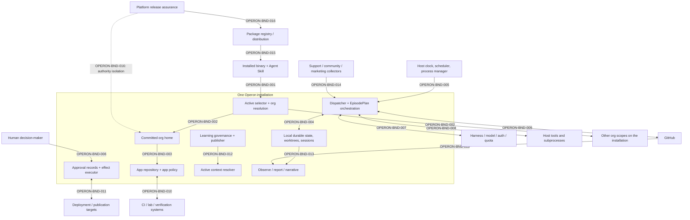

# Operon product boundary map

Status: **Phase 3 ratified — 2026-07-29**

Last updated: 2026-07-29

## 1. Scope and boundary rule

This is a broad product-level boundary map for production Operon at C3. It
identifies changes in state ownership, consistency, or independent failure
domain. It does not turn every source-code module, role, command, UI, or
stimulus into a boundary.

The acceptance question for every candidate is:

> Can side A be unavailable, slow, stale, or version-skewed while side B
> remains operational?

If the answer is unknown, the candidate remains an architecture finding. For
each accepted boundary, Phase 4 will define the exact contract.

Provenance:

- `[stated]`: derived from the human's failure-domain walk.
- `[doc]`: supported by the ratified product/architecture documents.
- `[PROPOSED]`: agent-originated structure requiring confirmation.

Registry shorthand such as `BND-007` and `INV-003` expands only to
`OPERON-BND-007` and `OPERON-INV-003`.

No simulator, live target, contract, or test implementation is created in this
phase. `test/` and `eval/` remain protected and were not inspected.

## 2. Human failure walk reconciled

### Approval accumulation

`[stated]` A large queue of unanswered human approvals must not globally stall
an organization. Work whose accepted DAG and authority do not depend on a
pending decision should continue. Only the dependent branch or effect waits.

This preserves `OPERON-INV-006` and `OPERON-INV-007`: continuing useful work
cannot mean bypassing or weakening the human gate. Exact queue backpressure,
fairness, and escalation policy remain open product truth.

### Whole-system interruption

`[stated][doc]` After shutdown, work may be at different durable points in
planning, research, build, review, or external-effect execution. Recovery must
reconcile each fact from its named authority and resume the next legal action.
Accepted files, plan data, worktree artifacts, settlements, decisions, and
valid session identity are not disposable merely because the process died.

The boundary question is not “restart or resume everything?” It is “which
owner can prove the last accepted fact?” Unknown provider or external-effect
state remains ambiguous rather than being guessed.

### Observation-plane loss

`[stated][doc]` Operon's projection surfaces own no workflow state. Runtime
work continues while observation is unavailable. A restarted observer
reconstructs from durable local sources and bounded GitHub reads; it never
becomes a recovery dependency or second source of truth.

Automatic supervision versus an operator restart is still unsettled.

### Harness, model, authentication, or quota loss

`[stated]` Operon should have a backup route when a selected harness/model is
unavailable or subscription quota is exhausted, including an eventual
subscription/API-key choice.

`[doc]` Assignments are atomic and qualification-bearing; fallback cannot
silently change only harness, model, or effort.

`[stated, ratified]` A provider backup route is permitted only when the
accepted plan already pre-authorized the complete alternative assignment. It
is never a silent substitution. A newly introduced assignment through
post-failure replanning is not treated as an automatic backup; whether a
separately authorized replan may introduce one remains open product truth. A
mid-turn switch cannot pretend to resume provider-native context it does not
possess.

## 3. Ratified boundary diagram

Arrows show interaction, not import direction. Several journeys cross more
than one boundary.

## 4. Ratified boundary registry

### OPERON-BND-001 — Installed implementation ↔ persisted schema estate

- **Sides and owners:** installed package/Agent Skill owns executable and
  template versions; org/app/state homes own user-specific durable data.
- **Boundary test:** homes can remain while Operon is absent or upgraded; an
  installed version can run while a home is missing, older, newer, or corrupt.
  **Yes.**
- **Consistency change:** package release consistency becomes migration and
  compatibility consistency across separately durable homes.
- **Journeys/invariants:** J-01–03, J-09; INV-001–004, INV-009–010.
- **Provenance:** `[doc][PROPOSED]`.
- **Maturity:** current for local/packed installs; npm evolution is planned.

### OPERON-BND-002 — Shared installation/selector ↔ isolated org scope

- **Sides and owners:** the shared installation and active pointer choose a
  default; each org owns its committed home, state home, secrets, schedulers,
  budgets, apps, and work.
- **Boundary test:** one org can be invalid, paused, locked, or unavailable
  while another org on the same installation remains operable. **Yes.**
- **Consistency change:** process-local default selection becomes explicit
  org-bound durable identity.
- **Journeys/invariants:** J-02, J-04–12; INV-001–003, INV-010–011.
- **Provenance:** `[stated][doc][PROPOSED]`.
- **Maturity:** current boundary; concurrent multi-org behavior needs a deeper
  module contract.

### OPERON-BND-003 — Org governance/configuration ↔ app-owned product state

- **Sides and owners:** the org home owns constitution, roles, authority,
  pipelines, and cross-app knowledge; the app repository owns product truth,
  app narrowing, gates, domain knowledge, and deliverables.
- **Boundary test:** an org can be valid while one app repository is missing,
  stale, or incompatible; an app checkout can exist while its org configuration
  is unavailable or version-skewed. **Yes.**
- **Consistency change:** org-wide authority becomes app-narrowed authority and
  repository-versioned product policy.
- **Journeys/invariants:** J-02–07, J-11–13; INV-001–004, INV-009–011.
- **Provenance:** `[doc][PROPOSED]`.
- **Maturity:** current.

### OPERON-BND-004 — Orchestrator process ↔ local durable state/worktrees/sessions

- **Sides and owners:** the process owns legal transition decisions; local
  journals, worktrees, run evidence, settlements, approvals, and session
  artifacts preserve accepted facts across processes.
- **Boundary test:** durable state persists while the process is down; the
  process may still be alive while disk access, a file, lock, worktree, or
  session artifact is unavailable or corrupt. **Yes.**
- **Consistency change:** in-memory activity becomes atomically persisted or
  append-only recovery evidence.
- **Journeys/invariants:** J-02–09, J-11–13; INV-001, INV-004–005,
  INV-008–011.
- **Provenance:** `[stated][doc]`.
- **Maturity:** current; generic native-session recovery after arbitrary
  process loss remains partly unresolved.

### OPERON-BND-005 — Host clock/scheduler/process manager ↔ stateless dispatcher

- **Sides and owners:** the host owns timer installation, cadence, clock, and
  spawn behavior; Operon owns due decisions, locks, journals, and execution
  evidence.
- **Boundary test:** the scheduler can remain installed while a dispatch
  process fails; dispatch can run manually while no scheduler is installed.
  **Yes.**
- **Consistency change:** OS-observed firing becomes an attributable,
  idempotent Operon decision and terminal outcome.
- **Journeys/invariants:** J-04, J-06–07, J-09, J-11–12; INV-001–005,
  INV-009–010.
- **Provenance:** `[doc]`, previously used only as the concept illustration.
- **Maturity:** current on supported hosts; future host managers may be
  versioned variants of one contract.

### OPERON-BND-006 — Autonomous work ↔ human decision availability

- **Sides and owners:** Operon owns pending work, dependency state, and
  content-bound decision packets; the human owns approval, denial, risk
  acceptance, and any widening of authority.
- **Boundary test:** Operon can continue independent authorized work while the
  human is unavailable; the human can review durable decisions while no
  provider turn is running. **Yes.**
- **Consistency change:** an asynchronous decision becomes a durable grant or
  denial, separate from later execution.
- **Journeys/invariants:** J-04–09, J-11–13; INV-004–008, INV-010–011.
- **Provenance:** `[stated][doc]`.
- **Maturity:** current mechanism; long-queue policy remains open.

### OPERON-BND-007 — Orchestration/runtime envelope ↔ harness/model/auth/quota

- **Sides and owners:** Operon owns assignment, prompts/context envelope,
  tools, guardrails, budgets, evidence, and terminal interpretation; each
  harness/provider owns authentication, quota, model availability, native
  session state, transport, and model output.
- **Boundary test:** Operon can perform deterministic work and report provider
  unavailability while a provider is down; a provider may be healthy while
  local Operon configuration or qualification rejects it. **Yes; external by
  definition.**
- **Consistency change:** deterministic admission becomes nondeterministic
  provider execution and then deterministic validation/accounting.
- **Journeys/invariants:** J-03–09, J-11–13; INV-003–010.
- **Provenance:** `[stated][doc]`.
- **Maturity:** current for supported assignment/auth paths; subscription to
  API-key failover and cross-assignment recovery are planned/unsettled.

### OPERON-BND-008 — Runtime envelope ↔ host tools and subprocess effects

- **Sides and owners:** Operon owns allow/deny decisions and effect
  attribution; host commands, git, files, and other local tools own their
  execution outcomes and may mutate a worktree or external system.
- **Boundary test:** the runtime can remain alive while a tool hangs, exits,
  partially writes, or is killed; a child process can outlive or become
  disconnected from its caller. **Yes.**
- **Consistency change:** an authorized tool intent becomes a host-observed
  partial or terminal effect.
- **Journeys/invariants:** J-06–09, J-11–13; INV-002–010.
- **Provenance:** `[doc][PROPOSED]`.
- **Maturity:** current; product-specific tools require later module passes.

### OPERON-BND-009 — Local orchestration state ↔ GitHub

- **Sides and owners:** Operon owns local plans, claims, journals, evidence,
  and managed worktrees; GitHub owns issues, labels, PRs, reviews, checks,
  refs, merges, and remote acknowledgements.
- **Boundary test:** local work continues or waits while GitHub is unavailable;
  GitHub can change through humans/CI while no Operon process is running.
  **Yes; external by definition.**
- **Consistency change:** strongly recorded local transitions reconcile with
  externally concurrent and eventually observed collaboration state.
- **Journeys/invariants:** J-03–10, J-13; INV-001–010.
- **Provenance:** `[stated][doc]`.
- **Maturity:** current for GitHub-mediated profiles.

### OPERON-BND-010 — Artifact workflow ↔ CI/lab/verification systems

- **Sides and owners:** Operon and the app repository own the candidate
  artifact and required verification request; CI, lab, or product-specific
  systems own execution evidence for an exact artifact revision.
- **Boundary test:** the artifact workflow may wait while verification is
  unavailable; a verification job may continue or complete while Operon is
  down. **Yes; external by definition.**
- **Consistency change:** accepted artifact identity becomes asynchronously
  produced, revision-bound evidence.
- **Journeys/invariants:** J-03, J-07–09, J-13; INV-003–005, INV-008–010.
- **Provenance:** `[stated][doc][PROPOSED]`.
- **Maturity:** current for configured software CI; generalized lab and
  non-software verification is planned where absent.

### OPERON-BND-011 — Consequential-effect executor ↔ deployment/publication target

- **Sides and owners:** Operon owns content-bound authorization, effect
  identity, attempt lifecycle, and acknowledgement record; the destination
  owns the real deployed or published state.
- **Boundary test:** the target can accept an effect while Operon crashes or
  loses the acknowledgement; Operon can remain healthy while the target is
  unavailable. **Yes; external by definition.**
- **Consistency change:** a local approved intent becomes an irreversible or
  externally visible effect with potentially ambiguous acknowledgement.
- **Journeys/invariants:** J-08–09, J-11, J-13; INV-001–002, INV-006–011.
- **Provenance:** `[stated][doc][PROPOSED]`.
- **Maturity:** current for typed supported effects; each new
  deployment/publication target needs its own contract variant.

### OPERON-BND-012 — Learning governance/publisher ↔ active context resolver

- **Sides and owners:** learning governance owns observations, candidates,
  review, approval, experiments, and deterministic publication; the resolver
  owns the pinned active bundle projected into a turn/episode.
- **Boundary test:** capture/review may continue while publication or
  resolution is unavailable; current approved context can remain usable while
  new learning is pending. **Yes.**
- **Consistency change:** non-authoritative evidence becomes versioned active
  context only through a governed publication transition.
- **Journeys/invariants:** J-06–07, J-09, J-11–12; INV-001–002, INV-004–007,
  INV-009–011.
- **Provenance:** `[stated][doc]`.
- **Maturity:** current.

### OPERON-BND-013 — Workflow state owners ↔ read-only projections

- **Sides and owners:** local/GitHub sources own workflow truth; Observe,
  Report, and Narrative own only deletable view state and presentation.
- **Boundary test:** workflow proceeds while every observer is down; an
  observer can restart and read durable state while no work process is active.
  **Yes.**
- **Consistency change:** authoritative per-source facts become a
  freshness-labeled, possibly partial read model.
- **Journeys/invariants:** J-09–12; INV-001–003, INV-008–011.
- **Provenance:** `[stated][doc]`.
- **Maturity:** current; automatic observer supervision is unsettled.

### OPERON-BND-014 — External demand collectors ↔ Operon intake

- **Sides and owners:** support/community/marketing systems and collectors own
  channel access and source observations; Operon owns validated intake
  identity, provenance, deduplication, routing, and disposition after receipt.
- **Boundary test:** existing Operon work continues while a collector/channel
  is down; collectors may accumulate observations while Operon is unavailable.
  **Yes; external by definition.**
- **Consistency change:** untrusted, unordered channel data becomes
  provenance-bearing organizational demand.
- **Journeys/invariants:** J-04–06, J-09, J-11–13; INV-001–004,
  INV-009–011.
- **Provenance:** `[stated][doc][PROPOSED]`.
- **Maturity:** file-drop intake is current; direct collectors are planned.

### OPERON-BND-015 — Package registry/distribution ↔ installed package

- **Sides and owners:** the registry owns published package/version
  availability and distribution metadata; the installer owns the local
  artifact, launcher, Agent Skill discovery, and selected version.
- **Boundary test:** existing installations continue while the registry is
  down; a registry version may exist while a host install is partial, stale,
  incompatible, or rolled back. **Yes; external by definition.**
- **Consistency change:** a release artifact becomes a host-installed,
  discoverable binary/skill pair.
- **Journeys/invariants:** J-01–03, J-09; INV-002–004, INV-009–010.
- **Provenance:** `[stated][PROPOSED]`.
- **Maturity:** planned npm path; not part of the current supported profile.

### OPERON-BND-016 — Platform release control plane ↔ operated organization

- **Sides and owners:** platform development/release assurance owns candidate
  identity, qualification evidence, and publication authority; an installed
  org owns its goals, operational state, learning, approvals, and product
  work.
- **Boundary test:** an installed org can operate while platform release
  infrastructure is down; platform qualification can run without importing
  authority or learning from an operated org. **Yes.**
- **Consistency change:** independently governed platform evidence produces an
  installable artifact; it must never become org prompt/state authority or
  vice versa.
- **Journeys/invariants:** J-01–03, J-09, J-11; INV-001–003, INV-006–011.
- **Provenance:** `[doc][PROPOSED]`.
- **Maturity:** current separation; npm adds a registry seam without merging
  the control planes.

## 5. Journey intersections

| Journey | Boundary crossings |
| --- | --- |
| J-01 Install/discover | BND-001, BND-015, BND-016 |
| J-02 Create/select/upgrade org | BND-001–004 |
| J-03 Onboard product | BND-001–004, BND-007, BND-009–010, BND-015 |
| J-04 Intake/prioritize | BND-002–007, BND-009, BND-014 |
| J-05 Decompose work | BND-002–004, BND-006–009 |
| J-06 Plan episode | BND-002–009, BND-012 |
| J-07 Execute episode | BND-002–012 |
| J-08 Consequential effect | BND-004, BND-006–011 |
| J-09 Recover | BND-001–013, BND-015 |
| J-10 Observe | BND-002–004, BND-009, BND-013 |
| J-11 Learn | BND-002–009, BND-011–013 |
| J-12 Periodic review | BND-002–007, BND-009, BND-012–014 |
| J-13 Non-software work | BND-002–014 |

The table intentionally maps shared behavior once. CLI, Agent Skill, UI,
future API/MCP, timers, events, signals, and recovery commands remain adapters
or stimuli around these journeys.

## 6. Failure-mode obligations

Every confirmed boundary must cover success plus the applicable independent
failure modes below. “N/A” may be declared only with a reason in the later
contract.

| Boundary | Timeout/unavailable | Partial success | Retry/duplicate | Stale read/order | Version skew |
| --- | --- | --- | --- | --- | --- |
| BND-001 | Missing implementation or home | Interrupted install/migration | Re-run migration/rollback | Old pointer/schema observation | Binary/skill/home/app/state mismatch |
| BND-002 | One org path unavailable | Selector changed after some work | Duplicate IDs/locks across orgs | Stale active pointer | Different org schema generations |
| BND-003 | Org or app repo missing | App narrowing written on one side | Re-onboarding/re-registration | Stale app/authority snapshot | Org policy vs app schema/config |
| BND-004 | Disk/session/worktree unavailable | Torn or interrupted durable write | Duplicate append/claim/resume | Stale lock or journal | Record/schema/session format |
| BND-005 | Timer/manager/spawn failure | Child spawned, bookkeeping failed | Duplicate tick/spawn | Clock skew, sleep, missed windows | Scheduler definition/executable |
| BND-006 | Human absent | Decision persisted, grant move interrupted | Repeated request/decision race | Approval after context drift | Decision/grant schema |
| BND-007 | Auth/quota/model/provider unavailable | Tool/output/usage partly observed | Provider retry or failover | Stale capability/qualification | Harness/model/protocol |
| BND-008 | Tool missing/hung/killed | Files/effects partly applied | Re-run command/tool call | Out-of-order tool completion | Host/tool/runtime |
| BND-009 | GitHub unavailable/rate-limited | Remote write accepted, response lost | Duplicate issue/comment/merge | Concurrent labels/refs/checks | API/schema/default-branch assumptions |
| BND-010 | CI/lab unavailable | Some checks/artifacts complete | Duplicate job/re-run | Result for stale revision | Runner/lab/artifact schema |
| BND-011 | Target unavailable | Effect applied, acknowledgement lost | Duplicate publish/deploy | Target state observed late | Target protocol/content version |
| BND-012 | Reviewer/publisher/resolver unavailable | Files written before manifest bump | Duplicate publish/activation | Old bundle pinned or cached | Bundle/manifest/resolver |
| BND-013 | Projection/source unavailable | Some sources refresh | Duplicate SSE/entity | Poll lag, reconnect order | View/source schema |
| BND-014 | Channel/collector unavailable | Payload delivered without ack | Duplicate/replayed signal | Delayed/out-of-order source | Channel/event schema |
| BND-015 | Registry/auth unavailable | Artifact or skill partly installed | Reinstall/rollback/dist-tag race | Cached metadata | Registry/package/Node/launcher |
| BND-016 | Release control unavailable | Evidence/artifact disagree | Re-attest/re-publish | Stale evidence/candidate | Candidate/package/policy |

## 7. Controlled-seam and live-obligation design

Layer placement below is ratified. “Layer 2” means real Operon composition
against a controlled seam, not mocking Operon internals. “Layer 3 retained”
means the simulator cannot prove the named real behavior.

| Boundary | Layer-2 controlled seam must simulate | Real behavior not proved | Candidate placement |
| --- | --- | --- | --- |
| BND-001 | Versioned package/home/schema layouts; collisions; interrupted migration; rollback | Packed launcher and host-specific filesystem/install behavior | Layer 2 anchor; bounded packed-install smoke retained |
| BND-002 | Multiple real temporary org/state homes, pointer changes, concurrent identities, permission/collision faults | Host account permissions and genuinely concurrent scheduler processes | Layer 2 anchor; targeted host-process smoke |
| BND-003 | Real temp org/app repos with independently varied config, authority, and schema versions | Remote git hosting behavior | Layer 2; remote behavior covered by BND-009 |
| BND-004 | Fault-injected durable store/filesystem: atomic-write failure, corruption, stale/live process, worktree/session presence | Actual OS signal/process/filesystem edge behavior | Layer 2 anchor; disposable subprocess crash smoke retained |
| BND-005 | Fake clock, injected scheduler manager, spawn recorder, sleep/missed-window and bookkeeping failures | Real launchd/systemd installation, wake, ownership, and process semantics | Layer 2 anchor; Layer 3 on a disposable user/VM only |
| BND-006 | Delayed/absent/approve/deny/revoke human actor; queue growth; independent and dependent DAG branches | Human comprehension and attention | Layer 2 mechanics; Layer 4 clarity evaluation |
| BND-007 | Scripted harness/provider for auth, quota, capability, timeout, malformed output, partial usage, sessions, and assignment alternatives | Vendor auth handshake, quota enforcement, native session compatibility, real model behavior | Layers 1–2 envelope; separately authorized Layer 3 calibration; Layer 4 quality |
| BND-008 | Injected process/tool runner with exit, signal, hang, partial write, output, and child-liveness control in temp worktrees | Platform-specific command/sandbox behavior | Layer 2 anchor; bounded disposable-host smoke where required |
| BND-009 | Stateful GitHub simulator with concurrent mutation, stale reads, rate limits, timeout-after-write, stable remote IDs, checks, refs, and default-branch changes | Real GitHub auth/API/eventual behavior | Layer 2 anchor; Layer 3 disposable private repo |
| BND-010 | Revision-keyed CI/lab simulator with pending, partial, stale, conflicting, duplicate, and corrupt evidence | Real runner/lab provisioning and artifact transport | Layer 2 anchor; Layer 3 disposable product-specific target |
| BND-011 | Idempotent effect-target simulator with lost acknowledgements, ambiguity, reconciliation marker, and target drift | Real deployment/publication protocol and destination semantics | Layer 2 anchor; Layer 3 disposable staging/publication target |
| BND-012 | Real temporary learning files plus controlled reviewer/publisher/resolver and crash points | Provider quality; real git collaboration if publication uses remote PRs | Layer 2 mechanics; provider quality at Layer 4; GitHub via BND-009 |
| BND-013 | Real projection over temporary durable sources with fake GitHub, clock, file changes, partial/stale/corrupt sources, and restart | Browser/network implementation details if materially relevant | Layer 2 system coverage; no runtime dependency on Layer 3 |
| BND-014 | Collector/file-drop simulator with auth failure, untrusted payload, duplicates, reorder, outage, and replay | Vendor channel auth, APIs, moderation, and rate limits | Layer 2 anchor; planned Layer 3 per supported collector |
| BND-015 | Local registry/package artifact simulator with version/cache/install/rollback and binary-skill pairing | Real npm authentication, visibility, metadata propagation, and install platform behavior | Planned Layer 2 anchor; Layer 3 target unresolved |
| BND-016 | Separate platform and org homes with contamination probes and immutable candidate/evidence identities | Real release host/registry identity and provenance chain | Layer 2 anchor; release/package live evidence retained |

No Layer-3 activity is authorized by this map. Real scheduler installation,
provider turns, GitHub mutation, CI/lab execution, publication, deployment, or
registry mutation requires separate explicit authorization and a disposable
target.

## 8. Explicit non-boundaries

These still need focused adapter or contract checks later, but they are not
separate product failure domains merely because they have different names:

- CLI commands and the shared behavior they invoke when they run in the same
  process and own no separate workflow state.
- Agent Skill instructions versus CLI behavior; the skill is a discovery and
  operation adapter, while authorization remains in shared behavior.
- A future API or MCP surface versus the behavior it adapts.
- Builder, Reviewer, SRE, Planner, and other role names by themselves.
  Different provider assignments cross BND-007; the role label alone is not a
  failure boundary.
- EpisodePlanner, plan validator, route projection, and DAG executor merely
  because they occupy different modules. Their provider call crosses BND-007;
  their accepted plan is the shared workflow authority.
- Observe pages, Reports, and Narrative views from one another when they are
  projections over the same source ownership and deployment process.
- Internal helper functions, repository classes, and parsers that deploy,
  transact, and fail with their owning component.

## 9. Findings exposed by boundary work

### Product-truth findings

| ID | Finding |
| --- | --- |
| PTF-010 | Independent authorized work should continue while human approvals wait. The maximum queue, backpressure threshold, fairness across apps/episodes, approval priority, aging, and operator alert policy remain unsettled. |
| PTF-011 | **Partly resolved.** Provider backup means an alternative complete assignment pre-authorized by the accepted plan, never silent substitution. Remaining contract choices include fallback order and triggers, cross-assignment handoff/quality, budget effects, human notice, and whether a separately authorized replan may introduce a new alternative. |
| PTF-012 | Observation failure must not stop work and manual restart must reconstruct. Whether Observe should be automatically supervised/restarted, and by which owner, is unsettled. |
| PTF-013 | Accepted artifacts and valid sessions should prevent needless repeated work. The exact promise for resuming a long in-flight provider turn after process/host loss—including session age, local scratch acceptance, and when same-session resume is unsafe—remains unsettled. |

### Architecture findings

| ID | Finding |
| --- | --- |
| AF-006 | Fact ownership is documented per subsystem, but Phase 4 needs one recovery precedence table covering plan/journal, worktree/commit, provider session, GitHub, approval/effect, verification, and settlement disagreements. |
| AF-007 | Native session resume exists per supported harness, but portable continuation across a different harness/model does not preserve native context by definition. A cross-assignment handoff artifact and quality/review policy are not yet specified. |
| AF-008 | Subscription authentication, API-key authentication, quota exhaustion, and capability health do not yet form one product-level failover contract across harnesses/providers. |
| AF-009 | Observe is restartable and reconstructable, but no product owner or supervisor is specified for automatic restart. |
| AF-010 | Disposable Layer-3 targets are not yet named for every intended OS scheduler, CI/lab, publication/deployment target, direct channel collector, and npm registry behavior. Missing targets remain obligations, not reasons to silently omit a lane. |
| AF-011 | The scheduler/DAG architecture supports bounded concurrency and dependency waits, but org-wide behavior under a large approval backlog needs explicit admission/backpressure and independent-ready-work selection semantics. |

## 10. Phase-3 ratification record

The human reviewed and ratified this map on 2026-07-29, confirming:

1. all sixteen product-level boundaries;
2. approval-independent progress: only work dependent on a pending human
   decision waits;
3. provider backup means a pre-authorized alternative in the accepted plan,
   never silent substitution;
4. the proposed Layer-2 controlled-seam placement and retained Layer-3
   obligations; and
5. unresolved expected behavior remains explicit and must not be silently
   chosen.

If contract work exposes a false boundary, missing boundary, or contradiction
with an invariant, Phase 3 must be explicitly reopened rather than patched
silently.
