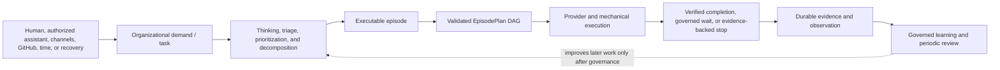

# Operon product system map

Status: **Phase 1 ratified — 2026-07-29**

Last updated: 2026-07-29

## 1. Scope and provenance

This map reconciles:

1. the human's Phase-1 product walk (`[stated]`);
2. ratified product and architecture documents (`[doc]`); and
3. agent-originated interpretations requiring confirmation (`[PROPOSED]`).

Primary document basis:

- `docs/PURPOSE.md`
- `docs/VISION.md`
- `docs/architecture.md`
- `docs/episodes/contract.md`
- `docs/loop/design.md`
- `docs/scheduler/design.md`
- `docs/approvals/design.md`
- `docs/org/`
- `docs/learning-loop/`
- `docs/live-ui/design.md`
- `docs/reporting/design.md`
- `docs/narrative/design.md`
- `docs/qualification/design.md`

The incumbent `test/` and `eval/` trees were not used or inspected.

## 2. Intended use and deployment shape

### Product intent

- `[stated]` Operon is a single installable org-runtime binary/package.
- `[stated]` A human can operate it through the CLI or authorize an AI assistant to operate the same CLI through the packaged Agent Skill.
- `[stated]` One installation can hold many organizations, and each organization can operate many products.
- `[stated]` The organizational abstraction is broader than a software build loop: products may produce software, research, verified content, community updates, consultancy deliverables, or other governed artifacts.
- `[doc]` The operator supplies goals, policy, and consequential decisions; Operon owns routine coordination and reaches verified completion, a precise governed wait, or an evidence-backed stop.
- `[PROPOSED]` Production assurance in this campaign assumes a self-hosted/user-operated runtime, not a centrally hosted multi-tenant Operon service.

### Current deployment shape

- `[doc]` Today the package is installed from a local clone through a source-backed development link or as a packed local package.
- `[doc]` Commands run as ordinary short-lived processes; autonomous work is initiated by an OS scheduler invoking stateless dispatch ticks.
- `[doc]` Durable state is split across installed package files, committed org homes, per-org local state homes, app repositories, and GitHub.
- `[doc]` LLM providers, GitHub, host schedulers, app CI, and deployment/publication targets are external dependencies.
- `[doc]` The active-org pointer selects a default org for interactive commands; explicit org and state-home paths can bind scheduled processes independently.

### Intended distribution evolution

- `[stated]` Users should eventually install Operon through npm instead of cloning its repository.
- `[PROPOSED]` npm installation, upgrade, rollback, schema compatibility, and Agent Skill discovery belong to the production product claim, but their exact supported contract is still unresolved.

### Criticality and exclusions

- `[stated, ratified Phase 0]` System target: C3 high-consequence.
- `[doc]` Evidence: autonomous code execution, high-value filesystem and GitHub privileges, provider spend, production release capability, persistent learning, external publication, delayed-detection risk, and strong audit requirements.
- `[ratified Phase 0]` Pure read-only projection/rendering may use a contained C2 component override; artifact authorization, secret redaction, path confinement, and consequential decision surfaces retain C3.
- `[PROPOSED]` C4 safety/mission-critical use and direct physical actuation are excluded unless separately designed and ratified.

## 3. Behavioral view

### Actors and initiating systems

| ID | Actor or initiator | Role in behavior | Provenance |
| --- | --- | --- | --- |
| ACT-01 | Human owner/operator | Creates organizations and products, supplies goals, authorizes assistants, ratifies policy, and decides consequential actions | `[stated][doc]` |
| ACT-02 | Authorized AI assistant | Discovers and operates the same governed CLI through the Agent Skill within human-granted authority | `[stated][doc]` |
| ACT-03 | Operon organizational roles | Plan, build, review, operate, support, market, distill, and review learning through governed provider turns | `[stated][doc]` |
| ACT-04 | External people and channels | Supply support issues, feedback, community material, adoption signals, or publication audiences | `[stated]` |
| ACT-05 | GitHub | Supplies issue/PR/CI/release stimuli and holds delivery artifacts/state | `[doc]` |
| ACT-06 | Time and host scheduler | Initiates due organizational work and later recovery/reconciliation ticks | `[doc]` |
| ACT-07 | Local event producers | Place validated company-lifecycle events into Operon's file-drop inbox | `[doc]` |
| ACT-08 | LLM providers and native harnesses | Supply nondeterministic judgment inside deterministic plan, authority, budget, and evidence envelopes | `[doc]` |
| ACT-09 | Deployment, publication, lab, and product systems | Receive or supply real-world effects and verification evidence | `[stated][doc][PROPOSED]` |

### Shared behavioral spine



This spine is behavior, not an interface sequence. A CLI command, timer,
GitHub event, file-drop event, or recovery scan can initiate parts of it.

### Product journeys

| ID | Actor → stimulus | Journey and intended outcome | State transition and durable/external effect | Required observation | Provenance |
| --- | --- | --- | --- | --- | --- |
| J-01 | Human/package manager → installation | Install a usable Operon runtime and discover its capabilities | Package and Agent Skill become available; no org is implied | Version/help/capability discovery states what is usable and what is missing | `[stated][doc]` |
| J-02 | Human/assistant → org create/select/upgrade | Establish or select one organization without confusing it with another | Org home, state home, and active pointer become explicit and valid | Resolved package/org/state identities and authority posture are visible | `[stated][doc]` |
| J-03 | Human/assistant → new-app/bootstrap/verify/promote | Add a product to an organization and earn increasing readiness claims | Generated → registered → runtime-ready evidence; registry may move onboarding → live | Each claim states exactly what it proves and does not imply | `[doc]` |
| J-04 | Human, support, marketing, development, GitHub, channels, or time → demand signal | Capture organizational demand, establish provenance, reason about it, prioritize it, and decide whether it should become executable work | Intake may become a planning artifact, proposal, ticket, rejection, or governed wait | Source, reasoning status, priority, disposition, and next action are visible | `[stated][doc][PROPOSED]` |
| J-05 | Planning role or execution-ready creator → task scope | Decompose broad or partial work into independently executable outcomes | A durable plan or ticket plan is accepted before child work is published or executed | Scope, exclusions, dependencies, acceptance criteria, and causal lineage are inspectable | `[stated][doc]` |
| J-06 | Episode trigger/creator → executable subtask | Select the smallest safe directed graph for one outcome | A validated, versioned EpisodePlan is durable before its first delivery step | Assignment, dependencies, ceilings, approvals, gates, and revision rationale are explainable | `[stated][doc]` |
| J-07 | Episode executor → ready plan step | Execute provider and mechanical work while preserving authority, isolation, spend, and evidence | Commits, content, findings, gates, reviews, lab evidence, or other governed artifacts advance the episode | Every started step terminates truthfully; model output alone cannot claim completion | `[stated][doc][PROPOSED]` |
| J-08 | Human approval or policy → consequential action | Authorize and later execute a deployment, publication, destructive action, protocol change, or other critical effect | Decision and execution acknowledgement remain separate, content-bound facts | Pending, approved, executing, executed, failed, or ambiguous state and next action are visible | `[doc]` |
| J-09 | Crash, signal, stale lock, restart, or later tick → recovery | Resume from the last accepted artifact without hiding repeats or duplicating effects | Journals, claims, plans, sessions, settlements, and external artifacts reconcile forward | Reused work, invalidated work, repeated cost, uncertainty, and executable next action are visible | `[stated][doc]` |
| J-10 | Human/assistant/UI → observation request | Understand what is happening, what happened, why, what it cost, and what needs attention without mutating work | Read-only projections are reconstructed from authoritative sources | Freshness, degradation, missing evidence, and provenance are explicit | `[doc]` |
| J-11 | Completed work/evidence/time → learning capture and review | Accumulate experience without immediately poisoning future behavior | Evidence becomes candidates; reviewed and approved changes may be published, activated, disabled, or rolled back | Authorization, validation, exposure, outcome, and lineage remain distinct | `[stated][doc]` |
| J-12 | Periodic organizational cadence → business/context review | Review accumulated context, learning, performance, and organizational posture and propose optimization | Report, candidate, proposal, or ratified change; no silent context mutation | What was reviewed, retained, changed, rejected, and deferred is visible | `[stated][PROPOSED]` |
| J-13 | Product-specific trigger → GitHub-tracked non-software product work | Plan, revise, verify in a product-specific lab when needed, review, commit, and publish a governed non-code deliverable | Product-defined artifacts and evidence advance through an accepted EpisodePlan; configured CI/release publishes the accepted commit | Acceptance/lab evidence, review disposition, commit, CI result, and publication acknowledgement are truthful and inspectable | `[stated]` |

### Work identity interpretation

`[stated, ratified]` The human's account and current documents reconcile as:

```text
organizational demand / parent task
    → planning and prioritization episode when judgment is required
    → one or more child executable outcomes
    → one episode per independently accountable outcome
    → one accepted EpisodePlan per episode
```

A fully execution-ready creator scope can make planning minimal, but it still
normalizes into the same durable plan contract. A broad task may therefore
have a planning episode that publishes child episodes rather than being one
oversized execution episode.

## 4. Entry, stimulus, recovery, and observation adapters

| Surface | Mapping to behavior |
| --- | --- |
| CLI and machine-readable JSON | Entry or observation adapters for lifecycle, planning, execution, approval, learning, and reporting journeys |
| Agent Skill | Discovery/operation guidance enabling an authorized AI assistant to use the same CLI behavior |
| Local Observe HTTP/SSE/UI | Read-only observation adapter over durable state and bounded external reads |
| GitHub issues, PRs, reviews, checks, releases | External state/effect substrate plus stimuli for planning, delivery, review, and operations |
| OS timer | Time stimulus into the same dispatch/admission behavior available manually |
| File-drop company events | Generic event stimulus; not a separate Support/Marketing/SRE behavior for each transport |
| Process signals and stale-heartbeat observations | Interruption/recovery stimuli |
| Re-arm, disposition, reconcile, and later ticks | Recovery mechanisms advancing existing work; not new business journeys |
| Future API or MCP | No ratified general product surface found; if introduced, it should conform to shared behaviors rather than clone them |

## 5. Structural view

### Components, state owners, and failure domains

| ID | Component or deployment unit | State/fact owned | Authorized writers | Dependencies and consistency | Independent failure domain |
| --- | --- | --- | --- | --- | --- |
| CMP-01 | Installed package and Agent Skill | Executable implementation, templates, help, capability surface, package version | Package installation/update mechanism | Must remain compatible with selected org/app schemas | Package manager, filesystem, installed-version skew |
| CMP-02 | Active-org selector | Default org-home pointer for interactive commands | Human-facing org lifecycle commands; explicit process overrides | Pointer must resolve to a valid org; scheduled processes bind explicit homes | User configuration file and process environment |
| CMP-03 | Committed org home | Constitution, authority, roles, apps, pipelines, prompts, governed learning, skills, retro artifacts | Human, deterministic lifecycle/publisher, approved changes | Human-ratified surfaces constrain runtime; app config can narrow, not widen | Git/filesystem repository for that org |
| CMP-04 | App repository | Product truth and deliverables; app `.operon/` policy/authority/memory; git history | Human contributors and scoped Operon workflows | Must agree with org registry and GitHub remote; one turn sees one app | App repo, branch, worktree, CI, and remote |
| CMP-05 | Per-org local state home | Plans, journals, runs, locks, approvals, telemetry, scheduler evidence, tasks, learning runtime state | Named Operon subsystems with subtree-specific ownership | High-churn truth joins committed org/app and external artifacts without becoming a second owner of them | Local disk, process crash, corruption, retention |
| CMP-06 | CLI command layer | Argument/error translation and invocation evidence; no independent business truth | Operon CLI | Must call shared behavior and preserve stable failure semantics | Caller shell/process |
| CMP-07 | Scheduler and dispatcher | Due-window decisions, trigger consumption, spawn commitments, scheduler health | Scheduler lifecycle and dispatch code | Uses config, clocks, event sources, locks, budgets, and state; decides when, not what | OS scheduler/host sleep/process |
| CMP-08 | Episode planning/admission | Intent, accepted plan versions, assignments, route projection, DAG journal, reservations | EpisodePlanner/creator normalization plus deterministic validator/executor | Plan must be durable before execution and cannot silently widen authority or assignment | Planner provider turn, local state, policy/config version |
| CMP-09 | Harness/runtime envelope | Provider transport, tool gating, context injection, cancellation/resume, usage, terminal provider evidence | Runtime/adapters under orchestrator policy | Atomic harness/model/effort assignment; provider is external and nondeterministic | Claude, Codex, pi, network, auth, native sessions |
| CMP-10 | Model-mediated intelligence | Planner/builder/reviewer/standing-role/learning judgments and trajectories | Selected model within harness and role authority | Quality is probabilistic; invariants remain code-enforced | Model/provider/version/prompt variance |
| CMP-11 | Delivery and artifact workflow | Provider/mechanical step transport, quality evidence, findings, ticket/content lifecycle, merge/publication handoff | Loop/orchestrator and typed external operations | Current implementation is GitHub/software specialized | GitHub, CI, worktree, target artifact system |
| CMP-12 | Approval and effect executor | Pending/decided grants, content binding, execution state, idempotency acknowledgement | Human decision surface and allowlisted orchestrator executors | Approval never implies execution; ambiguity never retries blindly | Local approval store and external effect target |
| CMP-13 | Evidence, accounting, and recovery | Run envelopes/events/L3 evidence, provider settlements, invocation outcomes, reconciliation and anomaly facts | Runtime, loop, org, scheduler, reconciliation code | Fact authority is per store; projections must not silently repair or infer | Concurrent append, torn files, retention, missing external state |
| CMP-14 | Context and knowledge resolver | Effective authority, TASTE, role/app context, pinned governed knowledge, task brief | Deterministic assembler/resolver; ratified source writers | Required authority/safety/task facts cannot be evicted or widened by prompt text | Stale/mismatched files, context cap, cache/model variance |
| CMP-15 | Governed learning system | Events, episodes, candidates, reviews, experiments, interventions, active bundle versions, activation lineage | Capture projector, agents for candidates only, independent reviewer, human, deterministic publisher | Agent self-report is advisory; active context changes require governance and pinning | Learning state, reviewer/model, experimental evidence |
| CMP-16 | Read-only projections | Live, reports, narrative, status, forensic exports | Deterministic readers/renderers | No workflow ownership; missing/corrupt facts remain named | Reader process, browser, path/security boundary |
| CMP-17 | Platform release assurance | Candidate/package/suite identity, evidence integrity/currency, release authority | Independent platform-development control plane | Must never derive authority from an operated org | CI, package registry, evidence archives |

### External dependencies

| ID | External system | Operon reliance |
| --- | --- | --- |
| EXT-01 | GitHub | Durable delivery substrate, collaboration state, remote effects, CI/release stimuli |
| EXT-02 | LLM/native harness providers | Nondeterministic judgment, native sessions, usage/auth/capability behavior |
| EXT-03 | OS scheduler and host | Autonomous time stimulus, process spawning, sleep/wake and signal behavior |
| EXT-04 | Package distribution/npm | Intended installation/update channel |
| EXT-05 | App CI, deployment, publication, and lab targets | Verification evidence and consequential external effects |
| EXT-06 | Support/community/marketing channels and collectors | Untrusted or semi-trusted demand signals and source material |

## 6. Reconciliation view

| Journey | Components/state owners crossed | Irreversible or external effects | Key consistency/failure question | Status |
| --- | --- | --- | --- | --- |
| J-01 Install/discover | CMP-01, package filesystem, skill discovery | Package installation/update | Which package/skill versions are mutually compatible, and how is rollback handled? | Open product-truth finding |
| J-02 Create/select org | CMP-01–03, per-org CMP-05 | Persistent org/config creation | Can one org's selection, migration, scheduler, state, or secrets affect another? | Open architecture finding |
| J-03 Onboard product | CMP-03–05, CMP-13–14, EXT-01/02 as applicable | App files, registry, remote draft artifacts, live status | Which evidence owns each readiness claim, and can partial writes overstate readiness? | Documented core; deep pass later |
| J-04 Intake/prioritize | CMP-03–05, CMP-07, CMP-10–11, EXT-01/06 | Tickets/proposals or channel responses | How are provenance, duplicate signals, channel outages, and priority authority handled? | Partly documented; finding for direct connectors |
| J-05 Decompose work | CMP-08, CMP-10–11, CMP-13–14 | Published child work items | Does every child preserve its causal link to the parent planning episode while owning one independently accountable outcome? | Product truth ratified; deep implementation pass later |
| J-06 Plan episode | CMP-03, CMP-05, CMP-08–10, CMP-13–14 | Provider spend; durable workflow authority | Can incomplete creator scope, model error, config skew, or budget pressure authorize an unsafe/incomplete plan? | Documented core; C3 |
| J-07 Execute episode | CMP-04–05, CMP-09–14, EXT-01/02/05 | Code/content changes, reviews, lab runs, external artifacts | Can deterministic evidence distinguish real completion from model claims across product profiles? | Software path documented; general path finding |
| J-08 Consequential effect | CMP-12–13, EXT-01/05 | Deploy, publish, destructive or protocol effect | Can authorization, execution, retry, and acknowledgement ever collapse into one unsupported claim? | Documented core; C3 |
| J-09 Recover | CMP-04–05, CMP-07–09, CMP-11–13, external artifacts | Possible repeat spend/effects if identity fails | Which store owns each fact when GitHub, local journal, provider session, and ledger disagree? | Fact-specific rules documented; deep pass later |
| J-10 Observe | CMP-13, CMP-16, bounded EXT-01 reads | Sensitive evidence exposure; no intended mutation | Can a reader misstate freshness, hide missing evidence, escape paths, or leak secrets? | Documented core; C2/C3 split |
| J-11 Learn | CMP-03–05, CMP-10, CMP-13–15 | Persistent future-context change | Can weak/adversarial evidence become active context or falsely claim efficacy? | Documented core; C3 |
| J-12 Periodic review | CMP-03, CMP-13–16 | Proposals or approved organizational changes | What cadence, scope, authority, and mandatory outcomes define a successful review? | Product-truth finding |
| J-13 Non-software work | CMP-04–05, CMP-08–14, EXT-05/06 | Configured CI publication or other product-specific release effect | Can the accepted DAG express role-specific artifact production and evidence-bearing verification without assuming the artifact is code, while retaining GitHub as the work/evidence substrate? | Product truth ratified; current implementation conformance remains an architecture finding |

## 7. Open findings

### Resolved product-truth findings

| ID | Resolution |
| --- | --- |
| PTF-001 | **Resolved.** Non-software product work is part of Operon's product intent when the organization represents work and evidence in GitHub and configures an EpisodePlan DAG, roles, gates/evidence, and ship mechanism appropriate to the artifact. This is not a separate content engine. |
| PTF-002 | **Resolved.** The universal interpretation is parent organizational task → planning episode when needed → independently accountable child episodes → one accepted EpisodePlan per episode. |
| PTF-003 | **Resolved.** Truthful completion for a GitHub-mediated non-software product is an accepted artifact committed after product-specific verification/review evidence, followed by the configured ship mechanism and a truthful publication acknowledgement. In the tutorial example, review may require an SRE-owned lab run and CI publishes the accepted commit to the community portal. |

### Product-truth findings

| ID | Finding | Why human input is required |
| --- | --- | --- |
| PTF-004 | Periodic organizational review is desired, but cadence, required inputs/outputs, authority, and success criteria are unsettled. | These are product behavior and consequence decisions, not validation-tool choices. |
| PTF-005 | npm installation is intended, but supported install/update/rollback/version-compatibility behavior is not yet specified. | A production distribution claim needs an explicit operator outcome and failure policy. |
| PTF-006 | C3 is ratified, but C4/safety-critical use is not explicitly excluded in the product documents. | Confirm the proposed exclusion or identify any safety/mission-critical permitted use. |
| PTF-007 | **Partly resolved.** “Optimize how to solve a task” means appropriate classification, the right amount of planning, efficient implementation and verification, and a strong combined outcome. The exact tradeoff ordering among acceptable outcome quality, elapsed time, provider work, cost, human attention, and risk is not fully ordered. | Hard ceilings can fail closed; declaring one plan or assignment efficient still requires a human-owned quality and consequence judgment. |
| PTF-008 | A continuously prioritized backlog window of `X` tasks is desired, but `X`, eligibility, refresh cadence, tie-breaking, override authority, and the fewer-than-`X` outcome are unsettled. | These choices determine scheduler/planner behavior and its falsifiable contract. |
| PTF-009 | Human escalations must explain the concrete operation, current practice, requested deviation, and consequence without forcing the human to reconstruct opaque policy references. The exact minimum decision-packet fields and semantic quality threshold await confirmation. | Authorization binding is deterministic, but adequate human comprehension is product truth and later needs a quality rubric. |
| PTF-010 | Independent authorized work should continue while human approvals wait, but approval-queue backpressure, fairness, aging, priority, alert thresholds, and protection against repetitive rubber-stamp load are unsettled. | Human absence must not become global serialization, while excessive or redundant escalation can destroy the value of human review. |
| PTF-011 | **Partly resolved.** Provider backup means a complete alternative assignment already authorized by the accepted plan, never silent substitution. Fallback ordering/triggers, handoff quality, budget effects, notice, and whether separately authorized replanning may introduce a new alternative remain unsettled. | The core safety rule is ratified; remaining choices define the boundary contract without weakening plan or capability invariants. |
| PTF-012 | Observation failure must not stop work and restart must reconstruct, but automatic observer supervision/restart ownership is unsettled. | Restartability is required; always-on supervision is a separate product choice. |
| PTF-013 | Long-running provider work should preserve accepted artifacts and valid session continuity, but the exact recovery promise after process/host loss remains unsettled. | Native same-harness resume, local scratch reuse, and cross-harness handoff have different safety and context guarantees. |
| PTF-014 | Platform release evidence must be bound to one exact candidate, but its validity window and the operator-facing release rollback promise are unsettled. | Evidence currency and rollback consequence are product policy; the harness must not invent either while validating control-plane/org-plane isolation. |
| PTF-015 | Per-call and end-artifact quality floors, acceptable quality-regression deltas, efficiency-dominance materiality bands, and product-profile effort envelopes remain unsettled. | These values determine whether a cheaper model, a long trajectory, or a visually/semantically weak artifact is acceptable; they are product truth rather than framework defaults. |
| PTF-016 | Independent application-quality evidence is required, but whether it needs a dedicated Test Creator agent versus pre-build human/Planner criteria, mechanically derived cases, hidden product-profile graders, or a combination remains unsettled. | Independence is the assurance requirement; adding another agent is one architectural option with its own cost and correlated-error risk. |
| PTF-017 | Independent builder/reviewer attribution is required, but whether production must use distinct GitHub principals or may retain a cryptographically verified single-principal fallback is unsettled. | Provider independence and GitHub actor independence are different claims with different operational costs. |
| PTF-018 | **Resolved.** A deterministically detected unresolved critical safety incident quarantines the smallest safely containable scope; uncertainty about scope or shared authority expands containment to the organization. Read-only forensics, evidence preservation, deterministic reconciliation, and explicitly authorized harm reduction may continue. Resume requires an attributable resolution decision. | Ordinary approval waits remain dependency-local. The exact classifier, triggers, ownership, and lifecycle implementation remain AF-014. |

### Architecture findings

| ID | Finding | Consequence for later validation design |
| --- | --- | --- |
| AF-001 | One installation may hold many orgs, but simultaneous scheduler operation, upgrade/version skew, failure containment, and secret isolation across orgs require an explicit reconciled contract. | Multi-org composition cannot be called hermetic or isolated until ownership and failure behavior are explicit. |
| AF-002 | Product truth requires GitHub-mediated non-software artifact workflows, including configurable role DAGs such as builder revision → reviewer-directed SRE lab verification → fix/review → commit → CI publication. Current implementation support for the required roles, operations, topology, artifact semantics, and verification evidence has not yet been established. | Later source-level implementation reconciliation must classify each element as supported or missing. Missing elements become explicit implementation issues; the supported product profile must never be overstated. |
| AF-003 | Discord/Reddit/support/marketing collectors are conceptually upstream of the file-drop inbox, but their auth, provenance, dedupe, outage, and replay behavior are not owned by the current dispatcher contract. | These are external assumptions or future boundaries, not silently supported Operon behavior. |
| AF-004 | Package update compatibility across installed binary, Agent Skill, org schemas, state schemas, and app `.operon/` schemas is distributed across lifecycle mechanisms rather than one target contract. | npm distribution needs a version-skew and rollback model before layer placement. |
| AF-005 | Org-wide work requires explicit durable scope, but the representation is unsettled: a synthetic org app such as `org-learning` versus a first-class org-internal work-scope identity. | The data model must preserve one-org/one-scope lineage without using a missing or ambient app identity. |
| AF-006 | Recovery ownership exists per subsystem, but no single precedence table yet covers disagreements among plan/journal, worktree/commit, provider session, GitHub, approval/effect, verification, and settlement facts. | Phase-4 contracts must assign each fact one authority and an explicit reconciliation rule. |
| AF-007 | Native same-harness session resume exists, but cross-harness/model continuation cannot carry provider-native context unchanged. | A portable handoff artifact plus quality/review policy is required before failover can claim continuation rather than restart. |
| AF-008 | Subscription auth, API-key auth, quota exhaustion, and capability health lack one product-level failover contract across providers. | Provider route-around cannot be validated until supported credential/failover states are explicit. |
| AF-009 | Observe is reconstructable but has no specified automatic supervisor/restart owner. | Manual restart is testable now; self-healing claims must wait for an owner and lifecycle. |
| AF-010 | Disposable live targets are not named for every scheduler, CI/lab, publication/deployment, collector, and npm seam. | Unproven real behavior remains a named Layer-3 obligation and cannot be silently omitted. |
| AF-011 | Large approval-backlog behavior is not yet reconciled with org-wide WIP/admission and independent-ready-work selection. | Deterministic composition needs explicit nonblocking and backpressure semantics. |
| AF-012 | Existing prompts predate the independent golden-set program designed in Phase 5. | Initial sets must be derived from ratified product truth and human-reported failures, honestly marked, and frozen before the next tuning change; they cannot claim that they preceded the current prompts. |
| AF-013 | Final-artifact graders and owners are not yet specified for every Operon product profile. | Per-call quality cannot prove that the combined website, tutorial, software change, or future non-software artifact is good; each profile needs meaningful independent evidence. |
| AF-014 | No product-wide owner and state machine has been identified for classifying a critical safety incident, selecting containment scope, and authorizing resume. | A pause rule without one authoritative classifier/lifecycle can either fail open or become an unbounded global stop. |
| AF-015 | The GitHub identity design includes a single-account compatibility path; it does not by itself prove production separation of builder and reviewer principals. | The production identity topology and repository protection model must be explicit before distinct-actor assurance can be claimed. |

## 8. Phase-1 criticality proposal

The reconciled map retains the ratified **C3 system target**.

Evidence:

- autonomous and model-mediated execution with recursive tool capability;
- high-value filesystem, GitHub, deployment, and publication privileges;
- persistent knowledge capable of steering future actions;
- provider spend and exact accounting obligations;
- many orgs and products with isolation requirements;
- plausible false-completion and false-evidence failures with delayed detection;
- human approval, audit, reconciliation, and rollback expectations.

Contained override:

- Pure, read-only rendering/projection remains C2 only when it cannot mutate
  workflow state and cannot escape its data-minimization and path boundaries.
- Artifact serving, authorization, redaction, source-truth projection, and any
  decision-support claim that could conceal a C3 condition retain C3.

No other component override is proposed in Phase 1.

## 9. Capability-maturity handling

The human explicitly requires planned but unimplemented capabilities to be
documented without making today's supported-profile tests fail merely because
implementation has not begun.

`[PROPOSED mechanism for later policy ratification]` Each capability will carry
one explicit maturity state:

- `supported`: included in the current product claim; required checks are
  blocking and missing evidence fails closed.
- `planned`: desired product behavior with an issue-ready finding/backlog
  entry; not claimed supported and not yet an executable gate.
- `excluded`: outside the declared assurance target, with a reason.

Changing `planned` to `supported` is a deliberate product/release decision that
simultaneously activates its blocking validation obligations. This is not a
test skip: reports must name planned absence, and no readiness statement may
count it as supported.

Initial planned capabilities include the unresolved periodic organizational
review behavior (PTF-004), npm distribution/update behavior (PTF-005), and any
AF-002 non-software DAG elements not present after implementation
reconciliation.

## 10. Phase-1 confirmation record

Confirmed by the human on 2026-07-29:

1. the behavioral, structural, and reconciliation views;
2. the task/episode interpretation;
3. the C3 tier and contained projection override; and
4. the GitHub-mediated interpretation of non-software artifact work described
   in the PTF-001/PTF-003 resolution.

Phase 1 is complete. Remaining product-truth and architecture findings stay
open without blocking entry into invariant design.
