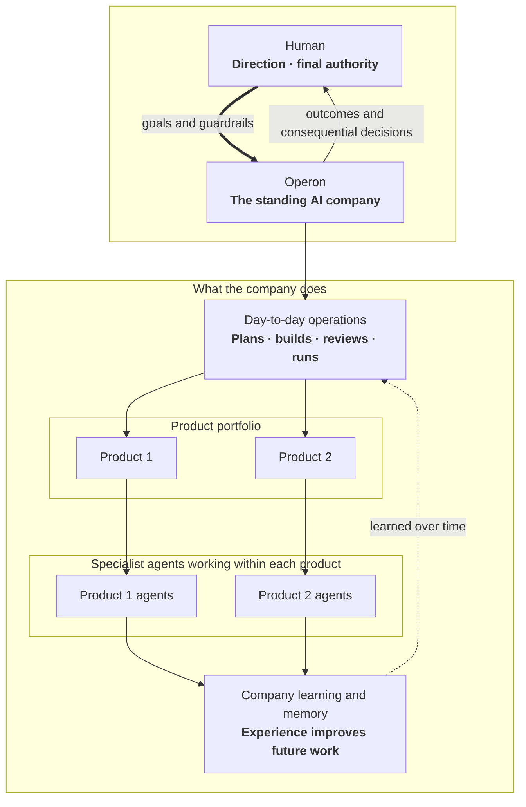

# Operon Architecture

*v1.7 — last aligned 2026-07-26. `docs/PURPOSE.md` → Decided is upstream and
authoritative; this document holds the implementation map the decision layer
deliberately does not. Route, budget, measurement, and qualification norms live
only in `docs/efficiency.md`. Propose implementation changes here; promote
decisions to PURPOSE only after human ratification.*

## 0. Overview

Operon is an installable **org runtime**: a standing AI company that develops
and operates a portfolio of independent software products. One human leads by
setting goals and guardrails and by making the critical decisions. Operon
handles the day-to-day work that turns that direction into software outcomes.



Read the diagram as an organization, not as an implementation architecture.
The human runs the company rather than its task queue. Each product stays
independent; shared learning must not erase product boundaries.

The runtime execution path:

```
launchd (now) / systemd timer (droplet later)
      │  fires every ~5 min
      ▼
operon dispatch  ── reads ──►  roles.yaml · apps.yaml · schedule state · events
      │
      │  for each due episode: acquire lock, gather deterministic facts
      ▼
EpisodePlanner boundary (src/org/episode-planner)
      │  complete creator scope ─► normalize (zero provider turns)
      │  otherwise ──────────────► fixed boot assignment + bounded planner
      ▼
validated, durable EpisodePlan (src/loop)
      │  ready provider/mechanical/approval steps in DAG order
      ▼
turn runner / pass transport
      │  role permissions ∩ selected adapter capabilities
      ▼
runtime adapter (claude | codex | pi)          src/runtime
      │  every tool action → GateFn ── critical ops denied + escalated
      ▼
artifacts land on GitHub (issues, PRs, comments, merges)
escalations land in the CLI approval queue ── §4
telemetry / memory / scorecard events written at turn end ── §6
```

**How the dispatcher "decides":** there is no planning intelligence in the
tick — *deciding is computing what is due*. Every ~5 minutes a stateless tick
merges roles.yaml triggers with apps.yaml overrides, checks schedule state,
polls GitHub for new events, starts a detached turn for each due (role, app),
and exits. Turns outlive ticks (§2); a fresh lock heartbeat skips that
(role, app) while unrelated work may start in parallel up to the org WIP limit.

Every due episode admits a plan-derived route and budget **before** provider
work: a bounded `EpisodeIntent`, then either token-free creator-scope
normalization or EpisodePlanner, then a schema-validated durable `EpisodePlan`
that owns the step DAG and exact harness/model/effort assignments. Identities,
numeric ceilings, and qualification semantics live only in `docs/efficiency.md`;
this document places intent/plan/journal/settlement modules on the import path
(`src/org` → `src/loop` → `src/runtime`). Observe and report are read-only.

Newer work never assumes older work finished:

1. **State derives from artifacts, not intentions** (§3): a ticket is
   reviewable only when its PR exists; a PR ships only when an APPROVE review
   and green gates exist.
2. **Dependencies gate readiness** (`docs/loop.md` §8): `Depends-on: #N`
   becomes due only when #N is *merged*; overlapping file scopes never run
   concurrently.

| Component | Module | Notes |
| --- | --- | --- |
| Dispatcher, schedule, events, locks, trigger routing | `src/org/dispatch.ts`, `src/org/trigger-routing.ts` | roles.yaml triggers → protocols |
| App registry (`apps.yaml`) | `src/org/apps.ts` | multi-app registry |
| Authority charter + resolver | `src/org/authority.ts` | versioned org grant, app-only narrowing |
| Context assembler | `src/org/context.ts` | authority + TASTE + memory |
| Approval queue + grants | `src/org/approvals.ts` | CLI queue; approve ≠ execute |
| OKF memory / scorecards / retro | `src/org/memory.ts`, `scorecards.ts`, `retro.ts` | §6 |
| Ticket state machine | `src/loop/loop.ts` | full design in `docs/loop.md` |
| EpisodePlanner boundary | `src/org/episode-planner/` | intent, creator scope, planner orchestration |
| EpisodePlan + route projection | `src/loop/episode-plan.ts`, `episode-plan-executor.ts`, `episode-route.ts` | one workflow source of truth |
| Pass transport, briefs, gates, verdicts | `src/loop/pipeline.ts`, `brief.ts`, `qgates.ts`, `verdicts.ts` | `docs/loop.md` |
| Protocol templates | `prompts/`, `pipelines.yaml` (org home) | human-ratified; not a workflow planner |
| Runtime contract, gate, telemetry, adapters | `src/runtime/` | atomic harness/model/effort per provider turn |
| Run status + anomalies | `src/runtime/runlog/status.ts`, `anomalies.ts` | L1/L2 readers |
| Live UI / reports / narrative | `src/observe/`, `src/report/`, `src/narrative/` | presentation-only leaves |
| Governed learning | `src/org/learning/` | `docs/learning-loop/` |
| Release handoff | `src/org/release.ts` | approved deploy executed once by later dispatch |
| Package/org/state boundary | `src/org/home.ts` | org init, active pointer, state-home resolution |

A **role invocation** is one scheduled, event-driven, or manual invocation of
a role. A **pass** is a configured protocol stage. A **provider turn** is one
adapter invocation and one settlement. An **execution step** is one terminal
provider or mechanical record; a **mechanical step** constructs no adapter.
Each planned provider step carries one indivisible `TurnAssignment`
`{harness, model, effort}` — never a silent substitute. The runtime gate is a
pure `GateFn`; the org composes grants (§4) and passes them down. Adapters run
headless with a non-interactive environment overlay and deny-first dependency
builds (`PNPM_CONFIG_IGNORE_SCRIPTS`); tickets that need builds opt in via
`setup_command`.

## 1. On-disk layout

Four explicit paths, one rule: **durable, curated artifacts live in git;
high-churn operational state stays outside git.** No command infers an org
home from the current working directory.

### Package root (installed Operon implementation)

```
src/operon.cjs           packaged pre-ESM cwd guard (`operon` bin)
src/operon-local.cjs     source-backed pre-ESM cwd guard
dist/                    compiled package CLI behind the preflight
src/**/*.ts              TypeScript source in a development checkout
TASTE.md                 org-init template, not an active org instance
roles.yaml               org-init template
pipelines.yaml           org-init template
prompts/                 org-init protocol templates
taste/                   org-init role craft templates
agent-skills/operon/     packaged coding-agent operating guide
```

`pnpm link:local` creates a source-backed pre-ESM launcher, so a development
checkout's next `operon` invocation reads the latest TypeScript source. Packed
installs use the parallel `src/operon.cjs` launcher before loading
`dist/cli.js`. Both absolute CommonJS entries check `process.cwd()` before any
ESM import, reject a removed caller directory with one actionable line, and
resolve templates relative to the installed package rather than the caller's
current directory.

### Org home (required, committed separately)

```
TASTE.md                 org constitution (human-ratified)
AUTHORITY.md             canonical, versioned human authority grant
AGENTS.md                Codex instructions composed around AUTHORITY.md
CLAUDE.md                Claude Code instructions composed around AUTHORITY.md
roles.yaml               org chart (human-ratified)
apps.yaml                app registry (§7)
pipelines.yaml           executable build/role protocols
prompts/                 pass templates referenced by pipelines.yaml
taste/<role>.md          role craft addenda
memory/roles/<role>/     per-role craft bundles, cross-app (§6)
skills/                  promoted skills (Agent Skills standard)
retro/<date>.md          weekly retro notes (§6)
```

`operon org init <path> --name <name> --dry-run [--json]` builds the same
read-only init manifest execution consumes: resolved org/state/pointer effects,
every generated file and directory, authority summary, packaged role chart,
and any nested collision blocker. It writes no target, state, pointer, or stage.
Execution remains the compatibility default. An absent target is atomically
staged, validated, and renamed; an existing real directory is populated with
exclusive file creation and exact-entry rollback while unrelated bytes and
reusable directories remain untouched. A complete org directs the operator to
`operon org use <path>`. Generated-file, nested-path, non-directory,
overlapping, or symlink collisions fail before target mutation. Successful
execution creates the state home and writes `~/.operon/config` with the active
`org_home`. Onboarding selects `delegated-operator` (default),
`conservative`, or an attributable custom authority file and previews both
automatic and human-gated actions. A pre-feature org with no `AUTHORITY.md`
fails closed to the built-in legacy-conservative profile; it never silently
inherits the newer delegated default. `operon org use <path>` selects an existing complete tree.
`OPERON_ORG_HOME` is the explicit non-persistent override.

`operon org upgrade` is the token-free legacy migration boundary. Its default
is a byte-stable, non-mutating schema/change plan. Execution requires an
explicit authority choice when a legacy org has no charter, copies only
missing packaged surfaces (including newly introduced nested prompt/taste
files inside an already-present tree), adds the registry schema marker without rewriting
app entries, writes a checksummed archive outside state, and validates the
complete org plus effective authority afterward. Existing ratified surfaces
are never replaced. A deterministic stage and dead-process-aware org lock make
an interrupted migration safely rerunnable; thrown failures restore the exact
archived bytes.

### App reset, verify, and promote

`operon app reset`, `operon app verify`, and `operon app promote` are the
token-free lifecycle commands for repeatable onboarding and readiness. Reset
archives managed state outside the state home before any destructive change
and never deletes a GitHub repository. Verify proves refs, managed clone,
authority/config hashes, app checks, locks/approvals, and adapters without
constructing a provider turn; it also synthesizes or repairs the lifecycle
record. Promote to `live` is plan-by-default and executes only from passing
verification. Readiness claims follow the generated → registered →
runtime-ready → live → autonomously scheduled ladder in `docs/efficiency.md`;
none of those states is implied by an earlier one. CLI details and remediation
live with the commands themselves and README → Commands.

### App repo (target product repo)

```
.operon/
  TASTE.md               app charter ("what this product is; what good means")
  AUTHORITY.md           session-readable org snapshot + app-only narrowing
  LABELS.md              generated canonical GitHub label reference
  config.yaml            app-entry registry mirror + top-level checkout gates
  policy.yaml            app-owned quality-gate policy emitted by bootstrap
  memory/<role>/         per-(role, app) domain bundles
  onboarding-report.md   deterministic setup/documentation inventory
  bootstrap/             initial issue and operator next steps for new apps
AGENTS.md                existing content + one marked Operon authority block
CLAUDE.md                existing content + one marked Operon authority block
```

**Containment invariant.** Operon's owned app artifacts live under `.operon/`,
with one deliberately narrow exception: onboarding composes an idempotent,
marked authority pointer into root `AGENTS.md` and `CLAUDE.md` so Codex and
Claude Code see the charter when launched directly. Existing content outside
that marker is preserved byte-for-byte. The remaining transient surface is
GitHub (`op/*` branches,
`op:*` labels) that closes out as work merges. Nothing Operon-specific is
scattered through the app's source tree, so contributors who don't run
Operon can ignore exactly one directory — the same social contract as
`.github/` or `.vscode/`. Under that invariant the directory is safe to
keep in the app repo regardless of whether the Operon tool itself is ever
open-sourced or stays private: it holds app-owned configuration and memory
(which a reader may freely see — it documents how the app is managed),
never tool source. If Operon is published, the `.operon/config.yaml` schema
becomes a public contract, so it carries a `schema_version` field from day one.

### Runtime state (`~/.operon/<org>/`, outside git entirely)

```
repos/<app>/             org-managed clone per app (worktree source, §3)
worktrees/<app>/<branch>/
state/schedule.json      last-fired per (role, app, trigger)
state/events/            consumed-event keys (dedup) + file-drop event inbox
state/turns/<turnId>.json  turn journals (§3)
state/budget-overlay.json  dispatcher budget-pause overlay (§7)
scheduler/installation.json  org-scoped scheduler ownership/definition record
scheduler/evidence/      versioned invocation, route-decision, and alert JSON
standing-roles/<app>/    grounded drafts + lifecycle-bound Planner feeds/consumption receipts
locks/<app>--<role>.lock
approvals/               pending/ decided/ grants/ log.jsonl (§4)
sessions/                adapter session artifacts where the SDK needs a home
tasks/<taskId>/           parent delegated-task record + exact operator prompt;
                         child runs correlate via parent_task_id
runs/<app>/<runId>/      L1–L3 per-pass runlogs: envelope, events, brief,
                         exact prompt, output, activity log (not a full
                         transcript; docs/loop.md §9)
telemetry/<day>.jsonl    org cost ledger (src/runtime/telemetry.ts orgDir)
invocations/<day>.jsonl  one terminal row per CLI command plus distinct
                         internal release-execution rows
state/invocation-journal/ pre-command intent and idempotent append recovery
tickets/<app>/<issue>.json  cross-process ticket claim state (docs/loop.md §7.1)
scorecards/<app>/<role>.jsonl  raw scorecard events (§6)
learning/**              learning-loop capture/episode/activation state;
                         metrics/capture-cursor.json binds eligible runs to
                         exact event ids, metrics/efficiency-health.json is a
                         refresh-only rebuildable projection, and events/,
                         episodes/, canary/, resolved/, and m6-runs/ retain
                         their governed meanings (docs/learning-loop/)
```

The org id `<org>` comes from org-home config. `OPERON_STATE_HOME` overrides
this location explicitly and independently of `OPERON_ORG_HOME`. Note
`~/.operon` is not TCC-protected on macOS, unlike `~/Documents` — launchd jobs
can read it freely (same reasoning that keeps repos at `~/Build`).

### Read-only Live UI (`operon observe`)

`src/observe/` is a presentation-only leaf over durable state and bounded
GitHub reads: loopback-only bind, per-process capability, no workflow mutation.
Stopping it never affects a run. `docs/live-ui/design.md` is the contract.
Reports and narrative are sibling presentation leaves (`docs/reporting/design.md`,
`docs/narrative/design.md`).

## 2. Dispatcher & scheduler

**Model: stateless tick, not a daemon.** Every ~5 minutes an org-scoped host
trigger (launchd today; a future systemd user timer shares the same backend
boundary) invokes the ordinary `operon dispatch`, which reads config plus
durable state, computes what is due, starts detached turns, and exits — there
is no competing daemon or workflow engine. Deciding is computing what is due:
roles.yaml triggers merge with apps.yaml cadence overrides, GitHub and the
file-drop event inbox are polled per live app, consumed events dedup durably,
locks and the org WIP limit bound concurrency, and due provider work still
enters only through the EpisodePlanner boundary (§0, §8). Turns outlive the
tick, a wedged host resumes on the next tick, and missed windows collapse to
one firing.

[`docs/scheduler/design.md`](scheduler/design.md) is the canonical contract:
trigger grammar and event polling, trigger→protocol routing, locking and
concurrency, manual `run-role` invocation, the scheduler definition/identity
schema, durable tick evidence, state retention, reason codes, and health
semantics. Company-lifecycle event payloads for the file-drop inbox are
[`docs/scheduler/event-schemas.md`](scheduler/event-schemas.md), validated by
`src/org/event-schemas.ts`.

## 3. Turn lifecycle & state machine


### One role invocation

```
dispatch → journal(assembling) → unresolved actor-retry check (§4)
        → worktree acquire
        → context assembly (§5)
        → journal(running)    → adapter.runTurn(req, {gate, onEvent})
        → journal(collecting) → collect artifacts, escalations, usage
        → telemetry append · scorecard events · memory-write check
        → journal(done | blocked_on_gate | failed) → release lock
```

The journal `state/turns/<turnId>.json` is written synchronously at every
phase transition — it is the crash-recovery source of truth:
`{turnId, role, app, trigger, phase, attempt, session?, worktree?, worktreeBranch?, ticketRef?, escalationIds?, errorCode?, recovery?, startedAt, updatedAt}`.

**Legacy role-invocation budget.** The adapter tracks running cost from SDK usage events;
crossing `max_turn_budget_usd` aborts the turn gracefully → status `failed`
with the exact `error_max_budget_usd` code and an incident note artifact
(roles.yaml: "overrun = incident note, not silent spend"). A standalone turn's
recovery evidence names its isolated path and branch, reports whether the worktree
is dirty, and gives a read-only inspection command. Operon does not automatically
stage or commit arbitrary provider output at this boundary. Episode route
admission and remaining-budget enforcement (`docs/efficiency.md`) are the
canonical ceilings; this adapter cap is a safety backstop, not a second route
budget.

### Worktrees

- Operon maintains its **own clone** per app at `repos/<app>` (fetch-only
sync with GitHub) and cuts worktrees from it under
`worktrees/<app>/<branch>`. It never touches the human's personal checkouts
of the same repos — GitHub is the only sync point between human and org.
Mutating git operations on that shared clone (fetch, worktree add/remove) are
serialized by a per-app clone lock (`withAppGitLock` in
`src/org/turn-runner.ts`), so two concurrent turns for the same app never
contend on `.git/index.lock` and corrupt the tree. That lock is a configuration
of the shared `FileLock` primitive (`src/runtime/file-lock.ts`): the lock file
carries a `pid`+`nonce` ownership token, release verifies the token before
unlinking (a late holder never deletes a successor's lock), and a proven-live
holder is never force-broken — a stale holder is reclaimed only when its pid is
dead or it has aged past the window, and a live holder held past the max wait
fails the waiter (typed busy, next tick retries) rather than running a second
`git reset --hard` on the same checkout.
- Loop items get branch `op/<issue>-<slug>` and keep the same worktree across
build → review → fix cycles; it is removed after merge/return. Explicit
standalone `run-role` turns get a collision-resistant `op/turn-<slug>-<hash>`
branch and durable worktree. Reusing the same invocation identity rediscovers
that worktree without resetting or deleting uncommitted work. Governed
scheduled/event routes retain their existing protocol-specific checkout policy.
- Standalone provider turns never run in `repos/<app>` itself. The managed clone
remains on its resolved remote default and clean while the isolated worktree may
retain inspected WIP after a failed turn.


### Build-loop state machine (`src/loop`) — see `docs/loop.md`

The loop is Operon's center of gravity — a framework-agnostic TypeScript
re-engineering of the predecessor orchestrator (`docs/loop.md` §0), **not**
a thin state machine over opaque role turns (decided 2026-07-04: control and
gates, never "throw a ticket at an agent"). `docs/loop.md` is the
authoritative design — passes, briefs, gates, verdicts, review dimensions,
and acceptance-criteria discipline all live there. Summary:

- A validated plan provider step currently uses the pass executor as a
  one-step transport: it invokes `runTurn` with the planned atomic assignment,
  assembled budgeted **brief**, role authority, and fresh session. Existing
  static pass pipelines remain readable for historical episodes and
  compatibility entry points, but cannot add work to an accepted EpisodePlan.
  Any extra adapter invocation remains a distinct provider turn and settlement
  (`docs/loop.md` §§2–4).
- **Mechanical quality gates** (setup/tests/lint/e2e/secret-scan/
completeness/review-freshness, risk-tiered by `.operon/policy.yaml`) run
as orchestrator subprocesses after build passes and twice at ship —
distinct from the safety gate; no agent prose ever drives a side effect
(`docs/loop.md` §5).
- Item states: `ready → building → gates → reviewing → shipping → merged`,
with bounded remediation (3) and review cycles (3) → `returned`.
`approve` + green gates + freshness → **the orchestrator squash-merges**
(agents never merge), deletes the branch, closes the ticket via
`Closes #N`. All states derive from GitHub artifacts; any tick advances
any item (`docs/loop.md` §7).


### Crash recovery: artifact boundary first

A stale lock or interrupted tick reopens the accepted plan pointer and
`plan-execution-journal.json` before choosing work. The authority order is
`intent → plan version → derived route → ready step → terminal evidence`.
Within a legacy ticket-delivery step, the finer artifact boundaries remain
`contract → implementation → push → gates → pr → findings → approvals → merge
→ release`. A boundary is reused only while its recorded artifact fingerprint
is still valid. Ticket, commit, or finding drift creates a typed material event
and invalidates only future work; any resulting plan revision is forward-only.
A cap stop, cancellation, crash, or timeout retains the last valid artifact
refs and a typed resume decision.


**Restart clean** currently resets worktree scratch to the branch tip with
`git reset --hard && git clean -fd`. It may discard only scratch that has not
been accepted as a valid episode artifact. Commits, pushed refs, contracts,
findings, approvals, gate evidence, usage checkpoints, execution records, and
any other accepted artifact survive interruption. Repeating a productive pass
requires a durable invalidation reason tied to the artifact or decision it
invalidates. Claim, repair, review, retry, tool-call, active-time, provider-turn,
and cost bounds are plan-derived and policy-clamped, and remain in force across
process restarts.

A role invocation whose running pass exceeds its wall-clock cap is killed by
the dispatcher — SIGTERM escalating to SIGKILL. The pass executor derives its
effective watchdog from the smaller of its configured ceiling and the
episode's remaining active-time allowance in `docs/efficiency.md`.
Recovery (restart-clean + respawn) is **deferred until the process is
confirmed dead** (`killHungTurns` in `src/org/dispatch.ts`): a still-alive
child that also holds the per-app clone lock would otherwise let two workers
mutate one clone. If the pid refuses to die this tick, recovery waits for a
later one.

Inside a pass, the executor also owns a shorter adapter-start deadline
(default 30 seconds). The first adapter progress checkpoint or streamed event
proves startup; silence until the deadline aborts the same owned provider tree
and finalizes `failed(error_adapter_start_timeout)`, distinct from the full
turn wall-clock timeout. `operon doctor` uses separate bounded, non-billable
initialize/account/auth probes to catch missing binaries, transports,
credentials, and model configuration before an operator starts live work.

### Idempotency rules

These four rules are why a dead turn never leaves the repo half-done:

1. **Durable progress is explicit.** Git/GitHub operations remain the durable
  product effects: commit, push, PR create, label flip, review, comment, merge.
  Episode contracts, findings, approvals, gate evidence, usage checkpoints,
  and terminal records are also durable orchestration artifacts. Only
  unaccepted worktree/session scratch is disposable.
2. **Artifact before label.** State labels flip only *after* the artifact
  they announce exists (push branch → then `op:building`; open PR → then
   `op:in-review`). A restarted turn re-derives state from artifacts (`gh pr  list --head <branch>`), never trusts the label alone, and skips
   already-done steps.
3. **Claims are label flips.** The Builder claims a ticket by atomically
  swapping `op:ready → op:building`; a dispatcher that polls mid-claim sees
   a consistent state either way.
4. **Non-git writes are append-only and keyed by turnId** (telemetry JSONL,
  scorecard events, journal) — re-running collection dedupes on turnId.
   Whole-file operational state (journal, lock, schedule, consumed-event set,
   approval items) is written atomically via a tmp-file-plus-`rename`
   (`writeFileAtomic` in `src/org/atomic.ts`), so a crash mid-write never
   leaves a torn file a later tick would choke on.


## 4. Approval surface (CLI queue)

Decided 2026-07-04: CLI queue, one-by-one review, approve or
deny-with-reason, persisted audit trail, app-tagged, single queue.

The classifier reads Operon's own command line as an effect surface, not just
third-party tools: `operon app reset`/`prune-runs` are
`destructive-or-irreversible`, `operon org init|use|upgrade` is
`protocol-self-edit`, `operon plan ratify-ticket-budget` and `operon bootstrap
publish` are `external-publishing`, and `operon approvals
review|revoke|disposition` is `approval-store-tamper` — self-approval by CLI is
still self-approval. Read-only invocations (`roles`, `apps`, `status`,
`doctor`, `budget`, `context`, `episode explain`, `approvals show|status`)
stay routine.

### Storage (`~/.operon/<org>/approvals/`)

```
pending/<id>.json     one file per open item
decided/<id>.json     moved here on decision (decision fields merged in)
grants/<grantId>.json grants created by approvals (single-use by default;
                      the human may widen to ticket/app scope at decision time)
execution-locks/      per-item claim locks for sanctioned later executors
log.jsonl             append-only audit trail (raised, decided, grant uses,
                      and execution transitions)
```

Plain files, no database: one human decision consumer, with per-item locks for
concurrent dispatch executors; survives the droplet migration as a directory
copy, and TASTE §3 (boring dependencies). `id = <utc-compact-timestamp>-<rand4>`.

Item schema:

```jsonc
{
  "id": "20260704T193201Z-8k2f",
  "app": "civic", "role": "builder", "turnId": "…", "ticketRef": "#42",
  "workdir": "/…/worktrees/civic/op-42",  // sandbox cwd the action was raised
                                          // from; the context a later
                                          // orchestrator execution runs in
  "rule": "secrets-or-auth",              // gate rule that fired
  "action": { "tool": "Bash", "input": "…", "description": "…" },
  "classification": {                     // effect fields only; no prose
    "schemaVersion": 1, "rule": "secrets-or-auth", "reason": "…",
    "matchedAction": { "executables": ["cat"], "targets": [".env"] }
  },
  "justification": "…",                   // the model's stated intent, from turn events
  "raisedAt": "…", "status": "approved",
  "execution": {
    "state": "approved",                  // not evidence the effect happened
    "executor": "orchestrator-command | durable-github | release | actor-retry",
    "idempotencyKey": "…", "attempts": 0, "nextAction": "dispatch"
  }
}
```


### Flow

1. Gate denies-and-escalates; the adapter surfaces the denial; the item is
   persisted to `pending/` at collection time (`blocked_on_gate` when the
   primary artifact is unreachable).
2. Human reviews via CLI. **Approve ≠ execute.** Approval mints an
   action-hashed grant (default scope `once`; human may widen to ticket/app
   with TTL/cap/revoke). Self-merge, production deploy, external publication,
   and protocol-surface writes are never scopeable.
3. Next tick re-dispatches when escalations are decided; the effective gate is
   grant lookup then default rules. Deny reasons become durable lessons.
4. Later dispatch executes only typed orchestrator-owned allowlisted actions
   (`durable-github`, `release`, `orchestrator-command`), records
   `approved → executing → executed|failed|ambiguous`, and never blindly
   retries ambiguity. Full grant, binding, and disposition contract:
   `docs/approval-and-release-amendment.md` and `docs/PURPOSE.md` → Decided.

### CLI

```
operon approvals              pending table plus approved executions that
                              still need acknowledgement (app-tagged)
operon approvals review       one-by-one: full item, then [a]pprove (with
                              optional scope: `a ticket [path]` / `a app
                              [path]`) / [d]eny (reason required) / [s]kip;
                              approving may also re-arm the parked ticket
                              (op:blocked → op:ready) so the next tick
                              continues from artifacts
operon approvals review --batch   group pending items with identical
                              (rule, app); one decision, per-item audit rows
operon approvals show <id>    full detail incl. turn-event context
operon approvals status       decision/execution state, attempts, actor,
                              result, remote reference, and next action
operon approvals disposition <id> (--executed|--failed|--retry)
                              --reason <text> --confirm <id>
                              explicit reconciliation for failed/ambiguous work
operon approvals revoke <grant-id>   immediate revocation of a live grant
```

Decision writes materialize the grant before the decision log and atomic item
move, so a logged approval cannot lack its authorization file; log-vs-file
reconciliation repairs an interrupted move or missing grant at the next
`operon approvals` run. Execution item rewrites are atomic and transition rows
remain append-only evidence.

Budget escalations (§7) enter this same queue as synthetic items
(`rule: "budget-exceeded"`) — one inbox, never two.

## 5. Context assembly

Assembly is **concatenation in fixed order** (PURPOSE v0.8 — layers answer
different questions, so conflicts are rare; narrower layers specialize
defaults):

```
[0] effective delegated authority    org AUTHORITY.md, optionally narrowed
                                      by <app>/.operon/AUTHORITY.md
[1] org TASTE.md                      values + engineering constitution
[2] taste/<role>.md                   role craft (when it exists)
[3] <app>/.operon/TASTE.md            product charter (when it exists)
[4] role turn protocol                generated: expected outputs, GitHub
                                      conventions (§10), end-of-turn learning
                                      note instruction, approval etiquette
[5] memory excerpts                   role craft bundle + this app's domain
                                      bundle (§6) — capped
```

**Authority and the org's "What we never do" section are unoverridable by
narrower context — but the guarantee is the gate, not prompt order.** App
authority can only inherit, select conservative, or add restrictions; a stale
app snapshot fails closed. Current-task instructions can narrow the grant.
Broader authority requires a fresh, attributable human instruction. Layers
[2]/[3] specializing a never-do rule
would merely be ignored text; the critical-ops gate enforces the same list
mechanically on every tool action. Prompt layering is steering; the gate is
the contract.

**Memory excerpt selection v1: no embeddings.** Include each bundle's
`INDEX.md` (curated one-liners) plus any documents whose frontmatter
`keywords` match the task text; hard cap ~16 KB. Curation (§6) keeps bundles
small enough that this stays adequate; retrieval sophistication is earned by
evidence, not assumed.

**Governed concepts resolve ahead of legacy memory** (`docs/learning-loop/`).
When learning is enabled, `resolveLearningContext`
(`src/org/learning/resolver.ts`, wired into `src/org/context.ts`) runs once
per turn as a **pinned resolve** — promotion, disable, or rollback mid-turn
never shifts a running turn's context. Its concept sections fill layer [5]
first, and the legacy keyword selection above spends only the bytes the
concepts leave. In the build loop the pin is per (ticket episode, pipeline
role) via `createEpisodeContextResolver` (`src/org/context.ts`), so build
and fix passes on one ticket share one pin and reviewer-scoped concepts
reach review passes. Every governed resolve persists a pinned record at
`learning/resolved/<turnId>.json` in the state home.

**Cache-stable assembly** (added 2026-07-04, reviewed with the human
operator; economics in `research/2026-07-04_prompt-caching.md`). Provider
prompt caches are org-wide *prefix matches*, not session state: a fresh
session whose rendered prefix is byte-identical to a recent request reads it
at ~0.1× input price, and every read refreshes the TTL — so back-to-back
passes stay warm across the loop's fresh-session-per-pass rule for free.
Two rules protect that:

1. **Layers [0]–[4] are a pure function of (role, app, ratified files).**
   Never embed per-turn bytes — timestamps, turn ids, ticket refs, attempt
   counters. Per-turn facts belong in the task payload (the brief), which
   renders after the stable prefix.
2. **Layer [5] is pinned per resolve and held fixed across its passes** —
   once per role turn, and in the build loop once per (ticket episode,
   pipeline role). Keyword matching runs against the *ticket* text,
   never the per-pass brief — re-selecting per pass would silently change
   the prefix on every pass (and hand the builder and the fix pass
   different lessons; pinning is better for coherence, not just cost).

A model switch between adjacent passes forfeits the whole cache (caches are
model-scoped) — weigh that when tuning per-pass overrides in pipelines.yaml.

**Injection per adapter — native channels only** (docs/PURPOSE.md), nothing
assembled ever lands in a commit:


| Runtime | Channel                                   | Mechanics                                                                                 |
| ------- | ----------------------------------------- | ----------------------------------------------------------------------------------------- |
| claude  | system-prompt append (SDK option)         | no files written                                                                          |
| codex   | App Server `developerInstructions`        | per-thread native instruction field; no worktree overlay required                         |
| pi      | `.pi/APPEND_SYSTEM.md` in worktree        | worktree-local, masked via `.git/info/exclude` (never the repo's `.gitignore`)            |


The assembler produces `ContextBundle.authority` (effective text, profile,
version, SHA-256, and source paths), then layers [1]–[4] in `taste: string[]`
and layer [5] in `memoryExcerpts`. Every pass envelope copies the authority
provenance without duplicating its full prose. Parent delegated-task records
capture the same evidence at `operon task begin`.

This section covers the *system context* a pass runs under. The *task
payload* — ticket, spec excerpts, contract, findings, attempt history — is
the loop's brief assembler (`docs/loop.md` §3), a separate, per-pass,
budgeted packet logged verbatim in the run artifact.

## 6. Memory & scorecards


### OKF bundles

Two partitions (PURPOSE v0.8: one-turn-one-app):


| Bundle                         | Home                 | Content                                                          |
| ------------------------------ | -------------------- | ---------------------------------------------------------------- |
| `memory/roles/<role>/`         | org home (committed) | craft: what this role has learned about doing its job, cross-app |
| `<app>/.operon/memory/<role>/` | app repo (committed) | domain: what this role knows about this product                  |


Document format (OKF — markdown + YAML frontmatter):

```markdown
---
name: prefer-fixture-factories
description: one-line hook used for excerpt selection
type: lesson | fact | procedure
keywords: [tests, fixtures]
evidence: ["PR #12 review", "incident 2026-07-02"]
status: active | deprecated
created: 2026-07-04
updated: 2026-07-04
---
Body: the lesson, with the why. Wrong lessons get deleted, not hedged.
```

Each bundle carries an `INDEX.md` (one line per doc) — the always-included
excerpt layer.

**End-of-turn learning notes** (`docs/learning-loop/`): the role protocol
(context layer [4]) instructs agents to record lessons and corrections as
**candidate notes** — `learning/candidates/<role>/` in the org home,
`.operon/learning/candidates/<role>/` on the ticket branch — never as active
OKF docs. Candidate trees are deliberately agent-writable routine ops; they
carry no authority and nothing in them loads into future context until it
passes review. The learning GOVERNANCE surfaces
(`learning/{bundle,quarantine,evals,reviews,experiments,interventions}/**`,
`manifest.yaml`, `policy.yaml`, `rejections.jsonl`, and their
`.operon/learning/**` counterparts) are critical ops by the
`learning-surface-tamper` gate rule — publisher/human-only. Existing
`memory/**` trees remain read-only legacy seed context: still resolved into
layer [5] at lowest precedence, no longer written by anyone.

**Curation** belongs to the governed learning loop (review → approval →
publish, `docs/learning-loop/`).

### Scorecards

Raw events append to `scorecards/<app>/<role>.jsonl` as they happen, written
by the orchestrator (never self-reported):


| Event                | Source                                          | Scores              |
| -------------------- | ----------------------------------------------- | ------------------- |
| `review_cycles`      | loop item at merge/return (cycles count)        | Builder             |
| `escaped_bug`        | SRE incident note tracing to a merged PR        | Reviewer            |
| `rework`             | ticket returned / reopened after merge          | Planner             |
| `edit_distance`      | human's delta on a published draft              | Support / Marketing |
| `gate_denial_upheld` | approval queue: deny on an item the role raised | any                 |
| `turn_cost`          | telemetry rollup                                | any                 |


### Weekly retro (`operon retro`)

A scheduled org-level turn (Opus, high effort — quality of judgment matters
here) that consumes the week's telemetry + scorecards and emits:

1. `retro/<date>.md` in org home (committed) — scores per (role, app),
  trends, incidents;
2. learning notes into `learning/candidates/` (routine — curation itself is
  the governed learning loop's job, `docs/learning-loop/`);
3. proposed TASTE/roles.yaml changes — **as proposals only** (issues/PRs for
  the human; the gate's `protocol-self-edit` rule backstops this).

The scorecard, not self-assessment, decides autonomy changes (TASTE §13) —
e.g. Support replies graduating from draft-only is a roles.yaml proposal
justified by edit-distance trend.

## 7. Multi-app structure


### App registry — `apps.yaml` (org home)

```yaml
org:
  name: operon
  max_concurrent_turns: 2

defaults:
  budget_usd_month: 1000        # decided 2026-07-04, configurable per app

apps:
  operon-sandbox-alpha:
    repo: bikramgupta/operon-sandbox-alpha       # GitHub slug = identity
    status: live                # live | paused | onboarding
    budget_usd_month: 1000
    execution:
      assignment_mode: fixed    # fixed | adaptive; omission is fixed
      allowed_assignments: {}   # adaptive app narrowing by role/candidate id
    cadence: {}                 # optional per-role trigger overrides, e.g.
                                #   support: []          (disable role here)
                                #   planner: [{schedule: "daily 08:00"}]
  operon-sandbox-beta:
    repo: bikramgupta/operon-sandbox-beta
    status: onboarding
```

`assignment_mode` changes assignment resolution only; it cannot disable
EpisodePlanner. In `fixed`, each planned role turn resolves the role's existing
configured tuple. In `adaptive`, role-local org-approved candidates are
required, and `allowed_assignments` may narrow their IDs per app but cannot
invent or widen a tuple. The Planner boot turn remains its configured fixed
tuple in both modes. The committed org-home entry and `.operon/config.yaml`'s
`apps.<name>` mirror use the same app-entry schema and must normalize
identically. Checkout gate commands are `.operon/config.yaml` top-level
extensions, not app-entry fields.

An org-approved role candidate keeps the harness and exact model inseparable,
lists every supported effort explicitly, and binds the operational evidence
used for capability, qualification, and price validation:

```yaml
roles:
  builder:
    runtime: codex
    model: gpt-5.6-sol
    effort: high
    adaptive_assignments:
      - id: codex-gpt-5.6-sol-qualified
        harness: codex
        model: gpt-5.6-sol
        efforts: [medium, high, xhigh]
        provider_family: openai
        capability_ref: codex/v1
        qualification_ref: campaign:codex-gpt-5.6-sol-v1
        conservative_estimate:
          max_turn_cost_usd: 5
          source: https://developers.openai.com/api/docs/pricing
```

Candidate IDs are stable and role-local; `configured` is reserved for the
role's fixed tuple and is always present. Each adaptive candidate currently
supplies a bounded `conservative_estimate`; `price_ref` is rejected until the
product packages an operational model-and-token estimator instead of silently
using the role-wide cap as a catalog estimate. `qualification_ref` is the
human-ratified provenance reference for the exact tuple. Configuration loading
validates its typed form but does not claim to rerun or dereference an external
campaign. App
`allowed_assignments` values are candidate-ID lists keyed by role. Unknown
roles or IDs fail configuration loading before execution, so app configuration
can only narrow the org catalog.

- **One-turn-one-app is structural:** `TurnRequest` has a single `workdir`;
multi-app exists only in the dispatcher (which iterates apps) and human
surfaces (the app-tagged approval queue, per-app budget rollups). No turn
ever sees two apps.
- "One live app at a time" is **operational policy** expressed as `status:`,
not code — the WIP limit is what code enforces.
- Per-app cadence overrides replace (not merge with) that role's roles.yaml
triggers when present; an empty list disables the role for that app.


### Budget enforcement

Telemetry already records cost per turn; the dispatcher rolls up the current
month per app (telemetry records gain an `app` field — small addition to
`TurnRecord`):

- ≥ 80% of `budget_usd_month` → warning line in the Planner's daily digest.
- ≥ 100% → app auto-set to `paused` (state overlay, not a YAML edit) + a
`budget-exceeded` item in the approval queue; human approval resumes the
app (optionally raising the budget in apps.yaml themselves).

The overlay (`state/budget-overlay.json`) is recomputed on **every dispatch
tick** — `enforceBudgetOverlay` runs before due-turn computation, and
`computeDueTurns` skips any app the overlay marks paused, so an app past its
cap stops spending within one tick rather than at the next human touch. The
rollup is per calendar month, so the overlay clears itself at month rollover
(a new month starts at $0). This is enforcement in code, not just a digest
line.


## 8. Product co-planning and the EpisodePlanner boundary

`operon plan` is the product-facing planning surface. A token-free `--dry-run`
preview assembles Planner context (§5) without constructing a runtime. Live
`--auto --goal` runs through the shared EpisodePlanner boundary
(`src/org/episode-planner/`): bounded intent, creator-scope assessment or
planner turn, then a durable execution `EpisodePlan` whose terminal output is
a schema-validated `TicketPlan` the orchestrator may publish as GitHub issues
(`src/org/plan-auto.ts`, `src/loop/plan-tickets.ts`). EpisodePlan authorizes
execution; TicketPlan describes child work. Route, budget, and assignment
norms are `docs/efficiency.md`; loop pass transport remains `docs/loop.md`.

`previewEpisode` / `orchestrateEpisode` / `explainEpisode` are the shared
boundary used by dispatch, tickets, product planning, and release flows.
`operon episode explain` is a total read-only diagnostic over durable evidence.
Only complete provenance-bearing creator scope skips the planner provider turn;
labels, lifecycle stage, or short prose never authorize a bypass. Bare
`operon plan <app>` fails closed and directs operators to `--auto --goal`.

Published tickets carry a `Planned-by:` trailer and a local
`published-tickets.json` mirror — the planner→ticket causal edge. Gate,
envelope, assignment, and settlement enforcement match every other
EpisodePlan-backed provider step.

## 9. Greenfield creation and Bootstrap

Greenfield (`operon new-app`) and existing-app (`operon bootstrap`) both require
a complete active org (`operon org init`). Readiness claims follow the evidence
ladder in `docs/efficiency.md` and §1 (generated → registered → runtime-ready →
live → autonomously scheduled); registry states remain `onboarding | live |
paused`.

`new-app` is deterministic and local: target skeleton, starter product truth
(`docs/VISION.md`, `docs/REQUIREMENTS.md`), `.operon/` contract, optional
template (`typescript-node` or `bare`), then the same register path as
bootstrap. It does not create a GitHub repo, push, or run the Planner —
follow-ups live in `.operon/bootstrap/next-commands.md`. After push,
`operon app verify` synthesizes the lifecycle record; `operon app promote
--to live --execute` flips status without a manual `apps.yaml` edit.

`bootstrap` (run inside the product repo) scans manifests/docs without agents,
runs the operator questionnaire, emits app-owned `.operon/` artifacts plus
marked AGENTS.md/CLAUDE.md blocks, and registers the app as `onboarding`. It
inventories setup signals; it does not infer authoritative product truth from
source. Recovered bootstrap writes only to an Operon-managed clone and leaves
the human checkout untouched.

## 10. GitHub substrate conventions


### Labels — the ticket state machine


| Label              | Meaning                                      | Set by                                              |
| ------------------ | -------------------------------------------- | --------------------------------------------------- |
| `op:ready`         | ticket is buildable as specified             | Planner (or human)                                  |
| `op:building`      | claimed; branch/PR in progress               | Builder turn (claim = atomic `ready→building` swap) |
| `op:in-review`     | PR open, review cycle running                | loop, after PR exists                               |
| `op:returned`      | bounced to Planner (max cycles / infeasible) | loop                                                |
| `op:blocked`       | waiting on approval-queue decision           | loop, on `blocked_on_gate`                          |
| `op:incident`      | SRE incident note                            | SRE                                                 |
| `p1` / `p2` / `p3` | priority (dispatch order within events)      | Planner                                             |


Transitions follow §3's artifact-before-label rule; ticket close comes from
the squash-merge's `Closes #N`, never a manual state.

### Ticket format (what the Planner emits)

Fixed headings, parseable by heading, human-first:

```markdown
Title: imperative, one concern (one ticket = one PR, TASTE §5)

## Goal            — what exists after this ships, one paragraph
## Context         — why now; links to feedback/digests/prior art
## Acceptance criteria   — checklist; each item mechanically checkable
## Out of scope    — the temptation fence
## Notes for the builder (optional) — pointers, not prescriptions
```


### Branches, PRs, reviews

- Branch: `op/<issue>-<slug>` from main; one branch per ticket; worktree ↔
branch 1:1 (§3).
- PR: title `<type>: <summary> (#<issue>)` — in v1 the builder loop always
emits the literal `build:` type (`prTitle` in `src/loop/loop.ts` is hardcoded;
a variable type is a later change); body = What / Why, **Evidence**
(pasted test output — TASTE §6), `Closes #<issue>`. Draft on first push;
ready when the Builder declares done.
- Review: verdict as a real GitHub review (APPROVE / REQUEST_CHANGES) plus a
structured findings comment — numbered findings, each must be resolved or
explicitly rebutted before merge (TASTE §8). Findings ride to the fix turn
as context. Single-account pilot caveat: GitHub forbids approving your own
PR, so a same-account approval lands as a marked COMMENTED review — trusted
only when its `operon:self-approval-fallback` marker carries a verifying
HMAC — signed with an orchestrator-only secret over the PR number **and the
reviewed commit**, so a marker copied onto a later push no longer verifies
(A-001) — plus an author-independence check, a structured `Verdict: approve`,
and commit freshness. No secret (or an unresolved reviewed commit) = fail
closed; a bare marker is never trusted (`docs/loop.md` §6).
- Merge: squash-merge only, performed by the loop after APPROVE; branch
deleted; PR description survives as the commit body (state-in-markdown, a
predecessor pattern).


## 11. Ratified decisions promoted to docs/PURPOSE.md

Ratified decisions live in `docs/PURPOSE.md` → Decided. Propose implementation
changes in this document; promote them to PURPOSE only after human ratification.

## 12. Open questions

None at the architecture level. Open work lives in the GitHub issue tracker.
