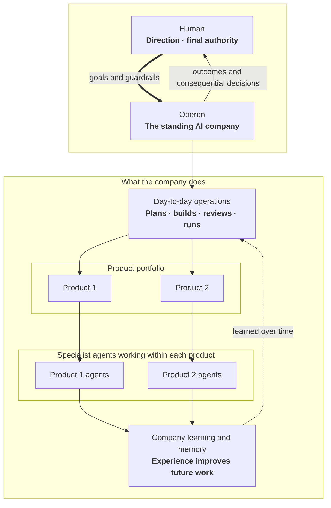

# Operon Architecture

*v1.7 — last aligned 2026-07-26. `docs/PURPOSE.md` → Decided is upstream and
authoritative; this document holds the implementation map the decision layer
deliberately does not. Route, budget, and measurement norms live
only in `docs/episodes/contract.md`; platform qualification and release
gating in `docs/qualification/design.md`. Propose implementation changes here; promote
decisions to PURPOSE only after human ratification.*

## 0. Overview

Operon is an installable **org runtime**: a standing AI company that develops
and operates a portfolio of independent software products. One human leads by
setting goals and guardrails and by making the critical decisions. Operon
handles the day-to-day work that turns that direction into software outcomes.



Read the diagram as an organization, not as an implementation architecture.
The human runs the company rather than its task queue. Each product stays
independent; shared learning must not erase product boundaries.

The runtime execution path:

```
launchd (now) / systemd timer (droplet later)
      │  fires every ~5 min
      ▼
operon dispatch  ── reads ──►  roles.yaml · apps.yaml · schedule state · events
      │
      │  for each due episode: acquire lock, gather deterministic facts
      ▼
EpisodePlanner boundary (src/org/episode-planner)
      │  complete creator scope ─► normalize (zero provider turns)
      │  otherwise ──────────────► fixed boot assignment + bounded planner
      ▼
validated, durable EpisodePlan (src/loop)
      │  ready provider/mechanical/approval steps in DAG order
      ▼
turn runner / pass transport
      │  role permissions ∩ selected adapter capabilities
      ▼
runtime adapter (claude | codex | pi)          src/runtime
      │  every tool action → GateFn ── critical ops denied + escalated
      ▼
artifacts land on GitHub (issues, PRs, comments, merges)
escalations land in the CLI approval queue ── §4
telemetry / memory / scorecard events written at turn end ── §6
```

**How the dispatcher "decides":** there is no planning intelligence in the
tick — *deciding is computing what is due*. Every ~5 minutes a stateless tick
merges roles.yaml triggers with apps.yaml overrides, checks schedule state,
polls GitHub for new events, starts a detached turn for each due (role, app),
and exits. Turns outlive ticks (§2); a fresh lock heartbeat skips that
(role, app) while unrelated work may start in parallel up to the org WIP limit.

Every due episode admits a plan-derived route and budget **before** provider
work: a bounded `EpisodeIntent`, then either token-free creator-scope
normalization or EpisodePlanner, then a schema-validated durable `EpisodePlan`
that owns the step DAG and exact harness/model/effort assignments. Identities and
numeric ceilings live only in `docs/episodes/contract.md`, qualification
semantics in `docs/qualification/design.md`;
this document places intent/plan/journal/settlement modules on the import path
(`src/org` → `src/loop` → `src/runtime`). Observe and report are read-only.

Newer work never assumes older work finished:

1. **State derives from artifacts, not intentions** (§3): a ticket is
   reviewable only when its PR exists; a PR ships only when an APPROVE review
   and green gates exist.
2. **Dependencies gate readiness** (`docs/loop/design.md` §8): `Depends-on: #N`
   becomes due only when #N is *merged*; overlapping file scopes never run
   concurrently.

| Component | Module | Notes |
| --- | --- | --- |
| Dispatcher, schedule, events, locks, trigger routing | `src/org/dispatch.ts`, `src/org/trigger-routing.ts` | roles.yaml triggers → protocols |
| App registry (`apps.yaml`) | `src/org/apps.ts` | multi-app registry |
| Authority charter + resolver | `src/org/authority.ts` | versioned org grant, app-only narrowing |
| Context assembler | `src/org/context.ts` | authority + TASTE + memory |
| Approval queue + grants | `src/org/approvals.ts` | CLI queue; approve ≠ execute |
| OKF memory / scorecards / retro | `src/org/memory.ts`, `scorecards.ts`, `retro.ts` | §6 |
| Ticket state machine | `src/loop/loop.ts` | full design in `docs/loop/design.md` |
| EpisodePlanner boundary | `src/org/episode-planner/` | intent, creator scope, planner orchestration |
| EpisodePlan + route projection | `src/loop/episode-plan.ts`, `episode-plan-executor.ts`, `episode-route.ts` | one workflow source of truth |
| Pass transport, briefs, gates, verdicts | `src/loop/pipeline.ts`, `brief.ts`, `qgates.ts`, `verdicts.ts` | `docs/loop/design.md` |
| Protocol templates | `prompts/`, `pipelines.yaml` (org home) | human-ratified; not a workflow planner |
| Runtime contract, gate, telemetry, adapters | `src/runtime/` | atomic harness/model/effort per provider turn |
| Run status + anomalies | `src/runtime/runlog/status.ts`, `anomalies.ts` | L1/L2 readers |
| Live UI / reports / narrative | `src/observe/`, `src/report/`, `src/narrative/` | presentation-only leaves |
| Governed learning | `src/org/learning/` | `docs/learning-loop/` |
| Release handoff | `src/org/release.ts` | approved deploy executed once by later dispatch |
| Package/org/state boundary | `src/org/home.ts` | org init, active pointer, state-home resolution |

A **role invocation** is one scheduled, event-driven, or manual invocation of
a role. A **pass** is a configured protocol stage. A **provider turn** is one
adapter invocation and one settlement. An **execution step** is one terminal
provider or mechanical record; a **mechanical step** constructs no adapter.
Each planned provider step carries one indivisible `TurnAssignment`
`{harness, model, effort}` — never a silent substitute. The runtime gate is a
pure `GateFn`; the org composes grants (§4) and passes them down. Adapters run
headless with a non-interactive environment overlay and deny-first dependency
builds (`PNPM_CONFIG_IGNORE_SCRIPTS`); tickets that need builds opt in via
`setup_command`.

## 1. On-disk layout

Four explicit paths, one rule: **durable, curated artifacts live in git;
high-churn operational state stays outside git.** No command infers an org
home from the current working directory.

### Package root (installed Operon implementation)

```
src/operon.cjs           packaged pre-ESM cwd guard (`operon` bin)
src/operon-local.cjs     source-backed pre-ESM cwd guard
dist/                    compiled package CLI behind the preflight
src/**/*.ts              TypeScript source in a development checkout
TASTE.md                 org-init template, not an active org instance
roles.yaml               org-init template
pipelines.yaml           org-init template
prompts/                 org-init protocol templates
taste/                   org-init role craft templates
agent-skills/operon/     packaged coding-agent operating guide
```

`pnpm link:local` creates a source-backed pre-ESM launcher, so a development
checkout's next `operon` invocation reads the latest TypeScript source. Packed
installs use the parallel `src/operon.cjs` launcher before loading
`dist/cli.js`. Both absolute CommonJS entries check `process.cwd()` before any
ESM import, reject a removed caller directory with one actionable line, and
resolve templates relative to the installed package rather than the caller's
current directory.

### Org home (required, committed separately)

```
TASTE.md                 org constitution (human-ratified)
AUTHORITY.md             canonical, versioned human authority grant
AGENTS.md                Codex instructions composed around AUTHORITY.md
CLAUDE.md                Claude Code instructions composed around AUTHORITY.md
roles.yaml               org chart (human-ratified)
apps.yaml                app registry (§7)
pipelines.yaml           executable build/role protocols
prompts/                 pass templates referenced by pipelines.yaml
taste/<role>.md          role craft addenda
memory/roles/<role>/     per-role craft bundles, cross-app (§6)
skills/                  promoted skills (Agent Skills standard)
retro/<date>.md          weekly retro notes (§6)
```

`operon org init <path> --name <name> --dry-run [--json]` builds the same
read-only init manifest execution consumes: resolved org/state/pointer effects,
every generated file and directory, authority summary, packaged role chart,
and any nested collision blocker. It writes no target, state, pointer, or stage.
Execution remains the compatibility default. An absent target is atomically
staged, validated, and renamed; an existing real directory is populated with
exclusive file creation and exact-entry rollback while unrelated bytes and
reusable directories remain untouched. A complete org directs the operator to
`operon org use <path>`. Generated-file, nested-path, non-directory,
overlapping, or symlink collisions fail before target mutation. Successful
execution creates the state home and writes `~/.operon/config` with the active
`org_home`. Onboarding selects `delegated-operator` (default),
`conservative`, or an attributable custom authority file and previews both
automatic and human-gated actions. A pre-feature org with no `AUTHORITY.md`
fails closed to the built-in legacy-conservative profile; it never silently
inherits the newer delegated default. `operon org use <path>` selects an existing complete tree.
`OPERON_ORG_HOME` is the explicit non-persistent override.

`operon org upgrade` is the token-free legacy migration boundary. Its default
is a byte-stable, non-mutating schema/change plan. Execution requires an
explicit authority choice when a legacy org has no charter, copies only
missing packaged surfaces (including newly introduced nested prompt/taste
files inside an already-present tree), adds the registry schema marker without rewriting
app entries, writes a checksummed archive outside state, and validates the
complete org plus effective authority afterward. Existing ratified surfaces
are never replaced. A deterministic stage and dead-process-aware org lock make
an interrupted migration safely rerunnable; thrown failures restore the exact
archived bytes.

### App reset, verify, and promote

Token-free lifecycle commands for repeatable onboarding and readiness —
[`docs/org/onboarding.md`](org/onboarding.md).
### App repo (target product repo)

```
.operon/
  TASTE.md               app charter ("what this product is; what good means")
  AUTHORITY.md           session-readable org snapshot + app-only narrowing
  LABELS.md              generated canonical GitHub label reference
  config.yaml            app-entry registry mirror + top-level checkout gates
  policy.yaml            app-owned quality-gate policy emitted by bootstrap
  memory/<role>/         per-(role, app) domain bundles
  onboarding-report.md   deterministic setup/documentation inventory
  bootstrap/             initial issue and operator next steps for new apps
AGENTS.md                existing content + one marked Operon authority block
CLAUDE.md                existing content + one marked Operon authority block
```

**Containment invariant.** Operon's owned app artifacts live under `.operon/`,
with one deliberately narrow exception: onboarding composes an idempotent,
marked authority pointer into root `AGENTS.md` and `CLAUDE.md` so Codex and
Claude Code see the charter when launched directly. Existing content outside
that marker is preserved byte-for-byte. The remaining transient surface is
GitHub (`op/*` branches,
`op:*` labels) that closes out as work merges. Nothing Operon-specific is
scattered through the app's source tree, so contributors who don't run
Operon can ignore exactly one directory — the same social contract as
`.github/` or `.vscode/`. Under that invariant the directory is safe to
keep in the app repo regardless of whether the Operon tool itself is ever
open-sourced or stays private: it holds app-owned configuration and memory
(which a reader may freely see — it documents how the app is managed),
never tool source. If Operon is published, the `.operon/config.yaml` schema
becomes a public contract, so it carries a `schema_version` field from day one.

### Runtime state (`~/.operon/<org>/`, outside git entirely)

```
repos/<app>/             org-managed clone per app (worktree source, §3)
worktrees/<app>/<branch>/
state/schedule.json      last-fired per (role, app, trigger)
state/events/            consumed-event keys (dedup) + file-drop event inbox
state/turns/<turnId>.json  turn journals (§3)
state/budget-overlay.json  dispatcher budget-pause overlay (§7)
scheduler/installation.json  org-scoped scheduler ownership/definition record
scheduler/evidence/      versioned invocation, route-decision, and alert JSON
standing-roles/<app>/    grounded drafts + lifecycle-bound Planner feeds/consumption receipts
locks/<app>--<role>.lock
approvals/               pending/ decided/ grants/ log.jsonl (§4)
sessions/                adapter session artifacts where the SDK needs a home
tasks/<taskId>/           parent delegated-task record + exact operator prompt;
                         child runs correlate via parent_task_id
runs/<app>/<runId>/      L1–L3 per-pass runlogs: envelope, events, brief,
                         exact prompt, output, activity log (not a full
                         transcript; docs/loop/design.md §9)
telemetry/<day>.jsonl    org cost ledger (src/runtime/telemetry.ts orgDir)
invocations/<day>.jsonl  one terminal row per CLI command plus distinct
                         internal release-execution rows
state/invocation-journal/ pre-command intent and idempotent append recovery
tickets/<app>/<issue>.json  cross-process ticket claim state (docs/loop/design.md §7.1)
scorecards/<app>/<role>.jsonl  raw scorecard events (§6)
learning/**              learning-loop capture/episode/activation state;
                         metrics/capture-cursor.json binds eligible runs to
                         exact event ids, metrics/efficiency-health.json is a
                         refresh-only rebuildable projection, and events/,
                         episodes/, canary/, resolved/, and m6-runs/ retain
                         their governed meanings (docs/learning-loop/)
```

The org id `<org>` comes from org-home config. `OPERON_STATE_HOME` overrides
this location explicitly and independently of `OPERON_ORG_HOME`. Note
`~/.operon` is not TCC-protected on macOS, unlike `~/Documents` — launchd jobs
can read it freely (same reasoning that keeps repos at `~/Build`).

### Read-only Live UI (`operon observe`)

`src/observe/` is a presentation-only leaf over durable state and bounded
GitHub reads: loopback-only bind, per-process capability, no workflow mutation.
Stopping it never affects a run. `docs/live-ui/design.md` is the contract.
Reports and narrative are sibling presentation leaves (`docs/reporting/design.md`,
`docs/narrative/design.md`).

## 2. Dispatcher & scheduler

**Model: stateless tick, not a daemon.** Every ~5 minutes an org-scoped host
trigger (launchd today; a future systemd user timer shares the same backend
boundary) invokes the ordinary `operon dispatch`, which reads config plus
durable state, computes what is due, starts detached turns, and exits — there
is no competing daemon or workflow engine. Deciding is computing what is due:
roles.yaml triggers merge with apps.yaml cadence overrides, GitHub and the
file-drop event inbox are polled per live app, consumed events dedup durably,
locks and the org WIP limit bound concurrency, and due provider work still
enters only through the EpisodePlanner boundary (§0, §8). Turns outlive the
tick, a wedged host resumes on the next tick, and missed windows collapse to
one firing.

[`docs/scheduler/design.md`](scheduler/design.md) is the canonical contract:
trigger grammar and event polling, trigger→protocol routing, locking and
concurrency, manual `run-role` invocation, the scheduler definition/identity
schema, durable tick evidence, state retention, reason codes, and health
semantics. Company-lifecycle event payloads for the file-drop inbox are
[`docs/scheduler/event-schemas.md`](scheduler/event-schemas.md), validated by
`src/org/event-schemas.ts`.

## 3. Turn lifecycle & state machine

One role invocation is a journaled, lock-held, worktree-isolated execution:
`dispatch → journal → worktree acquire → context assembly (§5) → adapter turn
→ collect artifacts/escalations/usage → telemetry + scorecards → release
lock`, with the journal written synchronously at every phase transition as the
crash-recovery source of truth. Operon cuts worktrees from its own per-app
clone — never the human's checkouts; GitHub is the only sync point. Recovery
reopens the accepted plan and journal at artifact boundaries
(`intent → plan → route → ready step → terminal evidence`); restart-clean may
discard only scratch never accepted as an episode artifact; and four
idempotency rules (durable progress is explicit; artifact before label;
claims are label flips; non-git writes append-only keyed by turnId) keep a
dead turn from leaving the repo half-done.
[`docs/loop/turns.md`](loop/turns.md) is the full contract.

### Build-loop state machine (`src/loop`) — see `docs/loop/design.md`

The loop is Operon's center of gravity — a framework-agnostic TypeScript
re-engineering of the predecessor orchestrator (`docs/loop/design.md` §0), **not**
a thin state machine over opaque role turns (decided 2026-07-04: control and
gates, never "throw a ticket at an agent"). `docs/loop/design.md` is the
authoritative design — passes, briefs, gates, verdicts, review dimensions,
and acceptance-criteria discipline all live there. Summary:

- A validated plan provider step currently uses the pass executor as a
  one-step transport: it invokes `runTurn` with the planned atomic assignment,
  assembled budgeted **brief**, role authority, and fresh session. Existing
  static pass pipelines remain readable for historical episodes and
  compatibility entry points, but cannot add work to an accepted EpisodePlan.
  Any extra adapter invocation remains a distinct provider turn and settlement
  (`docs/loop/design.md` §§2–4).
- **Mechanical quality gates** (setup/tests/lint/e2e/secret-scan/
completeness/review-freshness, risk-tiered by `.operon/policy.yaml`) run
as orchestrator subprocesses after build passes and twice at ship —
distinct from the safety gate; no agent prose ever drives a side effect
(`docs/loop/design.md` §5).
- Item states: `ready → building → gates → reviewing → shipping → merged`,
with bounded remediation (3) and review cycles (3) → `returned`.
`approve` + green gates + freshness → **the orchestrator squash-merges**
(agents never merge), deletes the branch, closes the ticket via
`Closes #N`. All states derive from GitHub artifacts; any tick advances
any item (`docs/loop/design.md` §7).
## 4. Approval surface (CLI queue)

Decided 2026-07-04: CLI queue, one-by-one review, approve or deny-with-reason,
persisted audit trail, app-tagged, single queue. **Approve ≠ execute**: a
decision mints a content-bound grant (default single-use; the human may widen
scope, the agent never chooses), and a later dispatch performs only typed
orchestrator-owned allowlisted actions with durable
`approved → executing → executed | failed | ambiguous` acknowledgement.
Self-merge, production deploy, external publication, and protocol-surface
writes are never scopeable. The classifier reads Operon's own command line as
an effect surface, and budget escalations (§7) enter this same queue as
synthetic `budget-exceeded` items — one inbox, never two.

[`docs/approvals/design.md`](approvals/design.md) is the authoritative
contract: storage layout and item schema, the CLI effect classifier, grant
scopes and the never-scopeable list, content-bound grant identity (A-002),
continuation after a decision, typed later delivery and acknowledgement,
batched review, release ownership and the `release:` config schema (A4),
denial lessons, standing Stage 5 bounds, and the standing regression
requirements.

## 5. Context assembly

Assembly is concatenation in fixed order — effective delegated authority, org
TASTE, role craft, app charter, the generated role protocol, then pinned
memory/concept excerpts — with the guarantee living in the gate, not prompt
order: narrower layers can only specialize defaults, never override authority
or the org's never-do list. Layers [0]–[4] are a pure function of
(role, app, ratified files) and layer [5] is pinned per resolve, which keeps
provider prompt-cache prefixes byte-stable across a ticket's passes.
Injection uses each adapter's native channel; nothing assembled lands in a
commit. [`docs/org/context.md`](org/context.md) is the full contract.
## 6. Memory & scorecards

Memory is two committed OKF bundle partitions — role craft in the org home,
app domain under `<app>/.operon/` — always indexed, keyword-selected, and
capped into context layer [5]. Agents write only candidate notes; governed
surfaces are publisher/human-only (`learning-surface-tamper` rule), and
curation belongs to the governed learning loop. Scorecards append
orchestrator-written events (never self-reported), and the weekly retro turns
telemetry + scorecards into committed retro notes, learning candidates, and
proposals — the scorecard, not self-assessment, decides autonomy changes.
[`docs/org/memory.md`](org/memory.md) is the full contract.
## 7. Multi-app structure

`apps.yaml` is the registry: one org, N independent apps, each with status,
monthly budget, optional per-role cadence overrides, and an
`assignment_mode` (`fixed` | `adaptive`) that changes only how a planned
provider step resolves its atomic harness/model/effort tuple — never
EpisodePlanner participation or role authority. One-turn-one-app is
structural (`TurnRequest` has a single `workdir`). Budget enforcement is in
code: the dispatcher recomputes the per-app overlay every tick, warns at 80%,
and pauses the app at 100% with a `budget-exceeded` approval item.
[`docs/org/apps.md`](org/apps.md) is the full contract.
## 8. Product co-planning and the EpisodePlanner boundary

`operon plan` is the product-facing planning surface. A token-free `--dry-run`
preview assembles Planner context (§5) without constructing a runtime. Live
`--auto --goal` runs through the shared EpisodePlanner boundary
(`src/org/episode-planner/`): bounded intent, creator-scope assessment or
planner turn, then a durable execution `EpisodePlan` whose terminal output is
a schema-validated `TicketPlan` the orchestrator may publish as GitHub issues
(`src/org/plan-auto.ts`, `src/loop/plan-tickets.ts`). EpisodePlan authorizes
execution; TicketPlan describes child work. Route, budget, and assignment
norms are `docs/episodes/contract.md`; loop pass transport remains `docs/loop/design.md`.

`previewEpisode` / `orchestrateEpisode` / `explainEpisode` are the shared
boundary used by dispatch, tickets, product planning, and release flows.
`operon episode explain` is a total read-only diagnostic over durable evidence.
Only complete provenance-bearing creator scope skips the planner provider turn;
labels, lifecycle stage, or short prose never authorize a bypass. Bare
`operon plan <app>` fails closed and directs operators to `--auto --goal`.

Published tickets carry a `Planned-by:` trailer and a local
`published-tickets.json` mirror — the planner→ticket causal edge. Gate,
envelope, assignment, and settlement enforcement match every other
EpisodePlan-backed provider step.

## 9. Greenfield creation and Bootstrap

`operon new-app` (deterministic local skeleton + starter product truth) and
`operon bootstrap` (agent-free scan + questionnaire inside an existing repo)
both require a complete active org and register the app as `onboarding`;
the token-free `app reset`/`verify`/`promote` commands own the path to
`live`. Readiness claims follow the evidence ladder in
`docs/episodes/contract.md`; no state is implied by an earlier one.
[`docs/org/onboarding.md`](org/onboarding.md) is the full contract.
## 10. GitHub substrate conventions

State labels (`op:ready → op:building → op:in-review`, plus
`op:returned | op:blocked | op:incident` and `p1–p3`), the fixed-heading
ticket format the Planner emits, and branch/PR/review/merge conventions
(`op/<issue>-<slug>` branches, evidence-bearing PR bodies, real reviews with
the HMAC-verified single-account fallback, orchestrator-only squash-merge)
are [`docs/loop/github-conventions.md`](loop/github-conventions.md). Labels
flip only after the artifact they announce exists.
## 11. Ratified decisions promoted to docs/PURPOSE.md

Ratified decisions live in `docs/PURPOSE.md` → Decided. Propose implementation
changes in this document; promote them to PURPOSE only after human ratification.

## 12. Open questions

None at the architecture level. Open work lives in the GitHub issue tracker.
