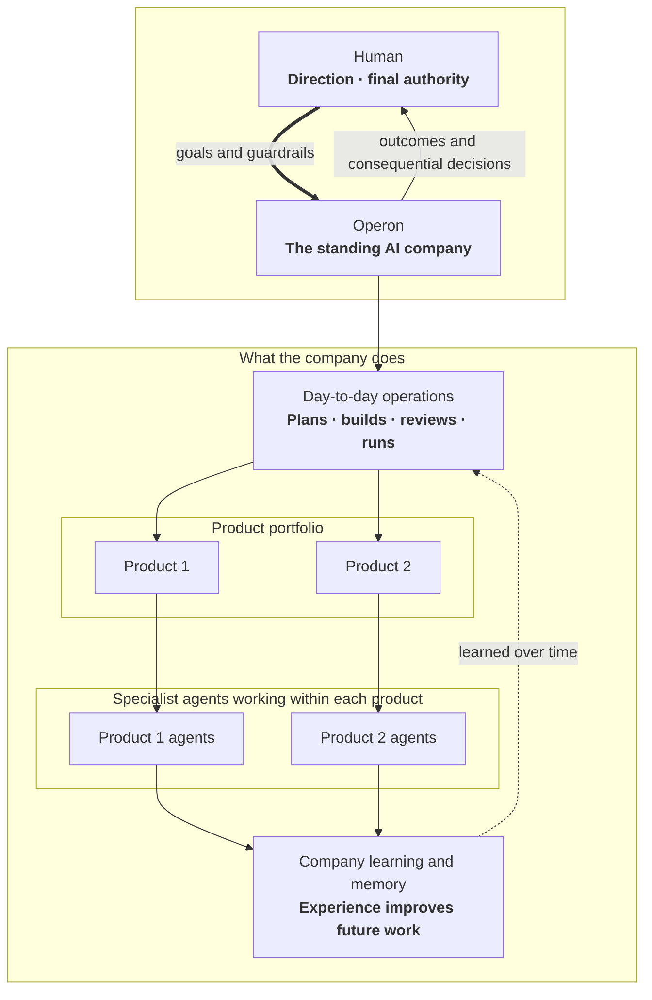

# Operon conceptual overview

Operon is an installable **org runtime**: a standing AI company that develops
and operates a portfolio of independent software products. One human leads the
company by setting goals and guardrails and by making the critical decisions.
Operon handles the day-to-day work needed to turn that direction into software
outcomes.

Read the diagram as an organization, not as an implementation architecture.
The human runs the company rather than its task queue. Operon coordinates the
routine planning, building, independent review, and operation of each product,
while returning consequential decisions and visible outcomes to the human.

Each product remains independent and has agents working in its own context.
Their experience feeds a shared company learning and memory system, so lessons
from real work can improve how the company operates over time without erasing
the boundaries between products.
