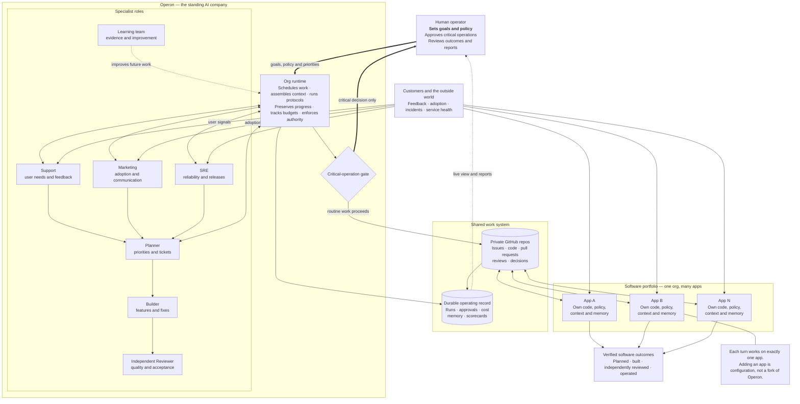

# Operon conceptual overview

Operon is an installable **org runtime**, not an application. One human directs
a standing AI company that develops and operates a portfolio of independent
software products. The team handles routine work autonomously; the human keeps
final authority over policy and critical operations.

## How to read it

1. The human supplies goals, organizational policy, and genuine high-impact
   decisions—not day-to-day scheduling or retry supervision.
2. Operon turns those goals and incoming product signals into coordinated work
   across specialist AI roles. The Builder and Reviewer remain independent.
3. GitHub holds the inspectable work artifacts for each product, while Operon
   keeps the durable operating record needed for continuity, governance, cost
   control, and learning.
4. Every application remains a separate product repository with its own
   context and policy. Operon can manage many apps, but a single role turn is
   always scoped to one app.
5. Routine, reversible work proceeds autonomously. Production deploys and
   other critical operations return to the human through the approval gate.
