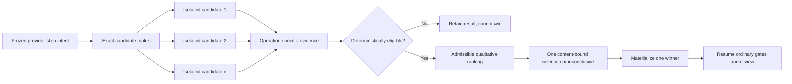

# How Cormidia derived validation for comparative execution

Status: standalone tutorial; derivative and non-normative  
Feature status: direction owner-confirmed; implementation contract proposed; implementation pending  
Source snapshot: comparative-execution design and validation corpus dated 2026-08-01

## The question this guide answers

Comparative execution sounds simple: run several harness–model–effort combinations on
the same work, check their outputs, ask a model which is best, and keep the winner. The
hard part is not producing several answers. The hard part is making the result mean
what it appears to mean.

This guide reconstructs how the validation design was derived. It is deliberately not
a tour of validation files and not an implementation specification. Its subject is the
reasoning chain:

> product promise → possible harm → invariant → ownership boundary → contract clause
> → cheapest detector → remaining uncertainty

That chain matters because a plausible leaderboard can be wrong in several different
ways. Candidates might not have received the same task. A losing candidate might have
changed the repository. A crash might charge twice or discard useful work. A polished
but incorrect answer might win. A report might call an advisory judgment “selected.”
The validation design must make each of those failures either impossible, detectable,
or explicitly inconclusive.

## 1. Begin with the right unit of comparison

The first design correction was to compare **one planned provider turn**, not an
entire episode. A provider turn is the atomic invocation of a harness with a model and
an effort setting for a particular role and operation. An episode still has one
outcome and one route; only the chosen step fans out temporarily.

For example, a Builder step may run three declared candidates:

- Codex + model A + high effort;
- Claude Code + model B + high effort;
- the same harness and model as the first candidate, but a second declared sample.

Each candidate receives the same frozen problem, base revision, authority, expected
output, and selection policy. Only its exact assignment tuple and optional sample
index may differ. Cormidia does not silently manufacture a Cartesian product of every
harness, model, and effort value.

This correction determines almost everything downstream. A per-episode tournament
would duplicate planning, review, approvals, publication opportunities, and GitHub
effects. A per-turn comparison can keep the fan-out inside a narrow inert region and
return one artifact to the ordinary episode. The comparison therefore has a precise
shape:

The diagram contains the first validation claim: **fan-out is temporary and
effect-inert; continuation is singular**. The system is not validated merely by
showing that three providers ran.

## 2. Turn the product promise into one observable journey

The validation map names the end-to-end outcome **J-19, per-turn comparative
execution**. A journey is a user-visible result that can fail even if every individual
function appears locally correct.

J-19 says that one frozen provider-step intent becomes bounded, exact candidates in
isolated workspaces; each candidate produces operation-specific evidence; eligibility
precedes any qualitative judgment; the system reaches either one content-bound winner
or an explicit inconclusive outcome; and each candidate and judge turn settles
separately. In standalone mode the same journey starts from a local repository and the
Cormidia binary rather than from an org or EpisodePlan.

The journey yields five acceptance families:

1. **Success:** identical bound inputs lead through isolated turns and evidence to one
   durable selection and materialization acknowledgment.
2. **Refusal:** unsafe repositories, invalid or undeclared tuples, unavailable
   capabilities, inadequate budget, all-ineligible results, or an inadmissible judge
   stop before an effect or end explicitly inconclusive.
3. **Interruption:** process death at candidate start, settlement, evidence capture,
   selection, or materialization cannot leak a losing lane into continuation.
4. **Recovery:** replay resumes only unsettled work, never charges twice for a settled
   turn, and never silently chooses a new winner.
5. **Equivalent entry surfaces:** EpisodePlan and standalone CLI adapt to the same
   comparison and result contract. Standalone preview spends no tokens, execution
   leaves the active branch untouched, and Cormidia does not use GitHub on the user's
   behalf.

These are not test cases yet. They are observable obligations. That distinction
prevents the test framework from dictating the product semantics.

## 3. Ask what could hurt, not what is easy to assert

Cormidia's existing risk vocabulary has three exhaustive families. Comparative
execution did not need a fourth family; it creates new instances of all three.

### E-1: permission to effect

The danger is that a candidate intended only for comparison performs a real action or
gains more authority: it pushes, opens a pull request, merges, publishes, deploys,
executes an approval, changes the active checkout, or asks a human to widen its grant.

The comparative rule is therefore stronger than “losers are deleted later.” Every
candidate lane is effect-inert while it runs. Only one selected, content-bound artifact
may cross into ordinary continuation, and crossing the boundary grants no new
authority.

This risk traces to existing invariants such as authority never growing
(`CORMIDIA-INV-001`), critical effects remaining gated (`INV-002`), destructive scope
being contained (`INV-010`), agents not authenticating their own promotion
(`INV-012`), and uncertainty narrowing capability rather than widening it
(`INV-015`).

### E-2: durability and money

The costly failure happens between states: a provider finishes useful work, but the
process dies before Cormidia records the terminal or settlement. A naïve retry can pay
again, discard the first artifact, or compare a replacement draw as though it were the
original candidate.

The derived rules are consequently about conservation:

- every candidate, declared sample, retry, and judge call is an independently admitted
  provider turn;
- every started turn reaches one truthful terminal record and one settlement;
- unknown usage is not treated as zero;
- settled work is replayed from its durable record rather than regenerated;
- partial evidence survives ceiling exhaustion or interruption;
- aggregate comparison ceilings cannot hide the cost of constituent turns.

These obligations reuse the invariants for one-app/workspace coherence (`INV-004`),
exactly-once turn settlement (`INV-006`), durable write integrity (`INV-013`), and
preservation of considered work (`INV-014`).

### E-3: evidence truth

The most corrosive outcome is a confident but false story: the report says every
candidate was comparable, says a judge was qualified, says an artifact was selected,
or says downstream work was verified when none of those claims is true.

That produces a strict ordering:

1. collect and authenticate candidate evidence;
2. determine eligibility with deterministic and grounded clauses;
3. let a calibrated judge compare only eligible candidates;
4. apply a deterministic tie-break only within quality indifference;
5. durably record the selection;
6. materialize exactly that content;
7. run the ordinary downstream review and freshness gates.

The corresponding invariants require evidence not to outrun reality (`INV-008`),
review and merge to bind to the exact content (`INV-009`), model claims not to promote
themselves (`INV-012`), considered work not to disappear (`INV-014`), and uncertainty
to narrow claims (`INV-015`).

The important design consequence is **lexicographic selection**. A qualitative score,
lower price, faster completion, or smaller diff can never compensate for a failed
required gate. This is not a weighting preference; it is a safety boundary.

## 4. Locate the independently failing seams

A validation boundary is an ownership seam at which either side can be correct while
the combined outcome is wrong. The useful test is: can an honest fake stand on one
side, honor its documented behavior, and still expose a bug in the other? If yes, the
boundary deserves its own contract and fault tests.

Comparative execution adds two boundaries.

### B-18: coordinator to isolated candidates

The coordinator owns the frozen intent, candidate identities, admission, journal, and
ceilings. Each candidate lane owns one execution and isolated workspace or artifact
namespace. Neither side alone can guarantee fair comparison.

The boundary can fail through:

- a candidate receiving a different base, context, authority, or expected output;
- silent substitution of a harness, model, effort, or sample index;
- a candidate seeing a sibling's artifact or selection state;
- a candidate attempting an outward effect;
- a provider finishing useful work before a crash hides its terminal or usage;
- budget exhaustion after some candidates complete;
- cleanup escaping the comparison namespace;
- a duplicate invocation creating a second paid turn for the same candidate identity.

Those failure modes become the clauses of `CORMIDIA-C-B18-001`. Candidate identity is
`(comparison_id, assignment_tuple, sample_index)`. Inputs and policies are immutable
after spend begins. Each output carries content and evidence-bundle hashes. Missing
evidence makes a candidate ineligible; it does not become an empty result or a zero
score. V1 executes candidates sequentially and pessimistically admits the aggregate
ceiling before the first turn, then rechecks before each subsequent turn.

An honest B-18 fake can use real temporary git repositories and worktrees with mocked
provider adapters. It can crash at selected points, report partial usage, attempt
forbidden effects, or return stale hashes. This proves the coordinator's isolation,
identity, refusal, settlement, and recovery behavior against scripted boundary
failures. It does **not** prove that a real provider still implements session binding,
usage reporting, or gate hooks correctly; those remain the existing adapter
conformance obligations.

### B-19: durable selection to materialization and continuation

The selector owns eligibility, judge admissibility, tie-break policy, and the immutable
selection record. The materializer owns moving exactly one selected artifact into the
episode output or a standalone local branch. A valid ranking does not prove correct
materialization, and correct git plumbing does not prove that the choice was
admissible.

This seam can fail through:

- corrupt or missing evidence being treated as valid;
- advisory judge output being treated as an admissible selection;
- a content hash changing between selection and materialization;
- two candidates, or a losing candidate, crossing the boundary;
- a moved or dirty base being overwritten;
- process death after branch creation but before acknowledgment;
- replay selecting again or creating a second winner;
- cleanup deleting a materialized winner;
- a report collapsing `selected`, `materialized`, and `downstream_verified` into one
  claim.

These become `CORMIDIA-C-B19-001`. The selection record is durable before winner bytes
move. Materialization is idempotent by comparison ID, selected content hash, and
destination identity. A matching already-created artifact is acknowledged; a
conflict stops with a typed refusal or ambiguous state. Standalone materialization
creates a new local winner branch without checking it out, touching the active branch,
pushing, opening a pull request, or contacting GitHub through Cormidia.

An honest B-19 fake can use real temporary git objects, durable journals, and kill
points. It proves exact-content movement, replay, crash reconciliation, and truthfully
separated status claims. It does **not** establish that an LLM judge makes good
choices; judge quality is a separate statistical question.

## 5. Derive evidence from the operation, not from a universal score

“Quality” is not one property. A Builder, Planner, Reviewer, SRE, Support, or
Marketing turn has a different output contract. The comparison therefore binds a
versioned operation-specific policy containing required evidence, hard eligibility
clauses, a qualitative rubric, judge assignment, tie-breakers, and fallback behavior.

For a Builder turn, deterministic and grounded evidence includes required gates,
tests, typechecking, a criterion-to-test map, the actual diff, documentation updates,
scope checks, and mutation checks. Qualitative axes include intent correctness, test
depth, documentation adequacy, maintainability, and implementation economy.

That split answers a subtle question: documentation is neither merely a Boolean test
nor merely a matter of taste.

- A required documentation surface being absent can be a hard eligibility failure.
- Evidence that the relevant public contract changed can be checked against the diff
  and repository rules.
- Whether the explanation is adequate, clear, and proportionate is a qualitative
  comparison among otherwise eligible candidates.

The same pattern applies elsewhere. A Reviewer must bind findings and citations to the
exact reviewed content. An SRE result needs typed operational outcomes and grounded
evidence. Audience-facing work needs source provenance. A generic score would pool
unlike risks and allow excellence in one dimension to hide a missing obligation in
another.

## 6. Separate the judge's envelope from the judge's ability

The selection judge is call site **S-8**. Two different things must be validated.

### The deterministic envelope: L1 and L2

The system can enforce, without trusting the model, that the judge receives:

- the complete eligible candidate set and no ineligible candidate;
- stable anonymous candidate IDs rather than provider identities;
- the same frozen operation rubric and deterministic evidence for every candidate;
- no sibling or hidden metadata that creates an unfair advantage.

The system can also require one structured result with criterion-level reasons,
evidence citations, confidence or disagreement data, and exactly one terminal marker.
Unknown candidates, missing citations, malformed output, multiple winners, or an
attempt to promote a deterministic failure cannot select a winner.

These checks prove that code constrains the judge and interprets its response safely.
They do not prove that the judge recognizes a subtle correctness error or resists
polished prose.

### The statistical ability: L4

Judge quality needs a committed meta-evaluation corpus. Its required families include:

- must-catch comparisons with planted correctness, evidence-fabrication, scope,
  documentation, test-depth, or maintainability defects;
- clean and genuine-tie controls to measure false selection;
- reversed candidate ordering and blinded-identity controls;
- expensive, verbose, or polished-but-worse lures;
- missing or contradictory evidence that should produce abstention or an inconclusive
  result;
- a deterministic-gate failure the judge must never promote.

The metrics follow directly: serious-defect preference, false-selection rate on clean
or tied work, order invariance, citation validity, abstention accuracy, and resistance
to irrelevant cost or polish.

The corpus must be committed before prompt tuning. Otherwise the same observed
failures can shape both the judge and the exam, producing a grader tuned to itself.
Results remain keyed by operation, candidate tuple set, and judge tuple; Builder and
Planner quality are not averaged into one flattering number.

At the 2026-08-01 snapshot, this is intentionally **not qualified**. The S-8 golden-set
directory is a truthful empty scaffold. Its case file is empty. Finding `F-PT-011`
keeps the corpus size, thresholds, aggregation rule, and sampling design open for
human ratification. Consequently:

- data collection may proceed;
- every threshold-dependent outcome is `inconclusive`;
- judge scores are inadmissible for automatic materialization;
- a unique mechanically eligible candidate may still be selected under policy;
- multiple eligible candidates must follow an explicit non-judge fallback or remain
  inconclusive;
- standalone mode retains valid results and requires explicit local selection.

This is an example of the “no green by absence” rule. An empty suite is not a passing
suite, and three impressive demonstrations are observations rather than calibration.

## 7. Choose the cheapest layer that can falsify each claim

The layer is selected by the question being asked, not by how realistic a tool feels.
The guiding rule is: use the cheapest layer that can honestly make the defect occur.

| Layer | Comparative-execution question | Representative detector | What it proves | What it does not prove |
|---|---|---|---|---|
| L1 — invariant/contract | Can pure policy, identity, state, and reporting logic admit an illegal outcome? | Seed one candidate with a failed required gate and a higher judge score; assert automatic selection refuses it. | Eligibility precedes preference in the code path; malformed or inadmissible outputs fail closed. | Real worktree isolation, crash recovery, provider behavior, or judge ability. |
| L2 — hermetic composition | Do independently correct components preserve the contract across files, git, processes, and crashes? | In a real temporary repo, kill a candidate after useful output but before terminal acknowledgment; replay and assert one settlement, retained evidence, sibling isolation, and no outward effect. | Orchestration, durable state, idempotency, exact-content materialization, and recovery against scripted faults. | Live vendor authentication, protocol drift, real usage semantics, or broad stochastic quality. |
| L3 — live sandbox | Does a changed real adapter still honor the invocation seam no fake can prove? | For an adapter-affecting change, execute the bounded provider conformance campaign under reviewed authorization and spend limits. | That provider/harness seam for the authorized run. | General regression coverage, all providers, or whether one candidate is better. A live run is evidence, not a regression suite. |
| L4 — model evaluation | Does the S-8 judge make calibrated operation-specific choices across a committed distribution? | Run seeded defects, clean/tie controls, order swaps, identity blinding, lures, citations, and abstentions against human references. | Statistical performance for the admitted corpus, tuple, thresholds, sample size, and aggregation rule. | Runtime enforcement, safety guardrails, universal model quality, or any pass/fail claim while F-PT-011 is open. |
| L5 — operational behavior | Does automatic sampling or concurrency remain fair, bounded, durable, and affordable under time and contention? | Once those modes exist, exercise sticky sampling distribution, simultaneous candidates, settlement contention, retained-state growth, and hard cost ceilings. | Behavior of the operational policy under the declared workload and duration. | A timeless guarantee outside that workload. It is not owed for explicit sequential V1. |

Two consequences are easy to miss.

First, standalone mode does not automatically require a new L3 campaign. It is an
adapter over the same local comparison engine, and local repository semantics can be
falsified honestly at L2 with real temporary git. L3 is triggered only if a real
provider invocation seam changes.

Second, V1 does not owe a new L5 campaign simply because it runs several candidates.
Explicit tuples, canonical sequential order, and hard per-comparison ceilings are
falsifiable at L1/L2. Cormidia-owned sampling or parallel execution changes the question
and must re-enter risk allocation before implementation.

## 8. Make every detector prove that it can fail

Every new detector family must include a negative control: deliberately seed the
violation and show the detector turns red before relying on its green result.

Examples for this feature include:

- change one candidate's frozen base hash and confirm comparison identity validation
  refuses execution;
- let a candidate write outside its workspace and confirm the gate denies and
  disqualifies it;
- return two terminal records for one candidate and confirm settlement conservation
  detects the duplicate;
- remove a required evidence bundle and confirm the result becomes ineligible rather
  than zero-scored;
- give the judge a deterministic-failure candidate and confirm the envelope rejects
  any attempt to select it;
- change the selected artifact after the durable record and confirm materialization
  refuses before mutation;
- crash after creating the winner branch but before acknowledgment, then confirm
  replay recognizes the exact hash rather than creating or choosing again;
- render an advisory result as “selected” in one surface and confirm cross-surface
  truth checks fail.

This rule tests the harness itself. Without a seeded violation, a green assertion can
mean “the product is correct,” “the fixture never reached the dangerous branch,” or
“the detector is disconnected.” Negative controls distinguish those possibilities.

## 9. Derive the case families and check closure

Only after journeys, risks, boundaries, and contracts exist does the design mint
detector families:

- `CF-J19-S/R/I/RC/A` cover success, refusal, interruption, recovery, and equivalent
  entry adapters;
- `CF-SM-COMP-*` covers legal state transitions, immutable hashes after spending
  begins, idempotent replay, and crash sweeps;
- `CF-B18-*` covers frozen inputs, tuple identity, admission, settlement, isolation,
  and denied effects;
- `CF-B19-*` covers eligibility precedence, admissibility, tie-breaks, exact winner
  movement, retry, and stale destination refusal;
- `CF-C-B18` and `CF-C-B19` resolve every canonical contract clause;
- `CF-IF-COMPARE` covers the standalone parse/preview/confirm/result/materialization
  interface and its no-org/no-GitHub promise;
- `CF-S8-env` covers the deterministic judge envelope;
- `CF-S8-qual+judge` covers the statistical meta-eval;
- `CF-OPS-COMP` is explicitly not applicable to sequential V1 and must be reconsidered
  for automatic sampling or parallel candidates.

The catalog claims **matrix closure**, not implementation coverage. Closure means
every derivation cell contains a family or a named reason such as structurally not
applicable, duplicate coverage, deliberately thin coverage, or a blocked finding. It
prevents a requirement from disappearing silently. For the comparison families the
catalog explicitly says “design-only”; closure does not turn them green.

## 10. Worked derivation: “documentation quality matters”

The user's correction that validation includes documentation—not only deterministic
checks—is a useful complete example.

### Step 1: state the product claim

For a Builder comparison, the selected change should satisfy the requested behavior
and leave the repository's affected documentation adequate and truthful.

### Step 2: name the possible harms

- A candidate changes a public contract but does not update the required docs.
- A candidate adds polished docs that describe behavior the code does not implement.
- A judge prefers verbosity or presentation over correctness.
- The final report says docs were validated when it merely saw files named `docs/*`.

These are primarily E-3 evidence-truth failures, with E-1 implications if a misleading
artifact is allowed to cross into normal continuation.

### Step 3: split enforceable eligibility from qualitative merit

Repository rules and changed public surfaces can determine whether a docs update is
required. Presence, location, relevant diff, and any deterministic documentation
validation can be hard evidence. Missing required documentation makes the candidate
ineligible.

Adequacy is different. Given two eligible candidates, one explanation may be clearer,
more precise, and more proportionate. That belongs in the Builder rubric under
documentation adequacy, grounded in the actual code diff, tests, and claimed behavior.

### Step 4: bind the evidence at B-18

Every candidate produces its diff, validation results, criterion-to-test mapping, and
documentation evidence under hashes. Missing or corrupt evidence is not silently
interpreted as “no documentation needed.”

### Step 5: constrain selection at B-19 and S-8

The judge sees only eligible candidates, the same rubric, and the same form of
evidence. Provider identity and ordering are blinded. It must cite evidence for its
documentation judgment. A verbose but incorrect candidate is a required lure in the
S-8 corpus.

### Step 6: place the checks

- L1 tests whether required-doc rules, evidence schema, eligibility precedence, and
  advisory-result handling are fail-closed.
- L2 uses repository fixtures where public interfaces change, docs are missing or
  stale, and evidence hashes disagree.
- L4 uses human-validated pairs: missing required docs, inaccurate docs, clear but
  concise docs, and verbose polished lures.
- No special L3 check is needed unless the relevant provider adapter contract changed.

### Step 7: state the proof limit

L1/L2 can prove that required documentation evidence is collected and that a missing
requirement cannot be outweighed. They cannot prove nuanced writing quality. L4 can
estimate the judge's ability on the ratified distribution, but until the S-8 corpus
and thresholds are ratified, it cannot authorize automatic selection. The honest
current verdict is therefore: **mechanical protection is designable now; qualitative
promotion remains inconclusive**.

## 11. Worked derivation: standalone mode is the same engine

The standalone promise is “given a safe local git repository, a Cormidia binary,
credentials, a task and policy, exact candidate tuples, budget, and confirmation, run
the same comparison without a Cormidia org.”

The tempting implementation would be a second lightweight engine. Validation rejects
that split because two engines would permit semantic drift: different eligibility,
different settlement, or a showcase mode that silently relaxes safety.

Instead, EpisodePlan and the CLI are adapters over J-19 and module M16. This creates
several falsifiable equivalence claims:

- both bind the same frozen intent and exact tuple identities;
- both use the same candidate and selection state machines;
- both distinguish advisory ranking, durable selection, materialization, and
  downstream verification;
- both account for candidate and judge turns separately;
- both deny outward candidate effects.

Standalone adds adapter-specific restrictions: preview must be token-free; state and
worktrees live outside the active repository checkout; execution does not mutate the
active branch; Cormidia neither requires an org nor uses GitHub; materialization is a
separate, content-bound command that creates a local branch.

An L2 equivalence test can send one frozen fixture through both adapters and compare
the normalized comparison and result records. A real temporary repository can prove
the active branch and worktree remain unchanged. That is more probative than a live
demo for these claims because it can inject unsafe bases, dirty destinations, crashes,
and retries deterministically.

What remains unproved is provider behavior. If standalone and org mode call an
unchanged, already-conformant adapter in the same way, no new live boundary exists.
If invocation semantics change, the existing bounded L3 adapter campaign is triggered.

## 12. Why implementation is sequenced this way

The backlog order is an argument about dependencies, not a feature-marketing roadmap.

1. **HB-090 — contracts and hermetic skeleton.** Build identities, the state machine,
   sequential isolation, settlement, evidence hashes, eligibility, durable selection,
   crash-safe materialization, and negative controls. This establishes the semantics
   every adapter must preserve.
2. **HB-091 — standalone Builder slice.** Exercise the shared engine through the
   smallest useful end-to-end adapter: a local repository, explicit tuples,
   preview-first execution, Builder evidence, reports, and explicit local branch
   materialization. This showcases Cormidia's value without importing org or GitHub
   complexity.
3. **HB-092 — EpisodePlan integration.** Add exact plan transport, app-narrowed policy,
   worst-case candidate-plus-judge admission, continuation, recovery, and shared
   observability. Ordinary Reviewer, gate, pull request, and merge behavior stays
   downstream.
4. **HB-093 — S-8 corpus and calibration.** Author human-grounded cases and collect
   data. Automatic judge-backed selection remains blocked by F-PT-011, even if the
   envelope and runner exist.
5. **HB-094 — Planner activation, sampling, and optional parallelism.** Only after the
   explicit sequential semantics are stable should Cormidia propose comparisons, sample
   them automatically, learn across episodes, or run candidates concurrently. Those
   changes re-enter risk allocation and may add L5 obligations.

This order prevents a compelling UI or adaptive policy from becoming the accidental
definition of unresolved safety and evidence semantics.

## 13. What can honestly be claimed today

The baseline validation harness was ratified on 2026-07-31 and its offline
implementation exists, though external evidence remains pending and release gating is
suspended. The 2026-08-01 comparative-execution revision is different: its direction
is owner-confirmed and its validation structure is recorded, but M16, J-19, B-18,
B-19, S-8, and their detector families are design-only.

The design revision itself was checked for internal integrity: policy parsing, the
existing offline suite, typechecking, build, and diff checks passed. Those facts show
that the documentation revision did not break the existing repository. They do not
show that comparative execution works.

In particular:

- no `cormidia compare` runtime or command is established by this design;
- exact EpisodePlan and CLI transport field names remain implementation work;
- no new J-19/B-18/B-19 executable detector evidence exists yet;
- the S-8 corpus is intentionally empty;
- F-PT-011 keeps automatic judge-backed selection inadmissible;
- no live, eval, soak, or comparison campaign ran for the design revision;
- sequential explicit V1 has no new L5 requirement, while automatic sampling or
  parallel execution must be redesigned and reallocated before implementation.

The present achievement is therefore not “comparison is validated.” It is more
specific and more useful: **every material claim has an owner, a contract, a cheapest
falsifying layer, a named detector family, and an explicit proof limit.**

## 14. A reusable derivation checklist

For any implementation decision in this epic, walk the chain in order:

1. What exact provider turn and operation are being compared?
2. Which inputs, base, authority, expected outputs, policies, and tuple identities are
   frozen?
3. Which harm family applies: unauthorized effect, lost/duplicated work and money, or
   false evidence?
4. Which existing invariant would be violated?
5. Does the behavior cross B-18, B-19, or an existing provider/git boundary?
6. What contract clause makes success, refusal, interruption, and replay observable?
7. Which part is mechanically enforceable eligibility, and which part is qualitative
   merit?
8. What is the cheapest layer that can make the defect occur honestly?
9. What seeded violation proves the detector can turn red?
10. What does a green result still not establish?
11. Is a human-owned threshold, sample design, or product truth still open?
12. Does the report distinguish planned, executed, eligible, advisory, selected,
    materialized, and downstream-verified?

If an answer requires guessing a new product truth, the correct result is a finding
and a blocked detector—not an accommodating fixture.

## Appendix A — compact vocabulary

- **Assignment tuple:** one exact harness, model, and effort combination.
- **Sample index:** a declared independent provider draw for the same tuple; it is a
  separate paid turn, not a retry.
- **Eligibility:** satisfaction of required deterministic and grounded clauses.
- **Admissible judge:** an exact judge prompt/model/rubric/corpus/threshold/sample
  configuration approved by policy for automatic selection.
- **Materialization:** moving exactly the selected content into the episode output or
  a standalone local winner branch.
- **J-19:** the full per-turn comparative-execution journey.
- **B-18:** comparison coordinator ↔ isolated candidate lanes.
- **B-19:** durable selection ↔ materialization and continuation.
- **S-8:** the LLM selection-judge call site.
- **E-1/E-2/E-3:** permission-to-effect, durability-and-money, and evidence-truth risk
  families.
- **L1–L5:** contract logic, hermetic composition, live dependency seams, statistical
  model evaluation, and operational behavior.
- **Matrix closure:** every derived cell has a detector family or a named disposition;
  it is not a claim that the detector has been implemented or passed.

## Appendix B — source and coverage record

This tutorial was synthesized from 20 files in the 2026-08-01 design snapshot. It is
derivative; when wording conflicts, the repository's ratified policy and decision log
remain authoritative.

| Role in this tutorial | Sources used |
|---|---|
| Product direction and non-negotiable principles | `docs/PURPOSE.md`; `docs/comparative-execution/design.md` |
| Corpus routing, module/journey map, and design status | `validation-design/README.md`; `validation-design/scope-and-module-map.md`; `validation-design/system-map.md`; `validation-design/harness-design-state.md` |
| Guarantee chain and ownership seams | `validation-design/invariants.md`; `validation-design/boundary-map.md`; `validation-design/contracts/B-18-comparison-candidates.md`; `validation-design/contracts/B-19-selection-materialization.md`; `validation-design/contracts/journey-acceptance.md` |
| Risk-to-layer and judge derivation | `validation-design/risk-allocation.md`; `validation-design/llm-eval-plan.md`; `validation-design/case-catalog.md`; `validation-design/validation-policy.yaml` |
| Delivery order and decision provenance | `validation-design/harness-backlog.md`; `validation-design/elicitation-log.md` |
| Golden-set commitment and current S-8 truth | `validation-design/golden-sets/README.md`; `validation-design/golden-sets/selection-judge/README.md`; `validation-design/golden-sets/selection-judge/cases.json` |

Explicit exclusion: `archive-do-not-read/**` was not read, cited, run, or used as a
design source. No unresolved contradiction was found among the selected sources. The
apparent status difference is intentional layering: the 2026-07-31 base harness is
ratified and implemented, while the 2026-08-01 comparative extension is
owner-confirmed, proposed, and design-only. The empty S-8 case file is treated as an
honest absence of qualification evidence, not as coverage.
