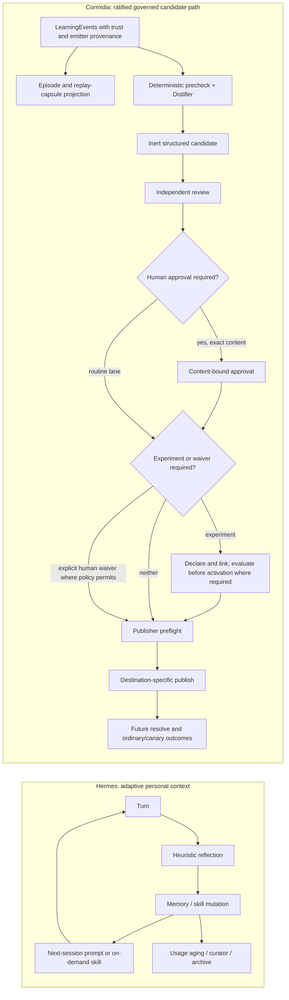

# Cormidia and Hermes Agent learning: architecture comparison

*2026-08-02. Reader-guide mode: tutorial with an evaluative comparison.
Descriptive research, not a proposal to change Cormidia's ratified learning
contract.*

## Executive answer

Hermes and Cormidia both preserve useful experience while controlling context
cost, but they optimize for different units of trust.

- **Hermes optimizes a personal agent.** It lets the same agent remember facts,
  build procedures, search its past, reflect after work, and archive stale
  skills. Learning is fast and local, with optional human approval and strong
  storage hygiene.
- **Cormidia optimizes a governed organization.** The ratified path keeps
  candidates inert through independent review, proportional human authority,
  and deterministic publication. When efficacy is claimed, a declared
  experiment and its result distinguish authorization from validation.
  Learning is slower because it is designed to make organizational behavior
  auditable and reversible.

The systems are therefore complementary, not substitutes. Hermes is strongest
as a context-and-procedure engine inside an execution harness. Cormidia is
strongest as the authority, evidence, deployment, and outcome layer around a
standing team.

## Terms and units

| Question | Hermes answer | Cormidia answer |
| --- | --- | --- |
| What is observed? | Conversation history, user corrections, tool-loop experience, skill usage | Orchestrator/verifier/resolver/publisher events, gates, approvals, run outcomes, human corrections |
| Smallest capture unit | Turn/iteration or persisted message | `LearningEvent` tied to an `episode_id` |
| Unit of outcome | Informal later usefulness | `EpisodeRecord`—ticket, incident, feedback item, campaign, scheduled work, or a generic turn |
| Unit of proposed change | Memory entry or skill-package mutation | Structured `CandidateArtifact`; the scheduled store path is create-only, but other writers/filesystem mutation can overwrite it, invalidating an existing approval binding and potentially leaving a stale review |
| Unit of active knowledge | Prompt memory entry or offered skill | Governed bundle concept, unexpired human provisional, and—currently—legacy `memory/**` at lowest precedence |
| Unit of deployment | File mutation visible to later sessions | Destination-specific: journaled OKF activation, GitHub ticket, local proposal file, or rejection record |
| “Validated” means | No distinct native state | A declared experiment ended `improved` with guardrails satisfied |

Cormidia's vocabulary matters because it separates states and claims that Hermes
normally combines:

1. **recorded**—a durable artifact exists;
2. **published**—a destination artifact has been materialized;
3. **authorized**—the right authority allowed the intervention;
4. **active**—the resolver can select it for work; and
5. **validated**—an experiment supports the claim that it improved outcomes.

These are not one simple ladder. `authorized` and `validated` are evidence
claims, while intervention records have their own lifecycle; a T0/T1 concept
may be active and authorized while explicitly unproven.

## The two loops

The Cormidia half shows the ratified path. The current executable gate accepts a
linked, merely declared experiment before publication; only an `improved`
result earns the later `validated` claim. The current CLI linkage and other
implementation gaps are called out below.

The shortest contrast is:

> Hermes learns by editing future context. Cormidia learns by governing and
> measuring an intervention.

## Side-by-side architecture

| Dimension | Hermes at the pinned snapshot | Cormidia in this checkout | Consequence |
| --- | --- | --- | --- |
| Primary user | One persistent personal agent/profile | A standing multi-role software organization | Hermes can privilege immediacy; Cormidia must privilege authority separation |
| Learning topology | Several cooperating stores and background jobs, not one state machine | Capture branches into episode/capsule projection and scheduled distillation; reviewed candidates then pass experiment/approval/publish gates | Cormidia can make state claims mechanically; Hermes is easier to adapt informally |
| Mutation authority | Foreground agent writes memory/skills by default; approval is optional | Scheduled Distiller creates structured candidates; role agents currently emit free-form notes; deterministic publisher alone applies published destinations and activates bundle concepts | Hermes trusts the active agent more; Cormidia still has migration exceptions |
| Reviewer independence | Usually the same model/runtime reflects on its own work; a different auxiliary model is optional | Distiller and Learning Reviewer are deliberately cross-provider | Cormidia reduces correlated judgment errors |
| Evidence provenance | Conversation supplied to the reflector, local usage timestamps, user edits | `LearningEvent` trust (`trusted`/`untrusted`/`legacy`) plus emitter provenance and episode projections; agent prose is intended as advisory but ordinary role notes are currently disconnected from scheduled distillation | Cormidia has an explicit trust model, though not every intended input is wired |
| Outcome evidence | No native treatment/control or regression verdict | Deterministic checks, paired replay, and human-started episode-sticky canary | Only Cormidia defines a causal path to `validated` |
| Risk model | Integrity scans, ownership, optional approvals, pins, archives, backups | T0–T3 tiers, content-bound approval, destination/scope policy, T3 canary prohibition | Cormidia scales intervention friction with blast radius |
| Publication | Write the memory file or skill package | Candidate stays outside active bundles; OKF publication is journaled and crash-resumable, remaining fail-inert until a manifest-history cut | Cormidia makes partial or stale activation harder without pretending the multi-step transaction is one atomic file write |
| Scope | Hermes profile plus optional provider-specific session key | `org`, `role`, `app`, and `app+role`; narrower `topic_key` wins before budget | Cormidia prevents a local lesson becoming global by accident |
| Context selection | Two tiny memory files plus progressively disclosed skills and session search | Deterministic scoped resolver with a 16 KiB combined governed-and-legacy memory budget, governed concepts first, plus episode/turn pinning | Both bound prompt cost; Cormidia's intended lineage is stronger than every current input path |
| Cache policy | Freeze one system prompt; defer ambient visibility of mutations; same-model review reuses prefix | Governed concepts have deterministic serialization, version cuts, and explicit stable/canary lineages; prompt-active legacy memory can still change outside that version policy | Hermes favors warm continuity; Cormidia's governed path accepts cold cuts, but the legacy path weakens cache-lineage control |
| Cost funnel | Cadence-based reflection; LLM consolidation off by default; deterministic archive | Zero-token capture/prechecks, dedupe/suppression, capped distill/review, targeted eval, then replay/canary | Both defer expensive model work; Cormidia accounts spend per governed stage |
| Compaction | Automatic stale/archive; optional LLM umbrella consolidation | Report-only recommendations; human executes compaction in V1 | Hermes grants more autonomous library maintenance |
| Rollback | Restore backups/archived skills; prompt state changes on a later rebuild | Deprecate concepts and append a new manifest cut; canary stop also attempts to update its intervention record | Cormidia preserves manifest history, though generic disable/rollback can leave intervention-record status stale |
| External memory | One optional provider with best-effort lifecycle hooks | No external-provider authority, but governed concepts, human provisionals, and prompt-active legacy memory currently coexist | An external Hermes provider must not become another bypass around Cormidia's publisher |

## Where Cormidia is materially stronger

### 1. Authority is separated from generation

Hermes lets the foreground model call `memory` or `skill_manage`; the approval
switches default off. Autonomous background skill edits have useful ownership
and read-before-write restrictions, but the same product still proposes and
performs the mutation.

The ratified Cormidia path makes a learned change a candidate outside the active
bundle. Scheduled distillation—not ordinary role prose—creates the structured
candidate consumed by the pipeline. Its Learning Reviewer is independent of
the Distiller, and the deterministic publisher rechecks the reviewer, scope,
tier, destination, suppression state, experiment requirement, approval hashes,
base manifest, and final bytes. The approval is single-use and bound to the
exact content being published. That `ApprovalStore` binding protects publish/
activation; direct operator commands for canary start/promote/stop, disable,
and rollback are human-operated gates but do not create the same content-bound
approval record.

That claim must be kept narrower than “the publisher writes every protected
learning record.” Dedicated modules legitimately write reviews, experiments,
eval results, provisionals, and canary state. The publisher is the sole
destination publisher and bundle activator. Current exceptions also exist:
legacy memory remains agent-writable because of a missing gate rule, and a
human-denial helper writes denial lessons directly into legacy role memory.

### 2. Evidence has an explicit trust model

Hermes reflection reasons over a transcript. That is useful but makes the
model both narrator and judge.

Cormidia labels `LearningEvent.trust` as `trusted`, `untrusted`, or `legacy` and
treats agent-emitted/self-reported evidence as advisory based on its emitter.
It captures many events from owned runtime seams. Required evidence that is
absent is recorded as a gap rather than silently interpreted as zero or
success. Events project into episodes, and build episodes can produce replay
capsules. A
`SystemFingerprint` is computed independently from package, org/app, model,
configuration, environment, budget, and bundle lineage. Those records give
later comparison a stable treatment and environment description.

### 3. Efficacy is distinct from permission

Cormidia permits a T0/T1 fact to be human-authorized without claiming it is
proven. Any efficacy claim—and a T2/T3 behavior change unless an explicit
human waiver is allowed and recorded—requires an `ExperimentRecord`. The only
result that supports a validated efficacy claim is `improved`;
`inconclusive`, `not_evaluatable`, missing evidence, or an invalid grader
cannot turn green by absence. At this snapshot, however, the publisher checks
for a declared linked record rather than requiring the experiment to have
already reached that result.

Hermes has no equivalent experiment state. Skill use counts and survival in
the library indicate activity, not better outcomes.

### 4. Deployment and rollback preserve lineage

Cormidia stores candidates, reviews, approvals, experiments, interventions, and
manifest history as distinct records. An OKF concept written during a partial
publish cannot become active unless manifest history names it. The journaled
multi-step transaction is crash-resumable rather than globally atomic.
Resolved context is pinned to an episode and role, and canary assignment is
deterministic and episode-sticky. Disable and rollback deprecate concepts and
append new manifest history rather than rewinding a stable pointer or erasing
why a version existed. Those generic operations do not currently update the
matching `InterventionRecord`, so its status/rollback fields can disagree with
the manifest; canary stop is the path that attempts that linkage.

This strongest lineage applies to OKF activation. Ticket publication creates a
GitHub issue; proposal destinations currently write local Markdown under
`learning/proposals/` rather than the PR promised by the design; rejection has
its own ledger. Those paths do not all create an `InterventionRecord` and
manifest cut.

Hermes's archive and snapshots provide good operational recovery, but a
restored directory is not the same as Cormidia's content-bound, auditable
lineage and append-only manifest history. Cormidia's chain is not wholly
immutable either: intervention and some review records have deliberate update
paths.

## Where Hermes is materially stronger or simpler

### 1. It has a practical three-temperature memory hierarchy

Hermes cleanly separates tiny ambient facts, on-demand procedures, and
searchable episodic history. Cormidia has a bounded scoped context resolver and
durable event/episode stores, but it does not expose the same general-purpose
personal session-search and progressive skill-loading experience to every
role.

### 2. It measures procedural-library use directly

Hermes records view, use, patch, and activity timestamps, then deterministically
moves cold skills through active → stale → archived. Pins, cron references,
protected built-ins, restores, dry-runs, and pre-run backups make this usable
day to day.

Cormidia's compaction is intentionally report-only. That is safer for a governed
organization, but it provides less automatic housekeeping.

### 3. It makes explicit teaching cheap

`/learn` reuses the normal agent and tools to turn files, URLs, or a
conversation into one skill. There is no extra pipeline or schema to operate.
That makes procedural capture accessible, although the result is authored
rather than validated.

### 4. It protects prompt-cache locality aggressively

Hermes freezes the system prompt even after a durable write and uses a
same-model reflection fork where possible. Cormidia also serializes context
deterministically and pins it per turn/episode; an approved governed version
cut intentionally creates a new cache lineage. Prompt-active legacy
`memory/**` can still change outside a manifest cut, so that cache discipline
does not yet cover every active input. The governed cold boundary is the cost
of making a governed change explicit.

## Cost and optimization compared

Both architectures follow the same economic instinct: spend tokens only after
cheap filters have identified useful work.

Hermes uses:

- hard prompt-memory caps;
- metadata-only skill indexes;
- on-demand full-text session search;
- 10-turn/iteration reflection cadence;
- same-model warm-cache reuse;
- deterministic curator pruning;
- opt-in expensive consolidation;
- lossy context compression when the active transcript grows.

Cormidia uses:

- deterministic event capture and recurrence clustering;
- no-model skip records when there is no evidence, the work is deduped, or a
  cap is reached;
- rejection suppression and rate limits;
- capped daily Distiller and weekly Reviewer runs;
- targeted evaluation before paired replay;
- small human-started canaries; T2 requires replay improvement first, while T1
  policy currently does not;
- ordinary app/org budget settlement plus learning-specific caps;
- a deterministic 16 KiB combined governed-and-legacy memory budget and stable
  serialization.

Hermes minimizes the marginal cost of maintaining one agent's continuity.
Cormidia minimizes the expected cost of safely changing a multi-agent
organization.

## What each system could borrow

These are observations, not ratified Cormidia changes.

### Hermes could borrow from Cormidia

- Stage autonomous memory/skill changes as inert candidates by default.
- Separate “approved to use” from “shown to improve outcomes.”
- Bind approval to the exact proposed diff and base state.
- Record an intervention lineage for each activated skill revision.
- Compare a changed skill against a stable arm before promoting broad behavior.
- Treat reflector output as advisory evidence, not ground truth.

### Cormidia could borrow from Hermes

- Progressive disclosure for larger procedural packages.
- First-class local session search as episodic recall, kept outside the prompt.
- Usage-based skill lifecycle telemetry with pins and recoverable archives.
- A dry-run plus automatic snapshot before any future compaction executor.
- A small explicit-teaching UX that still emits an inert Cormidia candidate.
- Cache-aware auxiliary work that reuses a stable model/tool/prompt identity
  when authority and experiment boundaries permit it.

The safest synthesis is asymmetric: use Hermes techniques to improve
retrieval, packaging, and maintenance, but retain Cormidia as the only authority
that can activate organizational learning.

## Cormidia status in this checkout

The ratified architecture and implemented state are not identical to fully
qualified evidence.

- `docs/PURPOSE.md` and the learning design record M1–M6 plus the closed-loop
  efficiency extension as built.
- The spec header still says “built through M5” and calls schemas draft. That
  header is stale; the higher-authority decision log, design header, and code
  show the later implementation.
- The replacement offline validation harness is implemented, but the current
  policy still treats Distiller/Reviewer quality thresholds as unresolved and
  the external L3/L4/L5 campaigns and soak as unrun. “Feature built” therefore
  must not be reported as “model-mediated learning effectiveness qualified for
  release.”
- The current code has known seams that matter to this comparison.
  [Issue #134](https://github.com/buildstacks-dev/Cormidia/issues/134) is a
  missing gate rule: agents can write prompt-active legacy `memory/**` outside
  the candidate path. Agent-authored free-form candidate notes likewise have
  no importer into the `LearningEvent`/structured-candidate path consumed by
  scheduled distillation. Human denial lessons are a deliberate second direct
  legacy-memory route.
- Candidate files are create-only through the scheduled store entry point,
  while an exported writer and ordinary filesystem access can overwrite them.
  A later byte change invalidates an existing approval binding but can leave a
  previously written review stale because that verdict lacks a content hash.
  App-scope candidates can live untracked in a disposable state-home clone;
  [issue #148](https://github.com/buildstacks-dev/Cormidia/issues/148) records
  that reset/repointing can lose them while an org-home review survives.
- Replay is currently build-ticket-only and candidate overlay accepts only
  `okf_concept`. The ordinary CLI declares an experiment without rebinding the
  content-bound candidate bytes to its `experiment_ref`, while publication
  requires that reference. Thus the normal efficacy/T2 pre-publish path is not
  fully connected at this snapshot, and later intervention/canary linkage has
  a related gap. Even when linked, current publisher preflight requires only a
  declared experiment record, not a completed `improved` result; an explicit
  human waiver can bypass the experiment for eligible non-efficacy T2/T3 work.
- Canary promotion throws below its T1/T2 sample floors or without a control,
  while the CLI exposes no human override. This conflicts with design prose
  promising human judgment rather than limbo after an inconclusive small
  canary.
- Deterministic evidence also has live defects: [issue
  #146](https://github.com/buildstacks-dev/Cormidia/issues/146) records repeated
  emission of an episode-scoped cap-stop signal, and [issue
  #156](https://github.com/buildstacks-dev/Cormidia/issues/156) records hardcoded
  retry/shell/reviewer-duration thresholds that can misclassify large apps.
- The ticket/role resolver logs and falls back to the turn-level context if
  its later resolve fails. That fallback may still contain governed concepts,
  but it can carry the wrong episode/role pin; Cormidia currently chooses
  availability over fail-closed learning lineage at that seam.
- OKF activation cuts occur per successful publish, not in the daily batches
  proposed by the design. Disable, rollback, canary stop, and promotion create
  other version cuts. High-churn learning events retain 180 days while derived
  and committed governance artifacts have different lifetimes.
- Policy accepts custom Distiller/Reviewer schedules, but trigger routing
  dispatches those roles only for the exact default schedule strings and the
  turn runner also requires equality with policy. The scheduled learning path
  is therefore not independently cadence-configurable as advertised.

Those caveats do not erase the architectural difference. They define where the
implementation still has to catch up to its own ratified authority and
evidence model.

## Source coverage and truth status

The canonical Cormidia learning-doc set comprised two files totaling 11,418
words:

- [learning-loop-design.md](../../docs/learning-loop/learning-loop-design.md)
- [learning-loop-spec.md](../../docs/learning-loop/learning-loop-spec.md)

The comparison also checked the higher-authority
[PURPOSE decision log](../../docs/PURPOSE.md), the
[episode contract](../../docs/episodes/contract.md), the two Mermaid flow
sources, the current modules under `src/org/learning/`, `src/org/turn-runner.ts`,
`src/org/context.ts`, `src/runtime/gate.ts`, the `cormidia learn` CLI, README
status/state inventory, and the replacement validation policy/catalog. Source
and decision-log status take precedence over stale prose as specified by the
repository instructions.

Hermes was compared at commit
[`9060e3c2d3d3f7f3a21c297b5617e06ff9237085`](https://github.com/NousResearch/hermes-agent/tree/9060e3c2d3d3f7f3a21c297b5617e06ff9237085)
using a 15-file, 49,817-word architecture set plus targeted implementation
checks. Primary Hermes sources were its
[memory](https://github.com/NousResearch/hermes-agent/blob/9060e3c2d3d3f7f3a21c297b5617e06ff9237085/website/docs/user-guide/features/memory.md),
[skills](https://github.com/NousResearch/hermes-agent/blob/9060e3c2d3d3f7f3a21c297b5617e06ff9237085/website/docs/user-guide/features/skills.md),
[curator](https://github.com/NousResearch/hermes-agent/blob/9060e3c2d3d3f7f3a21c297b5617e06ff9237085/website/docs/user-guide/features/curator.md),
[background-review](https://github.com/NousResearch/hermes-agent/blob/9060e3c2d3d3f7f3a21c297b5617e06ff9237085/agent/background_review.py),
[skill-usage](https://github.com/NousResearch/hermes-agent/blob/9060e3c2d3d3f7f3a21c297b5617e06ff9237085/tools/skill_usage.py),
and
[compression/cache](https://github.com/NousResearch/hermes-agent/blob/9060e3c2d3d3f7f3a21c297b5617e06ff9237085/website/docs/developer-guide/context-compression-and-caching.md)
surfaces.

Excluded from the comparison were product-market/UI differences, messaging
platforms, browser implementation details, provider quality rankings, and any
claim about which product is “better” in general. The comparison is confined
to learning architecture, authority, evidence, cost, cache behavior, and
operational reversibility.
