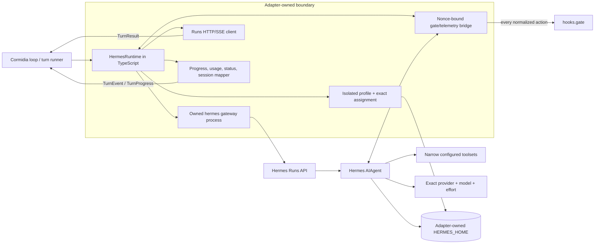

# Using Hermes Agent as a Cormidia runtime adapter

*2026-08-02. Reader-guide mode: review/proposal. Status: feasibility
architecture only—no `RuntimeKind`, role, dependency, or validation contract
has been changed.*

## Recommendation

Use Hermes's local **Runs API** as the target transport, not ACP and not a
direct Python import. Run it as a Cormidia-owned, isolated subprocess in the
requested worktree and translate its HTTP/SSE lifecycle into Cormidia's
`Runtime.runTurn()` contract.

Do **not** register Hermes as a production runtime at the pinned snapshot.
Five contracts are hard ship gates, whether fixed upstream or in an
intentionally pinned Cormidia fork:

1. a mandatory pre-tool authorizer that fails closed on absence, callback
   error, resolver error, timeout, and every main/subagent dispatch path;
2. a Runs operation that canonically resumes a stored Hermes session or fails
   before spending tokens if the session does not exist;
3. fail-closed per-provider-call accounting, exact `maxTurns` semantics, and a
   terminal envelope that cannot report incomplete work as success;
4. enforceable workspace, network, credential, and home-directory containment;
   and
5. token-free authentication readiness plus a pre-spend lock on the assigned
   provider, model, and reasoning configuration.

Current Hermes plugin hooks, Runs session IDs, usage lifecycle, and process
boundary do not meet those invariants. A text-only, tool-free feasibility
prototype could safely characterize the transport, but it is not a conforming
runtime. Any effectful Cormidia role must wait for all five gates and the normal
adapter qualification campaign.

Hermes should enter Cormidia only as an **execution harness**. Its memory,
background review, skill mutation, curator, external-memory providers, jobs,
and messaging surfaces should be disabled in the adapter profile. Cormidia's
ratified learning loop remains the sole authority for durable organizational
learning.

## The boundary being proposed

Cormidia currently sees a provider harness only through:

```ts
interface Runtime {
  readonly kind: RuntimeKind;
  runTurn(req: TurnRequest, hooks: TurnHooks): Promise<TurnResult>;
}
```

The proposed `HermesRuntime` would preserve that boundary:



This design adds one adapter. It does not make Hermes a second org
orchestrator, scheduler, approval system, memory authority, or learning
publisher.

## Why the Runs API is the best target seam

The pinned Hermes gateway exposes a native control-plane surface:

- `POST /v1/runs` for asynchronous submission;
- `GET /v1/runs/{id}` for pollable status;
- `GET /v1/runs/{id}/events` for SSE lifecycle, text, tool, and subagent
  events;
- `POST /v1/runs/{id}/approval` for Hermes-native pending approvals;
- `POST /v1/runs/{id}/stop` for interruption;
- `/api/sessions/**` for session resources;
- `/v1/capabilities`, `/v1/toolsets`, and detailed health for transport and
  configuration preflight (not provider-authentication proof);
- request-native `instructions`, explicit provider/model, and reasoning
  options;
- configurable API-server toolsets.

`instructions` is especially important: Cormidia's rendered authority, TASTE,
role protocol, and selected learning excerpts can be layered through Hermes's
system-instruction channel rather than disguised as user text.

The API server does not accept a per-run working directory. The adapter should
therefore launch an owned gateway process for the turn with `req.workdir` as
its process working directory. That lets process-local configuration narrow
toolsets without contaminating another turn. Exact call limits and containment
still require explicit adapter and Hermes contracts; process cwd alone proves
neither.

### Why ACP is not the primary transport

ACP has real advantages: stdio transport, explicit session `cwd`, structured
tool UI, cancellation, and a stronger `session/load` path. It is nevertheless
a worse fit for this contract at the snapshot:

- it hardcodes the broad `hermes-acp` toolset;
- it lacks an explicit per-turn system-instruction channel;
- effort and maximum-turn controls are not request surfaces;
- its final usage is too weak for running budget enforcement;
- its permission bridge is for selected dangerous/edit operations, not every
  Cormidia-gated action;
- `session/resume` may create a fresh session when the requested session is
  missing, which would make a false resume look successful.

ACP remains a useful reference and possible future transport if those
constraints change. Its `session/load` rejects a missing ID, but the inspected
path catches existing-session message-load errors and can recreate empty
history; `session/resume` can create a new session when missing. Neither is a
canonical, fail-closed Cormidia resume contract at this snapshot.

### Why not import Hermes's Python agent directly

Embedding `AIAgent` would expose more internals, but it would couple Cormidia's
TypeScript runtime layer to Hermes's large Python dependency graph and private
call paths. Every upstream refactor would become adapter work, and the runtime
would no longer have a crisp process/cancellation boundary. The public Runs
surface is the narrower dependency.

## Contract mapping

| Cormidia contract | Proposed Hermes mapping | Current truth at the snapshot |
| --- | --- | --- |
| `RuntimeKind` | Add `"hermes"` behind an unavailable/experimental registry path so conformance can run; do not make it role-selectable or claim production readiness until qualification | Not present |
| `req.workdir` | Process cwd of an owned per-turn `hermes gateway` | Feasible; Runs has no per-request cwd |
| `req.task` | JSON `input` body, never argv | Native |
| `req.context` | Deterministically render to Runs `instructions`; persist the exact hash in Cormidia evidence | Native instruction channel; byte identity still needs tests |
| assignment model/effort | Set provider, model, and request options; reject unsupported values before spend | Low–xhigh can be represented on relevant routes; Cormidia `max` is not generally portable |
| role tool shaping | Minimal `platform_toolsets.api_server` plus mandatory authorizer | Toolset narrowing exists; complete gate does not |
| `hooks.gate` | Exact raw action over a nonce-bound local bridge before execution | Requires fail-closed Hermes change |
| `onEvent` | SSE tool/subagent lifecycle plus bridge post-tool outcome | Runs tool start omits exact args/call ID; bridge required |
| `onProgress` | Bridge each provider-call usage; cumulative/monotonic adapter projection | Terminal Runs usage is only input/output/total |
| session resume | Keep the Cormidia `SessionHandle.id` stable; restore an exact DB-backed Hermes conversation and persist compression-tip changes in an adapter checkpoint keyed by that stable root | Not available; supplied `session_id` neither proves existence nor loads exact history; current progress/result types have no internal-lineage field |
| cancellation | `/stop`, bounded grace, then TERM/KILL the owned process group; preserve partial evidence | Adapter-built and testable |
| max-turn limit | Map `req.maxTurns` to the Hermes main-loop turn limit and suppress the post-limit summary; account and budget retries/auxiliary calls separately | Current `agent.max_turns` can trigger an extra summary call outside the ordinary loop accounting path |
| budget cap | Admit only priceable assignments, price each observed call, stop at cap, settle overshoot, and emit one incident | Needs a qualified runtime price catalog or contract extension plus a mandatory accounting bridge; terminal-only usage is too late |
| structured verdict | Existing lenient Cormidia parser | Fallback/degraded; Runs accepts no JSON schema |
| subagent fan-out | Block `delegate_task` initially | Must remain unsupported until child gating/usage is proved |
| network policy | Brokered tools plus an external filesystem/network/credential sandbox | Hermes has no equivalent per-turn workspace/network sandbox contract |
| `TurnResult` | Preserve terminal completeness, failure, usage quality, session root, escalation, and stable error semantics | Current Runs projection can collapse an incomplete non-failed agent result into `run.completed` and omits fields Cormidia needs |

## The hard blocker: current tool hooks fail open

Hermes has a general `pre_tool_call` plugin hook and a directive that can block
or request approval. That looks like the natural place to call
`hooks.gate`, but its failure semantics are incompatible with Cormidia.

At the pinned commit:

- `PluginManager.invoke_hook()` catches callback exceptions and continues;
- `model_tools.py`, `agent/tool_executor.py`, and
  `agent/agent_runtime_helpers.py` also catch pre-tool resolver failures and
  proceed with no block message;
- Runs events are observational and arrive after the decision point;
- Hermes-native approvals cover dangerous or plugin-flagged operations, not
  every tool action;
- child per-tool events are intentionally omitted from the public Runs stream.

A plugin that catches ordinary socket failures and a startup handshake reduce
risk, but they cannot prove “every action is gated.” A callback bug or resolver
failure can still execute an action before the adapter observes it.

Hermes therefore needs an opt-in mandatory-authorizer mode, or Cormidia must
carry an intentionally pinned minimal patch, with this invariant:

```text
for every main or delegated tool call:
  normalize exact tool name + raw args + call/session/turn identity
  require one registered Cormidia authorizer
  if authorizer is absent, throws, times out, disconnects, or returns invalid:
    block before execution
  otherwise execute only on explicit allow
```

Negative controls must fire through direct registry tools, agent-level tools
such as memory/session/delegation, concurrent calls, `execute_code`, lazily
discovered tools, MCP tools, and every subagent path. Until that suite passes,
the capability is `unsupported`, not “adapter-built.”

Hermes's own non-bypassable hardline safety blocks may remain as a second
defense. Its optional persistent/session-wide approvals should not become the
Cormidia authority layer. A native approval may be granted for one call only
after the mandatory bridge has correlated the approval to the exact raw action
by nonce/hash and Cormidia has explicitly allowed that action. Otherwise it must
be denied; a prototype without that bridge must deny every native approval.
The redacted Runs approval event cannot substitute for Cormidia's decision over
exact raw arguments.

## The second hard blocker: Runs does not canonically resume

`POST /v1/runs` accepts `session_id`, but the inspected path uses it for
correlation/task identity; it does not first verify the session or load its
canonical conversation.

The public session API can detect a missing session and return messages, but
its client-safe projection omits replay sidecars such as provider-specific
`api_content` and Codex items. Reconstructing from that projection would be a
best-effort replay, not exact resume. Cormidia must not round-trip a session
handle that silently starts a different conversation.

The required Runs extension is atomic:

1. accept an explicit canonical resume ID;
2. open the Hermes `SessionDB` record before constructing a provider client;
3. fail pre-spend if the ID is missing, corrupt, or belongs to another isolated
   profile;
4. restore the exact internal conversation and compression chain;
5. keep the external Cormidia session-root ID stable, while persisting any
   rotating Hermes compression tip in an adapter-owned checkpoint/sidecar
   keyed by that root. If consumers need the tip in generic progress or run
   evidence, extend that schema explicitly; do not overload `SessionHandle.id`.

Until that exists, advertise no `session_resume` capability. Starting a fresh
session remains valid when Cormidia supplies no session handle.

## Other effectful-runtime ship blockers

### Accounting, terminal truth, and exact turn bounds

Hermes exposes useful usage data, but the current hooks are observational:
plugin-hook exceptions are swallowed, so a broken `post_api_request` bridge
can lose a provider call without failing the run. Terminal Runs mapping is also
lossy: an agent result with `completed=false` and `failed=false` can become a
`run.completed` event. Finally, `agent.max_turns` can invoke an extra summary
model call after the nominal main-loop limit, potentially with retry behavior
and outside the ordinary accounting hook.

A conforming mode therefore maps `req.maxTurns` to the main-loop conversation-
turn limit and disables the post-limit summary rather than silently adding a
turn. It separately needs mandatory, fail-closed accounting around every
provider request, including retries, child calls, and any permitted auxiliary
generation. Admission, turn-limit enforcement, cumulative progress, budget
stop, and terminal settlement all consume the same ledger. Missing accounting
or an ambiguous terminal state fails the turn; it never becomes an
authoritative zero or a successful completion.

### Workspace, credentials, home, and network

A private mode-`0700` `HERMES_HOME`, narrow toolsets, and process cwd are good
configuration hygiene, not a security boundary against code executing in the
same process. The production adapter needs a proved broker/container/tool-
worker boundary that limits filesystem access to the assigned worktree and
adapter state, scrubs the environment, makes the operator's real home and auth
files inaccessible, and separates provider egress from tool network access.
`networkAccess: false` must block tool-originated network traffic without
preventing the explicitly assigned model call.

### Readiness and assignment admission

Gateway health and capability discovery do not prove that the selected
provider credentials work without spending tokens. The adapter needs a
provider-specific, token-free authentication probe. Until one exists, it must
remain unavailable for role selection (or report the existing
`unauthenticated` non-ready status) and refuse a production turn. It also
needs a mandatory pre-provider seam that locks provider, model, and reasoning
settings before each call. A post-request drift check is valuable evidence,
but it detects the
wrong assignment only after money has been spent. Service tier is not part of
Cormidia's current universal turn-assignment tuple and must not be claimed as a
portable invariant without a contract extension.

## Adapter-owned isolation profile

An Cormidia role must never inherit the operator's personal `~/.hermes` state.
The adapter should create a mode-`0700` home under Cormidia's state boundary,
with an ownership lock for each resumable session, inside the stronger sandbox
described above. The exact path becomes part of the implementation/state-
inventory change; this proposal does not create one.

The profile should contain only what the turn needs:

- API server enabled on loopback with an ephemeral port and random bearer key;
- every messaging platform, job scheduler, cron path, and peer gateway off;
- only explicitly selected API-server toolsets;
- globally configured and session-supplied MCP servers off unless separately
  authorized and gated;
- project/user plugins off except the pinned Cormidia bridge;
- built-in memory and user profile disabled;
- memory provider empty;
- memory and skill reflection intervals zero;
- skill mutation unavailable or always denied;
- curator disabled;
- title generation, smart approval, fallback models, and other auxiliary model
  work disabled or fully accounted;
- `delegate_task` denied until nested conformance exists;
- exact provider, model, and effort fixed before launch, with every provider
  call admitted through the assignment lock;
- exact `req.maxTurns` main-loop behavior with the post-limit summary off,
  while retries and auxiliary calls remain separately accounted and budgeted;
  and
- external workspace, network, credential, environment, and home-directory
  containment selected from Cormidia's policy.

Hermes `state.db` may then serve as a runtime checkpoint. It is not a Cormidia
knowledge store. No Hermes `MEMORY.md`, `USER.md`, skill, usage score, curator
report, or external-memory record may be injected into active Cormidia learning.

This separation also protects the repository's development boundary: root
instructions, developer grants, evaluation state, CI authority, and release
authority must never leak into an org-scoped Hermes profile.

## Context, cache, and assignment integrity

The adapter should render Cormidia's existing `ContextBundle` deterministically
into Runs `instructions` in the same stable layer order used by other
adapters. The run-specific task stays in `input`. Volatile IDs, timestamps,
budget counters, and progress data stay out of the static prefix.

Hermes may route across many providers and supports fallback behavior. That is
useful interactively but dangerous to Cormidia's atomic turn assignment. A new
fail-closed admission seam must prove the provider, model, and reasoning
configuration before every provider call; each telemetry record then confirms
what actually ran. Smart routing and model fallback stay off. Drift is a failed
turn, not a silent recovery.

Cache usage should be reported honestly. The mandatory accounting bridge sends
input, output, cache-read, and cache-write buckets with actual provider/model
identity after each model call. The adapter turns those into cumulative
`TurnProgress`. A provider that does not expose a bucket may justify
`partial`, `estimated`, or `unavailable` quality; a broken or missing bridge
fails the turn. Neither case becomes authoritative zero.

## Budget, cancellation, and process ownership

The Runs terminal response arrives too late to enforce a running turn budget.
The bridge must report each provider call. Cormidia's current `TurnRequest` does
not carry a universal pricing record, so Hermes admission also needs either a
runtime-owned, qualified price catalog or an explicit contract extension.
Unknown or unpriceable usage fails admission under a USD cap. The TypeScript
adapter prices cumulative usage from that authority and requests stop as soon
as the cap is crossed. As with current adapters, unavoidable overshoot is
preserved, the error is `error_max_budget_usd`, and exactly one incident is
deposited.

Cancellation is two-stage:

1. call `POST /v1/runs/{id}/stop` and wait a bounded grace period while
   retaining streamed usage/session evidence;
2. if the run does not settle, terminate and then kill the entire adapter-owned
   process group and descendants.

The adapter must never kill by a broad process name. Process IDs are captured
at launch, descendants are scoped to the owned group, and a later run cannot
inherit the old cancellation target.

## Provisional capability profile

This is the honest target **after all hard contracts and the bridge have been
implemented and proved**:

| Capability | Target support | Qualification condition |
| --- | --- | --- |
| `cache_telemetry` | adapter | Per-provider-call bridge; correct bucket and quality semantics |
| `cancellation` | adapter | HTTP stop plus bounded process-tree reap |
| `intra_turn_fanout` | unsupported initially | Remains blocked until every child action, usage unit, and lifecycle is correlated |
| `session_resume` | adapter | Canonical fail-closed Runs resume, including compression lineage |
| `structured_verdict` | fallback | Cormidia's existing lenient parser; no false native-schema claim |
| `tool_gate` | adapter | Mandatory fail-closed authorizer across every dispatch path |

Before those conditions pass, the actual profile is “experimental, no
effectful turns,” not a partial production profile.

## Implementation and validation sequence

### Phase 0 — upstream contract probes

- Pin the Hermes commit/package and record its license and install footprint.
- Build a tool-free Runs client that launches in `req.workdir`, performs health
  and capability discovery, streams output, and stops cleanly.
- Seed a canonical session, restart the process, and demonstrate the current
  resume gap without spending beyond a bounded test allowance.
- Upstream or carry all five hard-contract changes: authorization, canonical
  resume, accounting/terminal/turn bounds, containment, and readiness/
  assignment admission.

### Phase 1 — adapter skeleton, still unavailable to roles

- Re-enter the `validation-harness-design` skill in `harness-revision` mode
  with the ratified artifacts as baseline. Hermes introduces a new provider
  boundary, so this structural revision is mandatory before adding a
  `RuntimeKind` or cases.
- Extend `RuntimeKind`, registry, readiness, capability profile, and exact
  provider/model configuration, but keep the entry unavailable to configured
  roles until qualification finishes.
- Add the subprocess supervisor, loopback client, redaction, payload transport,
  status mapping, and deterministic context renderer.
- Keep tools and fan-out disabled.

### Phase 2 — gate, telemetry, budget, terminal truth, and sandbox

- Install and attest the nonce-bound bridge.
- Add pre-tool authorization, post-tool outcomes, mandatory per-provider-call
  usage, exact turn-limit semantics, and lossless terminal mapping.
- Enforce worktree, network, credentials, maximum-turn, cancellation, and
  process-tree boundaries.
- Capture Hermes checkpoints only as runtime state.

### Phase 3 — detectors and shared conformance

Every defect found deposits an offline detector. Required negative controls
include:

- missing, duplicated, crashed, timed-out, or malformed authorizer;
- every direct, lazy, MCP, agent-level, concurrent, and delegated tool path;
- denied and escalating actions with exact raw arguments;
- missing/corrupt/wrong-profile session IDs and compression-tip rotation;
- model/provider/effort drift and fallback attempts;
- cumulative usage monotonicity, cache buckets, subagent accounting, and budget
  overshoot settlement;
- cancellation during inference, tools, approval, and child work;
- stale PID/process-group reuse;
- 300 KiB task/context payload through a non-argv channel;
- workspace escape and `networkAccess: false`;
- auth loss and readiness failure without a provider turn;
- fallback structured verdict and malformed terminal response.

Hermes is a new provider boundary, so the structural validation-harness
revision in Phase 1 is mandatory. It must map the adapter against the ratified
boundary map and update the design before implementation; cases must not be
improvised onto the wrong structure.

Only after L1/L2 conformance is green should a human explicitly authorize the
bounded live adapter campaign. Under the current validation policy, the
changed-adapter pre-merge campaign is at most two turns and $5. An unrun,
ceiling-stopped, or missing live case remains incomplete, never green.

### Phase 4 — role adoption

- Update the capability matrix and readiness documentation with observed
  evidence.
- Propose, rather than silently edit, human-ratified role/model assignments.
- Start with a low-blast-radius role that does not require fan-out.
- Do not enable Hermes self-learning as part of adapter adoption.

## If Hermes learning is desired later

There is one safe integration direction: Hermes may emit an observation or a
proposed memory/skill diff as **advisory evidence**. Cormidia can translate it,
with source hashes and Hermes runtime/session identity, into an existing
`LearningEvent` that follows the normal Distiller path. A separately justified
direct mapping to an existing inert `CandidateArtifact` shape would bypass
distillation and enter at independent review. In either case, all downstream
experiment, approval, publisher, and canary rules still apply.

Direct synchronization is out of bounds:

- no copying Hermes memory into active OKF bundles;
- no treating skill usage as efficacy;
- no allowing background review to edit Cormidia prompts/protocols;
- no importing a curator archive/restore as a Cormidia activation/rollback;
- no external memory provider as a second active context authority.

If future requirements demand a new learning destination or boundary rather
than mapping to an existing event/candidate structure, that is a structural
learning-harness redesign and needs human ratification.

## Source anchors

Cormidia contract sources:

- [runtime types](../../src/runtime/types.ts)
- [runtime capability profiles](../../src/runtime/capabilities.ts)
- [runtime registry](../../src/runtime/registry.ts)
- [readiness probes](../../src/runtime/readiness.ts)
- [adapter addition and qualification](../../docs/harness/adding-updating.md)
- [capability matrix](../../docs/harness/capability-matrix.md)
- [runtime-layer research](../2026-07-03_runtime-layer.md)
- [ratified learning design](../../docs/learning-loop/learning-loop-design.md)

Hermes sources are pinned to
`9060e3c2d3d3f7f3a21c297b5617e06ff9237085`:

- [API-server and Runs guide](https://github.com/NousResearch/hermes-agent/blob/9060e3c2d3d3f7f3a21c297b5617e06ff9237085/website/docs/user-guide/features/api-server.md)
- [Runs, capability, session, approval, and stop implementation](https://github.com/NousResearch/hermes-agent/blob/9060e3c2d3d3f7f3a21c297b5617e06ff9237085/gateway/platforms/api_server.py)
- [ACP user guide](https://github.com/NousResearch/hermes-agent/blob/9060e3c2d3d3f7f3a21c297b5617e06ff9237085/website/docs/user-guide/features/acp.md)
  and
  [ACP internals](https://github.com/NousResearch/hermes-agent/blob/9060e3c2d3d3f7f3a21c297b5617e06ff9237085/website/docs/developer-guide/acp-internals.md)
- [ACP session construction](https://github.com/NousResearch/hermes-agent/blob/9060e3c2d3d3f7f3a21c297b5617e06ff9237085/acp_adapter/session.py)
  and
  [server lifecycle/usage mapping](https://github.com/NousResearch/hermes-agent/blob/9060e3c2d3d3f7f3a21c297b5617e06ff9237085/acp_adapter/server.py)
- [plugin hook dispatcher and pre-tool directives](https://github.com/NousResearch/hermes-agent/blob/9060e3c2d3d3f7f3a21c297b5617e06ff9237085/hermes_cli/plugins.py)
- [tool-dispatch resolver paths](https://github.com/NousResearch/hermes-agent/blob/9060e3c2d3d3f7f3a21c297b5617e06ff9237085/model_tools.py),
  [tool executor](https://github.com/NousResearch/hermes-agent/blob/9060e3c2d3d3f7f3a21c297b5617e06ff9237085/agent/tool_executor.py),
  and
  [agent-level tool helper](https://github.com/NousResearch/hermes-agent/blob/9060e3c2d3d3f7f3a21c297b5617e06ff9237085/agent/agent_runtime_helpers.py)
- [agent loop and API lifecycle hooks](https://github.com/NousResearch/hermes-agent/blob/9060e3c2d3d3f7f3a21c297b5617e06ff9237085/agent/conversation_loop.py)
- [turn finalization and completion semantics](https://github.com/NousResearch/hermes-agent/blob/9060e3c2d3d3f7f3a21c297b5617e06ff9237085/agent/turn_finalizer.py)
- [iteration-limit summary call and retry path](https://github.com/NousResearch/hermes-agent/blob/9060e3c2d3d3f7f3a21c297b5617e06ff9237085/agent/chat_completion_helpers.py)

This proposal deliberately excludes an implementation estimate, role
selection, upstream contribution commitment, and live token spend. Those
decisions depend on whether all hard contracts can be obtained without
carrying an unsafe long-lived fork.
