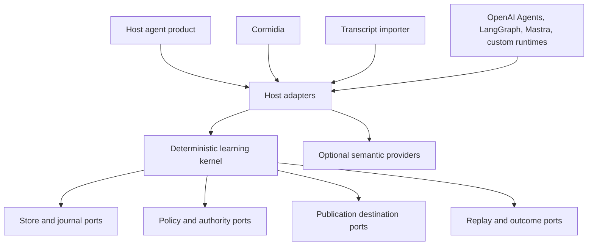

# Learning Loop as a Standalone TypeScript Library

**Mode:** review brief  
**Date:** 2026-08-12  
**Status:** derivative, non-normative proposal for review  
**Local source snapshot:** `242b12acf5e733dec9fbbeeedf4d47588c22da91`  
**Working package name:** `@cormidia/learning-loop` — a placeholder, not a naming decision

## Review question

Should Cormidia's learning loop become a standalone TypeScript library that Cormidia and unrelated agent products can both consume? If so, what should the library promise, how would developers use it, which guardrails must be non-negotiable, and what work must happen before a public release?

This review covers product vision, user value, scope, architecture, safety, evidence, extraction, and dogfooding. It does not authorize an npm publication, choose a final name or license, or claim that the present system has already proved that learned interventions improve later agent work.

## Bottom line

**Recommendation: yes, conditionally.** Separate the learning loop as a standalone, framework-neutral library, but do not copy or publish the current Cormidia learning directory as it stands. First extract a small deterministic kernel, make Cormidia consume it as the source of truth, and prove the same contract through a second integration such as a transcript adapter. Only then consider a public `0.x` release.

The strongest reason to extract is that the important idea is broader than Cormidia: an agent should not be allowed to turn its own story about a run directly into permanent instructions. A trustworthy learning path needs evidence provenance, an inert proposal, independent review, exact-content authorization, deterministic publication, rollback, and later outcome measurement. Those concerns recur in any serious agent product.

The most important limitation is equally clear: the repository proves a substantial mechanism and several safety seams, but the reviewed evidence does **not** prove that an activated learning intervention improved later work. One immutable paired campaign proved that qualification and activation are correctly decoupled; its result was inconclusive and nothing was activated. The public story must therefore be “governed adaptation infrastructure,” not “automatic self-improvement that is already proven to work.”

The proposed vision is:

> A framework-neutral TypeScript control plane that turns evidence from completed agent work into scoped, reviewable interventions with explicit disable, rollback, compensation, or irreversibility semantics, while preserving the distinction between “permitted to run” and “shown to improve outcomes.”

## Start with how people would use it

The library is useful only if its role in an agent product is concrete. Its normal path should look like this:

```mermaid
flowchart LR
    A["Agent completes an episode"] --> B["Host records observations and outcomes"]
    B --> C["Distiller proposes an inert candidate"]
    C --> D["Attributed independent reviewer accepts, revises, rejects, or escalates"]
    D --> E["Host prepares exact effect bytes and risk decision"]
    E --> R["When policy requires it: paired offline replay"]
    R --> F["Authorized publisher applies one versioned intervention"]
    E -->|"when pre-activation replay is not required"| F
    F --> G["Eligible future episodes receive that exact version"]
    G --> H["Outcome measurement or low-risk canary"]
    H --> I["Promote, revise, disable, roll back, or compensate"]
```



An **episode** is one outcome-bearing unit of work, such as “fix issue 42 and pass its acceptance checks.” It is not one chat message or one tool call. An **observation** is a provenance-bearing claim about that episode, such as a test exit code or a human correction. A **candidate** is a proposed lesson or change that remains inert. An **intervention** is an exact, versioned change that has passed the required governance and can affect future work. An **experiment** compares equivalent episodes with and without that intervention.

### Running example: a TypeScript coding agent

Suppose a coding agent repeatedly declares work complete after unit tests pass but before TypeScript compilation runs. Daily transcripts show the human correcting this several times.

The unsafe shortcut is to let a model summarize the transcripts and append “always run the type checker” directly to the agent's prompt. That shortcut has four problems: the transcript may contain prompt injection or secrets; the model may have mistaken a symptom for a cause; the instruction may be too broad; and later success cannot be attributed to the change.

With this library:

1. A structured runtime adapter records terminal tool results. A transcript adapter may add advisory evidence that the human issued the same correction repeatedly.
2. A distiller proposes: “For TypeScript code-change episodes, run the repository type-check command before reporting completion.” The proposal identifies its supporting episodes, intended scope, risk, expected benefit, and rollback.
3. An independent reviewer checks whether the proposal is grounded, narrow, non-duplicative, reversible, and within authority. The candidate cannot review itself into active context.
4. The destination adapter renders the exact instruction bytes. Before activation, an efficacy-claiming or higher-risk candidate runs the required paired offline replay. Authorization remains a separate governance decision.
5. The host's approval process authorizes exact content and base version, not a mutable label. The publisher writes the version once, records a receipt, and can resume safely after a crash.
6. Later eligible episodes receive an exact pinned version. Tool exit records, tests, review findings, time, and cost measure the result; a low-risk canary may test external validity after offline evidence and authorization.
7. The system may say the instruction is **authorized** as soon as governance permits its use. It may say **validated** only after a predeclared, comparable experiment shows improvement without a guardrail regression. Validation can therefore precede activation and remains orthogonal to it.

This example shows the library's value even before causal efficacy is proven. In a conforming integration it produces a reviewable queue of grounded candidates, refuses kernel-mediated direct self-modification, preserves why an intervention exists, and makes disable or rollback explicit. Causal improvement is a later and stronger value tier.

### Four adoption levels

Developers should not need to adopt the entire loop on day one.

| Level | What the developer integrates | Immediate value | Claim the product may make |
| --- | --- | --- | --- |
| Observe | Episodes, observations, source receipts, and outcomes | One durable account of recurring friction and corrections | “We can trace recurring learning opportunities.” |
| Govern | Candidate, review, policy, and rejection workflows | Proposed lessons are scoped, deduplicated, and kept inert inside a conforming integration | “This integration refused to resolve an unreviewed candidate.” |
| Activate | Content-bound authorization, deterministic publication, resolution, and rollback or compensation | Exact versions can be introduced under host authority and later disabled, reversed, or compensated as the destination permits | “This intervention was permitted and this exact version was used.” |
| Validate | Frozen experiments, paired execution, guardrails, exposure lineage, and outcome measurement | The host can test whether a change caused improvement | “This exact intervention improved this declared task population under this frozen setup.” |

Observe and Govern are cumulative foundations. Activate and Validate are orthogonal capabilities: policy may require validation before activation, while an inert proposal destination may publish without an efficacy claim. A transcript analytics product may stop after Govern. A production agent platform may need all four. The library should never imply that activation alone proves value.

### Primary user journeys

#### 1. Add a feedback path to a custom TypeScript agent

The developer wraps each task with an episode boundary, records verifiable tool and outcome events, asks a model or human to propose candidates, and supplies a destination adapter for prompt fragments, skills, runbooks, tests, or tickets. The library handles provenance, state transitions, exact bindings, policy checks, receipts, and experiment records.

**Value:** the developer avoids inventing a safety-critical state machine, and can change model, storage, or agent framework without losing learning history.

#### 2. Turn existing transcripts into advisory candidates

The developer supplies explicit exports or reader callbacks for Codex, Claude Code, Cursor, or another tool. A source adapter validates the provider format, redacts content locally, emits minimized observations, and records completeness. Transcript text is untrusted evidence and never becomes active context directly.

**Value:** a product can discover repeated corrections before it has complete instrumentation. This is also the proposed Cormidia dogfood path.

#### 3. Evaluate a prompt, skill, policy, or tool-use change

The developer declares the intervention, eligible episode class, metric, guardrails, execution fingerprint, budget, and stopping rule before seeing results. A replay adapter restores equivalent starting conditions and runs control and treatment. The library rejects missing arms, unplanned drift, invalid graders, and correctness-for-cost trades.

**Value:** “we changed the prompt and it felt better” becomes an attributable, reproducible result or an honest inconclusive verdict.

#### 4. Operate a governed library of active learnings

The host resolves only authorized entries that match the current scope and context budget. Every exposure records the exact intervention lineage. Conflicts, stale versions, and disabled entries fail visibly. High-risk changes require stronger host authority and may be structurally barred from live experimentation.

**Value:** permanent agent context becomes a controlled product surface rather than an append-only memory file.

#### 5. Build research and review tooling around a stable protocol

Researchers can contribute adapters, synthetic fixtures, evaluator calibrations, and benchmark episodes without adopting Cormidia's scheduler, GitHub workflow, role model, or storage layout.

**Value:** Cormidia's research becomes reusable evidence and executable contracts rather than product-specific prose.

### Who should not use it

The package is unnecessary for a stateless one-shot agent, a disposable prototype with no durable behavior changes, or an application that only needs conversation history. It is also the wrong abstraction for training model weights, optimizing one code patch in a tight attempt loop, or replacing a full observability platform.

## What the library should be

### Product category

Call it a **governed adaptation kernel**. “Learning loop” is approachable, but “memory” is too narrow and “self-improving agent” is too strong. The package connects four normally separate concerns:

1. evidence from completed work;
2. proposals for durable change;
3. authority to make an exact change active; and
4. evidence that the change helped or harmed later work.

The kernel is headless. It owns schemas, invariants, deterministic decisions, lifecycle transitions, lineage, and receipts. The host continues to own agent execution, model calls, identity, permissions, storage deployment, user interface, scheduling, and side effects.

### Public promise

The public promise should be:

> Turn agent work into evidence-linked, independently reviewable, safely activated, and measurable improvements without surrendering your agent framework, model provider, or storage system.

This promise is conditional on a **conforming host**: all governed-state writes, resolution and effect application must pass through the kernel, and the host must keep those surfaces outside direct agent authority. The package can refuse an invalid API transition; it cannot stop a separate filesystem or prompt-editing bypass that the host permits.

Within that boundary, the package should promise mechanisms it can enforce:

- the kernel never resolves candidate records into active context;
- review, authorization, activation, exposure, and validation are distinct records;
- approvals bind exact content and expected base state;
- publication is idempotent and journaled; each destination declares disable, rollback, compensating-action, or irreversible semantics before use;
- source trust and missing evidence are explicit;
- experiments are declared before results and preserve all attempts;
- host policy may tighten risk controls, while a conforming integration cannot configure away the core refusal rules.

It should not promise that a model will discover good lessons, that a transcript proves causality, or that every agent will improve.

### Deliberate non-goals

The library should not become:

- an agent runtime or orchestrator;
- a chat/session memory database;
- a vector store or retrieval framework;
- a model gateway or prompt framework;
- a scheduler, approval user interface, or identity provider;
- an undocumented transcript scraper;
- a hosted telemetry service by default;
- an automatic prompt rewriter with direct write authority;
- a general-purpose A/B experimentation platform;
- a Cormidia compatibility layer disguised as a public abstraction.

Keeping these out is what makes the package usable by the OpenAI Agents Software Development Kit (SDK), LangGraph, Mastra, custom state machines, command-line interface (CLI) coding agents, and future frameworks.

## Why separation is attractive

### 1. The core problem is genuinely product-independent

Every durable learning system must answer the same questions: What happened? Which parts are trustworthy? Is the proposed lesson grounded? Who may activate it? What exact version ran? Did it help? Can it be disabled? Cormidia's organization, roles, tickets, and scheduler are one host's answers around that core, not the core itself.

### 2. It gives Cormidia a sharper internal boundary

Today the learning subsystem mixes reusable state-machine logic with Cormidia runlogs, tickets, approvals, GitHub operations, repository paths, budgets, and prompt assembly. A standalone source of truth forces the composition boundary to become explicit. That should reduce accidental authority coupling and make the critical invariants easier to test.

### 3. It enables a meaningful community contribution

Most developers should not need an entire standing agent organization to adopt evidence-linked learning. A dependency-light TypeScript package, a local filesystem adapter, an in-memory test kit, and worked integrations can make the protocol available to small applications.

The research is part of that contribution only if it is honest about status. Public documentation should distinguish ratified design, implemented mechanism, historical evidence, provisional thresholds, and unproven efficacy. Publishing a large research folder without this truth map would create volume, not trust.

### 4. It creates an elegant independent test host

Cormidia can remain the high-assurance first consumer. Daily Codex, Claude Code, and Cursor transcripts form a very different second consumer: irregular formats, private content, incomplete outcome data, and no Cormidia scheduler. If both can satisfy the same core contracts, the boundary is probably real.

### 5. It improves cost discipline

Capture, hashing, policy, deduplication, lineage, and most eligibility checks can be deterministic. Model spend is needed only for semantic distillation, review, or grading after enough evidence accumulates. That architecture is useful outside Cormidia and prevents “reflect on every turn” from becoming the default.

### 6. It creates a stable place for executable research

The package can ship conformance tests, synthetic episodes, adversarial transcript fixtures, evaluator versioning examples, and reproducible experiments next to the prose explaining why they exist. That is more useful to the community than publishing architectural claims alone.

## Why separation could be a mistake

The contrary case is substantial.

### 1. A public abstraction could freeze too early

The current subsystem is large and shaped by one host. Its public-looking interfaces are explicitly internal extraction candidates, not a supported SDK. A premature `1.0` would preserve terms such as org, app, role, OKF—the Markdown-and-YAML knowledge format used for Cormidia's governed context—ticket, GitHub, and Cormidia-specific fingerprints in places where a generic host needs opaque scopes and adapters.

### 2. Safety currently depends on Cormidia outside the learning folder

Cormidia's runtime gate treats active learning state as a prompt-injection persistence surface. Its approval store, protected paths, serialized scheduler, budget ledger, and role separation supply authority that a package cannot manufacture. A library can validate records and refuse invalid transitions; it cannot prevent a host agent that already has filesystem access from editing its own prompt. Every safety guarantee in this proposal is therefore a kernel or conforming-integration guarantee, not a claim that the package can police bypassing host code.

Public documentation must state this boundary plainly: the host must keep governed state outside agent write authority or provide an equivalent mutation guard.

### 3. The efficacy story is not yet proven

The mechanisms are real, but the current evidence does not show a completed chain from discovered lesson through safe activation to improved later work. Extraction now is justified by reuse and architecture. Marketing the package as proven self-improvement is not.

### 4. A second product has a permanent cost

A public package creates semantic-versioning commitments, security intake, migration support, adapter drift, privacy expectations, documentation, examples, release automation, and community governance. Those costs can distract from Cormidia if the package has no independent adopters.

### 5. Storage and concurrency assumptions need hardening

Some present stores rely on a serialized Cormidia scheduler and filesystem replacement. Check-then-write “create only” behavior and last-writer-wins atomic replacement are not a safe general multi-process contract. Public storage ports need exclusive create, compare-and-set or transaction ownership, and crash/concurrency conformance tests.

### 6. Transcript onboarding can become a privacy liability

Coding transcripts may contain credentials, customer data, source code, names, paths, and prompt injection. A convenient crawler would create a dangerous default. The library should accept explicit inputs, redact locally, persist minimized derivatives, and make outbound model disclosure opt-in.

### 7. Community demand is still an assumption

Cormidia plus personal transcript dogfooding proves two shapes of integration, not market demand. Before stable publication, one independent TypeScript adopter or a credible reference integration should exercise the application programming interface (API) without relying on private Cormidia knowledge.

## Options considered

| Option | Benefits | Costs and risks | Recommendation |
| --- | --- | --- | --- |
| Keep everything inside Cormidia | No migration or public support burden; maximum freedom to change | No community library; Cormidia coupling remains hidden; transcript use becomes another special case | Reject as the long-term direction, but use the current repo as the extraction workshop |
| Copy the folder into a new package | Fastest visible separation | Immediate code drift; duplicated defects; Cormidia-shaped API; safety dependencies become implicit | Reject |
| Create an internal package in this repository | Good for discovering import boundaries and parity tests | Still not independently consumable; can tempt a permanent monorepo-only API | Use as a temporary seam if it accelerates extraction |
| Create a standalone package as source of truth, with Cormidia as a consumer | Real independence, one implementation, community contribution, clean adapters | Highest migration and release discipline; compatibility and concurrency work required | **Recommended target** |

The key sequence is architectural separation first, repository and npm separation second. A new repository on day one is not necessary to discover the boundary. A copied implementation is never the source of truth.

## Position in the TypeScript agent ecosystem

This is a selected comparison based on current public documentation, not an exhaustive market audit. It identifies where the proposed package should integrate rather than compete indiscriminately.

| Current tool or category | Documented center of gravity | Relationship to this proposal |
| --- | --- | --- |
| LangGraph memory | Thread-scoped state plus long-term semantic, episodic, and procedural memory in custom namespaces. Its documentation also describes prompt rewriting as a procedural-memory technique. [LangGraph memory overview](https://docs.langchain.com/oss/javascript/concepts/memory) | A strong memory and agent-state substrate. The proposed library adds a governed path from evidence to an exact intervention and an explicit authorization-versus-efficacy distinction. |
| OpenAI Agents SDK for TypeScript | Pluggable persistent sessions and comprehensive tracing of generations, tool calls, handoffs, guardrails, and custom events. [Sessions](https://openai.github.io/openai-agents-js/guides/sessions/) and [tracing](https://openai.github.io/openai-agents-js/guides/tracing/) | A natural source and execution adapter. Sessions or traces can feed observations, while the learning kernel governs durable changes outside the run history. |
| Mastra | Message, observational, working, and semantic memory, plus model-graded, rule-based, and statistical scorers for live or continuous-integration (CI) evaluation. [Memory](https://mastra.ai/docs/memory/overview) and [scorers](https://mastra.ai/docs/evals/overview) | A TypeScript-native host with overlapping memory and evaluation capabilities. The package should be composable with those systems and focus on intervention authority, lineage, and activation safety. |
| Langfuse | Scores, datasets, code or model evaluators, and experiment runs used to compare application changes before production. [Evaluation concepts](https://langfuse.com/docs/evaluation/core-concepts) | A possible trace, outcome, dataset, and evaluator adapter. The proposed core should not rebuild a general observability platform. |
| BozoLoop | A small TypeScript loop for goal → proposed patch → apply → evaluate → repeat, with a ledger, checkpoints, pause/resume, and rollback. [BozoLoop documentation](https://bozoloop.js.org/) | Adjacent but differently scoped. BozoLoop optimizes attempts inside an iterative code-improvement run; this proposal governs learnings accumulated across completed episodes and later activated in future work. |
| Personal-memory systems such as the reviewed Hermes design | Compact ambient memory, progressively loaded skills, searchable history, reflection, curation, and usage telemetry | Useful prior art for progressive disclosure and cheap teaching. Usage or retrieval is not the same as a measured outcome, so those signals remain separate. |

The apparent whitespace is not “agents need memory” or “agents need evals”; both are well served. It is a portable protocol that links evidence, durable behavior change, authority, exact exposure lineage, and outcome claims without owning the agent runtime.

## The invariants that make the library worth having

If these rules become optional conveniences, extraction loses its purpose.

### Evidence and trust

1. **Parse, do not trust.** Every provider record, transcript, stored document, callback result, and network response crosses as `unknown` and must be runtime-validated.
2. **Provenance is mandatory.** Every observation identifies its source adapter, version, source revision, record reference, trust ceiling, and content digest.
3. **Trust is granted by the host, not claimed by the adapter.** Transcript prose and agent self-report are advisory. Independently observed test, tool, continuous-integration, or human records may be metric-bearing under explicit policy.
4. **Observation, explanation, and intervention remain separate.** “The command failed,” “the agent forgot the precondition,” and “add a preflight instruction” are different claims with different evidence.
5. **Missing or invalid measurement is never zero and never a pass.** It makes the result invalid or inconclusive.

### Authority and activation

6. **A candidate is inert.** It cannot appear in resolved active context and cannot grant itself permissions.
7. **Generation and review are attributed and independently governed.** A principal is an authenticated human, agent, or service identity attested by the host. The kernel can prove that two verified principal handles differ. Provider family, model, process and organizational independence require stronger host policy and conformance; unequal caller-supplied strings are not proof. The same verified principal must not both propose and provide the decisive review.
8. **Authorization and validation are permanently different.** `authorized` means policy permits an exact intervention. `validated` means a predeclared comparable evaluation found improvement without guardrail regression. Neither implies the other.
9. **Approval binds exact content and expected state.** Changing content, destination, scope, policy-critical metadata, or base version voids the binding.
10. **Least authority and narrowest scope win.** A ticket or draft is preferable to active context when it can preserve value. A role-specific lesson is preferable to an organization-wide rule when evidence supports only that role.
11. **The package never widens host permissions.** High-impact actions remain subject to host authority. A package cannot turn model output into an entitlement.

### Publication and rollback

12. **Publication is planned before it is applied.** The plan contains canonical bytes, hashes, target versions, expected bases, effects, and declared disable, rollback, compensation, or irreversibility semantics.
13. **Publication is journaled and idempotent.** A retry after a crash either completes the same plan or performs a no-op; it does not duplicate an intervention.
14. **Every active version has lineage.** Resolution and exposure identify the exact intervention, bundle, policy, and host fingerprint that ran.
15. **After-effects are always modeled.** Active context must be disable- and rollback-capable. Outward effects such as tickets may support compensation rather than literal reversal; irreversible effects require explicit risk and authority. Changing the destination without updating intervention state is never complete.

### Experiments and claims

16. **The episode, not the turn, is the treatment unit.** An episode carries one stable assignment and one outcome boundary.
17. **Experiments are declared before results.** Eligibility, intervention digest, control and treatment fingerprints, primary metric, guardrails, grader, budget, and stopping rules are frozen first.
18. **Replay means equivalent starting conditions, not identical text.** Nondeterministic agents may require repeated paired trials; all attempts are retained.
19. **Usage is not success.** Retrieval, selection, application, completion, outcome, and attributable effect are separate signals.
20. **A guardrail regression blocks an improvement verdict.** Faster or cheaper work is not improvement if correctness, safety, or required review worsens.
21. **No rerun-until-favorable history.** Evaluator versions, failed attempts, invalid campaigns, and negative controls remain visible unless privacy withdrawal requires byte deletion. In that case the store retains only a non-sensitive tombstone and invalidates dependent candidates, evaluations and claims; deletion never turns prior evidence into a favorable result.

### Privacy and prompt-injection resistance

22. **Imported content is inert data.** Commands, links, Markdown, and instructions inside a transcript never execute and never enter active context directly.
23. **Local and minimal is the default.** Transcript adapters accept explicit files, exports, or reader callbacks; they do not crawl user home directories.
24. **Redaction precedes persistence and truncation.** Raw transcripts are not copied into the core store by default. Tool arguments and results are omitted or digested unless policy explicitly allows bounded fields.
25. **Outbound disclosure is explicit.** Sending one provider's transcript to another provider's distiller requires opt-in and an exact preview of outbound bytes.
26. **Deletion and consent propagate.** Source-to-derivative provenance supports byte deletion or tombstoning when a source is withdrawn. Sensitive bytes are removed, a minimal non-sensitive audit tombstone remains where lawful, and dependent active context and outcome claims become unresolved or invalid until human disposition.
27. **Resource and path ceilings fail closed.** Adapters limit bytes, records, nesting, time, redirects, encodings, symlinks, and decompression.

### The public risk scale

The package should standardize a four-level risk vocabulary while allowing hosts to tighten policy:

| Tier | Meaning | Example | Default consequence |
| --- | --- | --- | --- |
| `T0` | Factual context | “This repository uses pnpm.” | May be eligible for low-friction review, but still cannot bypass provenance or prompt-injection controls |
| `T1` | Procedure | “Run type checking before declaring a TypeScript change complete.” | Attributed independent review and scoped activation with declared disable or rollback |
| `T2` | Behavior or protocol | “The reviewer must reject changes without an offline detector.” | Stronger review, explicit human authorization, and pre-activation evaluation |
| `T3` | Tools, configuration, permissions, or authority | “Permit this agent to execute a new deployment command.” | No automatic or live-canary activation; host-controlled change path only |

`T0` does not mean “trusted,” and `T3` is not merely a larger prompt change. The tiers describe the authority and harm of the destination effect.

## Proposed public boundary

Start with one package and a few intentional subpath exports rather than a family of micro-packages:

- `@cormidia/learning-loop` — schemas, deterministic engine, policies, state transitions, ports, and a small façade;
- `@cormidia/learning-loop/node` — local filesystem/JSON Lines stores and journals;
- `@cormidia/learning-loop/testing` — in-memory stores, fake time and identifiers, builders, conformance suites, and adversarial fixtures;
- `@cormidia/learning-loop/workflows` — optional model-mediated distillation and review helpers, explicitly experimental until calibrated.

Transcript formats should not be hardwired into the core. They can begin as example or companion adapters and become separate packages only when their versioning and privacy surface justify independent releases.

The architectural layers are:



The kernel must have no imports from Cormidia's org, loop, runtime, GitHub, scheduler, role configuration, or provider SDKs. Cormidia maps its current records into the public protocol through an adapter and keeps its protected paths, approvals, budgets, CLI, scheduling, and context assembly.

The detailed proposed TypeScript contract and usage examples are captured in `api-contract.md`. The extraction and transcript-evaluation sequence is captured in `extraction-and-dogfood-plan.md`. Those supplements make the proposal executable; this brief contains the full reasoning needed for the decision.

### How the documentation and research should ship

The community contribution should be a public repository with three visibly different layers:

```text
docs/
├── quickstart.md
├── concepts.md
├── protocol-and-lifecycle.md
├── host-authority-boundary.md
├── privacy-and-threat-model.md
├── adapters.md
├── experiments-and-claims.md
└── limitations.md
research/
├── README.md                  status and evidence ledger
├── architecture-decisions/   dated, supersession-aware decisions
├── evaluation-cards/         immutable experiment identities and verdicts
└── prior-art/                license-safe comparisons and citations
examples/
├── minimal-typescript-agent/
├── cormidia-adapter/
└── transcript-shadow-import/
```

The npm tarball should remain lean: runtime, type declarations, license, readme, and only the examples or schemas needed at runtime. The repository and documentation site can carry the full public research trail. That still lets the library “come with the research” without making every installation download a historical corpus.

Research needs an evidence contract of its own:

- mark each claim as ratified, implemented, historically proven for an exact identity, provisional, invalid, inconclusive, or absent;
- bind experiment cards to package, evaluator, dataset, intervention, fingerprint, and policy versions;
- retain negative and failed results rather than curating only wins;
- distinguish normative protocol from explanatory research and dated implementation snapshots;
- publish license-safe synthetic or fully redacted fixtures, never private daily transcripts;
- include a source and supersession index so an old decision cannot masquerade as current behavior;
- make examples executable in continuous integration where possible.

The original Cormidia research folder should not be copied indiscriminately. Public material needs a license, privacy, freshness, and truth-status review. The result should show the work that produced the design while remaining useful to a reader who has never seen the Cormidia repository.

## Evidence and truth status

Cormidia's six learning milestones are called `M1` through `M6`: `M1` introduced capture plus human review; `M2` the episode and replay substrate; `M3` experiments; `M4` governed activation; `M5` offline evaluation plus human-started canary; and `M6` scheduled distillation. The labels are implementation milestones, not evidence levels. The repository's offline validation layers `L1` and `L2` are deterministic and hermetic checks; they can prove state-machine behavior and crash properties, but not model-mediated learning quality in live work.

| Claim | Present status | What supports it | What remains outside the evidence |
| --- | --- | --- | --- |
| Governed learning is approved Cormidia product direction | Ratified | The decision log and learning design explicitly separate evidence, review, activation, and efficacy | Ratification is not community demand or public API validation |
| The Cormidia mechanism exists through `M6` | Implemented | Capture, episodes, candidates, review, publication, replay, canary, resolution, and efficiency paths are present | The implementation is Cormidia-coupled and lacks a supported npm surface |
| The deterministic activation boundary is guarded | Proven at offline `L1`/`L2` scope | Current tests cover self-review refusal, content-bound approval, candidate inertness, create-only records, crash-resume behavior, status distinctness, and authorized-versus-validated separation | These tests do not prove semantic candidate quality or production efficacy |
| Runtime tool events can feed capture from multiple agent providers | Proven at a dated adapter seam | Per-adapter emission was pinned by offline detectors, while six dated live cases proved conformance with emission enabled for Claude, Codex, and pi | The live campaign did not independently prove six end-to-end capture paths; outcome fidelity differs and historical transcript import remains unsupported |
| Qualification can succeed without activation | Proven for one frozen historical candidate | A paired result of `+1,+2,0` was correctly called inconclusive; the candidate qualified for loop-health purposes and nothing activated | This proves policy plumbing, not an intervention that improved later work |
| Learned interventions improve later work | **Not proven in the reviewed corpus** | No inspected immutable record completes the chain with a strict improved verdict and later comparable outcomes | Requires a frozen intervention, held-out replay, safe activation, and prospective measurement |
| Distiller and Learning Reviewer quality is qualified | Unvalidated | Their calibration thresholds and golden sets remain provisional or unpopulated | Public defaults must not present model judgment as trusted or calibrated |
| Seven-day operational soak and broad threat assurance | **Not complete / pending** | The validation design names these future lanes | They remain outside current release evidence |
| A host-neutral public API exists | Proposed only | The design anticipated future extraction seams | The package has no exports map or declarations and current interfaces are internal |
| Codex, Claude Code, and Cursor historical transcript import is supported | Absent | The current system records some native task or session references | No inspected source defines or qualifies stable historical import formats |

### Important source contradictions and implementation risks

- The higher-authority design and decision log say the loop is built through `M6`; the spec header still says built through `M5` and labels its schemas draft. Public extraction must reconcile this documentation before presenting a stable contract.
- The conceptual memory contract says active legacy memory is read-only and agents submit inert candidates. A dated implementation review found remaining writable prompt-active memory and disconnected free-form notes. Extraction must preserve the intended authority boundary rather than canonize the gap.
- The design's phrase “publisher is the only writer” is too broad. The defensible invariant is that the publisher is the only destination publisher and bundle activator; dedicated stores legitimately write reviews, experiments, evaluations, provisional state, and canary assignments.
- A dated review found efficacy and rollback lineage inconsistencies on some non-OKF destinations. Every public destination must satisfy the same intervention and rollback contract.
- A later trust-boundary audit found multiple stored learning records read without their canonical validator. A public package must parse every store and adapter boundary from `unknown`.

These findings support seam-first extraction; they argue against immediate publication.

## Release gates

The following gates should all be true before asking for approval to publish a public `0.x` package:

1. **Boundary gate:** core and application-engine code import no Cormidia org, loop, runtime, provider SDK, GitHub, or CLI module.
2. **Consumer gate:** Cormidia uses the extracted package as its source of truth; no copied implementation remains.
3. **Second-consumer gate:** at least one transcript or small reference-agent adapter uses the public contract without private Cormidia types.
4. **Parity gate:** existing Cormidia records, hashes, canonical bytes, approval bindings, receipts, and active bundle resolution either remain byte-compatible or have explicit, tested migrations.
5. **Trust-boundary gate:** every external and stored record is parsed from `unknown`; malformed versions fail with typed errors.
6. **Concurrency gate:** create-only, compare-and-set, journal ownership, and recovery semantics pass with two writers and crash injection.
7. **Safety gate:** candidate inertness, distinct reviewer identity, exact-content binding, no permission widening, fail-closed measurement, and `T3` restrictions are package conformance tests.
8. **Privacy gate:** transcript fixtures prove secret and personally identifiable information redaction, path confinement, resource ceilings, no implicit outbound calls, and deletion propagation.
9. **Packaging gate:** a strict-TypeScript consumer installs the tarball, imports only documented exports, receives declarations and source maps, and does not install irrelevant model-provider SDKs.
10. **Documentation gate:** quickstart, concepts, authority boundary, storage contract, privacy model, experiment claims, limitations, versioning, migrations, and research truth status are complete.
11. **Dogfood gate:** shadow ingestion is idempotent and useful enough to yield grounded candidates without unacceptable privacy leakage or reviewer burden.
12. **Governance gate:** final package name, license, Node support range, repository home, maintainer policy, security reporting, and release process have explicit human decisions.

Efficacy proof should not block an honest experimental `0.x` of the deterministic kernel, but it must block any claim that the package is known to make agents better. A stable release and stronger marketing should require at least one preregistered positive experiment and one independent adopter.

## Work involved

This is a medium-to-large extraction, not a packaging exercise. The current learning directory is roughly 12,500 lines across 28 TypeScript modules, and several of its most important flows reach outside that directory.

The work separates into seven streams:

1. **Contract ratification:** vision, invariants, domain vocabulary, public surface, scope model, trust levels, risk tiers, package identity, license, Node support, and compatibility policy.
2. **Characterization:** freeze current schemas, bytes, hashes, lifecycle decisions, crash windows, and Cormidia behavior in portable conformance tests.
3. **Domain extraction:** move pure validators, records, decisions, lineage, policy, evaluation, and resolver algorithms behind a narrow façade.
4. **Port and adapter split:** isolate evidence sources, storage, approvals, destinations, semantic judgment, replay, outcomes, time, identifiers, hashing, and context codecs.
5. **Cormidia migration:** compose the package with Cormidia's runlogs, scheduler, budgets, gates, protected paths, GitHub operations, CLI, and prompts without changing behavior.
6. **Transcript dogfood:** qualify explicit export/read adapters, redact locally, shadow-import daily work, review candidates, and run one frozen paired experiment.
7. **Public productization:** package metadata, declarations, support matrix, examples, documentation, threat model, contribution workflow, migrations, release automation, and security intake.

As an unvalidated planning hypothesis, the companion work breakdown totals **10–18 focused engineer-weeks** plus **3–6 calendar weeks** of shadow ingestion and prospective evaluation. The estimate's owner is the extraction campaign lead; confidence is low until Phase 0 contract decisions and the Phase 1 compatibility, concurrency, and transcript-format spikes complete, at which point it must be replaced. The largest uncertainty is not moving pure types; it is preserving historical bytes and authority semantics while hardening storage concurrency and transcript privacy. Parallel work can reduce calendar time, but it does not remove the evidence windows.

## Challenge points for review

A reviewer should press hardest on these questions:

1. Is “governed adaptation kernel” a sufficiently clear category, or would users still expect automatic memory and be disappointed by the deliberate friction?
2. Which minimum workflow must feel valuable before a user integrates replay and experiments: recurring-friction reports, reviewed candidates, or safe activation?
3. Should the first public release include an optional model-mediated distiller/reviewer, or only contracts and examples until those components are calibrated?
4. Is `@cormidia/learning-loop` the right community identity, or should the protocol have a separate product name while retaining Cormidia provenance?
5. Which Node versions and storage backends are worth supporting initially? Inheriting Cormidia's Node 26 floor would unnecessarily narrow adoption unless justified.
6. How much historical Cormidia state compatibility is required: exact bytes forever, a one-time migration, or a clean start for the package while Cormidia retains a compatibility adapter?
7. What host capability is sufficient to claim safe activation when the package cannot itself prevent an agent from editing its prompt or storage?
8. What evidence threshold should move the package from experimental mechanism to efficacy claims, and who independently reproduces it?

None of these prevents the next step—ratifying the boundary and building characterization tests—but several should block a public stability promise.

## Recommendation and next authorized step

Approve the direction with this exact qualification:

> Extract a standalone, dependency-light TypeScript governed-learning kernel. Cormidia remains the first high-assurance host, and an explicit transcript/reference-agent adapter becomes the second consumer. Candidates remain inert, authorization remains distinct from validation, semantic judgment remains injectable and experimental, and public efficacy claims wait for causal evidence.

The next session should not begin by moving files. It should ratify the contract in `api-contract.md`, choose the compatibility policy, and implement the first red characterization tests for the public invariants. The first code milestone is an import-clean, package-shaped core still consumed inside the Cormidia repository. Repository creation and npm publication come later and require their own human approval.

## Source coverage and provenance

This brief is derivative and non-normative. Normative Cormidia decisions remain in their governing sources. At local source snapshot `242b12acf5e733dec9fbbeeedf4d47588c22da91`, the deterministic reader-guide inventory contained **16 primary local sources (85,270 words)** and **36 supporting implementation/test artifacts**, for **52 local sources total**. Seven current public documentation sources were used only for the selected ecosystem comparison.

### Primary local sources

- `docs/learning-loop/learning-loop-design.md`
- `docs/learning-loop/learning-loop-spec.md`
- `docs/PURPOSE.md`
- `docs/episodes/contract.md`
- `docs/org/memory.md`
- `research/2026-08-02-hermes-learning/cormidia-hermes-learning-comparison.md` (git history; retired 2026-08-14)
- `research/2026-08-02-hermes-learning/hermes-adapter-for-cormidia.md` (git history; retired 2026-08-14)
- `research/2026-08-02-hermes-learning/hermes-learning-architecture.md` (git history; retired 2026-08-14)
- `research/2026-07-18-phase6-requalification-learning-slo-qualified.md` (git history; retired 2026-08-14)
- `research/adapters/2026-07-11_adapter-tool-events.md`
- `research/evals/2026-07-16-phase6-learning-scorer-candidate-invalid.md` (git history; retired 2026-08-14)
- `research/2026-08-11_prompt-and-ts-posture-audit.md`
- `validation-design/contracts/B-11-learning-publisher.md`
- `validation-design/harness-backlog.md`
- `validation-design/case-catalog.md`
- `validation-design/validation-policy.yaml`

### Supporting local sources

- all 28 TypeScript modules under `src/org/learning/`;
- the four hermetic `cf-sm-learn-*` tests covering legal and illegal transitions, silent-promotion refusals, replay/no-op behavior, lineage, and tail-crash recovery;
- the two learning-loop Mermaid diagrams;
- `package.json` for current packaging and dependency posture; and
- `research/2026-08-05_pi-forensic-analysis/pi-engineering-standards-skill.md` (git history; retired 2026-08-14) for the binding public-surface standard.

### Exclusions and limitations

- `archive-do-not-read/` was excluded by repository policy and was not accessed.
- Historical evaluation artifacts were treated as immutable evidence and were not edited.
- Current provider transcript export schemas were not assumed from private local databases; their support remains an explicit research and qualification task.
- The ecosystem comparison is intentionally selective and may not identify every adjacent library.
