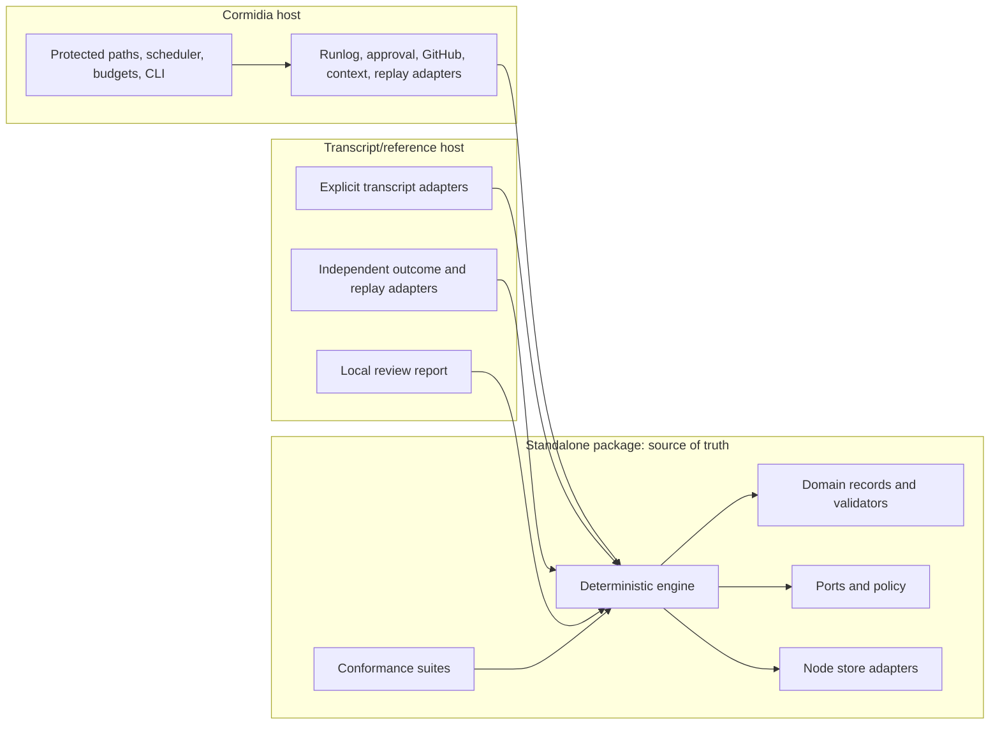

# Extraction and Transcript Dogfood Plan

**Date:** 2026-08-12  
**Status:** non-normative execution proposal; no release or live-token campaign is authorized  
**Goal:** make a standalone TypeScript governed-learning package the single source of truth for Cormidia and at least one non-Cormidia integration

## Success in plain language

Extraction succeeds when a developer can import a small package into an unrelated TypeScript agent, record completed work, create and review inert lessons, activate exact versions through host-owned authority, and test their effect—without importing Cormidia's organization, scheduler, tickets, GitHub operations, roles, prompts, provider software development kits, or state-home layout.

It also succeeds only if Cormidia still behaves correctly. A second implementation that merely resembles the original is failure because it creates drift in the most safety-sensitive logic.

The target architecture is:



## Principles governing the move

1. **Characterize before moving.** Durable records, canonical bytes, hashes, authorization bindings, publication receipts, crash behavior, resolution, and status decisions are compatibility contracts even when they were not previously called APIs.
2. **Separate by ownership, not by filename.** Mixed Cormidia modules should be split into pure decisions, portable application logic, and host adapters. Moving entire files will preserve accidental coupling.
3. **One source of truth.** Cormidia imports the extracted package. It does not keep a forked copy “temporarily” without a dated deletion gate.
4. **No broad redesign during parity.** The first green milestone preserves behavior. Schema simplification and product expansion follow after parity, with explicit migrations.
5. **No efficacy marketing during extraction.** Conformance proves mechanism. Transcript candidate utility proves product usefulness. Only controlled evaluation can support a causal improvement claim.
6. **Release-shaped actions remain separate.** Creating a public repository, publishing an npm package, tagging a release, or announcing it requires exact human approval under Cormidia policy.
7. **Historical evaluation is immutable.** New evaluators or corrected rules produce new evidence. Old invalid or inconclusive evidence is not relabelled.

## Current-to-target map

The present `src/org/learning/` directory contains roughly 12,500 lines in 28 modules. It has a credible reusable core, but the highest-complexity files also have the strongest host coupling.

| Current area | Reusable content | Target owner | Important work |
| --- | --- | --- | --- |
| `validate.ts`, `episodes.ts`, `efficacy.ts` | Pure validation and domain foundations | Root package | Turn every durable input into a versioned `unknown` parser; eliminate unchecked generic reads |
| `candidate.ts`, `review.ts`, `experiment.ts`, `eval-result.ts`, `intervention.ts`, `rejections.ts`, `policy.ts` | Records, lifecycle invariants, binding and verdict decisions | Root package | Split filesystem operations from pure schemas and decisions; define a narrow export surface |
| `distillation.ts` | Eligibility, clustering, deduplication, caps, suppression | Root engine | Move Cormidia budget rollup, schedule, filesystem, and model turn out to adapters |
| `canary.ts` | Stable bucketing, sticky assignment, lineage, verdict decisions | Root engine | Separate assignments and manifests from Cormidia paths and publisher orchestration |
| `resolver.ts` | Scope precedence, conflict handling, context budgets, selection | Root engine | Replace Cormidia path grammar and keyword codec with structured scopes and a host codec |
| `publisher.ts` | Publication plan, exact binding, journal state machine, idempotent recovery | Root engine | Replace concrete approvals, GitHub and filesystem effects with authority and destination ports |
| Filesystem portions of stores and records | JSON Lines, create-only records, journals, atomic files | `/node` | Add runtime parsing, compare-and-set/exclusive create, two-writer safety, path confinement, crash conformance |
| `capture.ts`, `efficiency-evidence.ts` | Cormidia projection semantics | Cormidia adapter | Map run envelopes, runlogs, execution journals, scheduler and efficiency evidence into public observations |
| `episode.ts`, `capsule.ts` | Cormidia episode folding and replay-input assembly | Cormidia adapter | Keep generic episode and replay contracts in core; keep ticket/runlog/approval projection here |
| `fingerprint.ts` | Canonical component hashing idea | Core plus Cormidia adapter | Core hashes named components; adapter supplies Cormidia package, org, app, model, role, prompt, tool, budget and repository components |
| `replay.ts` | Small replay request/executor contract | Contract in core, implementation in Cormidia | Keep loop driver, durable files, workspaces, policy, runtime gates and agent execution out of package |
| `eval-fixture.ts` | Fixture and grading protocol | Core plus adapters | Inject sanitizer, scope parser, artifact assembler and grader; do not embed Cormidia memory types |
| `concepts.ts` | Versioned governed context as one destination | Optional reference destination | Generalize record and selection contract; keep OKF Markdown rendering and manifests in Cormidia |
| Org context and scheduled turns outside the folder | Context injection, episode pins, token-free eligibility, model turns | Cormidia only | Compose package at host boundary; package must not own scheduling or prompt construction |
| Runtime gate, approval store, protected paths, budget ledger | Root of trust and effect authority | Cormidia only | Document that safe activation requires equivalent host protection; never imply package enforcement can replace it |
| `cormidia learn` CLI and reports | Operator experience | Cormidia first; examples later | Use as a reference workflow, not the SDK definition |

## Work breakdown

The estimates below are planning ranges for one experienced engineer or agent-assisted equivalent after contract ratification. They include implementation, offline tests, documentation, and review, but not waiting time for live observations. Ranges are intentionally broad because compatibility and concurrency findings can expand the work.

| Stream | Focused effort | Exit result |
| --- | ---: | --- |
| 0. Ratify product and protocol | 0.5–1.5 weeks | Approved vision, non-goals, public records, ports, invariants, compatibility policy, support floor, license direction |
| 1. Freeze characterization and packaging tests | 1–2 weeks | Red then green invariant, golden-byte, strict-consumer, tarball, dependency and migration tests; privacy-approved prospective replay capture begins |
| 2. Extract domain and deterministic decisions | 2–3 weeks | Import-clean root package with versioned parsers and no Cormidia/provider dependencies |
| 3. Build storage, authority, destination and replay ports | 2–4 weeks | Concurrency-safe store contract, journal engine, host ports and conformance runners |
| 4. Make Cormidia the package consumer | 2–3 weeks | Cormidia adapters, byte/state parity, existing harness green, no duplicate implementation |
| 5. Build transcript/reference second consumer | 1.5–3 weeks | Qualified explicit-input adapter, local report, minimized evidence, synthetic/redacted fixtures |
| 6. Dogfood and one frozen efficacy experiment | 1.5–2 weeks engineering plus 3–6 calendar weeks observation | Candidate-utility evidence, held-out replay result, optional low-risk prospective canary |
| 7. Public productization | 1–2.5 weeks | Documentation, examples, security process, contribution guide, release automation and publish-ready artifact |

Total focused effort: approximately **10–18 engineer-weeks**, subject to re-estimation after the transcript-format and compatibility spikes. Streams can overlap after contracts are stable. Privacy-approved prospective capture should begin during characterization so the replay evidence window does not start only after extraction. Cormidia parity, qualified adapter use, shadow-ingestion conclusions, and efficacy claims still have ordered gates.

### What can run in parallel

After the schema and port snapshot is ratified:

- domain extraction can run alongside strict-consumer and packaging tests;
- storage conformance can run alongside authority and destination fakes;
- synthetic transcript fixture construction can run alongside the Cormidia adapter;
- passive prospective replay-input capture can run alongside extraction once its privacy policy is approved;
- documentation examples can compile continuously against the package;
- privacy red-team cases can run alongside ordinary adapter qualification.

What should not run in parallel against a moving target:

- stable public API documentation before the record and port snapshot;
- historical migration implementation before exact compatibility policy;
- paired efficacy evaluation before one intervention and protocol are frozen;
- public release work before the two-consumer and privacy gates.

## Phased execution plan

### Phase 0 — ratify what the package is

Decide:

- final category and one-sentence promise;
- public name and whether Cormidia appears in it;
- first-release user journey;
- core records and status dimensions;
- source trust classes and `T0`–`T3` risk meanings;
- structured scope model;
- port ownership;
- whether optional model workflows ship in `0.x`;
- Cormidia historical compatibility policy;
- Node and module-format support;
- license, contribution, security and release ownership.
- the prospective replay-capture content, consent, retention, deletion and side-effect policy.

Exit criteria:

- `api-contract.md` is accepted or amended by exact diff;
- no material term is defined only by Cormidia internals;
- the package can be explained without “agent memory automatically improves prompts” language;
- publication, authorization, activation, exposure, and validation remain separate;
- passive prospective capture is either approved and started or explicitly declined; it performs no activation, distillation or outbound model call.

### Phase 1 — deposit characterization detectors

Before moving code, create package-facing tests that fail because no package exists yet.

#### Public surface and packaging

- a fixture project with `strict: true` compiles the quickstart;
- only documented root and subpath exports resolve;
- declarations and source maps are present in a dry-run tarball;
- no Cormidia internal path or provider software development kit appears in the dependency tree;
- examples compile as tests;
- an export-ratchet snapshot fails on accidental new public symbols.

#### Durable compatibility

Create license-safe golden fixtures for:

- observations and import receipts;
- episodes and late outcomes;
- candidates, reviews and rejections;
- publication plans, canonical bytes and authorization bindings;
- intervention lineages, rollback and disable;
- experiments, attempts, evaluations and invalid evidence;
- resolved context and exposure receipts.

For existing Cormidia records, test one of the ratified compatibility strategies:

1. **Exact preservation:** new adapters reproduce byte-identical records and hashes.
2. **Versioned migration:** legacy reader parses original bytes, emits a new schema with source digest and migration receipt, and preserves binding semantics.
3. **Compatibility island:** Cormidia retains a legacy adapter while new records use the public schema; both satisfy the same engine decisions.

The recommendation is exact preservation for currently active binding and publication artifacts, and an explicit migration or compatibility reader for broader historical records. Do not promise exact bytes for fields that need a genuinely host-neutral schema without first testing the cost.

#### Existing invariants to transplant

Current hermetic cases already exercise the most valuable properties. Convert them into package conformance scenarios with host-neutral names:

- no review or self-review cannot publish;
- imported prompt injection cannot activate;
- pending approval produces no destination mutation;
- changing candidate content voids prior review and authorization;
- create-only candidates and reviews reject conflicting bytes;
- efficacy requirements are not waived by publication;
- authorized does not imply validated;
- legal validation upgrades require matching experiment evidence;
- crash after each publication step forward-completes or no-ops;
- candidates never resolve;
- lifecycle dimensions remain pairwise distinct;
- rejection and suppression are idempotent.

State-machine coverage is necessary but not sufficient. Every test description should state what it proves and what remains unproven.

#### Passive prospective replay capture

Historical transcripts will often lack a trustworthy starting state, so begin a privacy-approved, capture-only lane during characterization. For eligible new episodes it records the original task, starting revision, an authorized minimized dirty-state fixture where permissible, environment and tool fingerprint, verifier contract, hidden-fixture digest, and side-effect policy. Inclusion rules, consent, retention, deletion, permissions and local-only storage are frozen before capture. This lane performs no candidate generation, model call, activation or evaluation and therefore does not widen the task's authority.

Exit criteria:

- the public contract has red tests before implementation;
- the old implementation passes equivalent characterization where applicable;
- golden fixtures contain no private transcripts or secrets;
- no current gate is weakened to ease extraction.

### Phase 2 — extract the pure domain

Create a package-shaped directory or separate repository according to the ratified workflow. During this phase, it may remain unpublished.

Move or reimplement from source—not by broad copy—the following:

- JSON value and canonical serialization;
- versioned parsers and typed diagnostics;
- scopes, principals, provenance and trust;
- observation, episode, candidate, review, experiment, evaluation, intervention and exposure records;
- content binding and digest rules;
- lifecycle legality;
- policy invariants;
- missing-evidence and guardrail verdict rules;
- pure deduplication, suppression, selection, scope precedence, context budget and generic assignment decisions.

Constraints:

- no imports from Cormidia `src/org`, `src/loop`, `src/runtime`, CLI, GitHub, roles, apps, prompts, or provider adapters;
- no file or network access in pure modules;
- no bare `as`, non-null assertion, or `any` at trust boundaries;
- no Cormidia-specific filesystem scope strings;
- no generic function that accepts an unchecked type parameter from disk;
- public symbol count is a hard design gate.

Exit criteria:

- domain conformance and strict-consumer tests pass;
- invalid versions and corrupt records fail typed;
- status fields cannot collapse authorization into validation;
- canonicalization is deterministic across two fresh processes.

### Phase 3 — extract the application engine and ports

Implement:

- `LearningStore` plus store conformance;
- source registration, ingestion cursors and receipts;
- candidate and review workflows;
- policy decisions and reason codes;
- publication preparation, journaled application, disable, rollback and compensation;
- authority binding verification;
- context resolution and exposure receipts;
- experiment declaration, attempt collection and verdict computation;
- reporting over durable records;
- clocks, identifiers and a durable post-commit outbox for deterministic testing.

#### Concurrency hardening

The present Cormidia environment serializes much work. A public package cannot assume that.

Required tests:

- two processes attempt conflicting create-only writes;
- compare-and-set loses cleanly against a new revision;
- two publishers contend for one plan lease;
- lease expiry cannot allow both an old and new owner to commit;
- crash before effect, after effect but before receipt, and after receipt but before final state;
- same idempotency key with different content fails;
- a list cursor cannot skip or duplicate records under append;
- corrupted or partially written records never become empty/pass.

The Node filesystem adapter may use exclusive create, lock records with ownership and expiry, directory swap or append-only journals as appropriate. Its guarantee must be explicit. Database adapters can supply transactions, but cannot weaken core outcomes.

Exit criteria:

- each port has a conformance runner and at least one in-memory fake;
- the Node adapter passes process-level concurrency and crash injection;
- root package remains provider- and host-neutral;
- no default destination produces an external side effect without explicit host composition.

### Phase 4 — migrate Cormidia onto the package

Build a Cormidia adapter layer that owns:

- runlog, execution-journal, scheduler, efficiency and ticket projection;
- current episode folding and late-outcome sources;
- Cormidia fingerprint components;
- replay capsule assembly and isolated run execution;
- approval verification and protected-state enforcement;
- OKF, proposal, evaluation-gate and ticket destinations;
- GitHub operations and manifest commits;
- app/role/org scope mapping and context rendering;
- budget rollups, scheduled distiller and reviewer turns;
- canary scheduling, CLI, reports and retention.

Composition rule:

```text
Cormidia org/runtime/loop code
    -> Cormidia learning adapters
        -> standalone learning package
```

The package must never import upward into Cormidia.

Parity checks:

- existing offline test and typecheck gates remain green;
- package conformance runs against Cormidia adapters;
- canonical records and bindings match the selected compatibility policy;
- current active bundle resolution and episode pinning are unchanged;
- every destination creates uniform intervention lineage and rollback state;
- remaining prompt-active direct-memory writes are closed or explicitly isolated from the new contract;
- all stored-record reads use versioned parsers;
- no old deterministic engine remains behind a feature flag after parity sign-off.

Do not run live, evaluation, or soak campaigns casually. Those require the repository's explicit authorization and reviewed configuration.

Exit criteria:

- Cormidia is the first real consumer, not the defining implementation;
- the normal Cormidia operator path passes offline qualification;
- migration and rollback procedures are documented and tested;
- removing the package breaks Cormidia compilation, proving there is one source of truth.

### Phase 5 — build the second consumer

The best second consumer is a tiny custom TypeScript agent plus explicit transcript adapters. The tiny host proves the API is not secretly Cormidia-shaped; transcripts prove the degraded-evidence and privacy boundaries.

#### Reference agent

Build a license-safe example with:

- one task runner;
- one deterministic verifier;
- one local versioned-instruction destination;
- an in-memory or temporary Node store;
- manual candidate and review;
- one paired replay fixture.

This should fit in a small example and use only public exports.

#### Transcript adapters

Evaluate Codex, Claude Code, and Cursor as candidates, not as three promised adapters. Maintain this qualification matrix for every input path:

| Field | Required decision |
| --- | --- |
| Input mechanism | Vendor-supported export or stream, explicit user-selected file, or caller-owned reader; never assumed private state |
| Version band | Product, export, native schema and adapter versions |
| Legal basis | Terms, licensing and user authority to process the content |
| Completeness | Which messages, tools, outcomes, usage and edits are present or absent |
| Support status | `qualified`, `experimental`, or `unsupported` |
| Drift response | Exact versions accepted and the typed failure for anything else |

One qualified explicit-input adapter is enough for the extraction gate. A prospective generic stream captured by a caller is the fallback when no historical format has a supportable contract. Re-estimate transcript work after this discovery spike.

Every claimed adapter must:

1. accept an explicit representative export, stream or caller-provided read-only reader;
2. record product, export, adapter and schema versions;
3. parse native input from `unknown`;
4. preserve open/closed/unknown and complete/partial/unsupported/corrupt state;
5. namespace stable IDs;
6. emit unknown native records visibly;
7. apply byte, record, nesting and decompression ceilings before full parsing;
8. redact before truncation, durable persistence or model calls;
9. persist immutable import receipts and minimized evidence, not raw transcript copies;
10. create a new source revision and receipt when a source is appended or rewritten;
11. supersede or tombstone affected derivatives and void content-bound review or authorization where required, without rewriting prior experiment evidence;
12. reject undocumented format drift with `source.unsupported_format`.

Do not build the public promise around a provider's private database. Do not follow source symlinks. Prospective capture of supported streams or explicit export APIs is safer than scraping application state.

#### Executable transcript privacy policy

Each adapter runs under a content-addressed `TranscriptPrivacyPolicy` whose receipt is bound to the import. It must specify:

- explicit allowed source files, streams or readers; home-directory discovery is off and cannot be enabled implicitly;
- read-only access, path roots, no symlink following, maximum bytes, records, nesting, decompressed bytes and processing time;
- source classification, user consent or other processing basis, tenant, retention, deletion and filesystem-permission rules;
- redactors and data-loss-prevention checks at import, candidate, review and publication boundaries;
- raw-content handling for memory, temporary files, caches, logs, diagnostics, receipts and crashes;
- `outboundModelCalls: false` by default;
- when outbound calls are enabled, allowed destination/provider, explicit consent, an exact redacted-byte preview and a durable disclosure receipt;
- private versus public publication eligibility, with every transcript-derived artifact private by default;
- the action on source deletion or consent revocation for observations, candidates, reviews, active context and historical experiment evidence.

Redaction does not make content safe to disclose automatically. Proprietary code, customer text and business context may remain sensitive after credentials and personally identifiable information are removed.

The engine keeps a provenance index from source revision through observation, candidate, review, intervention and active context. On deletion or revocation, policy must choose and record one outcome for every derivative: delete, tombstone and make unresolvable, retain under an explicit legal basis, or queue human disposition. Low-entropy sensitive source material uses tenant-scoped keyed digests; ordinary unsalted hashes can enable dictionary recovery.

Prompt-injection safety is structural. Import and distillation run without network, tool-execution, authority or publication ports composed. Transcript text remains an inert bounded field. A model's ability to recognize malicious wording is a quality metric, not the security boundary.

#### Transcript evidence ceiling

All imported transcript content enters as `untrusted` or `advisory`, including apparent human messages and native tool records. A provider-recorded process exit is stronger discovery evidence than assistant prose, but it is still not independent verifier truth. Elevation creates a separate, provenance-bearing observation from an authenticated human or deterministic verifier. An adapter cannot elevate its own evidence or turn duplicated transcript text into recurrence.

For dogfood reporting, a **grounded candidate** is one whose factual problem statement is traceable to minimized source records, survives an independent evidence review, identifies contradictory or missing evidence, and does not claim a stronger trust class than its sources. Grounding supports review; it does not establish the candidate's causal explanation or efficacy.

Tool-specific known boundary:

- Cormidia currently has a native Codex task reference, not proof of a stable historical-export schema.
- Its current Claude integration has a session identity but not a complete transcript reference.
- Its Cursor integration has a resumable session identity and live stream shape, not proof of a supported historical export.

Those facts make adapter qualification work, not assumptions. Until the matrix records otherwise, historical import for each tool is `experimental` or `unsupported`, not “supported.”

Exit criteria:

- the reference agent uses no Cormidia private type;
- each claimed adapter version passes synthetic and redacted golden fixtures;
- import is idempotent and format drift fails visibly;
- transcript evidence remains advisory, cannot publish by itself and cannot satisfy efficacy metrics;
- the executable privacy policy and source-to-derivative provenance index pass deletion and disclosure tests;
- no raw private transcript enters public fixtures.

## Transcript dogfood program

The user's daily Codex, Claude Code, and Cursor work is unusually good product research because it supplies high-volume, personally interpretable feedback across different tools. Its proper use is staged.

### Stage 1 — adapter qualification

Use three to five explicit representative exports per supported tool and a larger synthetic adversarial suite.

Measure:

- terminal sessions discovered and imported;
- known, unknown and unsupported record rates;
- complete, partial, pending and corrupt sessions;
- cursor idempotency and source-revision detection;
- episode-boundary confidence and human agreement;
- raw transcript bytes persisted in library-managed durable stores, temporary files, caches, logs, errors and receipts, expected to be zero;
- processing cost and time.

Raw bytes necessarily exist transiently in bounded memory while parsing. Byte, record and decompression ceilings apply before full materialization, and every library-managed store uses restrictive permissions.

Negative controls:

- malformed schema versions;
- torn final record versus corruption in the middle;
- duplicate, out-of-order and appended records;
- identical session identifiers across providers;
- path traversal, symlink escape, malformed encodings, huge nesting, decompression bombs and regular-expression stress;
- secrets and personally identifiable information placed exactly across truncation boundaries;
- prompt injection that asks the importer or distiller to execute, disclose or publish.

Exit only when failures are typed, imports are idempotent, and privacy behavior is credible.

### Stage 2 — two-week shadow ingestion

For at least two weeks, import daily transcripts locally with **no candidate activation**. Before the window starts, preregister eligible tools, repositories, task classes, dates, completeness requirements, exclusions, unsupported-format handling and sampling. “Selected” transcripts chosen after seeing their content cannot enter utility-rate denominators.

Preselect the review sample before reading model outputs. Double-label a fixed subset, adjudicate disagreements and preserve the original labels. Human-label:

- session/episode boundaries;
- source and trust class;
- whether the observation is grounded;
- whether a repeated correction is real or duplicated transcript text;
- symptom versus plausible cause;
- privacy leakage;
- whether a proposed candidate is specific, reversible and appropriately scoped.

Reports should show:

- repeated friction clusters;
- supporting and contradicting episodes;
- suggested scope and destination;
- exact minimized evidence that would be sent to any model;
- cost per imported episode and per candidate;
- diagnostics and unsupported formats.

No report should call candidate counts “improvement.”

### Stage 3 — candidate-utility evaluation

Define leakage groups before splitting. Sessions that share a root task, issue, repository starting state, copied prompt, follow-up chain or near-duplicate artifact stay in one group. Freeze and hash the group manifest before content inspection, then split groups—not individual episodes—by a stable keyed hash:

- 60% discovery;
- 20% candidate validation;
- 20% final held-out evaluation.

Use discovery episodes to form candidates. Use the validation bucket to tune deterministic clustering, prompts and review rubrics. Keep the final bucket untouched until one intervention and experiment are frozen. A near-duplicate detector rejects cross-bucket contamination and records any groups it cannot classify confidently.

Before labeling, define grounded, novel, correctly scoped, reversible, cause-correct and actionable with positive and negative examples. Freeze denominators, missing/unsupported handling, labeler assignment, adjudication and uncertainty reporting.

Candidate utility metrics:

- grounded candidate rate;
- duplicate/suppression rate;
- cause-versus-symptom accuracy;
- narrow-scope and reversible-intervention rate;
- review disposition distribution;
- human and independent-review agreement;
- human review minutes per candidate;
- actionable accepted candidates per 100 eligible imported episodes under the frozen inclusion rule;
- cost per reviewed and accepted candidate;
- privacy and prompt-injection escape rate.

Report labeler agreement, uncertainty intervals, eligible and ineligible counts, and missing or unsupported sessions next to every rate. The results characterize the included personal workflow; they are not population estimates for all agent work.

Candidate utility is enough to decide whether transcript ingestion provides value. It is not evidence that active learning improves task outcomes.

### Stage 4 — one frozen paired experiment

Select one narrow, repeated TypeScript-agent candidate with enough replayable held-out episodes. The type-check preflight example is illustrative; selection must occur from actual discovery evidence without contaminating held-out tasks.

Before running anything, freeze and content-hash:

- hypothesis;
- exact intervention bytes;
- eligible task class;
- control and treatment fingerprints;
- primary metric;
- correctness, safety, unintended-change, human-intervention, cost and duration guardrails;
- hidden fixture manifest, expected outcomes, rubric, grader code and any model-grader tuple;
- stable pair assignment and arm order;
- repetitions, cost ceiling and stopping rules;
- missingness and invalidity behavior;
- allowed side effects.

Also preregister the **estimand**—the exact effect being estimated—and the decision rule. The episode is the independent experimental unit. Repeated stochastic runs within one episode are nested repetitions, not extra independent samples. Freeze per-episode aggregation, minimum useful effect, confidence or randomization procedure, missing-pair handling, multiplicity policy and the exact threshold for `improved`.

Deterministic outcomes are primary wherever possible. Hidden verifier fixtures remain inaccessible to the acting agent and are independently validated before results. An uncalibrated model judge is advisory and cannot by itself support an efficacy-backed release claim.

For each replayable held-out episode:

1. restore the same starting commit and data fixture;
2. use fresh isolated sessions and workspaces;
3. hold task, declared model identifier, endpoint, provider, effort, tool policy, budget and grader configuration constant;
4. differ only by the intervention;
5. use closely interleaved, preregistered randomized or counterbalanced arm order;
6. hide arm identity and expected answer from the acting agent;
7. blind subjective graders;
8. retain every attempt, failure, budget stop and missing result.

Existing transcripts without a trustworthy starting snapshot are `non_replayable`. They remain useful for discovery. Prospective capture should retain the starting revision, authorized dirty-state fixture where permissible, original task, environment fingerprint, side-effect policy, outcome contract and grader.

Record endpoint, model identifier, observed model or service version where available, execution window, provider incidents and contemporaneous pricing. A hosted model identifier does not freeze provider weights or service behavior. Detected service or configuration drift invalidates affected pairs or places them in a separately declared stratum.

A practical pilot might use 8–12 held-out replayable episodes with two paired repetitions. This is a planning assumption, not a ratified universal threshold. Unless the preregistered decision rule gives that sample confirmatory power for the minimum useful effect, label it **exploratory**. Fewer usable pairs or missing guardrails yield `inconclusive` or `invalid`, not a relaxed pass.

The strongest permissible positive statement is narrow:

> Exploratory paired evidence indicates that this exact intervention improved the declared metric for these eligible held-out tasks under the recorded host, model-identifier, provider-service window, tool and grader configurations without the declared guardrails regressing.

Use the word “confirmatory” only when the preregistered estimand, sample, decision rule and independent verifier support it. Neither statement claims that all agents, providers, repositories or users improve.

### Stage 5 — prospective low-risk canary

Only after a positive replay result and explicit authorization, expose a `T0` or `T1` intervention to a small episode-sticky fraction of future eligible work.

Keep:

- stable assignment for the full episode;
- exact exposure lineage;
- provider and harness strata;
- concurrent control when feasible;
- a preauthorized content-bound deterministic kill action on exact guardrail thresholds, or otherwise a queued disable recommendation;
- human review of low-volume ambiguous outcomes;
- a bounded duration and cost;
- a written stop and rollback procedure.

Personal workflows have carryover: once the human learns a lesson, control tasks may benefit too. Prospective canary evidence therefore corroborates isolated replay; it does not replace it.

Any automatic kill action is an authority contract: it names the exact intervention, trigger, permitted disable effect, expiry and idempotency key, and produces a verifiable receipt. The canary engine cannot acquire new mutation authority merely because a metric changed.

Do not compare Codex, Claude Code, and Cursor from ordinary daily selection as if one caused better outcomes. Task difficulty, repository, time, user preference and product features confound that comparison.

## Metrics dashboard

The dogfood report should keep five layers visibly distinct.

### Ingestion health

- supported terminal sessions discovered/imported;
- complete, partial, pending, corrupt and unsupported counts;
- typed unknown-record and format-drift rates;
- second-run net-new observations, expected to be zero on an unchanged source;
- source-revision changes;
- episode segmentation confidence and human agreement;
- raw bytes persisted in library-managed durable stores, temporary files, caches, logs, errors or receipts, expected to be zero.

### Privacy and security

- seeded secret and personally identifiable information persistence leaks, expected to be zero;
- outbound bytes and cross-provider disclosures;
- prompt-injection catch rate as a reviewer-quality metric, while structural port isolation remains the security boundary;
- path, symlink and resource-limit refusals;
- deletion-propagation completeness;
- transcript-derived content appearing in diagnostics or logs, expected to be zero.

### Candidate utility

- grounded, novel, correctly scoped and reversible candidate rates;
- cause-versus-symptom accuracy;
- duplicate and suppression hits;
- accept, revise, reject and escalate distribution;
- review time;
- actionable candidates per 100 eligible imported episodes under the frozen inclusion rule;
- cost per reviewed and accepted candidate.

### Activation integrity

- prepared plans by effect class and risk;
- authorization pending, denied, expired and binding-mismatch counts;
- publication first-pass, resumed and no-op retry counts;
- rollback and disable time;
- resolution conflicts and stale-version refusals;
- exposures with complete lineage, expected to be 100%.

### Efficacy

- paired primary-metric delta;
- held-in and held-out deterministic pass rate;
- guardrail failures;
- invalid and missing measurement rate;
- provider- and fingerprint-stratified effect;
- cost per experiment and validated intervention;
- recurrence under stable and treatment lineages;
- human intervention and correction rate.

Retrieval, selection, application, task outcome and attributable effect must remain separate columns.

## Required negative-control catalog

### Evidence honesty

- assistant prose says “tests passed” while the tool record has a nonzero exit: outcome is failure;
- assistant prose claims completion with no tool or verifier evidence: outcome is unknown;
- quoted human text is not automatically an attributed human correction;
- duplicated transcript segments do not become recurring independent evidence;
- a replay attempt cannot re-enter the discovery corpus;
- an adapter cannot raise its own registered trust ceiling.

### Review and authority

- proposer and reviewer have the same principal identity;
- policy requires a separate independence domain and both actors share one;
- review binds an earlier candidate digest;
- human authorization binds a different destination or base;
- content mutates after authorization;
- expired or revoked authority is presented on retry;
- an adapter attempts to classify a `T3` destination as `T1`.

### Publication and storage

- two writers create different bytes under one candidate ID;
- crash occurs before effect, after effect, after receipt and before terminal record;
- retry uses the same idempotency key with different content;
- destination reports a receipt with the wrong target or digest;
- base version advances between preparation and application;
- rollback restores bytes but fails to update intervention state;
- corrupt JSON Lines tail versus corrupt middle record;
- path escapes namespace via traversal or symlink.

### Experiment validity

- control and treatment fingerprints are identical;
- more than the declared intervention differs;
- held-out episode appears in distillation input;
- acting agent can see arm labels or hidden grader data;
- arm, primary metric or guardrail is missing;
- cost improves while correctness regresses;
- evaluator version changes after results are inspected;
- early-stop reporting omits attempted losing pairs.

### Privacy

- credential, email, customer name and source path straddle a chunk or truncation boundary;
- redacted content survives in an exception, digest susceptible to dictionary guessing, debug log or cache key;
- a transcript tells the distiller to upload the rest of the file;
- cross-provider model calls occur without opt-in;
- deletion of a source leaves resolvable candidates or context with no tombstone;
- malicious compressed input expands beyond the configured ceiling.

## Release readiness ladder

### R0 — research only

- decision docs exist;
- no package contract ratified;
- no external claims.

### R1 — package-shaped internal core

- public-contract snapshot accepted;
- import-clean domain and engine;
- strict-consumer and conformance tests;
- not published.

### R2 — Cormidia consumer parity

- Cormidia uses package source of truth;
- existing offline harness and compatibility gates pass;
- migration and rollback proven;
- still not necessarily public.

### R3 — experimental public `0.x` candidate

- second consumer passes;
- privacy and concurrency gates pass;
- documentation and security process ready;
- distiller/reviewer clearly experimental;
- efficacy claims explicitly absent or narrow;
- exact publication requires human approval.

### R4 — efficacy-supported beta

- one retained preregistered experiment with an explicit estimand, per-episode decision rule and independently validated verifier;
- a confirmatory positive verdict under that rule; an exploratory positive result remains `R3` until a suitably powered confirmation or preregistered independent reproduction;
- no guardrail regression;
- prospective corroboration or an independent reproduction;
- limitations, eligible population, model identifier and observed provider-service window stated.

### R5 — stable community library

- at least one independent adopter;
- migrations and support policy exercised;
- threat model and operational evidence appropriate to claims;
- calibrated semantic components if shipped as defaults;
- maintainers accept the ongoing support burden.

The ladder prevents mechanism completeness from being mistaken for outcome proof.

## Stop or reconsider conditions

Pause extraction and revisit the product decision if any of these occurs:

- Cormidia cannot consume the core without weakening its protected-state or approval model;
- host-neutral records become a large set of Cormidia fields renamed generically;
- exact compatibility requires exposing unstable internal bytes as the public v1 contract;
- concurrency-safe storage makes the “small package” promise untenable and no narrower kernel remains useful;
- shadow ingestion repeatedly produces private leakage or mostly ungrounded candidates;
- reviewers find no meaningful value before activation and causal evaluation is too costly for likely adopters;
- no independent TypeScript adopter wants the protocol after a clear reference integration;
- maintaining provider transcript formats becomes the center of the product rather than a companion adapter concern.

These conditions do not imply Cormidia's loop lacks value. They would mean the right form is an internal subsystem or a smaller protocol/test-kit contribution rather than a broad library.

## Open decisions for the next session

The next session should resolve these in order because later choices depend on them:

1. **Promise:** approve or amend the “governed adaptation kernel” vision and first user journey.
2. **Minimum product:** decide whether Observe + Govern is independently valuable enough for `0.x`, or whether safe local activation must ship at launch.
3. **API:** ratify the record and port boundary in `api-contract.md`.
4. **Compatibility:** choose exact preservation, versioned migration, or a compatibility island for each Cormidia record family.
5. **Semantic workflows:** decide whether distiller and reviewer code ships as experimental helpers or remains host example code.
6. **Package identity:** name, repository, license, Node support, module formats and maintenance ownership.
7. **First detector:** choose the strict-consumer/API snapshot and the first lifecycle conformance test to land red.

After those decisions, the implementation campaign can be decomposed into bounded tickets without reopening the product vision on every file move.

## Definition of done for the extraction campaign

The campaign is complete only when:

- one standalone package is the deterministic source of truth;
- Cormidia imports it and passes its existing offline validation unchanged or with explicitly ratified tightened contracts;
- a small non-Cormidia TypeScript host and at least one qualified transcript adapter use only public exports;
- every record and adapter boundary parses `unknown`;
- candidate, authorization, activation, exposure and validation invariants are conformance tests;
- storage survives concurrency and publication crash injection;
- transcript defaults are local, explicit, minimized, redacted and non-exporting;
- public documentation states the host-protection boundary and evidence limitations;
- legacy compatibility and rollback are tested;
- no copied core remains;
- any public repository creation, npm publication, version tag or announcement has separate exact human approval.

Until causal evidence exists, completion means a reusable and honestly characterized governed-learning mechanism. It does not mean the community has been promised proven automatic improvement.
