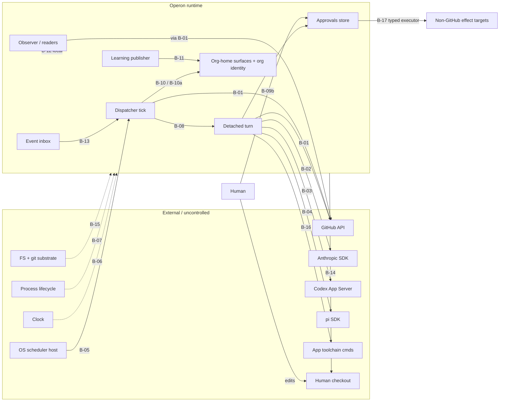

# Boundary map — Operon (product scope)

Status: rev 4, CONFIRMED at the Phase 3 gate (2026-07-31); human-ratified 2026-07-31
(ratification-package.md §9). <!-- AUD-105 --> (rev 1 corrected per elicitation —
five objections + seam-by-seam operational failure modes; rev 2 refused — B-17 added,
B-02/B-03/B-07 layer placements untangled, B-09b ownership precision, B-13 provenance;
rev 3 refused — B-17 L3 status corrected to BLOCKED with future-policy reason/unblock
condition; see elicitation-log.md). Rows `[doc]`-derived unless marked `[PROPOSED]`; operational failure
modes contributed by the stakeholder are marked `[elicited]`, with `[rambling]` citations
where they trace to lived incidents.

Boundaries fall out of the structural view (state ownership, consistency, failure
domains) — never testing convenience. Interfaces (CLI/JSON/UI) are adapters, not
boundaries; the `org → loop → runtime` import layering is code organization, not failure
domains.

Honest-fake column semantics (skill rule 15): a fake must reproduce the seam's failure
modes as first-class scriptable behavior, not only success; every real behavior the fake
cannot prove is a named live-sandbox (L3) obligation. One conformance suite runs against
both fake and real dependency to prevent drift.

## 1. Boundary inventory

### B-01 — GitHub API `[doc]`
- **Boundary test:** GitHub can be down/degraded while every local subsystem runs. PASS.
- **State/consistency:** GitHub owns product artifacts; local state is eventually
  consistent via polling.
- **Journeys:** J-02/03/04/05/10/11/14/15/18.
- **Failure modes:** timeout; rate limit; 5xx; partial success (issue created, label call
  failed; merge succeeded, branch-delete failed); **remote effect occurred but the client
  lost the response** — not mere partial success: it creates execution ambiguity and
  dangerous retry pressure, and the fake must script it `[elicited]`; duplicate delivery
  (retried create → two issues); stale read after write; pagination truncation;
  permission change mid-flight; **remote default branch moved / wrong base** — the
  representative failure: every call succeeds while the operation is about the wrong tree
  `[rambling: guessed-default-branch defect]`; **green evidence attached to the wrong
  candidate** `[rambling: PR #182]`; force-push/history rewrite by a human.
- **Honest fake:** YES — scripted GitHub double: per-call failure scripts, label/PR/
  review state machine, configurable default branch, lost-response mode (effect applied,
  error returned), rate limits, partial sequences.
- **Unproven real (L3):** real auth; actual squash-merge + branch-protection semantics;
  review-submission authorization (HMAC fallback) against the real API; poll timing
  truth. Disposable target: sandbox repos.
- **Layer:** 2 (dominant) + named L3 smoke.

### B-02 — Anthropic provider (Claude Agent SDK) `[doc]`
- **Boundary test:** PASS (provider down; turn fails/blocks; everything else fine).
- **Failure modes:** timeout; rate limit; auth expiry mid-turn; malformed/truncated
  output; **partial stream then drop**; **usage absent** (unknown ≠ zero, INV-006);
  **tool intent emitted without a terminal tool event** (Claude/pi surface calls
  pre-execution — no outcome fields); **resume that authenticates but does not restore
  the exact session** `[elicited]`; model id retired. (No lived Anthropic incident exists
  in the record — these shapes are elicited judgment + docs, not history. Provenance
  honest by stakeholder instruction.)
- **Honest fake:** YES — mocked adapter runtime: scripted outcomes, tool-event
  sequences with/without terminal events, malformed verdicts, usage present/absent/
  partial, gate-hook interaction, session-resume identity mismatch scripts. (LLM quality
  = layer 4, not this fake.)
- **Unproven real (L3):** real subscription/API auth; real SDK streaming + hook behavior
  across SDK versions; real session resume. Spend-bounded.
- **Layer:** 2 + L3 adapter conformance. (Model *quality* is Phase 5 call-site eval
  material — deliberately not part of this boundary's transport-conformance placement.)

### B-03 — OpenAI Codex App Server (pinned CLI, JSON-RPC/stdio) `[doc]`
- **Boundary test:** PASS (subprocess dies/hangs independently).
- **Failure modes:** all of B-02, plus subprocess death mid-RPC; protocol-version skew
  with the pinned CLI; `untrusted` read bypass (issue #20); **refresh-token rotation
  races killing multi-hour runs** `[rambling]` — with the ratified consequence: **auth
  loss is never permission to restart and discard evidence; the checkpoint and session
  identity must be preserved, and recovery either resumes exactly or terminates
  honestly** `[elicited]`; **refresh succeeds for one subprocess while the retained
  session becomes unusable**; **protocol-valid but semantically stale capabilities**
  `[elicited]`.
- **Honest fake:** YES — fake App Server speaking the JSON-RPC schema: scriptable
  deaths, delays, protocol errors, auth-rotation events, stale-capability responses.
- **Unproven real:** real ChatGPT-account auth/session behavior (L3); upstream
  capability drift (L3).
- **Layer:** split by question — **injected token-rotation events: L2** (the fake
  scripts them); **ordinary real auth/session behavior: L3** adapter conformance;
  **natural multi-hour rotation under a long live run: L5** time-hardening (Phase 6).

### B-04 — pi SDK `[doc]`
- **Boundary test:** PASS.
- **Failure modes:** as B-02, plus: no native approval flow — Operon installs the gating
  extension at runtime; **extension not loaded = gate hole**, and conformance must prove
  an actual forbidden tool attempt **reaches and is denied by Operon's gate** — observing
  "extension loaded" proves very little `[elicited]`; no intra-turn fan-out (documented
  degradation). **Correlation note:** pi's Anthropic-native path shares an upstream
  outage domain with B-02 even though the adapter integration fails independently
  `[elicited]`. (No lived pi incident — provenance honest.)
- **Honest fake:** YES — fake session with scriptable extension presence/absence and
  forbidden-attempt injection.
- **Unproven real (L3):** real extension installation into a real pi session with a real
  denied attempt; real Anthropic-native path.
- **Layer:** 2 + L3 adapter conformance.

### B-05 — OS scheduler host (launchd today; systemd when supported) `[doc]`
- **Boundary test:** host timer broken while every manual command works. PASS.
- **Failure modes:** never fires; fires late; double-fires; **fires with different
  identity, environment, PATH, or working directory than the manual invocation that
  "works"** `[elicited]` — the definition file on disk is the comforting fake of health;
  stale definition; duplicate/orphan definitions; machine asleep through windows
  (compound with B-06/B-07).
- **Honest fake:** PARTIAL — tick invocation trivially fakeable (invoke `operon
  dispatch`; the dispatcher cannot tell); install/status/uninstall logic against a faked
  host-command surface is hermetic. **Actual load-and-fire is unfakeable.**
- **Unproven real (L3):** **launchd only, today** — a launchd proof does not prove
  systemd; systemd gains its own proof when the droplet shape becomes supported
  `[elicited]`. The proof uses a uniquely identifiable test definition, proves loaded
  identity and attributable tick evidence, then removes exactly that definition —
  sandbox orgs make the *Operon work* disposable, not careless host-scheduler mutation.
- **Layer:** 2 (dominant) + one named L3 lifecycle proof (launchd).

### B-06 — Clock & calendar time `[PROPOSED]` (nondeterminism seam)
- **Failure modes to script:** TTL expiry; heartbeat staleness; UTC day/month rollover
  **while local scheduling uses host time**; retention sweeps; missed-window
  reconciliation (one reconciled firing with the missed count, never a catch-up storm
  `[elicited]` <!-- AUD-101: rambling tag was false; source is the Phase 1 walk -->); **wall-clock rollback; NTP jump forward; DST transition; timezone
  change** `[elicited]`. **Sleep is compound adversity across B-05/B-06/B-07, not owned
  by one seam** `[elicited]`.
- **Honest fake:** YES — injected clock, scriptable skew/rollback/rollover.
- **Unproven real:** genuine multi-hour/multi-day wall-clock behavior → L5 soak
  (Phase 6).
- **Layer:** 2 (+ L5 obligations).

### B-07 — OS process lifecycle `[PROPOSED]` (seam)
- **Failure modes:** kill at any journaled phase — the defining question is not "the
  child exited" but **"the child may have done expensive or external work and we cannot
  prove how far it got"** `[elicited]`; double-spawn; **PID reuse**; **signal delivery
  racing a terminal write**; **orphaned descendants**; **dead child whose heartbeat
  still looks fresh** `[elicited]`; spawn failure after durable decision; partial
  detach.
- **Honest fake:** YES — real subprocesses in controlled temp environments with
  scripted kill points; dead-process detection scriptable.
- **Unproven real:** genuine laptop sleep/wake — production-shaped, stays a separate L5
  obligation `[elicited]`.
- **Layer:** 2 (+ the named L5 sleep/wake obligation above).

### B-08 — Dispatcher tick ↔ detached turn `[doc]` (internal)
- **Boundary test:** PASS by design (turns outlive ticks; ticks survive dead turns).
- **Failure modes — two asymmetric nightmares, each with its own named durable outcome,
  never a generic "spawn failed"** `[elicited]`: (1) durable spawn decision with no
  child; (2) **a real child with missing post-spawn bookkeeping — worse, because the
  next tick is tempted to create a duplicate**. Plus: lock heartbeat stale-vs-live race;
  WIP race between two ticks.
- **Honest fake:** YES — both sides real code in temp state homes, controlled clock +
  process seams.
- **Layer:** 2 entirely.

### B-09a — Turn ↔ approval store (continuation seam) `[doc]` (split per stakeholder)
- **Ownership:** approvals store owns items/decisions/grants/execution records; the turn
  owns its paused session state (pipeline/pass, native session, context + worktree
  fingerprints, completed-pass set, run id, cost, decisions).
- **Boundary test:** a valid decision can exist while resume is broken — and vice versa.
  PASS.
- **Failure modes:** resume with changed role/runtime/context/work (must fail closed
  before spend); crash between decision and continuation; grant TTL expiry before
  resume; claim identity across pauses (INV-005); denial-guidance path; **decision-store
  reconciliation: grant written but item move / log append interrupted** `[elicited]`.
- **Honest fake:** YES — scripted decision records + real continuation machinery.
- **Layer:** 2.

### B-09b — Human/CLI ↔ approval store (decision-entry seam) `[doc]`
- **Ownership — actor, authority, writer kept distinct:** the human is the **actor**
  supplying decision intent and the **authority** behind it; the CLI/approval store is
  the **state writer** that validates and persists the durable decision, enforcing shape
  (content binding, scope, TTL, batch semantics, revocation).
- **Boundary test:** the human can be absent for days while the paused turn stays
  perfectly preserved. PASS.
- **Failure modes:** decision after expiry; batch review with per-item audit; widening
  at decision time (human-only); revocation mid-wait; malformed decision entry;
  concurrent decisions on one item.
- **Honest fake:** YES at L2 — script approvals, denials, widening, expiry, revocation.
- **Unattended L3 (cross-reference, prohibition):** in unattended live-sandbox
  campaigns the human seam **must not be a runtime dependency** — but the mechanism is
  the **ratified sandbox-only test-policy profile** (canonical definition:
  `validation-policy.yaml`), under which the allowed validation path requires **zero
  human decisions**. **Never forge human decisions under a robot identity.** Campaign
  evidence must prove: profile identity, sandbox target, permitted auto-grant
  categories, and zero human decision rows. External publication and non-sandbox
  effects remain blocked under the profile. `[elicited]` `[doc: PURPOSE v2.9]`
- **Layer:** 2 (+ the L3 profile obligation above).

### B-10 — Org-home ratified surfaces ↔ runtime resolver `[doc]`
- **Boundary test:** config can be invalid/stale/mid-edit while the runtime runs. PASS.
- **Failure modes:** invalid YAML; package/org schema skew during upgrade; missing
  AUTHORITY.md (fail closed to legacy-conservative — never a newer default because it
  was convenient `[elicited]`, INV-015); mid-edit torn read; app narrowing wider than
  org (refuse, INV-001); **config changing between preview and execution** `[elicited]`.
- **B-10a — active-org identity resolution (explicit sub-boundary)** `[elicited]`:
  the active pointer, `OPERON_ORG_HOME`/`OPERON_STATE_HOME` overrides, resolved org
  home, and resolved state home can disagree **while every individual file is valid**.
  "Correct config from the wrong org" is an identity-boundary failure, not a parser
  failure (F-PT-002 already warns here). Failure modes: stale active pointer; override
  disagreement; symlinked org home; pointer to a deleted/moved org; state home from a
  different org than the org home.
- **Honest fake:** YES — fixture org homes covering every skew/corruption/identity
  class.
- **Layer:** 1/2.

### B-11 — Learning capture (state home) ↔ governed substrate (org home git) `[doc]`
- **Boundary test:** capture proceeds while the substrate is untouched; publisher fails
  while capture is intact. PASS.
- **Failure modes:** publisher crash mid-transaction (journaled); candidate placed to
  masquerade as active; tamper on protected surfaces; capture cursor drift;
  **authorized / published / active / validated remaining separate facts even when
  evaluation is unavailable or statistically inconclusive** `[elicited]` — the paired-
  gate scar (maxed control, ties, coin-flip qualification `[rambling]`) is **Phase 5
  eval-design material, deliberately NOT stuffed into this boundary's fake**.
- **Honest fake:** YES — temp git org home; scripted publisher transactions.
- **Layer:** 1/2 (T-10 adversarial depth).

### B-12 — Observer/report readers ↔ **local durable state** `[doc]` (split per stakeholder)
- **Scope:** the local-reader seam only; the observer's GitHub dependency **reuses B-01**
  — the two sources fail independently and carry different consistency rules.
- **Boundary test:** observer down ⇒ zero effect on runs; state files mid-write while
  the observer reads. PASS.
- **Failure modes:** torn reads (INV-013 reader side); stale local evidence rendered as
  current `[elicited]`; capability token absent/wrong; traversal/symlink escape;
  SSE cursor gaps; **source-by-source health**: the projection must report each
  source's freshness and disagreement independently — "degraded" without naming which
  source and which claims are affected is just another plausible green `[elicited]`
  `[rambling: PR #182]` (the anchoring incident; its framing as the emotional center
  and the GitHub-unavailable→empty-queue / missing-usage→zero renderings are the
  stakeholder's elaboration `[elicited]`).
  <!-- changelog 2026-07-31 (audit AUD-102): bracket narrowed to the anchor that
  actually exists in rambling.txt; elaboration retagged elicited. -->
- **Honest fake:** YES — fixture state homes + the B-01 GitHub double; HTTP surface
  driven directly.
- **Layer:** 2 (confidentiality slice T-9/T-4 adversarial).

### B-13 — Company-event inbox producers ↔ dispatcher `[doc]`
- **Boundary test:** producers write files at any time independent of tick liveness.
  PASS.
- **Failure modes:** malformed JSON; unknown kind; valid-no-subscriber; subscriber-set
  change while pending (F-PT-005, resolved); partial fan-out across ticks under WIP
  (first-reader-wins is the representative *feared* failure — `[elicited]` judgment, not
  a documented incident); file vanishing before
  all current subscribers hold marks; **producer crash during file creation**; **two
  files with the same event identity but different payloads**; **file changing after
  initial validation** `[elicited]`; retention interplay.
- **Open product truth — F-PT-006:** the producer visibility protocol is unspecified in
  the docs: must producers publish via temp-file + atomic rename, or does the dispatcher
  deliberately tolerate a partially written file and retry it later? Unknown — recorded
  as a finding; the fake must not accidentally make this policy.
- **Honest fake:** YES — files in temp inbox; entirely hermetic.
- **Layer:** 2.

### B-14 — Human checkout ↔ managed workspace `[elicited]` (was wrongly "not a boundary")
- **Why it is a boundary:** bootstrap deliberately writes `.operon/**` and the marked
  instruction blocks into the human's checkout, while the build loop and recovery must
  use org-managed clones/worktrees. Two writers (human, Operon-lifecycle), independent
  failure, containment consequences (INV-010, T-6/T-8).
- **Boundary test:** the human can edit/dirty/move their checkout at any moment while
  managed clones proceed — and vice versa. PASS.
- **Failure modes:** dirty files at bootstrap; symlinks inside the checkout; wrong
  remote; path overlap between generated artifacts and existing content; **concurrent
  human edits during a lifecycle command**; **a lifecycle command touching more than its
  authorized generated paths** (marked-block containment; byte-preservation of existing
  content); bootstrap re-run idempotency; checkout owned by a different Operon checkout
  (link ownership refusal).
- **Honest fake:** YES — real temp git checkouts with scripted human interference.
- **Layer:** 2.

### B-15 — Local persistence & git substrate `[elicited]` (decomposed from "process death")
- **Why separate:** a process can be healthy while the filesystem or git independently
  misbehaves — different failure domain than process lifecycle.
- **Filesystem failure modes:** disk full; read-only remount; permission change;
  symlinked paths; torn/short reads; ENOSPC mid-append.
- **Git failure modes:** `index.lock` held; corrupt refs; missing worktree metadata;
  remote URL changed; hooks present in a cloned repo; git version skew; **a git command
  that partially succeeds**.
- **Boundary test:** PASS (process up, substrate failing — and each git failure
  independent of FS health).
- **Honest fake:** YES — real temp repos + injected FS faults (permissions, quotas,
  fault-injecting wrappers) and staged git states.
- **Layer:** 2.

### B-16 — Gate/command-runner ↔ app toolchain `[elicited]`
- **Why it is a boundary:** the gate engine is Operon code; `setup`, test, lint, e2e,
  and release commands are **app-owned subprocesses** — not inside the pass executor's
  failure domain. (Executor ↔ gate engine ↔ verdict parsing stay together — §2.)
- **Failure modes:** hang; fork bombs / runaway children; output flood; **worktree
  mutation by the gate command**; required tool unavailable; nonzero-exit semantics vs
  misleading success — **exit 0 while producing misleading evidence**; timeout kill
  leaving droppings; `PNPM_CONFIG_IGNORE_SCRIPTS` / dependency-build opt-in semantics.
- **Boundary test:** PASS (app toolchain broken while Operon healthy, and vice versa).
- **Honest fake:** YES — scripted gate commands (fixture apps with commands that hang,
  flood, mutate, lie).
- **Layer:** 2.

### B-17 — Typed critical-effect executor ↔ non-GitHub external target `[elicited]`
- **Why it is a boundary:** running a release command is B-16 (app toolchain); the
  **deploy/publication destination** — hosting platform, package registry, DNS, external
  channel — is a different failure domain that can accept, reject, or half-apply an
  effect independently of the command that requested it. GitHub-backed effects reuse
  B-01.
- **Journeys / tier:** J-05, J-11, J-17; T-12 is the control point this boundary
  carries.
- **Boundary test:** the target can be down/slow/half-applied while Operon and the
  toolchain are healthy. PASS.
- **Failure modes:** lost response (effect applied, reply lost — execution ambiguity);
  **asynchronous acceptance vs completion** (202-accepted ≠ deployed); idempotency-marker
  disagreement between our record and the target's state; auth/credential change at the
  target; acknowledgement write failure after remote effect; partial multi-step effect
  (deploy applied, cache invalidation not).
- **Honest fake:** YES for the executor's semantics — scripted external target with
  accept/complete split, lost responses, marker disagreement, auth failures.
- **Unproven real (L3):** a real deploy/publication round-trip. Status: **BLOCKED** —
  the obligation exists but cannot currently run, because no disposable real non-GitHub
  target exists in the corpus. Recorded in the draft `validation-policy.yaml`
  (`layers.L3_live_sandbox.obligations` id `B-17-L3`) with its reason and unblock
  condition (a sandbox app declaring a real, disposable `release:` target) — pending
  human ratification and implementation. **No green L3 claim follows from this
  status.** The shared fake/real conformance suite for this seam becomes active when a
  disposable target exists.
  <!-- changelog 2026-07-31: pointed to the existing draft policy (final-gate fix). -->
- **Layer:** 2 + BLOCKED L3 obligation (recorded in the draft policy file).

## 2. Not boundaries (named, so nobody re-litigates)

- `org → loop → runtime` module layering — import discipline inside one process.
- Pass executor ↔ gate *engine* ↔ verdict parser — one failure domain, tested as a block
  (the app-owned commands the engine runs are B-16).
- Ledger append within a turn — same process; crash-mid-step is a B-07/B-15 modifier,
  covered by INV-006/013 cases.
- CLI/JSON/Live-UI surfaces — adapters over behavior (system-map §1.4).

## 3. Diagram

## 4. Findings raised at Phase 3

- **F-PT-006 (open):** company-event producer visibility protocol unspecified — atomic
  temp-file+rename required of producers, or dispatcher-tolerated partial files with
  retry? Docs silent (checked scheduler/design.md + event-schemas.md). The fake must not
  make this policy by fixture convenience.
