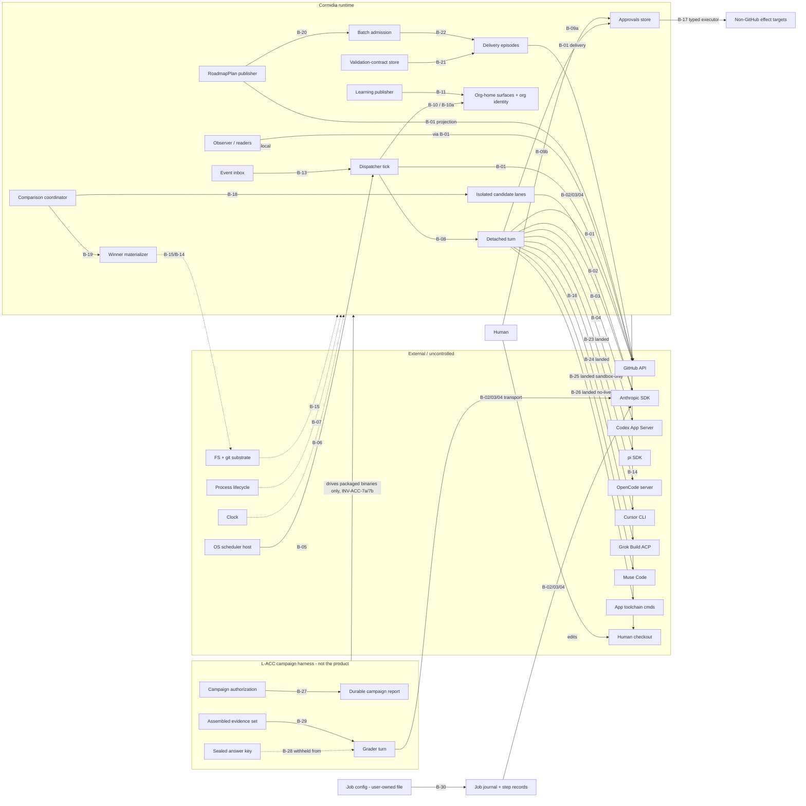

# Boundary map — Cormidia (product scope)

Status: rev 4, CONFIRMED at the Phase 3 gate (2026-07-31); human-ratified 2026-07-31
(ratification-package.md §9). <!-- AUD-105 --> (rev 1 corrected per elicitation —
five objections + seam-by-seam operational failure modes; rev 2 refused — B-17 added,
B-02/B-03/B-07 layer placements untangled, B-09b ownership precision, B-13 provenance;
rev 3 refused — B-17 L3 status corrected to BLOCKED with future-policy reason/unblock
condition; see elicitation-log.md). Rows `[doc]`-derived unless marked `[PROPOSED]`
or `[stated]` (direct live owner input); operational failure
modes contributed by the stakeholder are marked `[elicited]`, with `[rambling]` citations
where they trace to lived incidents. All `[rambling]` tags in this file predate
2026-08-10 and cite the superseded 2026-07-31 operator ramble, not the current
./rambling.txt; they resolve via `rambling-archive.md`. <!-- AUD-101 (audit
rev-2026-08-10): historical scope added — the 2026-08-10 evidence sync replaced
the ramble file these tags cite. -->

**At-a-glance L3/certification roll-up** <!-- changelog 2026-08-10 (reader
test 17, operator finding 7): the per-boundary prose has no single sorted status
table; the roll-up exists but readers had to discover it -->: this file is prose
per boundary by design; the single status table
across all live-seam obligations lives at
`validation-policy.yaml → layers → L3_live_sandbox → obligations`, where **every
entry carries an explicit status** (`ACTIVE`/`BLOCKED`, with certification and
restriction fields where they apply <!-- changelog 2026-08-10 (final-gate
follow-up 6): six entries had no status field and three carried stale
PENDING-ADAPTER labels contradicting the recorded 2026-08-07 certifications;
the policy block was reconciled rather than this pointer weakened -->) — read
that block first when you need status rather than semantics.

Harness revision 2026-08-01: B-18/B-19 are the only new boundaries introduced by the
owner-confirmed comparative-execution direction. Existing B-02/03/04, B-14/15/16 and
their layer placements are reused rather than duplicated.

Harness revision 2026-08-03 (#184/#233/#234/#240): B-20/B-21/B-22 cover the newly
confirmed durable joins from RoadmapPlan to admission, validation contract to delivery,
and execution batch to independently authoritative delivery episodes. GitHub/provider/
filesystem transport still reuses B-01/B-02..04/B-15; these rows exist because their
state owners and asynchronous failure domains differ, not to duplicate transport tests.

Harness revision 2026-08-07 (#330/#336): B-23…B-26 add the four planned adapter
harnesses — OpenCode (server+SDK), Cursor (`cursor-agent` CLI headless), Grok Build
(ACP stdio), Muse Code (`muse exec` headless swarm) — as provider boundaries of the
B-02/03/04 class. Each extends CORMIDIA-C-CORE-001 with per-adapter deltas only
(contracts/B-23…B-26); all four adapters LANDED and were certified 2026-08-07
(#337–#340) under the certification lane (docs/harness/adding-updating.md §5) —
Grok Build's real-repo use stays gated on the OPEN #339 human risk review, and
Muse Code's live walk is certified-incomplete (fail-closed off). Findings
F-PT-025…028 all resolved 2026-08-07 (ratified/certification/evidence — §4);
their formerly parked mechanism cells are unparked. <!-- changelog 2026-08-10
(reader test 5, operator finding 6): was "design-only until its adapter lands …
F-PT-025…028 park the cells" — stale against the policy registry. -->
Facts `[doc]`-derived
from `research/adapters/2026-08-06_adapter-upstream-references.md`; `[stated]` = owner text in
issues #330/#337–#340 and their field-verification comments.

Harness revision 2026-08-07 (outcome acceptance + jobs): four additions.
**B-27/B-28/B-29** are the L-ACC lane's own seams — campaign authorization ↔ durable
report, the sealed answer key ↔ grader input, and the graded evidence set ↔ the grader
turn. They govern the *harness*, and they are in this map for one reason: a campaign
that fails at any of the three still produces a plausible score, so they need the same
failure-mode discipline as a product seam. **B-30** clears the jobs debt
(`docs/jobs/design.md` §14) — job config authority ↔ journal-bound execution. Provider
transport for the grader is **not** a new boundary: it reuses B-02/B-03/B-04 exactly as
the selection judge does (§2). Findings F-PT-029/030 are recorded in §4.

Boundaries fall out of the structural view (state ownership, consistency, failure
domains) — never testing convenience. Interfaces (CLI/JSON/UI) are adapters, not
boundaries; the `org → loop → runtime` import layering is code organization, not failure
domains. **Terminology note — "adapter" carries two distinct senses in this
corpus** <!-- changelog 2026-08-10 (reader test 25, operator finding 4): the
same word named a non-boundary category here and real boundaries at
B-23…B-26 -->: *interface adapters* (CLI/JSON/UI surfaces over one behavior —
NOT boundaries, this rule) vs *provider adapters* (the B-02/B-03/B-04 class and
B-23…B-26 — real external-system boundaries, each with its own failure domain).
The word alone never decides the category; the state-ownership test does. (A
third, informal use also appears — e.g. `cormidia-job` as "a second adapter
over the runtime layer," or harnesses "driving packaged binaries" <!--
changelog 2026-08-10 (reader test 42, operator finding 4): the two-sense rule
didn't anticipate this framing -->: these are figurative uses of the word and
still resolve by the same test — none of them creates a boundary or a
category of its own.)

Honest-fake column semantics (skill rule 15): a fake must reproduce the seam's failure
modes as first-class scriptable behavior, not only success; every real behavior the fake
cannot prove is a named live-sandbox (L3) obligation. One conformance suite runs against
both fake and real dependency to prevent drift.

## 1. Boundary inventory

### B-01 — GitHub API `[doc]`
- **Boundary test:** GitHub can be down/degraded while every local subsystem runs. PASS.
- **State/consistency:** GitHub owns product artifacts; local state is eventually
  consistent via polling.
- **Journeys:** J-02/03/04/05/10/11/14/15/18.
- **Failure modes:** timeout; rate limit; 5xx; partial success (issue created, label call
  failed; merge succeeded, branch-delete failed); **remote effect occurred but the client
  lost the response** — not mere partial success: it creates execution ambiguity and
  dangerous retry pressure, and the fake must script it `[elicited]`; duplicate delivery
  (retried create → two issues); stale read after write; pagination truncation;
  permission change mid-flight; **remote default branch moved / wrong base** — the
  representative failure: every call succeeds while the operation is about the wrong tree
  `[rambling: guessed-default-branch defect]`; **green evidence attached to the wrong
  candidate** `[rambling: PR #182]`; force-push/history rewrite by a human;
  **the repository identity itself is an unresolved placeholder** — the sibling of
  the wrong-base mode one level up: every call is well-formed and every response
  succeeds, but the target is a repository the operator never chose, so the
  effect lands on a literal sentinel-named repo (or another account's existing
  one) while both configuration sources record it as the app's identity
  <!-- changelog 2026-08-12 (#385 §10.3 write-back): observed in the first
  production manual E2E run; absent from this list, which had only wrong-BASE,
  never wrong-REPO -->.
- **Honest fake:** YES — scripted GitHub double: per-call failure scripts, label/PR/
  review state machine, configurable default branch, lost-response mode (effect applied,
  error returned), rate limits, partial sequences.
- **Unproven real (L3):** real auth; actual squash-merge + branch-protection semantics;
  review-submission authorization (HMAC fallback) against the real API; poll timing
  truth. Disposable target: sandbox repos.
- **Layer:** 2 (dominant) + named L3 smoke.

### B-02 — Anthropic provider (Claude Agent SDK) `[doc]`
- **Boundary test:** PASS (provider down; turn fails/blocks; everything else fine).
- **Failure modes:** timeout; rate limit; auth expiry mid-turn; malformed/truncated
  output; **partial stream then drop**; **usage absent** (unknown ≠ zero, INV-006);
  **tool intent emitted without a terminal tool event** (Claude/pi surface calls
  pre-execution — no outcome fields); **resume that authenticates but does not restore
  the exact session** `[elicited]`; model id retired. (No lived Anthropic incident exists
  in the record — these shapes are elicited judgment + docs, not history. Provenance
  honest by stakeholder instruction.)
- **Honest fake:** YES — mocked adapter runtime: scripted outcomes, tool-event
  sequences with/without terminal events, malformed verdicts, usage present/absent/
  partial, gate-hook interaction, session-resume identity mismatch scripts. (LLM quality
  = layer 4, not this fake.)
- **Unproven real (L3):** real subscription/API auth; real SDK streaming + hook behavior
  across SDK versions; real session resume. Spend-bounded.
- **Layer:** 2 + L3 adapter conformance. (Model *quality* is Phase 5 call-site eval
  material — deliberately not part of this boundary's transport-conformance placement.)

### B-03 — OpenAI Codex App Server (pinned CLI, JSON-RPC/stdio) `[doc]`
- **Boundary test:** PASS (subprocess dies/hangs independently).
- **Failure modes:** all of B-02, plus subprocess death mid-RPC; protocol-version skew
  with the pinned CLI; `untrusted` read bypass (issue #20); **refresh-token rotation
  races killing multi-hour runs** `[rambling]` — with the ratified consequence: **auth
  loss is never permission to restart and discard evidence; the checkpoint and session
  identity must be preserved, and recovery either resumes exactly or terminates
  honestly** `[elicited]`; **refresh succeeds for one subprocess while the retained
  session becomes unusable**; **protocol-valid but semantically stale capabilities**
  `[elicited]`.
- **Honest fake:** YES — fake App Server speaking the JSON-RPC schema: scriptable
  deaths, delays, protocol errors, auth-rotation events, stale-capability responses.
- **Unproven real:** real ChatGPT-account auth/session behavior (L3); upstream
  capability drift (L3).
- **Layer:** split by question — **injected token-rotation events: L2** (the fake
  scripts them); **ordinary real auth/session behavior: L3** adapter conformance;
  **natural multi-hour rotation under a long live run: L5** time-hardening (Phase 6).

### B-04 — pi SDK `[doc]`
- **Boundary test:** PASS.
- **Failure modes:** as B-02, plus: no native approval flow — Cormidia installs the gating
  extension at runtime; **extension not loaded = gate hole**, and conformance must prove
  an actual forbidden tool attempt **reaches and is denied by Cormidia's gate** — observing
  "extension loaded" proves very little `[elicited]`; no intra-turn fan-out (documented
  degradation). **Correlation note:** pi's Anthropic-native path shares an upstream
  outage domain with B-02 even though the adapter integration fails independently
  `[elicited]`. (No lived pi incident — provenance honest.)
- **Honest fake:** YES — fake session with scriptable extension presence/absence and
  forbidden-attempt injection.
- **Unproven real (L3):** real extension installation into a real pi session with a real
  denied attempt; real Anthropic-native path.
- **Layer:** 2 + L3 adapter conformance.

### B-05 — OS scheduler host (launchd today; systemd when supported) `[doc]`
- **Boundary test:** host timer broken while every manual command works. PASS.
- **Failure modes:** never fires; fires late; double-fires; **fires with different
  identity, environment, PATH, or working directory than the manual invocation that
  "works"** `[elicited]` — the definition file on disk is the comforting fake of health;
  stale definition; duplicate/orphan definitions; machine asleep through windows
  (compound with B-06/B-07).
- **Honest fake:** PARTIAL — tick invocation trivially fakeable (invoke `cormidia
  dispatch`; the dispatcher cannot tell); install/status/uninstall logic against a faked
  host-command surface is hermetic. **Actual load-and-fire is unfakeable.**
- **Unproven real (L3):** **launchd only, today** — a launchd proof does not prove
  systemd; systemd gains its own proof when the droplet shape becomes supported
  `[elicited]`. The proof uses a uniquely identifiable test definition, proves loaded
  identity and attributable tick evidence, then removes exactly that definition —
  sandbox orgs make the *Cormidia work* disposable, not careless host-scheduler mutation.
- **Layer:** 2 (dominant) + one named L3 lifecycle proof (launchd).

### B-06 — Clock & calendar time `[PROPOSED]` (nondeterminism seam)
- **Failure modes to script:** TTL expiry; heartbeat staleness; UTC day/month rollover
  **while local scheduling uses host time**; retention sweeps; missed-window
  reconciliation (one reconciled firing with the missed count, never a catch-up storm
  `[elicited]` <!-- AUD-101: rambling tag was false; source is the Phase 1 walk -->); **wall-clock rollback; NTP jump forward; DST transition; timezone
  change** `[elicited]`. **Sleep is compound adversity across B-05/B-06/B-07, not owned
  by one seam** `[elicited]`.
- **Honest fake:** YES — injected clock, scriptable skew/rollback/rollover.
- **Unproven real:** genuine multi-hour/multi-day wall-clock behavior → L5 soak
  (Phase 6).
- **Layer:** 2 (+ L5 obligations).

### B-07 — OS process lifecycle `[PROPOSED]` (seam)
- **Failure modes:** kill at any journaled phase — the defining question is not "the
  child exited" but **"the child may have done expensive or external work and we cannot
  prove how far it got"** `[elicited]`; double-spawn; **PID reuse**; **signal delivery
  racing a terminal write**; **orphaned descendants**; **dead child whose heartbeat
  still looks fresh** `[elicited]`; spawn failure after durable decision; partial
  detach.
- **Honest fake:** YES — real subprocesses in controlled temp environments with
  scripted kill points; dead-process detection scriptable.
- **Unproven real:** genuine laptop sleep/wake — production-shaped, stays a separate L5
  obligation `[elicited]`.
- **Layer:** 2 (+ the named L5 sleep/wake obligation above).

### B-08 — Dispatcher tick ↔ detached turn `[doc]` (internal)
- **Boundary test:** PASS by design (turns outlive ticks; ticks survive dead turns).
- **Failure modes — two asymmetric nightmares, each with its own named durable outcome,
  never a generic "spawn failed"** `[elicited]`: (1) durable spawn decision with no
  child; (2) **a real child with missing post-spawn bookkeeping — worse, because the
  next tick is tempted to create a duplicate**. Plus: lock heartbeat stale-vs-live race;
  WIP race between two ticks; malformed schedule/trigger definition (was a tick crash
  or a mislabeled route skip); corrupt or unreadable scheduler state — schedule
  last-fired bytes, spawn-evidence reads at admission, the budget overlay (was a tick
  crash, or silent not_due arithmetic over an unparseable timestamp); a later tick's
  backpressure observation rewriting a live execution's pending decision.
  <!-- changelog 2026-08-12 (HB-142, F-PT-034 write-back): the last three failure
  modes were observed while implementing the admission matrix — enrichment of the
  elicited list with observed reality, per the routing doc's write-back obligation. -->
- **Honest fake:** YES — both sides real code in temp state homes, controlled clock +
  process seams.
- **Layer:** 2 entirely.

### B-09a — Turn ↔ approval store (continuation seam) `[doc]` (split per stakeholder)
- **Ownership:** approvals store owns items/decisions/grants/execution records; the turn
  owns its paused session state (pipeline/pass, native session, context + worktree
  fingerprints, completed-pass set, run id, cost, decisions).
- **Boundary test:** a valid decision can exist while resume is broken — and vice versa.
  PASS.
- **Failure modes:** resume with changed role/runtime/context/work (must fail closed
  before spend); crash between decision and continuation; grant TTL expiry before
  resume; claim identity across pauses (INV-005); denial-guidance path; **decision-store
  reconciliation: grant written but item move / log append interrupted** `[elicited]`.
- **Honest fake:** YES — scripted decision records + real continuation machinery.
- **Layer:** 2.

### B-09b — Human/CLI ↔ approval store (decision-entry seam) `[doc]`
<!-- changelog 2026-08-06 (harness-revision, F-PT-023 ratified #296): the seam now also
carries the objective-grant store (approvals/objective-grants/, #310) — same state
home, same writer discipline, same failure domain — and the disposition-tier decision
boundary. Failure modes extended accordingly; the honest-fake verdict is unchanged
(real temp state homes + scripted records). -->
- **Ownership — actor, authority, writer kept distinct:** the human is the **actor**
  supplying decision intent and the **authority** behind it; the CLI/approval store is
  the **state writer** that validates and persists the durable decision, enforcing shape
  (content binding, scope, TTL, batch semantics, revocation). Since #296 Stage 3 the
  same seam owns the **objective-grant store** (`approvals/objective-grants/`): grants,
  per-grant spend ledgers, and the per-use audit log — human-created only, with the
  disposition tiers (`RULE_DISPOSITION_TIERS`) deciding what any grant may ever cover.
- **Boundary test:** the human can be absent for days while the paused turn stays
  perfectly preserved. PASS.
- **Failure modes:** decision after expiry; batch review with per-item audit; widening
  at decision time (human-only; refused for `human-only`/`un-grantable` tiers);
  revocation mid-wait; malformed decision entry; concurrent decisions on one item;
  **objective grants:** creation naming an un-grantable class or by an agent identity
  (refused); forged grant file on disk (refused at use); concurrent ledger debits
  racing the ceiling (serialized under the per-grant lock; at most one escalation);
  ceiling/use-cap/TTL exhaustion and revocation each killing coverage immediately;
  **split-classification context (ratified, lands with PR D):** target-repo
  verification for `repo-collaboration` — explicit `--repo` mismatch, missing target
  with unreadable/mismatched worktree origin, and `cd`/`-C`-obscured cwd each fail
  closed to `human-only`.
- **Honest fake:** YES at L2 — script approvals, denials, widening, expiry, revocation,
  planted objective grants/ledgers, and worktree origins in real temp git repos.
- **Unattended L3 (cross-reference, prohibition):** in unattended live-sandbox
  campaigns the human seam **must not be a runtime dependency** — but the mechanism is
  the **ratified sandbox-only test-policy profile** (canonical definition:
  `validation-policy.yaml`), under which the allowed validation path requires **zero
  human decisions**. **Never forge human decisions under a robot identity.** Campaign
  evidence must prove: profile identity, sandbox target, permitted auto-grant
  categories, and zero human decision rows. External publication and non-sandbox
  effects remain blocked under the profile. `[elicited]` `[doc: PURPOSE v2.9]`
- **Layer:** 2 (+ the L3 profile obligation above).

### B-10 — Org-home ratified surfaces ↔ runtime resolver `[doc]`
- **Boundary test:** config can be invalid/stale/mid-edit while the runtime runs. PASS.
- **Failure modes:** invalid YAML; package/org schema skew during upgrade; missing
  AUTHORITY.md (fail closed to legacy-conservative — never a newer default because it
  was convenient `[elicited]`, INV-015); mid-edit torn read; app narrowing wider than
  org (refuse, INV-001); **config changing between preview and execution** `[elicited]`;
  **committed org configuration present in the working tree but absent from the
  configured remote** — one dirty checkout read as universally authoritative, so a
  second host, a fresh clone, or a recovery from the remote silently loses it (#388);
  **an org home deliberately without a remote**, whose local-only contract must be
  explicit rather than an implied durability claim (#388).
  <!-- changelog 2026-08-12 (CF-REG-388 write-back): the two clauses above were
  observed reality absent from this list — `new-app` reported a terminal
  `app-created-and-registered` with `origin/<default>` still at `apps: {}`. Additive
  enrichment of ratified text, tighten-only; not a structural event. -->
- **B-10a — active-org identity resolution (explicit sub-boundary)** `[elicited]`:
  the active pointer, `CORMIDIA_ORG_HOME`/`CORMIDIA_STATE_HOME` overrides, resolved org
  home, and resolved state home can disagree **while every individual file is valid**.
  "Correct config from the wrong org" is an identity-boundary failure, not a parser
  failure (F-PT-002 already warns here). Failure modes: stale active pointer; override
  disagreement; symlinked org home; pointer to a deleted/moved org; state home from a
  different org than the org home; first-run default-root relocation interrupted after
  the atomic move; both retired and current roots present (typed refusal, never merge);
  migrated lifecycle or git-worktree paths still naming the retired root.
- **Honest fake:** YES — fixture org homes covering every skew/corruption/identity
  class.
- **Layer:** 1/2.

### B-11 — Learning capture (state home) ↔ governed substrate (org home git) `[doc]`
- **Boundary test:** capture proceeds while the substrate is untouched; publisher fails
  while capture is intact. PASS.
- **Failure modes:** publisher crash mid-transaction (journaled); candidate placed to
  masquerade as active; tamper on protected surfaces; capture cursor drift;
  **authorized / published / active / validated remaining separate facts even when
  evaluation is unavailable or statistically inconclusive** `[elicited]` — the paired-
  gate scar (maxed control, ties, coin-flip qualification `[rambling]`) is **Phase 5
  eval-design material, deliberately NOT stuffed into this boundary's fake**.
- **Honest fake:** YES — temp git org home; scripted publisher transactions.
- **Layer:** 1/2 (T-10 adversarial depth).

### B-12 — Observer/report readers ↔ **local durable state** `[doc]` (split per stakeholder)
- **Scope:** the local-reader seam only; the observer's GitHub dependency **reuses B-01**
  — the two sources fail independently and carry different consistency rules.
- **Boundary test:** observer down ⇒ zero effect on runs; state files mid-write while
  the observer reads. PASS.
- **Failure modes:** torn reads (INV-013 reader side); stale local evidence rendered as
  current `[elicited]`; capability token absent/wrong; traversal/symlink escape;
  SSE cursor gaps; corrupt/missing validation-campaign report rendered absent or green;
  incomplete/inconclusive campaign rendered as pass or release evidence;
  **source-by-source health**: the projection must report each
  source's freshness and disagreement independently — "degraded" without naming which
  source and which claims are affected is just another plausible green `[elicited]`
  `[rambling: PR #182]` (the anchoring incident; its framing as the emotional center
  and the GitHub-unavailable→empty-queue / missing-usage→zero renderings are the
  stakeholder's elaboration `[elicited]`).
  <!-- changelog 2026-07-31 (audit AUD-102): bracket narrowed to the anchor that
  actually exists in rambling.txt; elaboration retagged elicited. -->
- **Honest fake:** YES — fixture state homes + the B-01 GitHub double; HTTP surface
  driven directly.
- **Layer:** 2 (confidentiality slice T-9/T-4 adversarial).

### B-13 — Company-event inbox producers ↔ dispatcher `[doc]`
- **Boundary test:** producers write files at any time independent of tick liveness.
  PASS.
- **Failure modes:** malformed JSON; unknown kind; valid-no-subscriber; subscriber-set
  change while pending (F-PT-005, resolved); partial fan-out across ticks under WIP
  (first-reader-wins is the representative *feared* failure — `[elicited]` judgment, not
  a documented incident); file vanishing before
  all current subscribers hold marks; **producer crash during file creation**; **two
  files with the same event identity but different payloads**; **file changing after
  initial validation** `[elicited]`; retention interplay.
- **Open product truth — F-PT-006:** the producer visibility protocol is unspecified in
  the docs: must producers publish via temp-file + atomic rename, or does the dispatcher
  deliberately tolerate a partially written file and retry it later? Unknown — recorded
  as a finding; the fake must not accidentally make this policy.
- **Honest fake:** YES — files in temp inbox; entirely hermetic.
- **Layer:** 2.

### B-14 — Human checkout ↔ managed workspace `[elicited]` (was wrongly "not a boundary")
- **Why it is a boundary:** bootstrap deliberately writes `.cormidia/**` and the marked
  instruction blocks into the human's checkout, while the build loop and recovery must
  use org-managed clones/worktrees. Two writers (human, Cormidia-lifecycle), independent
  failure, containment consequences (INV-010, T-6/T-8).
- **Boundary test:** the human can edit/dirty/move their checkout at any moment while
  managed clones proceed — and vice versa. PASS.
- **Failure modes:** dirty files at bootstrap; symlinks inside the checkout; wrong
  remote; path overlap between generated artifacts and existing content; **concurrent
  human edits during a lifecycle command**; **a lifecycle command touching more than its
  authorized generated paths** (marked-block containment; byte-preservation of existing
  content); bootstrap re-run idempotency; checkout owned by a different Cormidia checkout
  (link ownership refusal); packaged same-version reinstall and version upgrade;
  source/package generation replacement interrupted between artifacts; multiple foreign
  install collisions reported incompletely or after mutation; retired and current
  app-artifact roots coexisting or being split across reads and writes.
- **Honest fake:** YES — real temp git checkouts with scripted human interference.
- **Layer:** 2.

### B-15 — Local persistence & git substrate `[elicited]` (decomposed from "process death")
- **Why separate:** a process can be healthy while the filesystem or git independently
  misbehaves — different failure domain than process lifecycle.
- **Filesystem failure modes:** disk full; read-only remount; permission change;
  symlinked paths; torn/short reads; ENOSPC mid-append; **a target directory
  whose CONTENT decides which operation is legal** — the same path can be
  greenfield inputs, an application checkout, an already-onboarded app, or a
  generated-path collision, and reading it as a single "empty / not empty" bit
  loses the distinction a command needs to route correctly; **the same directory
  inspected twice** (preview, then execution) can differ, so a preview that does
  not re-read is a prediction about a world that has already moved
  <!-- changelog 2026-08-12 (#384 §10.3 write-back): observed in the first
  production manual E2E run; this list had per-file failure modes but no
  directory-classification or preview-vs-execution-drift mode -->.
- **Git failure modes:** `index.lock` held; corrupt refs; missing worktree metadata;
  remote URL changed; hooks present in a cloned repo; git version skew; **a git command
  that partially succeeds**.
- **Boundary test:** PASS (process up, substrate failing — and each git failure
  independent of FS health).
- **Honest fake:** YES — real temp repos + injected FS faults (permissions, quotas,
  fault-injecting wrappers) and staged git states.
- **Layer:** 2.

### B-16 — Gate/command-runner ↔ app toolchain `[elicited]`
- **Why it is a boundary:** the gate engine is Cormidia code; `setup`, test, lint, e2e,
  and release commands are **app-owned subprocesses** — not inside the pass executor's
  failure domain. (Executor ↔ gate engine ↔ verdict parsing stay together — §2.)
- **Failure modes:** hang; fork bombs / runaway children; output flood; **worktree
  mutation by the gate command**; required tool unavailable; nonzero-exit semantics vs
  misleading success — **exit 0 while producing misleading evidence**; timeout kill
  leaving droppings; `PNPM_CONFIG_IGNORE_SCRIPTS` / dependency-build opt-in semantics.
- **Boundary test:** PASS (app toolchain broken while Cormidia healthy, and vice versa).
- **Honest fake:** YES — scripted gate commands (fixture apps with commands that hang,
  flood, mutate, lie).
- **Layer:** 2.

### B-17 — Typed critical-effect executor ↔ non-GitHub external target `[elicited]`
- **Why it is a boundary:** running a release command is B-16 (app toolchain); the
  **deploy/publication destination** — hosting platform, package registry, DNS, external
  channel — is a different failure domain that can accept, reject, or half-apply an
  effect independently of the command that requested it. GitHub-backed effects reuse
  B-01.
- **Journeys / tier:** J-05, J-11, J-17; T-12 is the control point this boundary
  carries.
- **Boundary test:** the target can be down/slow/half-applied while Cormidia and the
  toolchain are healthy. PASS.
- **Failure modes:** lost response (effect applied, reply lost — execution ambiguity);
  **asynchronous acceptance vs completion** (202-accepted ≠ deployed); idempotency-marker
  disagreement between our record and the target's state; auth/credential change at the
  target; acknowledgement write failure after remote effect; partial multi-step effect
  (deploy applied, cache invalidation not).
- **Honest fake:** YES for the executor's semantics — scripted external target with
  accept/complete split, lost responses, marker disagreement, auth failures.
- **Unproven real (L3):** a real deploy/publication round-trip. Status: **BLOCKED** —
  the obligation exists but cannot currently run, because no disposable real non-GitHub
  target exists in the corpus. Recorded in the draft `validation-policy.yaml`
  (`layers.L3_live_sandbox.obligations` id `B-17-L3`) with its reason and unblock
  condition (a sandbox app declaring a real, disposable `release:` target) — pending
  human ratification and implementation. **No green L3 claim follows from this
  status.** The shared fake/real conformance suite for this seam becomes active when a
  disposable target exists.
  <!-- changelog 2026-07-31: pointed to the existing draft policy (final-gate fix). -->
- **Layer:** 2 + BLOCKED L3 obligation (recorded in the draft policy file).

### B-18 — Comparison coordinator ↔ isolated candidate lanes `[stated+PROPOSED]` (DESIGN-ONLY — nothing built; HB-090…094 open) <!-- changelog 2026-08-10 (reader test 10, operator finding 3): built-vs-design status now explicit in the heading, not only in the provenance tag -->
- **Why it is a boundary:** the coordinator owns frozen comparison intent, candidate
  identities, aggregate admission, and the journal; each candidate owns an isolated
  provider execution and artifact namespace and can fail while the coordinator and
  sibling candidates remain healthy.
- **Boundary test:** one candidate can hang, crash, lose provider auth, corrupt its
  worktree, or terminate ambiguous while the coordinator records the outcome and
  proceeds with other already-admitted candidates. PASS.
- **Journeys / tier:** J-19; C2 coordinator with T-2/T-5/T-6/T-11 slices.
- **Failure modes:** candidate never starts after durable admission; process dies after
  useful work but before terminal evidence; candidate observes sibling bytes; base or
  input fingerprint differs; tuple silently substituted; candidate performs an outward
  effect; candidate worktree mutation escapes its namespace; missing/partial usage;
  candidate completion recorded twice; aggregate budget exhausted between candidates;
  cleanup removes a retained or materialized artifact.
- **Honest fake:** YES — real coordinator + temp git worktrees/artifact roots, mocked
  adapters, injected clock/process/FS faults, scripted candidate terminals and usage.
  The same adapter conformance obligations remain B-02/B-03/B-04; no new live seam is
  created merely because an adapter is invoked inside a comparison.
- **Unproven real:** provider/harness behavior remains the existing adapter L3
  obligations. Parallel candidate contention is a future L5 obligation, not part of
  sequential V1.
- **Layer:** 1/2; existing conditional L3 adapters; future L5 when parallelism exists.

### B-19 — Durable selection ↔ winner materialization/episode continuation `[stated+PROPOSED]` (DESIGN-ONLY — nothing built; HB-090…094 open) <!-- changelog 2026-08-10 (reader test 10, operator finding 3) -->
- **Why it is a boundary:** selection owns one immutable, evidence-bound decision;
  materialization owns copying that exact artifact into an episode output or a new
  standalone local winner branch. Either side can fail while the other remains valid.
- **Boundary test:** a valid selection record can exist while git materialization or
  episode continuation is unavailable; a materializer can be healthy while selection
  is missing, corrupt, advisory-only, or inconclusive. PASS.
- **Journeys / tier:** J-19; T-6 containment and T-9 evidence-truthfulness slices;
  downstream merge still uses T-7 and ordinary J-04.
- **Failure modes:** selected artifact hash no longer exists or differs; judge-advisory
  output treated as admissible; crash after branch/artifact creation but before
  acknowledgement; materialization repeated; active branch or human checkout mutated;
  destination base moved/dirty; loser materialized; two winners; selected artifact
  receives broader authority; selected code bypasses ordinary review/gates; cleanup
  deletes a winner branch; report says materialized or downstream-verified when only
  selected.
- **Honest fake:** YES — real temp git and episode journals with kill points before and
  after branch/artifact creation, content-hash mismatches, moved bases, dirty
  destinations, and replayed materialization.
- **Unproven real:** none beyond B-15 git behavior and any later ordinary B-01 GitHub
  journey. Standalone materialization is local and creates no new L3 target.
- **Layer:** 1/2.

### B-20 — RoadmapPlan authority ↔ ready-frontier and delivery admission `[stated]`
- **Why it is a boundary:** the deterministic roadmap publisher owns one versioned
  account of backlog membership, delivery units, dependencies, priority, WIP and
  validation status; scheduler/readiness consumers run later and can fail or observe a
  changed GitHub backlog while that accepted plan remains intact.
- **Boundary test:** a valid RoadmapPlan can exist while scheduling is stopped; a healthy
  scheduler must refuse a missing, stale, truncated, or contradictory plan. PASS.
- **Journeys / tier:** J-03/J-20/J-18; C2 planning with T-3 routing and T-9 evidence
  slices where admission could include protected work or claim unsupported readiness.
- **Failure modes:** one of 100 considered issues is dropped or assigned twice; unstable
  workstream/delivery-unit IDs rewrite history; dependency cycle; ready unit has an
  unmet dependency or absent validation contract; issue membership/routing changes
  after snapshot; stale frontier consumed after replan; label-only readiness or
  `planning:preplanned` forgery; partial GitHub projection; every tick rereads and
  replans the whole backlog; a planner eagerly creates one EpisodePlan per issue before
  admission; an unavailable/truncated backlog is represented as empty or complete.
- **Honest fake:** YES — real roadmap validator/publisher/scheduler against the B-01
  scripted GitHub double and B-15 temp state, including 100+ issue snapshots, deltas,
  stale hashes, partial writes and concurrent label/body edits.
- **Unproven real:** GitHub pagination/freshness remains B-01 L3; Planner quality and
  context efficiency are S-1 L4/trajectory evidence, not transport truth.
- **Layer:** 1/2 dominant; existing B-01 L3 only.

### B-21 — Validation contract authority ↔ readiness, Builder evidence, and Reviewer verdict `[stated]`
- **Why it is a boundary:** the validation-design pass proposes and the deterministic
  validator persists obligations before readiness; Builder and Reviewer consume that
  immutable version in later processes and can each fail while the contract remains
  valid.
- **Boundary test:** a validation contract can be complete while no Builder is running;
  a Builder result can exist while Reviewer correctly refuses missing or stale evidence.
  PASS.
- **Journeys / tier:** J-03/J-04/J-18; C2 ordinarily, inheriting the tier of every
  affected T-1…T-12 control point; evidence-integrity failures are T-9.
- **Failure modes:** missing/malformed/unknown journey, boundary, contract or invariant
  IDs; structural change smuggled through a case-only update; cheapest layer ignored;
  no seeded negative control; waiver outside explicit policy or without provenance;
  Builder evidence absent/copied from another unit or HEAD; Reviewer passes on declared
  missing evidence; contract mutates after build/review; Builder and Reviewer share a
  private reasoning session and lose independence; cross-ticket boundary touched with
  no shared detector.
- **Honest fake:** YES — strict schema/ID registry, fixture RoadmapPlans and validation
  contracts, seeded Builder/Reviewer evidence, exact-HEAD changes, waiver matrices and
  mocked provider outputs. Model quality remains S-10 L4.
- **Unproven real:** none beyond ordinary provider adapters and GitHub exact-HEAD B-01;
  the correctness guardrails are fully L1/L2.
- **Layer:** 1/2; inherited existing L3 seams only.

### B-22 — Execution-batch admission ↔ independently authoritative execution episodes `[stated]`
- **Why it is a boundary:** the scheduler owns a bounded grouping/order/context-affinity
  decision; each execution unit owns its own EpisodeIntent, EpisodePlan, claim, budget,
  effects and verdict. Code-delivery units additionally own one PR; direct operational
  units instead bind one complete task/event and typed effect set. One unit may fail or
  replan while siblings and the batch journal remain valid.
- **Boundary test:** an admitted batch can survive one unit's provider failure without
  transferring that unit's claim/evidence/budget to a sibling; an individual delivery
  episode can resume without recreating or reauthorizing the whole batch. PASS.
- **Journeys / tier:** J-20/J-04/J-18; C2 scheduling, with T-5 aggregate accounting,
  T-6 app/context isolation, T-7 per-PR merge, T-9 attribution, and T-11 exact-session
  resume slices.
- **Failure modes:** same unit admitted twice or to overlapping batches; cross-app unit
  grouped; unit membership changes after batch hash; aggregate cap hides per-turn/unit
  exposure; batch crash causes completed work to rerun; failed unit partially closes
  tickets; cached context from a sibling changes authority or acceptance criteria;
  Builder session resumed as Reviewer; cache miss claimed as hit; priority/cache score
  overrides dependency, routing or validation; one giant batch defeats WIP/reviewability;
  EpisodePlans created for non-admitted frontier members.
  A direct task bypasses RoadmapPlan without complete creator provenance/effect policy;
  a batch turns multiple external payloads into one widened approval; unknown follow-up
  content is pre-authorized; code work bypasses durable roadmap accounting rather than
  only bypassing its provider turn.
- **Honest fake:** YES — real scheduler, episode journals and temp git with mocked
  adapters; scripted cache metadata, hit/miss/unavailable evidence, crashes between unit
  terminals, and per-unit failure/replan. Correctness never depends on obtaining a hit.
- **Unproven real:** actual provider cache/session behavior reuses B-02/B-03/B-04 L3;
  measured cache economics are observational until enough evidence exists.
- **Layer:** 1/2 dominant; existing adapter L3; no new L5 solely for sequential batches.

### B-23 — OpenCode server (`opencode serve` + SDK) `[doc]` (adapter landed #337, certified 2026-08-07) <!-- changelog 2026-08-10 (stakeholder gate finding): heading was "design-only, #337" — stale -->
- **Boundary test:** the OpenCode server/process can be down while every other
  subsystem — and every other harness — runs. PASS.
- **Failure modes:** the B-02 core shapes (timeout; rate limit; auth expiry mid-turn;
  malformed/truncated output; usage absent — unknown ≠ zero, INV-006; resume that
  authenticates but does not restore the exact session), plus: server process death
  mid-turn; **SSE event-stream gap/disconnect while the server-side turn continues**
  (lost-response class — execution ambiguity, dangerous retry pressure); OpenAPI/SDK
  version skew with the running server (post-1.0 near-daily releases); **stale or
  foreign server instance answering on the expected port** (wrong session universe —
  an identity failure, not a transport failure); gating plugin hook not loaded =
  gate hole (B-04's extension lesson: "hook registered" proves very little);
  **permission `ask` in pure headless mode — auto-REJECTS (F-PT-025
  resolved-ratified 2026-08-07: `ask` is never used; the `tool.execute.before`
  hook is the sole enforcing gate)**; per-provider credential expiry inside one
  multi-provider install
  (provider X usable while provider Y expired — must surface per connection,
  INV-008); models.dev catalog drift / retired `provider/model` id (typed refusal,
  never substitution); published-roster vs actually-reachable divergence.
- **Honest fake:** YES — scripted HTTP/SSE double speaking the published OpenAPI
  shapes: scriptable outcomes, event gaps, hook presence/absence, permission-ask
  emission, per-provider auth states, catalog/roster responses.
- **Proven real (L3), 2026-08-07:** the §5 certification walk ran against the real
  server+SDK — real auth store; real hook-seam denial of a forbidden attempt (the
  ratified post-F-PT-025 mechanism); real session resume; representative-model
  smokes (roster published, never per-model certified). Spend-bounded per policy.
  Evidence: `research/adapters/2026-08-07_opencode-adapter-certification.md`.
  <!-- changelog 2026-08-10 (stakeholder gate finding): was "Unproven real (L3)" —
  stale against the #337 certification record already cited by case-catalog CF-B23-L3. -->
- **Layer:** 2 + L3 certification (adapter landed #337). <!-- changelog 2026-08-10:
  was "(design-only until the adapter lands)" — stale -->

### B-24 — Cursor CLI (`cursor-agent` headless) `[doc]` (adapter landed #338, certified 2026-08-07) <!-- changelog 2026-08-10 (stakeholder gate finding): heading was "design-only, #338", contradicting this section's own "Proven real (L3), 2026-08-07" body -->
- **Boundary test:** PASS (subprocess dies/hangs independently).
- **Failure modes:** the B-02 core shapes, plus: **directory-trust refusal** from an
  untrusted workdir (typed, pre-spend — field-verified `[stated]`); **edits silently
  not applied when `--force` is absent** (a success-looking turn with zero effect —
  the evidence-lie class, INV-008); trust + `--force` mis-scoped (the pair is what
  lets the agent act — a deliberate, gated adapter decision, never a default
  `[stated]`); binary-name collision (`agent` resolves to another product on the
  verified host — resolve `cursor-agent`, never `agent` `[stated]`); stream-json
  protocol drift on the fast-moving CLI; native permissions config missing/malformed/
  wider-than-role (refuse — Cormidia narrows onto Cursor's deny-wins surface, never
  widens through it); **a dynamic per-action hook seam that stops firing** (the
  `.cursor/hooks.json` `preToolUse` channel was certified live 2026-08-07,
  F-PT-026 resolved; the residual risk is a future build silently dropping it, which
  the post-turn executed-versus-allowed cross-check surfaces as
  `error_gate_not_observed`); **a hook process that closes stdin while the pre-spend
  handshake is being delivered** (typed bridge refusal, never an unhandled process
  error); native `AGENTS.md`/`CLAUDE.md` and
  `~/.cursor/skills-cursor/**` ingestion pulling operator-personal config into org
  turns (hermeticity — partial, gate-visible, documented); thread resume that
  authenticates but does not restore the thread. <!-- changelog 2026-08-11 (#403):
  added the early-stdin-close shape observed by the Linux ARM64 CI run. -->
- **Honest fake:** YES — scripted `cursor-agent` subprocess double speaking
  stream-json: trust refusals, force-absent no-op edits, permission-config
  interactions, thread-resume mismatch, protocol drift.
- **Proven real (L3), 2026-08-07:** the §5 certification walk ran — real auth, real
  trust/force behavior in an org-managed worktree, a real denied forbidden attempt
  (and a real denied **subagent** attempt) through the certified `preToolUse` bridge
  with no side effect, exact chat resume, version band `cursor-agent
  2026.08.04-aaa8809`. Spend-bounded per policy.
  Evidence: `research/adapters/2026-08-07_cursor-adapter-certification.md`.
- **Layer:** 2 + L3 certification (adapter landed #338).

### B-25 — Grok Build ACP (`grok agent stdio`) `[doc]` (adapter landed #339, certified 2026-08-07 in sandbox; real-repo use stays #339 risk-review-gated) <!-- changelog 2026-08-10 (stakeholder gate finding): heading was "design-only; #339 risk-review-gated" — the adapter and its sandbox certification are landed; ONLY real-repo use remains gated -->
- **Boundary test:** PASS (subprocess dies/hangs independently) — a B-03 cousin.
- **Failure modes:** B-03's subprocess shapes (death mid-RPC preserving journal/
  checkpoint; protocol-version skew as typed terminal config error; hang), plus:
  ACP version-negotiation failure; **permission-request coverage gaps — a tool
  action executed without the ACP permission round-trip is an INV-002 gate hole,
  not a degradation (F-PT-027 resolved-by-evidence 2026-08-07: coverage IS
  incomplete by design, so the `PreToolUse` hook is the ratified gate with a
  per-turn proof handshake — `error_gate_unproven` on failure)**; headless
  auto-approve analog bypassing the request path (confirmed real — same finding,
  closed by the hook-first mechanism); auto-update mutating the binary
  mid-campaign when `--no-auto-update` is omitted (config drift); auth expiry —
  readiness probes usable request authentication (`XAI_API_KEY` or stored login),
  never account presence; operator
  `~/.grok/config.toml` substituting for the exact assigned model (refuse — core
  §1); **vendor-transport exfiltration risk** — the recorded unverified 2026-07
  secrets-upload report plus closed-contribution upstream make live use
  human-risk-review-gated and sandbox-repo-only until cleared `[stated]` (INV-011
  treats the transport as untrusted).
- **Honest fake:** YES — fake ACP peer speaking JSON-RPC over stdio: scriptable
  permission requests and omissions, denials, protocol skew, deaths, delays,
  auto-approve analogs.
- **Proven real (L3), 2026-08-07 — sandbox only:** the §5 certification walk ran
  over ACP in throwaway sandbox repos (2 provider turns / $0.058, violations empty:
  real auth, real denied shell+read attempts through the ratified PreToolUse hook
  bridge, exact session resume, isolation sentinel). Evidence:
  `research/adapters/2026-08-07_grok-build-adapter-certification.md`. **Real-repository use
  remains gated on the OPEN #339 human risk-review decision — certification proves
  the adapter, never the vendor; sandbox-repo-only until it clears** `[stated]`.
  <!-- changelog 2026-08-10 (stakeholder gate finding): was "Unproven real (L3)" —
  the sandbox certification is complete; only the #339 restriction remains, and it
  is preserved verbatim here. -->
- **Layer:** 2 + L3 certification (sandbox certified; real-repo use #339
  risk-review-gated). <!-- changelog 2026-08-10: was "(risk-review-gated)" alone -->

### B-26 — Muse Code (`muse exec` headless, swarm) `[doc]` (adapter landed #340, certified 2026-08-07)
- **Boundary test:** PASS.
- **Failure modes:** the B-02 core shapes, plus: **a swarm-spawned agent's tool
  action escaping the gate** — an INV-002 gate hole, never a degradation `[stated]`;
  swarm-member attribution loss (events without paired subagent lifecycle/spanId);
  **no gate/hook seam AT ALL on 0.1.0-R708.1 — F-PT-028 resolved by field evidence
  2026-08-07**, so the owner-decided fallback applies at its widest: `tool_gate` and
  `intra_turn_fanout` `unsupported`, `subagent_spawn` refused, and any turn with an
  unproven seam refused pre-spend — never an ungated swarm, never an ungated turn
  `[stated]`; **ambient-config ingestion** — default runs pull the operator's
  personal Claude/Codex rules + skills into org turns (disable path found, pinned,
  and certified by the skills-count delta 23 → 17);
  `--workspace` containment escape (tool effect outside the declared root — T-6);
  JSONL event-schema drift on the 0.1.x beta (typed failure, never silent re-parse);
  effort-ladder mismatch (`ultra` above `xhigh`; Cormidia `max` unmapped and throws
  until a human ratifies the mapping `[stated]`); usage fields absent (unknown ≠
  zero).
- **Honest fake:** YES — scripted `muse exec` JSONL double (failure-mode substrate);
  additionally the vendor's free `--provider echo` offline mode as a real-binary
  hermetic **transport** lane `[stated]` — transport evidence only, never gate-seam,
  swarm, or model-behavior evidence.
- **Unproven real (L3):** the §5 certification walk with the **swarm gate probe as
  the load-bearing case** (`intra_turn_fanout`: spawned agent's critical op reaches
  the gate identically, event → gate → escalation ordering) — no role goes live
  before it passes live, or fan-out is disabled with the documented degradation
  `[stated]`. **2026-08-07 outcome: the walk did not run and CF-B26-L3 is INCOMPLETE**
  — the adapter refuses before the first provider turn because no seam is live, and
  the swarm probe is unprovable on this build. Certified live instead: the fail-closed
  refusal against the real binary, the hermeticity delta, and the durable-log usage
  path. Spend-bounded per policy; re-certification on every version bump.
- **Layer:** 2 (+ echo-mode hermetic transport lane) + L3 certification.

### B-27 — L-ACC campaign authorization ↔ durable campaign report `[stated]` (harness seam)
- **Why it is a boundary:** the campaign config is the frozen **authorization envelope**
  — authorized commit, scenario set, per-scenario model matrix, spend envelope, plan-gate
  policy — authored and reviewed before the run and owned outside it. The report is the
  campaign's durable **account** of what actually happened. Ownership and failure domain
  both change at that line. Structurally parallel to the L3 campaign config
  (`tests/live/config.ts`): **reuse that shape, do not invent a second one.**
- **Boundary test:** a valid authorization can exist with nothing run, and a partially
  written report must survive and refuse an authorization that changed underneath it.
  PASS.
- **Journeys / tier:** J-21; C2 with T-9 evidence-truth and T-5 envelope slices.
- **Preflight failure modes — these refuse BEFORE the campaign starts, never mid-run.**
  Discovering any of them at the first turn wastes the envelope, and three of them
  invalidate every score the campaign would have produced:
  - `pnpm install:packaged --replace-source-links` unrun, skipped, stale relative to the
    campaign's commit pin, or exited non-zero (`CORMIDIA-INV-ACC-7b`). The campaign
    **asserts that script's exit status**; it does not reimplement the check.
  - `effort: max` on any harness but `claude` or `opencode`
    ([`src/runtime/assignment.ts:82`](../src/runtime/assignment.ts:82) admits it
    nowhere else), which otherwise throws at the first turn.
  - an app arm whose planner, builder **and** reviewer are one provider family —
    the builder ≠ reviewer cross-provider collapse AGENTS.md → Working rules forbids
    outright ([`roles.yaml:52`](../roles.yaml:52) calls it "the single most important
    pairing in this file").
  - an `adaptive_assignments` candidate with no real ratified `qualification_ref` and
    no **uncertified disclosure** field. Configuration loading validates the reference's
    *type* without dereferencing it
    ([`docs/org/apps.md:104`](../docs/org/apps.md:104)), so a plausible-looking string
    passes — the disclosure field exists to make the omission structurally impossible
    rather than a matter of diligence.
  - the authorized commit ≠ checked-out HEAD, or the canonical policy blob untracked
    (`assertCampaignRepositoryBinding`); a scenario repository resolving to this
    repository (`CORMIDIA-INV-ACC-3`).
  - unattended execution declared with no plan-gate policy — refuse, and refuse an
    auto-continue policy outright while **F-PT-030** is open.
- **Run/report failure modes:** ceiling exhausted mid-scenario (→ `incomplete`, partial
  evidence preserved); torn report write; a report claiming `complete` while a scenario
  was killed or a grader run is missing; a scenario silently absent from the report; the
  matrix actually used missing from a score (a poor outcome then cannot be attributed
  between "Cormidia is broken" and "that builder was wrong for this"); installed version
  or tarball identity absent, so "which bytes did this exercise" is unanswerable;
  resumption under a changed config; two campaigns writing one report identity.
- **Honest fake:** YES, and completely — real config loader and report writer over temp
  roots, with the preflight's exit status scripted at L2 (a process double) and every
  illegal config seeded. The real `install:packaged` run is the campaign's own
  preflight, not a fixture.
- **Unproven real:** the packaged install against a real host toolchain — the same host
  seam class as B-05/B-14, and **not a new disposable target**. It is a campaign-time
  obligation, recorded once in the report.
- **Layer:** 1/2 dominant; the campaign run itself is the L-ACC lane (policy
  `l_acc_lane`).

### B-28 — Sealed answer key ↔ grader turn input `[stated]` (confidentiality seam; novel)
- **Why it is a boundary, and why it is not a B-27 variant:** B-27 owns *authorization
  and account*. B-28 owns a different fact entirely — **which committed repository bytes
  may cross into which turn**. The key extractor owns the sealed artifact; the mechanical
  scorer is its only consumer; every grader turn is a deliberate **non**-consumer, and
  the party that owns "the grader has not seen the plants" is the campaign's
  input-assembly path. Those fail independently in both directions: the key artifact can
  be valid and complete while assembly leaks, and assembly can be perfectly confined
  while the key is stale or partial. PASS.
- **Novelty (this is the thing to get right):** no existing boundary governs *withheld*
  content. INV-011 governs secrets crossing **outward** to lower-sensitivity surfaces;
  this is the mirror — ordinary, non-secret, **committed** content withheld **inward**
  from one specific consumer. The nearest analogue in the corpus, S-8's blinded candidate
  IDs, is a call-site contract that hides *identity*, not a boundary that withholds
  *content*.
- **Boundary test:** the key can exist and be valid with no grader running; a grader turn
  can be constructed and run while the key stays sealed and unread. PASS.
- **Journeys / tier:** J-21; C2 with a **T-4** confidentiality slice (the control point
  is the same one secret containment uses, pointed at a different content class).
- **Three escape routes, each needing its own detector — a byte-scan of the prompt
  catches only the first:**
  1. **Assembly** — plants text in the brief, prompt, context bundle, tool results, or a
     prior transcript the grader is handed.
  2. **Reachability** — plants readable from the tree the grader is given. The grader is
     an **agentic turn holding file-read tools**, so a scenario markdown committed in
     the campaign repo is reachable even when it is not in the prompt — and deleting it
     from the working tree does not remove it from `git log -p`. The mitigation is
     structural: the grader receives an **evidence set the campaign assembled**, never
     the scenario-authoring repository.
  3. **Echo** — plants leaking back through an intermediate artifact later handed to a
     grader: a report draft, the scorer's own output, a previous axis's grader
     transcript.
- **Failure modes:** key extracted after a grader turn already exists; **key drift** —
  the scenario file edited after extraction, so the key and the file disagree (bind them
  by content hash); key applied to the wrong scenario; **partial extraction** — one plant
  category missing, which does not read as an error but as generosity, because the axis
  then scores against an incomplete key; the key surviving into the report before scoring
  completes; the grader's tool sandbox widened mid-campaign; git-history exposure; the
  key's plaintext written under the campaign root while a grader's workdir *is* the
  campaign root.
- **Honest fake:** YES, **entirely** — assemble grader input in-process and scan it;
  walk the grader's declared reachable set including `git log -p` for the key's byte
  patterns; script an extractor that under-extracts; replay an echo through a report
  draft. No provider is needed to falsify any mode above, which is the strongest
  argument that this boundary is cheap to hold.
- **Unproven real, and deliberately not claimed:** whether a real grader model *infers* a
  planted contradiction from context it legitimately reads. That is **not** a confinement
  failure and is not evidence of one; it is a rubric-validity question the human owns
  (rubric §2's plants are instrumentation, and an inferable plant is a weak plant). Named
  here so a later reader cannot mistake byte-confinement for semantic confinement.
- **Layer:** 1/2 entirely. **No new L3 seam.**

### B-29 — Graded evidence set ↔ grader turn `[stated]` (independence seam)
- **Why it is a boundary:** the grader is a **separate provider execution** over an
  immutable evidence set the campaign owns. Either side fails while the other is healthy:
  the grader can time out, return malformed or citation-less scores, or be refused at the
  disjointness check while the evidence set stays intact; the evidence set can be
  incomplete while the grader is perfectly healthy.
- **Not a new provider boundary.** Transport, auth, usage, resume and gate conformance
  reuse B-02/B-03/B-04 (and the B-23…B-26 class where those adapters are assigned) —
  exactly as the selection judge does (§2). What is new here is the **admission
  precondition** and the **evidence-set composition rule**.
- **Boundary test:** PASS (either side down, the other unaffected).
- **Journeys / tier:** J-21; C2 with T-9 evidence-truth slices; the quality of the
  grader's judgment is S-11's layer-4 obligation, never this seam's.
- **Failure modes:** per-axis provider disjointness computed against the wrong read set,
  or after provider construction (`CORMIDIA-INV-ACC-2`); an axis silently graded when the
  disjointness check found no legal grader, instead of reporting `ungraded`; the evidence
  set including the org's **own self-report** where the axis forbids it — PR bodies and
  verdicts are the *subject* of O-5, never evidence for O-1…O-3 (rubric §7 rule 2);
  missing evidence rendered as a low score instead of `ungraded`
  (`CORMIDIA-INV-ACC-5`); a score without its mandatory evidence citation retained as a
  number; a grader turn retried after partial output and the two halves merged; grader
  output citing an artifact it never read; per-axis results attributed to the wrong axis;
  the grader turn settling into the wrong envelope; **the O-5 fabrication detector never
  firing** — a detector that has never seen the defect it exists to catch is an
  assumption (standing rule 4).
- **Honest fake:** YES — mocked adapters returning scripted grader payloads: malformed,
  citation-less, over-long, contradictory, and one containing a **seeded fabricated
  claim** for the O-5 negative control; scripted evidence sets with deliberate omissions.
- **Unproven real:** grader *quality* — an S-11 layer-4 question under the judge
  calibration rule, deliberately outside this boundary.
- **Layer:** 1/2 + the existing adapter L3 obligations. No new live seam.

### B-30 — Job config authority ↔ journal-bound execution `[doc: docs/jobs/design.md]` (alias **B-JOB**)
- **Why it is a boundary:** the job config is authored and owned **outside** Cormidia —
  a file in the user's own repository, editable at any moment — while the journal is
  Cormidia's durable account of what has actually executed. Ownership of state and
  failure domain both change at that line. One boundary, not two: the config→journal and
  journal→execution seams share a failure domain (the journal is the only thing that
  survives), so splitting them would create two contracts over one truth.
- **Boundary test:** a valid config can exist with no journal and nothing running; a
  journal must survive and refuse a config that changed underneath it. PASS.
- **Journeys / tier:** J-22/J-23; C2 with T-3 assignment-authority, T-5 settlement,
  T-6 isolation and T-9 evidence slices.
- **Failure modes:** dependency cycle; unknown `dependsOn` id; duplicate step id; config
  edited between runs while the journal claims completed steps; journal present but
  config absent; torn journal write; a completed step's declared output deleted or
  emptied afterwards; a step marked completed whose check never ran; resume re-executing
  a completed step (**double spend**); resume skipping an *interrupted* step whose
  provider turn was already paid; unapproved assignment tuple accepted, or an assignment
  that widens the `operator` role; completion inferred from an output file's existence
  rather than the journal; app-scoped and unscoped records both written for one job;
  **a nested `cormidia-job` invoked inside a Cormidia provider turn** — without the
  refusal, a Builder turn spawns provider turns that escape its episode budget entirely;
  a checkpoint resumed with no decision.
- **Honest fake:** YES — real config loader, journal, check evaluator and brief assembly
  against B-15 temp state, the B-02/03/04 scripted adapter doubles, an injected clock,
  and the B-07 kill-point harness. No provider is needed to falsify any mode above.
- **Unproven real:** nothing new. Provider behavior stays B-02/03/04; job step **output
  quality** is deliberately out of scope (`llm-eval-plan.md` §1 records the exclusion).
- **Layer:** 1/2 dominant. **No new L3 seam** — the strongest argument that this
  subsystem is cheap to validate.

### B-31 — Declared planning-source scope ↔ harness-native reading `[stated: F-PT-039 / #386, 2026-08-12]`
- **Why it is a boundary:** Cormidia canonicalizes the operator's `--source` paths and
  declares them as a governed read scope; the party that actually opens those files is
  the **harness**, using readers Cormidia neither owns nor controls. Both tests for a
  boundary change at that line. Ownership of state: the source directory lives outside
  the app checkout and outside Cormidia's write domain, and the operator may edit it
  mid-turn. Failure domain: scope resolution succeeding says nothing about whether a
  single byte was read. This replaces the pre-read design ratified away by F-PT-039 —
  under the old shape Cormidia held the bytes, so there was no seam and no boundary.
- **Boundary test:** a scope can resolve perfectly while the harness reads nothing (the
  dangerous direction — the plan still looks complete); and a fully capable harness can
  face a scope whose root vanished or whose symlink escapes it. PASS, both directions.
- **Journeys / tier:** J-03; C2 with T-3 assignment-authority, T-9 evidence and T-1
  gate-classification slices.
- **Failure modes:** declared root missing, unreadable, or not a directory at declare
  time; symlink escaping a declared root; a read attempted outside every declared root;
  **the harness reads nothing at all** (silent under-read — the plan is published on
  evidence nobody looked at); the harness reads only text and never opens the image while
  the plan is reported as covering visual evidence; the exact assignment tuple has no
  reader for a modality present in scope; read evidence unobservable or unattributable
  (must report as such, never as coverage); the scope mutating between declare and read,
  so a recorded hash describes bytes nobody saw; unbounded traversal or corpus volume
  exhausting the turn's execution limits; source content attempting to act as instruction
  rather than data.
- **Honest fake:** YES — a scripted adapter double replaying a known sequence of read
  tool actions through the **real** gate core (never a copy), over B-15 temp state, with
  the B-07 kill-point harness. Silent under-read, out-of-scope denial, symlink escape,
  modality refusal, and unobservable-evidence reporting are all falsifiable with no
  provider.
- **Unproven real:** whether a given harness build's image/document reader actually fires
  headless (L3 adapter certification, per harness), and whether the model *understood*
  what it read (S-1b quality, L4). Neither is claimable from this boundary's L1/L2 cases.
- **Layer:** 1/2 dominant, plus a per-harness L3 modality-proof leg feeding the
  capability profile.

## 2. Not boundaries (named, so nobody re-litigates)

- `org → loop → runtime` module layering — import discipline inside one process.
- Pass executor ↔ gate *engine* ↔ verdict parser — one failure domain, tested as a block
  (the app-owned commands the engine runs are B-16).
- Ledger append within a turn — same process; crash-mid-step is a B-07/B-15 modifier,
  covered by INV-006/013 cases.
- CLI/JSON/Live-UI surfaces — adapters over behavior (system-map §1.4).
- Standalone `cormidia compare` versus EpisodePlan entry — two adapters over J-19 and
  M16, not two comparison behaviors.
- Selection judge transport — reuses B-02/B-03/B-04; its quality and calibration are
  S-8 layer-4 obligations, not a new provider boundary.
- Delivery unit ↔ its member ticket/one-PR GitHub projections — the transaction is
  C-OP-LOOP behavior over B-01/B-15, not another independently deployable dependency.
- A shared ACP transport core (if adopted per the B-25 `[PROPOSED]` note) — an
  implementation detail behind per-harness boundaries; each ACP harness keeps its own
  boundary, capability profile, and certification evidence.
- **Grader provider transport** — reuses B-02/B-03/B-04 (and the B-23…B-26 class where
  assigned). B-29 owns only the independence precondition and the evidence-set
  composition rule; grader *quality* is S-11 at layer 4. Added 2026-08-07.
- **The `cormidia-job` process itself** — it joins B-15 (local persistence and git
  substrate) and the existing CLI-as-effect-surface classification, and passes the same
  `defaultGate`. A second binary is a second adapter over one runtime, not a second
  failure domain. Added 2026-08-07.
- **The L-ACC scenario repositories as a class** — they are ordinary GitHub repositories
  reached through B-01. What is new is *which* repository a campaign may bind
  (`CORMIDIA-INV-ACC-3`) and how it is provisioned (B-27), not how git or GitHub behave.
  Added 2026-08-07.

## 3. Diagram

## 4. Findings raised at Phase 3

- **F-PT-006 (open):** company-event producer visibility protocol unspecified — atomic
  temp-file+rename required of producers, or dispatcher-tolerated partial files with
  retry? Docs silent (checked scheduler/design.md + event-schemas.md). The fake must not
  make this policy by fixture convenience.

### Findings raised at the 2026-08-07 harness revision (#336)

Canonical entries: `validation-policy.yaml` → `open_findings`; mirrored in
harness-design-state.md; dependent cells parked in case-catalog.md.

- **F-PT-025 (RESOLVED-ratified 2026-08-07, B-23):** answered by the owner's own
  bounded probe of opencode 1.18.15 headless and re-proved by the #337
  certification — headless `ask` auto-REJECTS (never blocks/hangs), so `ask` is
  never used; the ratified mechanism is deny-by-default config as shaping plus the
  in-process `tool.execute.before` plugin hook as the SOLE enforcing gate, covering
  every effectful tool and subagent child sessions, with `--auto` never passed.
  Mechanism legs unparked and implemented in #337. <!-- changelog 2026-08-10
  (reader test 5, operator finding 6): this entry had gone stale against the
  canonical validation-policy.yaml → open_findings; the policy always wins on such
  drift. -->
- **F-PT-026 (RESOLVED-by-certification 2026-08-07, B-24):** the premise was
  falsified in the field — a project `.cursor/hooks.json` `preToolUse` hook DOES fire
  under `-p --force` and enforces pre-execution, so the question was empirical and no
  degraded-tier/role-narrowing decision was needed. Ratified rung: `preToolUse` as the
  sole gate channel over a per-turn Unix socket, `failClosed: true`; tiers
  `tool_gate: adapter`, `intra_turn_fanout: native`. Evidence:
  `research/adapters/2026-08-07_cursor-adapter-certification.md` (#338).
- **F-PT-027 (resolved-by-evidence 2026-08-07, B-25):** answered empirically against
  grok 1.0.0 — ACP permission coverage is incomplete BY DESIGN (read-only tools
  never reach `session/request_permission`), denial semantics differ per channel,
  and headless auto-approve bypasses the request path silently. Ratified mechanism:
  the `PreToolUse` hook is the gate (evaluated ahead of every other authorization
  check), bridged over a per-turn Unix socket, with the ACP request as backstop;
  because grok's hook runner fails open, the adapter must PROVE the gate per turn
  (SessionStart handshake) and refuse with typed `error_gate_unproven` otherwise.
  Certified live in throwaway sandbox repos; **the #339 human risk review remains
  OPEN and independently gates real-repo use.** <!-- changelog 2026-08-10 (reader
  test 5, operator finding 6): stale "open" corrected against the canonical
  policy registry. -->
- **F-PT-028 (RESOLVED-by-evidence 2026-08-07, B-26):** #340 certification against
  Muse Code 0.1.0-R708.1 found no hook/permission seam firing at all — not for swarm
  members and not for the parent — so the owner-decided fallback applies at its
  widest: `tool_gate` and `intra_turn_fanout` are `unsupported` and the adapter
  refuses any turn whose seam is unproven. The mechanism-level cases stay
  scripted-only; CF-B26-L3 reports incomplete
  (`research/adapters/2026-08-07_muse-code-adapter-certification.md`).

### Findings raised at the 2026-08-07 outcome-acceptance + jobs revision

Canonical entries: `validation-policy.yaml` → `open_findings`; mirrored in
harness-design-state.md; dependent cells parked in case-catalog.md.

All three were **answered by the owner on 2026-08-07**, the day they were opened. Full
resolutions in `validation-policy.yaml` → `open_findings`.

- **F-PT-029 (RESOLVED-ratified, B-27 / lane policy) — NO BLOCKER.** L-ACC never gates a
  release and never enters RQ-1 completeness, verdict, or qualification; it sits
  permanently outside RQ-1 as disclosed assurance, beside the seven-day soak and the
  threat model. A bad campaign result is information the human acts on, never a
  mechanical block, and no surface may present it as one. Recorded in B-27 §4.
- **F-PT-030 (RESOLVED-ratified, B-27 / J-21 plan gate) — auto-continue permitted.** An
  unattended campaign **may** resolve the plan gate through the campaign config's
  declared `plan_gate` policy, because an end-to-end run is the point of a campaign. Four
  bounds are unchanged and are what keep this from being open-ended: the ratified rubric
  §6 criteria still decide (at least `attempted` on P-1 and P-5 for every scenario); the
  resolution is still recorded durably before any build-arm spend; the per-campaign
  envelope still bounds every token; and approvals still run under the ratified sandbox
  test-mode profile, with human decisions never forged. A config with **no** declared
  policy still refuses — silence is not consent. Recorded in B-27 §1.8/§4 and
  `CORMIDIA-INV-ACC-4`.
- **F-PT-031 (RESOLVED-ratified, INV-016 domain) — confirmed delivery-scoped**, with the
  owner's nuance recorded: a job may be recurring and app- or org-scoped, and may be
  *associated* with a ticket, but a ticket is never mandatory for a job and such an
  association does not pull a job step into INV-016's domain — the precondition is a
  readiness transition, which no job step has either way.
